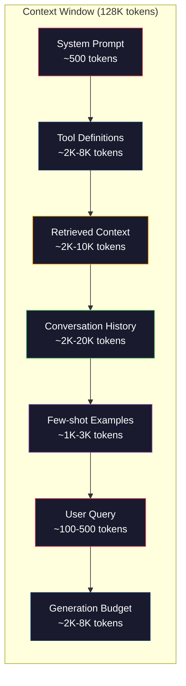
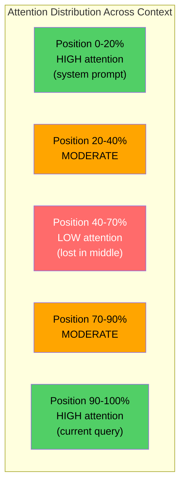
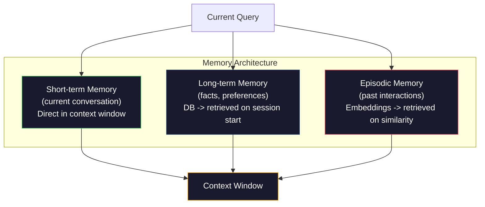

# مهندسی زمینه: ویندوز، بودجه، حافظه و بازیافت

> مهندسی فوری یک زیر مجموعه است. مهندسی زمینه تمام بازی است. یک پیام رسان یک رشته است که شما تایپ می کنید. پیام رسان هر چیزی است که به پنجره مدل می رود: دستورالعمل های سیستم، اسناد بازیافت شده، تعریف ابزار، تاریخچه مکالمه، چند نمونه عکس و خود پیام رسان. بهترین مهندسان هوش مصنوعی در سال 2026 مهندسان زمینه هستند. آنها تصمیم می گیرند چه چیزی وارد می شود، چه چیزی خارج می ماند و در چه ترتیب.

**Type:** Build
**Languages:** Python
**Prerequisites:** Phase 10 (LLMs from Scratch), Phase 11 Lesson 01-02
**Time:** ~90 minutes
**Related:**مرحله 11 · 15 (Caching فوری)  طرح دوستانه به کش یک تمدید از مهندسی زمینه است. مرحله 5 · 28 (تقييم متن طولانی) برای اندازه گیری از دست رفته در وسط با NIAH / RULER.

## اهداف یادگیری

- محاسبه بودجه توکن در تمام قطعات پنجره های زمینه (سستمه سیستم، ابزارها، تاریخچه، اسناد بازیافت شده، فضای تولید)
- پیاده سازی استراتژی های مدیریت پنجره های زمینه: کوتاه کردن، خلاصه کردن و پنجره های شیفت برای تاریخچه مکالمه
- اولویت بندی و ترتیب بخش های زمینه برای حداکثر توجه مدل به اطلاعات مرتبط
- یک جمع کننده زمینه ای را بسازید که به طور پویاً توکن ها را بر اساس نوع سوال و فضای پنجره موجود اختصاص دهد

## مشکل

کلاود اوپوس 4.7 دارای پنجره 200K توکن (1M در حالت بتا) است. GPT-5 دارای 400K است. Gemini 3 Pro دارای 2M است. Llama 4 ادعا می کند 10M. این اعداد تا زمانی که آنها را پر کنید، بسیار بزرگ به نظر می رسند.

در اینجا یک تجزیه واقعی برای یک دستیار کوڈنگ است. دستور سیستم: 500 توکن. تعاریف ابزار برای 50 ابزار: 8,000 توکن. اسناد باز یافت: 4,000 توکن. تاریخچه مکالمه (10 نوبت): 6,000 توکن. سوال کاربر فعلی: 200 توکن. بودجه نسل (با حداکثر تولید): 4,000 توکن. کل: 22,700 توکن. که تنها 18% از یک پنجره 128K است.

اما توجه به طور خطی با طول زمینه مقیاس نمی گیرد. یک مدل با 128K توکن های زمینه هزینه توجه مربع (O  n ^ 2) را در ترانسفورماتور های وانیل پرداخت می کند، اگرچه اکثر مدل های تولید از انواع توجه کارآمد استفاده می کنند. مهمتر از همه، دقت بازیافت کاهش می یابد. آزمایش "نور در یک هیستاک" نشان می دهد که مدل ها برای یافتن اطلاعات در وسط زمینه های طولانی تلاش می کنند. تحقیق لیو و همکاران (2023) نشان داد که LLM ها اطلاعات را در آغاز و پایان زمینه های طولانی با دقت تقریبا کامل بازمی گیرند، اما دقت برای اطلاعات در وسط (موقع 40-70% از زمینه) 10-20٪ کاهش می یابد. این اثر "در وسط گم شده" با توجه به مدل متفاوت است اما بر تمام معماری های فعلی تأثیر می گذارد.

درس عملی: داشتن 200K توکن در دسترس به این معنی نیست که استفاده از 200K توکن موثر است. یک زمینه توکن 10K که با دقت تنظیم شده است اغلب عملکرد یک زمینه توکن 100K را از بین می برد. مهندسی زمینه رشته ی حداکثر کردن نسبت سیگنال به صدا در پنجره زمینه است.

هر توکن که در پنجره قرار می دهید، توکن را که می تواند اطلاعات مرتبط تری داشته باشد، جایگزین می کند. هر تعریف ابزار بی معنی، هر چرخش گفتگو قدیمی، هر قطعه متن بازیافت شده که به سوال پاسخ نمی دهد، هر یک از آنها مدل را کمی بدتر در کار می کند.

## مفهوم

### پنجره زمینه ای یک منبع کم است

پنجره زمینه را به عنوان RAM، نه دیسک تصور کنید. سریع و مستقیماً قابل دسترسی است، اما محدود است. شما نمی توانید همه چیز را قرار دهید. شما باید انتخاب کنید.



هر جزء برای فضای رقابت می کند. اضافه کردن تعاریف ابزار بیشتر به معنای فضای کمتری برای تاریخچه مکالمه است. اضافه کردن زمینه های بیشتر به معنای فضای کمتری برای نمونه های چند عکس است. مهندسی زمینه هنر اختصاص دادن این بودجه برای حداکثر عملکرد کار است.

### گمشده در وسط

مهم ترین یافته تجربی در مهندسی زمینه. مدل ها در ابتدای و پایان زمینه به اطلاعات بهتر توجه می کنند. اطلاعات در وسط نمره توجه کمتری دارند و بیشتر نادیده گرفته می شوند.

لیو و همکاران (2023) این را به صورت سیستماتیک آزمایش کردند. آنها یک سند مرتبط را در میان 20 سند غیر مرتبط در موقعیت های مختلف قرار دادند و دقت پاسخ را اندازه گرفتند. هنگامی که سند مربوطه اولین یا آخرین بود، دقت 85-90٪ بود. هنگامی که در وسط بود (مرتب 10 از 20) ، دقت به 60-70% کاهش یافت.

این پیامدهای مهندسی مستقیم دارد:

- مهم ترین اطلاعات را در اولویت قرار دهید (نظم سریع، دستورالعمل های مهم)
- آخرین سوال و زمینه مرتبط را قرار دهید (تأثر اخیر کمک می کند)
- با وسط زمینه به عنوان کمترین منطقه اولویت بندی کنید
- اگر باید اطلاعات را در وسط قرار دهید، نقطه کلیدی را در پایان تکرار کنید



### اجزای زمینه

**System prompt**: شخصیت، محدودیت ها و قوانین رفتاری را تعیین می کند. این اولین و ثابت در طول دور است. کلوید کد برای پیامک سیستم خود تقریباً 6000 توکن از جمله تعریف ابزار و دستورالعمل های رفتاری را استفاده می کند. آن را محکم نگه دارید. هر کلمه در پیامک سیستم در هر تماس API تکرار می شود.

**Tool definitions**هر ابزار 50 تا 200 توکن اضافه می کند (نام، توصیف، طرح پارامتر). 50 ابزار در 150 توکن هر کدام 7500 توکن است قبل از هر مکالمه اتفاق می افتد. انتخاب ابزار پویا - فقط شامل ابزار مربوط به جستجو فعلی - می تواند این را 60 تا 80 درصد کاهش دهد.

**Retrieved context**: اسناد از یک پایگاه داده ویکتور، نتایج جستجو، محتوای فایل. کیفیت بازیافت مستقیماً کیفیت پاسخ را تعیین می کند. بازیافت بد بدتر از هیچ بازیافت نیست - پنجره را با صدا پر می کند و به طور فعال مدل را گمراه می کند.

**Conversation history**: هر پیام قبلی کاربر و پاسخ دستیار. به طور خطی با طول مکالمه رشد می کند. مکالمه 50 نوبت در 200 توکن در هر نوبت 10،000 توکن تاریخ است. بیشتر آن برای سوال فعلی بی ربط است.

**Few-shot examples**دو تا سه مثال خوب انتخاب شده اغلب کیفیت خروجی را بیش از هزاران توکن دستورالعمل بهبود می بخشد. اما آنها هزینه فضای.

**Generation budget**: توکن هایی که برای پاسخ مدل ذخیره شده اند. اگر پنجره را به ظرفیت پر کنید، مدل هیچ جایی برای پاسخ دادن ندارد. حداقل 2,000 تا 4,000 توکن را برای تولید ذخیره کنید.

### استراتژی های فشرده سازی زمینه

**History summarization**: به جای حفظ تمام نوبت های قبلی به صورت لفظی، به طور دوره ای مکالمه را خلاصه کنید. "ما X را مورد بحث قرار دادیم، Y را تصمیم گرفتیم و کاربر Z را می خواهد" در 100 توکن جایگزین 10 نوبت است که 2000 توکن را گرفت. خلاصه زمانی که تاریخ از یک حد عبور می کند (به عنوان مثال، 5000 توکن).

**Relevance filtering**: هر سند بازیافت شده را با نظرسنجی فعلی ارزیابی کنید و اسناد را زیر یک حد رها کنید. اگر 10 قطعه بازیافت کرده اید اما فقط 3 قطعه مرتبط هستند، بقیه را کنار بگذارید. 7 بهتر است 3 قطعه بسیار مرتبط از 10 قطعه متوسط داشته باشید.

**Tool pruning**: هدف سوال کاربر را طبقه بندی کنید و فقط ابزار مربوط به آن هدف را در بر داشته باشید. یک سوال کد به ابزارهای تقویم نیاز ندارد. یک سوال برنامه ریزی به ابزارهای سیستم فایل نیاز ندارد. این می تواند تعریف ابزار را از 8000 توکن به 1000 کاهش دهد.

**Recursive summarization**در این مقاله، در مورد یک سند بسیار طولانی، به مراحل خلاصه کنید. ابتدا هر بخش را خلاصه کنید، سپس خلاصه را خلاصه کنید. یک سند 50 صفحه ای به یک دیجست 500 توکن تبدیل می شود که نکات کلیدی را به دست می آورد.

### سیستم های حافظه

مهندسی زمینه سه افق زمانی را پوشش می دهد.

**Short-term memory**: مکالمه فعلی. به طور مستقیم در پنجره زمینه ذخیره می شود. با هر نوبت رشد می کند. با خلاصه کردن و کوتاه کردن مدیریت می شود.

**Long-term memory**: حقایق و ترجیحات که در طول مکالمات باقی می مانند. " کاربر تایپ اسکریپت را ترجیح می دهد. " " پروژه از PostgreSQL استفاده می کند. " در یک پایگاه داده ذخیره شده است، در زمان شروع جلسه بازیافت می شود. کلوید کد این را در فایل های CLAUDE.md ذخیره می کند. ChatGPT آن را در ویژگی حافظه خود ذخیره می کند.

**Episodic memory**: تعاملات گذشته خاص که ممکن است مرتبط باشد. "مسلّم گذشته، ما یک مشکل مشابه را در ماژول auth debugged". ذخیره شده به عنوان گنجانده شده، در هنگام بازیابی مکالمه فعلی با یک قسمت گذشته مطابقت دارد.



### جمع آوری کنستکس پویا

بینش کلیدی: سوالات مختلف نیاز به زمینه های مختلف دارد. یک سیستم ثابت پرامپرت + ابزار ثابت + تاریخچه ثابت ضایع کننده است. بهترین سیستم ها به طور پویاً زمینه را در هر سوال جمع می کنند.

1. طبقه بندی هدف سوال
2. ابزار مربوطه را انتخاب کنید (نه همه ابزارها)
3. دریافت اسناد مربوطه (نه مجموعه ای ثابت)
4. شامل دوره های مربوطه تاریخ (نه همه تاریخ)
5. چند نمونه عکس که با نوع کار مطابقت دارد اضافه کنید
6. همه چيز رو به لحاظ اهميت ترتيب بده اول مهم آخر مهم اخير اخياري در وسط

این چیزی است که یک برنامه هوش مصنوعی خوب را از یک برنامه عالی جدا می کند. مدل یکسان است. زمینه فرقی دهنده است.

```figure
lost-in-the-middle
```

## آن را بسازید

### مرحله اول: شمارشکن

شما نمی توانید بودجه آنچه را که نمی توانید اندازه گیری کنید. یک شمارشگر توکن ساده بسازید (تقریبا با استفاده از تقسیم فضای سفید، زیرا شمارش دقیق به توکنر بستگی دارد).

```python
import json
import numpy as np
from collections import OrderedDict

def count_tokens(text):
    if not text:
        return 0
    return int(len(text.split()) * 1.3)

def count_tokens_json(obj):
    return count_tokens(json.dumps(obj))
```

### مرحله دوم: مدیر بودجه زمینه

خلاصه اصلی: مدیر بودجه ردیابی می کند که هر جزء از چه تعداد توکن استفاده می کند و محدودیت ها را اعمال می کند.

```python
class ContextBudget:
    def __init__(self, max_tokens=128000, generation_reserve=4000):
        self.max_tokens = max_tokens
        self.generation_reserve = generation_reserve
        self.available = max_tokens - generation_reserve
        self.allocations = OrderedDict()

    def allocate(self, component, content, max_tokens=None):
        tokens = count_tokens(content)
        if max_tokens and tokens > max_tokens:
            words = content.split()
            target_words = int(max_tokens / 1.3)
            content = " ".join(words[:target_words])
            tokens = count_tokens(content)

        used = sum(self.allocations.values())
        if used + tokens > self.available:
            allowed = self.available - used
            if allowed <= 0:
                return None, 0
            words = content.split()
            target_words = int(allowed / 1.3)
            content = " ".join(words[:target_words])
            tokens = count_tokens(content)

        self.allocations[component] = tokens
        return content, tokens

    def remaining(self):
        used = sum(self.allocations.values())
        return self.available - used

    def utilization(self):
        used = sum(self.allocations.values())
        return used / self.max_tokens

    def report(self):
        total_used = sum(self.allocations.values())
        lines = []
        lines.append(f"Context Budget Report ({self.max_tokens:,} token window)")
        lines.append("-" * 50)
        for component, tokens in self.allocations.items():
            pct = tokens / self.max_tokens * 100
            bar = "#" * int(pct / 2)
            lines.append(f"  {component:<25} {tokens:>6} tokens ({pct:>5.1f}%) {bar}")
        lines.append("-" * 50)
        lines.append(f"  {'Used':<25} {total_used:>6} tokens ({total_used/self.max_tokens*100:.1f}%)")
        lines.append(f"  {'Generation reserve':<25} {self.generation_reserve:>6} tokens")
        lines.append(f"  {'Remaining':<25} {self.remaining():>6} tokens")
        return "\n".join(lines)
```

### مرحله سوم: تنظیم مجدد گم شده در میان

استراتژی تنظیم مجدد را اجرا کنید: مهمترین موارد اول و آخرین هستند و مهم ترین موارد در وسط هستند.

```python
def reorder_lost_in_middle(items, scores):
    paired = sorted(zip(scores, items), reverse=True)
    sorted_items = [item for _, item in paired]

    if len(sorted_items) <= 2:
        return sorted_items

    first_half = sorted_items[::2]
    second_half = sorted_items[1::2]
    second_half.reverse()

    return first_half + second_half

def score_relevance(query, documents):
    query_words = set(query.lower().split())
    scores = []
    for doc in documents:
        doc_words = set(doc.lower().split())
        if not query_words:
            scores.append(0.0)
            continue
        overlap = len(query_words & doc_words) / len(query_words)
        scores.append(round(overlap, 3))
    return scores
```

### مرحله چهارم: کمپرسور تاریخچه مکالمه

خلاصه کردن گفتگوي هاي قديمي به بازيافت بودجه رمزنگاري مياد

```python
class ConversationManager:
    def __init__(self, max_history_tokens=5000):
        self.turns = []
        self.summaries = []
        self.max_history_tokens = max_history_tokens

    def add_turn(self, role, content):
        self.turns.append({"role": role, "content": content})
        self._compress_if_needed()

    def _compress_if_needed(self):
        total = sum(count_tokens(t["content"]) for t in self.turns)
        if total <= self.max_history_tokens:
            return

        while total > self.max_history_tokens and len(self.turns) > 4:
            old_turns = self.turns[:2]
            summary = self._summarize_turns(old_turns)
            self.summaries.append(summary)
            self.turns = self.turns[2:]
            total = sum(count_tokens(t["content"]) for t in self.turns)

    def _summarize_turns(self, turns):
        parts = []
        for t in turns:
            content = t["content"]
            if len(content) > 100:
                content = content[:100] + "..."
            parts.append(f"{t['role']}: {content}")
        return "Previous: " + " | ".join(parts)

    def get_context(self):
        parts = []
        if self.summaries:
            parts.append("[Conversation Summary]")
            for s in self.summaries:
                parts.append(s)
        parts.append("[Recent Conversation]")
        for t in self.turns:
            parts.append(f"{t['role']}: {t['content']}")
        return "\n".join(parts)

    def token_count(self):
        return count_tokens(self.get_context())
```

### مرحله 5: انتخاب ابزار پویا

فقط ابزار مربوط به سوال فعلی را در بر می گیرد. قصد را طبقه بندی کنید، سپس فیلتر کنید.

```python
TOOL_REGISTRY = {
    "read_file": {
        "description": "Read contents of a file",
        "tokens": 120,
        "categories": ["code", "files"],
    },
    "write_file": {
        "description": "Write content to a file",
        "tokens": 150,
        "categories": ["code", "files"],
    },
    "search_code": {
        "description": "Search for patterns in codebase",
        "tokens": 130,
        "categories": ["code"],
    },
    "run_command": {
        "description": "Execute a shell command",
        "tokens": 140,
        "categories": ["code", "system"],
    },
    "create_calendar_event": {
        "description": "Create a new calendar event",
        "tokens": 180,
        "categories": ["calendar"],
    },
    "list_emails": {
        "description": "List recent emails",
        "tokens": 160,
        "categories": ["email"],
    },
    "send_email": {
        "description": "Send an email message",
        "tokens": 200,
        "categories": ["email"],
    },
    "web_search": {
        "description": "Search the web for information",
        "tokens": 140,
        "categories": ["research"],
    },
    "query_database": {
        "description": "Run a SQL query on the database",
        "tokens": 170,
        "categories": ["code", "data"],
    },
    "generate_chart": {
        "description": "Generate a chart from data",
        "tokens": 190,
        "categories": ["data", "visualization"],
    },
}

def classify_intent(query):
    query_lower = query.lower()

    intent_keywords = {
        "code": ["code", "function", "bug", "error", "file", "implement", "refactor", "debug", "test"],
        "calendar": ["meeting", "schedule", "calendar", "appointment", "event"],
        "email": ["email", "mail", "send", "inbox", "message"],
        "research": ["search", "find", "what is", "how does", "explain", "look up"],
        "data": ["data", "query", "database", "chart", "graph", "analytics", "sql"],
    }

    scores = {}
    for intent, keywords in intent_keywords.items():
        score = sum(1 for kw in keywords if kw in query_lower)
        if score > 0:
            scores[intent] = score

    if not scores:
        return ["code"]

    max_score = max(scores.values())
    return [intent for intent, score in scores.items() if score >= max_score * 0.5]

def select_tools(query, token_budget=2000):
    intents = classify_intent(query)
    relevant = {}
    total_tokens = 0

    for name, tool in TOOL_REGISTRY.items():
        if any(cat in intents for cat in tool["categories"]):
            if total_tokens + tool["tokens"] <= token_budget:
                relevant[name] = tool
                total_tokens += tool["tokens"]

    return relevant, total_tokens
```

### مرحله 6: خط لوله کامل جمع آوری زمینه

همه چیز را به هم متصل کنید. در نظر گرفتن یک سوال، به طور پویاً زمینه مطلوب را جمع آوری کنید.

```python
class ContextEngine:
    def __init__(self, max_tokens=128000, generation_reserve=4000):
        self.budget = ContextBudget(max_tokens, generation_reserve)
        self.conversation = ConversationManager(max_history_tokens=5000)
        self.system_prompt = (
            "You are a helpful AI assistant. You have access to tools for "
            "code editing, file management, web search, and data analysis. "
            "Use the appropriate tools for each task. Be concise and accurate."
        )
        self.knowledge_base = [
            "Python 3.12 introduced type parameter syntax for generic classes using bracket notation.",
            "The project uses PostgreSQL 16 with pgvector for embedding storage.",
            "Authentication is handled by Supabase Auth with JWT tokens.",
            "The frontend is built with Next.js 15 using the App Router.",
            "API rate limits are set to 100 requests per minute per user.",
            "The deployment pipeline uses GitHub Actions with Docker multi-stage builds.",
            "Test coverage must be above 80% for all new modules.",
            "The codebase follows the repository pattern for data access.",
        ]

    def assemble(self, query):
        self.budget = ContextBudget(self.budget.max_tokens, self.budget.generation_reserve)

        system_content, _ = self.budget.allocate("system_prompt", self.system_prompt, max_tokens=1000)

        tools, tool_tokens = select_tools(query, token_budget=2000)
        tool_text = json.dumps(list(tools.keys()))
        tool_content, _ = self.budget.allocate("tools", tool_text, max_tokens=2000)

        relevance = score_relevance(query, self.knowledge_base)
        threshold = 0.1
        relevant_docs = [
            doc for doc, score in zip(self.knowledge_base, relevance)
            if score >= threshold
        ]

        if relevant_docs:
            doc_scores = [s for s in relevance if s >= threshold]
            reordered = reorder_lost_in_middle(relevant_docs, doc_scores)
            doc_text = "\n".join(reordered)
            doc_content, _ = self.budget.allocate("retrieved_context", doc_text, max_tokens=3000)

        history_text = self.conversation.get_context()
        if history_text.strip():
            history_content, _ = self.budget.allocate("conversation_history", history_text, max_tokens=5000)

        query_content, _ = self.budget.allocate("user_query", query, max_tokens=500)

        return self.budget

    def chat(self, query):
        self.conversation.add_turn("user", query)
        budget = self.assemble(query)
        response = f"[Response to: {query[:50]}...]"
        self.conversation.add_turn("assistant", response)
        return budget


def run_demo():
    print("=" * 60)
    print("  Context Engineering Pipeline Demo")
    print("=" * 60)

    engine = ContextEngine(max_tokens=128000, generation_reserve=4000)

    print("\n--- Query 1: Code task ---")
    budget = engine.chat("Fix the bug in the authentication module where JWT tokens expire too early")
    print(budget.report())

    print("\n--- Query 2: Research task ---")
    budget = engine.chat("What is the best approach for implementing vector search in PostgreSQL?")
    print(budget.report())

    print("\n--- Query 3: After conversation history builds up ---")
    for i in range(8):
        engine.conversation.add_turn("user", f"Follow-up question number {i+1} about the implementation details of the system")
        engine.conversation.add_turn("assistant", f"Here is the response to follow-up {i+1} with technical details about the architecture")

    budget = engine.chat("Now implement the changes we discussed")
    print(budget.report())

    print("\n--- Tool Selection Examples ---")
    test_queries = [
        "Fix the bug in auth.py",
        "Schedule a meeting with the team for Tuesday",
        "Show me the database query performance stats",
        "Search for best practices on error handling",
    ]

    for q in test_queries:
        tools, tokens = select_tools(q)
        intents = classify_intent(q)
        print(f"\n  Query: {q}")
        print(f"  Intents: {intents}")
        print(f"  Tools: {list(tools.keys())} ({tokens} tokens)")

    print("\n--- Lost-in-the-Middle Reordering ---")
    docs = ["Doc A (most relevant)", "Doc B (somewhat relevant)", "Doc C (least relevant)",
            "Doc D (relevant)", "Doc E (moderately relevant)"]
    scores = [0.95, 0.60, 0.20, 0.80, 0.50]
    reordered = reorder_lost_in_middle(docs, scores)
    print(f"  Original order: {docs}")
    print(f"  Scores:         {scores}")
    print(f"  Reordered:      {reordered}")
    print(f"  (Most relevant at start and end, least relevant in middle)")
```

## ازش استفاده کن

### زمینه ی مدیریت استفاده از استفاده از زره

کلوید کد با یک رویکرد لایه ای زمینه را مدیریت می کند. پیامک سیستم شامل قوانین رفتاری و تعاریف ابزار (~ 6K توکن) است. هنگامی که یک فایل را باز می کنید، محتوای آن به عنوان زمینه تزریق می شود. هنگامی که جستجو می کنید، نتایج اضافه می شود. نوبت های قدیمی مکالمه خلاصه می شوند. CLAUDE.md حافظه طولانی مدت را فراهم می کند که در طول جلسات باقی می ماند.

تصمیم کلیدی مهندسی: کلوید کد تمام پایگاه کد شما را در زمینه رها نمی کند. فایل های مربوطه را بر اساس تقاضا بازمی گیرد. این در واقع مهندسی زمینه است.

### بارگذاری کنست های پویا

Cursor تمام پایگاه کد شما را به قالب های گنجانده شده شاخص می کند. هنگامی که شما یک سوال را تایپ می کنید، با استفاده از شباهت ویکتور، فایل ها و بلوک های کد مرتبط را بازمی گیرد. تنها آن قطعات به پنجره زمینه می روند. یک پایگاه کد خط 500K به 5-10 بلوک کد مرتبط فشرده می شود.

این الگوی است: همه چیز را دربرگیرید، به صورت تقاضا بازیافت کنید، فقط آنچه که مهم است را دربرگیرید.

### کمک کننده حافظه بلند مدت

ChatGPT ترجیحات و حقایق کاربر را به عنوان حافظه طولانی مدت ذخیره می کند. در هر شروع مکالمه، خاطرات مربوطه بازیافت می شوند و در دستور سیستم قرار می گیرند. "مستخدم ترجیح می دهد پایتون" 5 توکن هزینه دارد اما صدها توکن دستورالعمل تکراری را در سراسر مکالمه ذخیره می کند.

### RAG به عنوان مهندسی زمینه

نسل بازیافت افزوده شده، مهندسی زمینه ای رسمی شده است. به جای پر کردن دانش به وزن مدل (تدريب) یا سیستم فوری (حوالۀ جامد) ، شما اسناد مربوطه را در زمان جستجو بازمی گیرید و آنها را در پنجره زمینه تزریق می کنید. کل خط لوله RAG -- شکستن، گنجاندن، بازیافت، رتبه بندی مجدد -- برای حل یک مشکل وجود دارد: قرار دادن اطلاعات مناسب در پنجره زمینه.

## -باده

این درس به ما کمک می کند`outputs/prompt-context-optimizer.md`-- یک پیامک قابل استفاده مجدد که یک استراتژی جمع آوری زمینه را بررسی می کند و بهینه سازی را توصیه می کند. به آن پیامک سیستم خود را، تعداد ابزار، طول متوسط تاریخچه و استراتژی بازیافت می دهد، و آن را شناسایی می کند و پیشنهادات بهبود را ارائه می دهد.

همچنین تولید می کند`outputs/skill-context-engineering.md`-- چارچوب تصمیم گیری برای طراحی خط لوله های جمع آوری زمینه بر اساس نوع کار، اندازه پنجره زمینه و بودجه تاخیر.

## تمرینات

1. یک "تکن ردیاب زباله" را به کلاس ContextBudget اضافه کنید. این باید از اجزای با استفاده از بیش از 30٪ از بودجه نشان دهد و استراتژی های فشرده سازی خاص برای هر نوع اجزای (تاریخ خلاصه، ابزار برش، رتبه بندی مجدد اسناد) را پیشنهاد دهد.

2. پیاده سازی تخفیف معنوی برای زمینه بازیافت شده. اگر دو سند بازیافت شده بیش از 80٪ مشابه هستند (به لحاظ تعادل کلمات یا شباهت کوسین از گنجانده شدن آنها) ، تنها یکی با امتیاز بالاتر را نگه دارید. اندازه گیری کنید که بودجه رمزنگاری چه مقدار از آن بازیافت می شود.

3. یک ابزار "بازخوردن متن" ایجاد کنید. به عنوان یک متن مکالمه، آن را از طریق ContextEngine بازخورد و نحوه تغییر تخصیص بودجه را در نوبت مشاهده کنید. استفاده از توکن ها را در هر جزء با گذشت زمان نشان دهید. نوبت را شناسایی کنید که در آن زمینه شروع به فشرده شدن می کند.

4. یک انتخاب ابزار مبتنی بر اولویت را پیاده سازی کنید. به جای شامل/استعمال دوگانه، به هر ابزار نمره مرتبطی را به جستجو فعلی اختصاص دهید. ابزار را در ترتیب مرتبطی پایین تر شامل کنید تا بودجه ابزار تمام شود. عملکرد کار را با ابزار شامل 5, 10, 20 و 50 مقایسه کنید.

5. یک کمپرسور زمینه چند استراتژی بسازید. سه استراتژی فشرده سازی (تخت کردن، خلاصه کردن، استخراج جمله های کلیدی) را پیاده سازی کنید و آنها را بر روی مجموعه ۲۰ سند مقایسه کنید. تعادل بین نسبت فشرده سازی و حفظ اطلاعات را اندازه گیری کنید (آیا نسخه فشرده هنوز پاسخ به سوال را در خود دارد؟)

## اصطلاحات کلیدی

| Term | What people say | What it actually means |
|------|----------------|----------------------|
| Context window | "How much the model can read" | The maximum number of tokens (input + output) the model processes in a single forward pass -- 400K for GPT-5, 200K (1M beta) for Claude Opus 4.7, 2M for Gemini 3 Pro |
| Context engineering | "Advanced prompt engineering" | The discipline of deciding what goes into the context window, in what order, and at what priority -- encompasses retrieval, compression, tool selection, and memory management |
| Lost-in-the-middle | "Models forget stuff in the middle" | Empirical finding that LLMs attend better to the beginning and end of context, with 10-20% accuracy drop for information placed in the middle |
| Token budget | "How many tokens you have left" | An explicit allocation of context window capacity across components (system prompt, tools, history, retrieval, generation) with per-component limits |
| Dynamic context | "Loading stuff on the fly" | Assembling the context window differently for each query based on intent classification, relevant tool selection, and retrieval results |
| History summarization | "Compressing the conversation" | Replacing verbatim old conversation turns with a concise summary, reducing token cost while preserving key information |
| Tool pruning | "Only including relevant tools" | Classifying query intent and only including tool definitions that match, reducing tool token cost by 60-80% |
| Long-term memory | "Remembering across sessions" | Facts and preferences stored in a database and retrieved at session start -- CLAUDE.md, ChatGPT Memory, and similar systems |
| Episodic memory | "Remembering specific past events" | Past interactions stored as embeddings and retrieved when the current query is similar to a past conversation |
| Generation budget | "Room for the answer" | Tokens reserved for the model's output -- if the context fills the window completely, the model has no room to respond |

## خواندن بیشتر

- [Liu et al., 2023 -- "Lost in the Middle: How Language Models Use Long Contexts"](https://arxiv.org/abs/2307.03172)-- مطالعه نهایی در مورد توجه وابسته به موقعیت، نشان می دهد که مدل ها در وسط زمینه های طولانی با اطلاعات مبارزه می کنند
- [Anthropic's Contextual Retrieval blog post](https://www.anthropic.com/news/contextual-retrieval)-- چگونه آنترپک به بازیافت قطعات آگاهانه به زمینه نزدیک می شود، و شکست بازیافت را 49 درصد کاهش می دهد
- [Simon Willison's "Context Engineering"](https://simonwillison.net/2025/Jun/27/context-engineering/)-- پست وبلاگ که این رشته را نام داده و از مهندسی سریع جدا می کند
- [LangChain documentation on RAG](https://python.langchain.com/docs/tutorials/rag/)-- پیاده سازی عملی تولید افزایش یافته بازیافت به عنوان یک الگوی مهندسی زمینه
- [Greg Kamradt's Needle in a Haystack test](https://github.com/gkamradt/LLMTest_NeedleInAHaystack)-- شاخصِ مرجع که شکست های بازیافت وابسته به موقعیت در تمام مدل های اصلی را نشان داد
- [Pope et al., "Efficiently Scaling Transformer Inference" (2022)](https://arxiv.org/abs/2211.05102)-- چرا طول زمینه حافظه و تاخیر را هدایت می کند، و چگونه KV cache، MQA، و GQA محاسبه بودجه را تغییر می دهند.
- [Agrawal et al., "SARATHI: Efficient LLM Inference by Piggybacking Decodes with Chunked Prefills" (2023)](https://arxiv.org/abs/2308.16369)-- دو مرحله از نتیجه گیری که باعث می شود پیام های طولانی در TTFT گران قیمت باشند اما در TPOT ارزان؛ حقیقت اصلی پشت تعادل های بسته بندی زمینه.
- [Ainslie et al., "GQA: Training Generalized Multi-Query Transformer Models from Multi-Head Checkpoints" (EMNLP 2023)](https://arxiv.org/abs/2305.13245)-- کاغذ توجه به سوالات گروه بندی شده که حافظه KV را 8x در کدرهای تولید بدون از دست دادن کیفیت کاهش می دهد.
