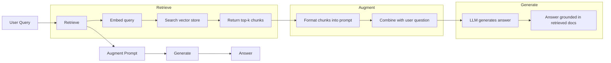
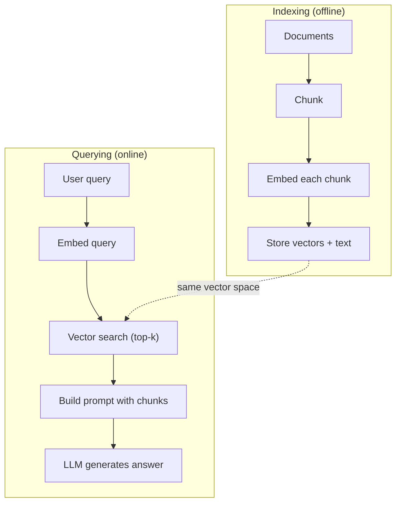

# RAG (پدران بهبود یافته)

> کارشناسی ارشد شما همه چیز را می داند تا دوره آموزشی خود. چیزی در مورد اسناد شرکت شما، پایگاه کد شما یا یادداشت های جلسه هفته گذشته نمی داند. RAG این را با بازیافت اسناد مربوطه و پر کردن آنها در پرامپت حل می کند. این الگوی رایج ترین در هوش مصنوعی تولید است. اگر شما چیزی را از این دوره بسازید، یک لوله لوله RAG بسازید.

**Type:** Build
**Languages:** Python
**Prerequisites:** Phase 10 (LLMs from Scratch), Phase 11 Lessons 01-05
**Time:** ~90 minutes
**Related:**مرحله 5 · 23 (استراتژی های شکستن برای RAG) برای شش الگوریتم شکستن و زمانی که هر یک برنده می شود. مرحله 5 · 22 (مودل های گنجاندن عمیق) برای انتخاب گنجاندن. مرحله 11 · 07 (RAG پیشرفته) برای جستجوی هیبریدی ، رتبه بندی مجدد و تبدیل سوال.

## اهداف یادگیری

- ساخت یک خط خط کامل RAG: بارگذاری اسناد، شکاف، گنجاندن، ذخیره سازی ویکتور، بازیافت و تولید
- پیاده سازی جستجوی معنوی با استفاده از یک پایگاه داده ویکتور (ChromaDB، FAISS، یا Pinecone) با شاخص سازی مناسب
- توضیح دهید که چرا RAG را در مورد تنظیم دقیق برای برنامه های مبتنی بر دانش ترجیح می دهند ( هزینه، تازه بودن، نسبت)
- ارزیابی کیفیت RAG با استفاده از متریک های بازیافت (درست بودن، بازپس گرفتن) و متریک تولید (وفاداری، ارتباط)

## مشکل

شما یک چت روت برای شرکت خود ایجاد می کنید. یک مشتری از شما می پرسد "سیاست بازپرداخت برای برنامه های شرکت چیست؟" LLM با یک پاسخ عمومی در مورد سیاست های بازپرداخت SaaS معمول پاسخ می دهد. سیاست واقعی، که در ویکی داخلی 200 صفحه ای دفن شده است، می گوید مشتریان شرکت یک پنجره 60 روزه با بازپرداخت های معادل دریافت می کنند. LLM هرگز این سند را ندیده است. نمی تواند بداند که در چه زمینه ای آموزش دیده نشده است.

تنظیم دقیق یک راه حل است. LLM را بگیرید، آن را در اسناد داخلی خود آموزش دهید و مدل به روز شده را پیاده سازی کنید. این کار می کند اما مشکلات جدی دارد. تنظیم دقیق هزینه هزاران دلار در محاسبات است. مدل در لحظه ای که یک سند تغییر می کند قدیمی می شود. شما هیچ راهی برای دانستن اینکه مدل از چه منبع ای گرفته شده است. و اگر شرکت یک خط محصول جدید را در ماه آینده خریداری کند، شما دوباره تنظیم دقیق می کنید.

RAG راه حل ديگه اي است. مدل رو دست نخورده بذار وقتی یک سوال وارد می شود، در فروشگاه اسناد خود به دنبال متن های مرتبط باشید، آن ها را در پیامک قبل از سوال چسبید و اجازه دهید مدل با استفاده از آن متن ها پاسخ دهد. ذخیره اسناد می تواند در عرض چند دقیقه به روز شود. می تونید ببینید دقیقاً چه اسنادی رو پیدا کردید. خود مدل هرگز تغییر نمی کند. به همین دلیل است که RAG الگوی غالب در تولید است: ارزان تر، تازه تر، قابل بررسی تر است و با هر LLM کار می کند.

## مفهوم

### مدل RAG

کل الگوی در چهار مرحله قرار دارد:



سوال -> بازیافت -> افزونه پرامپت -> تولید. هر سیستم RAG این الگوی را دنبال می کند. تفاوت بین سیستم های تولید RAG در جزئیات هر مرحله است: چگونه شما بخش بندی می کنید، چگونه شما گنجانید، چگونه شما جستجو می کنید و چگونه شما پرامپت را ساختید.

### چرا RAG بهتر از تنظیم خوب است

| Concern | Fine-tuning | RAG |
|---------|------------|-----|
| Cost | $1,000-$100,000+ per training run | $0.01-$0.10 per query (embedding + LLM) |
| Freshness | Stale until retrained | Updated in minutes by re-indexing docs |
| Auditability | Cannot trace answer to source | Can show exact retrieved passages |
| Hallucination | Still hallucinates freely | Grounded in retrieved documents |
| Data privacy | Training data baked into weights | Documents stay in your vector store |

تنظیم دقیق وزن مدل را به طور دائمی تغییر می دهد. RAG زمینه مدل را به طور موقت تغییر می دهد. برای اکثر برنامه ها، زمینه موقت چیزی است که شما می خواهید.

در موردی که تنظیم دقیق برنده می شود: زمانی که شما نیاز به مدل برای اتخاذ یک سبک، طن یا الگوی استدلال خاص دارید که تنها با درخواست نمی تواند به دست آید. برای بازیافت دانش واقعی، RAG هر بار برنده می شود.

### درگیری مدل ها

یک مدل گنجانده متن را به یک ویکتور کثیف تبدیل می کند. متن های مشابه ویکتور هایی را تولید می کنند که در این فضای ابعاد بالا نزدیک به یکدیگر هستند. "چگونه رمز عبور خود را تنظیم کنم؟" و "به تغییر رمز عبور نیاز دارم" ویکتورهای تقریبا یکسان را تولید می کنند اگرچه چند کلمه را به اشتراک می گذارند. " گربه روی فرش نشسته است" ویکتور بسیار متفاوتی تولید می کند.

مدل های داخلی مشترک (صف بندی ۲۰۲۶  برای تجزیه و تحلیل کامل، مرحله ۵ · ۲۲ را ببینید):

| Model | Dimensions | Provider | Notes |
|-------|-----------|----------|-------|
| text-embedding-3-small | 1536 (Matryoshka) | OpenAI | Best price/performance for most use cases |
| text-embedding-3-large | 3072 (Matryoshka) | OpenAI | Higher accuracy, truncatable to 256/512/1024 |
| Gemini Embedding 2 | 3072 (Matryoshka) | Google | Top MTEB retrieval; 8K context |
| voyage-4 | 1024/2048 (Matryoshka) | Voyage AI | Domain variants (code, finance, law) |
| Cohere embed-v4 | 1024 (Matryoshka) | Cohere | Strong multilingual, 128K context |
| BGE-M3 | 1024 (dense + sparse + ColBERT) | BAAI (open-weight) | Three views from one model |
| Qwen3-Embedding | 4096 (Matryoshka) | Alibaba (open-weight) | Top open-weight retrieval score |
| all-MiniLM-L6-v2 | 384 | Open-weight (Sentence Transformers) | Prototyping baseline |

برای این درس، ما از طریق TF-IDF یک ادغام ساده خود را ایجاد می کنیم. نه به این دلیل که TF-IDF از سیستم های تولید استفاده می کند، بلکه به این دلیل که مفهوم را مشخص می کند: متن وارد می شود، یک ویکتور خارج می شود، متن های مشابه ویکتورهای مشابه تولید می کنند.

### شباهت متری

با توجه به دو متری، چگونه شباهت را اندازه گیری کنیم؟ سه گزینه:

**Cosine similarity**: کوسین زاویه بین دو متری. از -1 (قابل) تا 1 (تماه برابر) می باشد. اندازه را نادیده می گیرد، فقط به جهت اهمیت می دهد. این پیش فرض برای RAG است.

```
cosine_sim(a, b) = dot(a, b) / (||a|| * ||b||)
```

**Dot product**: محصول داخلی خام. متری های بزرگتر نمره های بالاتر را دریافت می کنند. مفید است هنگامی که حجم اطلاعات را حمل می کند (دستور های طولانی تر ممکن است مرتبط تر باشند).

```
dot(a, b) = sum(a_i * b_i)
```

**L2 (Euclidean) distance**فاصله خط مستقیم در فضای متری. فاصله کوچکتر = مشابهتر. حساس به تفاوت های بزرگی.

```
L2(a, b) = sqrt(sum((a_i - b_i)^2))
```

شباهت کوسین استاندارد است. این اسناد طول های مختلف را با زیبایی اداره می کند زیرا با اندازه عادی می شود. وقتی کسی می گوید " جستجوی ویکتور، " تقریبا همیشه به معنای شباهت کوسین است.

### استراتژی های شکستن

اسناد برای گنجاندن به عنوان یک ویکتور طولانی هستند. یک PDF 50 صفحه ممکن است یک گنجاندن وحشتناک ایجاد کند زیرا حاوی ده ها موضوع است. در عوض، شما اسناد را به قطعات تقسیم می کنید و هر قطعه را به طور جداگانه گنجانید.

**Fixed-size chunking**: تقسیم هر نماد N. ساده و قابل پیش بینی است. یک قطعه 512 نماد با 50 نماد تعادل است نماد 1 است نماد 0-511, قطعه 2 است نماد 462-973 و غیره. تعادل تضمین می کند که شما یک جمله را در یک مرز بد شانس تقسیم نمی کنید.

**Semantic chunking**: تقسیم در مرزهای طبیعی. پاراگراف ها، بخش ها یا سرنخ های نشان دادن. هر قطعه یک واحد معنی منسجم است. پیاده سازی پیچیده تر اما بازیافت بهتر را تولید می کند.

**Recursive chunking**اگر بخش هنوز هم خیلی بزرگ است، در مرز پاراگراف تقسیم کنید. اگر پاراگراف هنوز خیلی بزرگ است، در مرز جملات تقسیم کنید. این رویکرد LangChain RecursiveCharacterTextSplitter است و در عمل خوب کار می کند.

اندازه قطعه ها مهم تر از آنچه مردم فکر می کنند:

- خیلی کوچک (64-128 توکن): هر قطعه بدون زمینه ای است. "این به 15 درصد افزایش یافته است سه ماهه گذشته" بدون دانستن "این" به چه معنی است، چیزی نیست.
- خیلی بزرگ (2048+ توکن): هر بخش موضوعات متعددی را پوشش می دهد، ارتباط را کاهش می دهد. وقتی برای داده های درآمد جستجو می کنید، شما یک بخش دریافت می کنید که 10٪ در مورد درآمد و 90٪ در مورد تعداد کارکنان است.
- نقطه شیرین (256-512 توکن): زمینه کافی برای خودبستگی، تمرکز کافی برای ارتباط.

اکثر سیستم های تولید RAG از 256 تا 512 قطعه توکن با 50 توکن همپوشانی استفاده می کنند. دستورالعمل های RAG Anthropic این محدوده را توصیه می کند.

### پایگاه داده های ویکتور

وقتی که شما یک بار به آن ها اضافه شده اید، باید جایی برای ذخیره کردن و جستجو آنها باشید.

| Database | Type | Best for |
|----------|------|----------|
| FAISS | Library (in-process) | Prototyping, small to medium datasets |
| Chroma | Lightweight DB | Local development, small deployments |
| Pinecone | Managed service | Production without ops overhead |
| Weaviate | Open source DB | Self-hosted production |
| pgvector | Postgres extension | Already using Postgres |
| Qdrant | Open source DB | High-performance self-hosted |

برای این درس، ما یک فروشگاه ویکتور ساده در حافظه ایجاد می کنیم. این ویکتورها را در یک لیست ذخیره می کند و جستجوی شباهت کوسین با نیروی خام انجام می دهد. این معادل FAISS با شاخص مسطح است. قبل از کند شدن، ممکن است به ۱۰۰ هزار ویکتور مقیاس بندی کند. سیستم های تولید از الگوریتم های همسایه نزدیک (ANN) مانند HNSW برای جستجوی میلیون ها ویکتور در میلی ثانیه استفاده می کنند.

### خط لوله کامل



مرحله انڈیکس یک بار در هر سند اجرا می شود (یا زمانی که اسناد به روز می شوند). مرحله سوال در هر درخواست کاربر اجرا می شود. در تولید، انڈیکس ممکن است میلیون ها سند را طی ساعت ها پردازش کند. سوال باید در کمتر از یک ثانیه پاسخ دهد.

### اعداد واقعی

اکثر سیستم های RAG تولید از این پارامترها استفاده می کنند:

- **k = 5 to 10**قطعات بازیافت شده در هر جستجو
- **Chunk size = 256 to 512 tokens**با 50 توکن همپوشانی
- **Context budget**: 2500 تا 5000 توکن محتوای بازیافت شده در هر جستجو
- **Total prompt**: ~ 8000-16,000 توکن (سستمه سیستم + قطعات بازیافت شده + تاریخچه مکالمه + سوال کاربر)
- **Embedding dimension**: 384-3072 بسته به مدل
- **Indexing throughput**: 100 تا 1000 سند در ثانیه با API های داخلی
- **Query latency**: 50-200ms برای بازیافت، 500-3000ms برای تولید

```figure
rag-chunking
```

## آن را بسازید

### مرحله اول: کج کردن اسناد

```python
def chunk_text(text, chunk_size=200, overlap=50):
    words = text.split()
    chunks = []
    start = 0
    while start < len(words):
        end = start + chunk_size
        chunk = " ".join(words[start:end])
        chunks.append(chunk)
        start += chunk_size - overlap
    return chunks
```

### مرحله دوم: گنجانده شدن TF-IDF

ما یک تابع ادغام ساده ایجاد می کنیم. TF-IDF (تردد متغیر متغیر متغیر متغیر) یک ادغام عصبی نیست، اما متن را به ویکتور به گونه ای تبدیل می کند که اهمیت کلمه را درک کند. کلمات مکرر در یک سند TF بالاتر می شوند. کلمات نادر در سراسر corpus IDF بالاتر می شوند. محصول یک ویکتور را می دهد که کلمات مهم و متمایز دارای ارزش های بالا هستند.

```python
import math
from collections import Counter

def build_vocabulary(documents):
    vocab = set()
    for doc in documents:
        vocab.update(doc.lower().split())
    return sorted(vocab)

def compute_tf(text, vocab):
    words = text.lower().split()
    count = Counter(words)
    total = len(words)
    return [count.get(word, 0) / total for word in vocab]

def compute_idf(documents, vocab):
    n = len(documents)
    idf = []
    for word in vocab:
        doc_count = sum(1 for doc in documents if word in doc.lower().split())
        idf.append(math.log((n + 1) / (doc_count + 1)) + 1)
    return idf

def tfidf_embed(text, vocab, idf):
    tf = compute_tf(text, vocab)
    return [t * i for t, i in zip(tf, idf)]
```

### مرحله سوم: جستجوی شباهت های کوزین

```python
def cosine_similarity(a, b):
    dot = sum(x * y for x, y in zip(a, b))
    norm_a = math.sqrt(sum(x * x for x in a))
    norm_b = math.sqrt(sum(x * x for x in b))
    if norm_a == 0 or norm_b == 0:
        return 0.0
    return dot / (norm_a * norm_b)

def search(query_embedding, stored_embeddings, top_k=5):
    scores = []
    for i, emb in enumerate(stored_embeddings):
        sim = cosine_similarity(query_embedding, emb)
        scores.append((i, sim))
    scores.sort(key=lambda x: x[1], reverse=True)
    return scores[:top_k]
```

### مرحله چهارم: ساخت سریع

این جایی است که "توسع" در RAG اتفاق می افتد. قطعات بازیافت شده را بگیرید، آنها را به یک پرامپت فرمت کنید و از LLM بخواهید که بر اساس زمینه ارائه شده پاسخ دهد.

```python
def build_rag_prompt(query, retrieved_chunks):
    context = "\n\n---\n\n".join(
        f"[Source {i+1}]\n{chunk}"
        for i, chunk in enumerate(retrieved_chunks)
    )
    return f"""Answer the question based ONLY on the following context.
If the context doesn't contain enough information, say "I don't have enough information to answer that."

Context:
{context}

Question: {query}

Answer:"""
```

### مرحله پنجم: خط لوله RAG کامل

```python
class RAGPipeline:
    def __init__(self):
        self.chunks = []
        self.embeddings = []
        self.vocab = []
        self.idf = []

    def index(self, documents):
        all_chunks = []
        for doc in documents:
            all_chunks.extend(chunk_text(doc))
        self.chunks = all_chunks
        self.vocab = build_vocabulary(all_chunks)
        self.idf = compute_idf(all_chunks, self.vocab)
        self.embeddings = [
            tfidf_embed(chunk, self.vocab, self.idf)
            for chunk in all_chunks
        ]

    def query(self, question, top_k=5):
        query_emb = tfidf_embed(question, self.vocab, self.idf)
        results = search(query_emb, self.embeddings, top_k)
        retrieved = [(self.chunks[i], score) for i, score in results]
        prompt = build_rag_prompt(
            question, [chunk for chunk, _ in retrieved]
        )
        return prompt, retrieved
```

### مرحله 6: نسل (تخونی)

در تولید، این جایی است که شما LLM API را می نامید. برای این درس، ما تولید را با استخراج مرتبط ترین جمله از زمینه بازیافت می کنیم.

```python
def simple_generate(prompt, retrieved_chunks):
    query_words = set(prompt.lower().split("question:")[-1].split())
    best_sentence = ""
    best_score = 0
    for chunk in retrieved_chunks:
        for sentence in chunk.split("."):
            sentence = sentence.strip()
            if not sentence:
                continue
            words = set(sentence.lower().split())
            overlap = len(query_words & words)
            if overlap > best_score:
                best_score = overlap
                best_sentence = sentence
    return best_sentence if best_sentence else "I don't have enough information."
```

## ازش استفاده کن

با مدل واقعی ادغام و LLM، کد به سختی تغییر می کند:

```python
from openai import OpenAI

client = OpenAI()

def embed(text):
    response = client.embeddings.create(
        model="text-embedding-3-small",
        input=text
    )
    return response.data[0].embedding

def generate(prompt):
    response = client.chat.completions.create(
        model="gpt-4o-mini",
        messages=[{"role": "user", "content": prompt}],
        temperature=0
    )
    return response.choices[0].message.content
```

یا با آنترپيك:

```python
import anthropic

client = anthropic.Anthropic()

def generate(prompt):
    response = client.messages.create(
        model="claude-sonnet-5",
        max_tokens=1024,
        messages=[{"role": "user", "content": prompt}]
    )
    return response.content[0].text
```

خط لوله یکسان است. تابع ادغام را تغییر دهید. تابع تولید را تغییر دهید. منطق بازیافت، شکاف، ساخت سریع - همه یکسان هستند، صرف نظر از اینکه از کدام مدل استفاده می کنید.

برای ذخیره سازی ویکتور در مقیاس، جستجوی نیروی خام را با یک پایگاه داده ویکتور مناسب جایگزین کنید:

```python
import chromadb

client = chromadb.Client()
collection = client.create_collection("my_docs")

collection.add(
    documents=chunks,
    ids=[f"chunk_{i}" for i in range(len(chunks))]
)

results = collection.query(
    query_texts=["What is the refund policy?"],
    n_results=5
)
```

کروما ورودی را در داخل اداره می کند (به طور پیش فرض از تمام MiniLM-L6-v2 استفاده می کند) و متری ها را در یک پایگاه داده محلی ذخیره می کند. الگوی مشابه، لوله کشی متفاوت.

## -باده

این درس نتیجه می دهد:
- `outputs/prompt-rag-architect.md`-- یک دستور برای طراحی سیستم های RAG برای موارد استفاده خاص
- `outputs/skill-rag-pipeline.md`-- يه مهارت که به ماموران مي آموزد چطوري لوله هاي RAG رو بسازند و بگي کنن

## تمرینات

1. جایگزین ورودی های TF-IDF با یک رویکرد ساده با کلمات (باینری: 1 اگر کلمه وجود دارد، 0 اگر وجود ندارد) مقایسه کیفیت بازیافت در اسناد نمونه. TF-IDF باید عملکرد بهتری داشته باشد زیرا کلمات نادر را وزن می کند.

2. با اندازه قطعات آزمایش کنید: 50، 100، 200 و 500 کلمه را در یک مجموعه سند امتحان کنید. برای هر اندازه، 5 سوال را اجرا کنید و شمارش کنید که چند تا از آنها یک قطعه مربوطه را در بالای 3 بازمی گرداند. نقطه شیرین را پیدا کنید که کیفیت بازیافت آن بالا می رود.

3. متاداتا را به هر بخش اضافه کنید (نام سند منبع، موقعیت بخش). قالب فوری را برای شامل اختصاص منبع تغییر دهید تا LLM منابع خود را ذکر کند.

4. یک ارزیابی ساده انجام دهید: با داده 10 جفت سوال و پاسخ، هر سوال را از طریق لوله RAG اجرا کنید و اندازه گیری کنید که چه درصد از قطعات بازیافت شده پاسخ را دارند. این بازیافت در k است.

5. یک خط لوله RAG آگاه از مکالمه بسازید: یک تاریخچه از 3 مبادله اخیر را حفظ کنید و آنها را در پیامک همراه با قطعات بازیافت شده شامل کنید. آزمایش با سوالات پیگیری مانند "چه در مورد شرکت؟" پس از پرسیدن در مورد قیمت گذاری.

## اصطلاحات کلیدی

| Term | What people say | What it actually means |
|------|----------------|----------------------|
| RAG | "AI that reads your docs" | Retrieve relevant documents, paste them into the prompt, and generate an answer grounded in those documents |
| Embedding | "Convert text to numbers" | A dense vector representation of text where similar meanings produce similar vectors |
| Vector database | "Search engine for AI" | A data store optimized for storing vectors and finding the nearest neighbors by similarity |
| Chunking | "Split docs into pieces" | Breaking documents into smaller segments (typically 256-512 tokens) so each can be embedded and retrieved independently |
| Cosine similarity | "How similar are two vectors" | The cosine of the angle between two vectors; 1 = identical direction, 0 = orthogonal, -1 = opposite |
| Top-k retrieval | "Get the k best matches" | Return the k most similar chunks to the query from the vector store |
| Context window | "How much text the LLM can see" | The maximum number of tokens the LLM can process in a single request; retrieved chunks must fit within this |
| Augmented generation | "Answer using given context" | Generating a response using retrieved documents as context rather than relying solely on trained knowledge |
| TF-IDF | "Word importance scoring" | Term Frequency times Inverse Document Frequency; weights words by how distinctive they are within a corpus |
| Indexing | "Preparing docs for search" | The offline process of chunking, embedding, and storing documents so they can be searched at query time |

## خواندن بیشتر

- لوئیس و همکارانش، "تولید بازیافت شده برای وظایف NLP دانش فشرده" (2020) - مقاله اصلی RAG از تحقیقات هوش مصنوعی فیس بوک که الگوی بازیافت و سپس تولید را رسمی کرد
- مستندات RAG Anthropic (docs.anthropic.com) - دستورالعمل های عملی برای اندازه قطعات، ساخت سریع و ارزیابی
- مرکز یادگیری Pinecone، "RAG چیست؟" - توضیحات بصری واضح از لوله RAG با توجه به تولید
- جملۀ-BERT: Reimers & Gurevych (2019) - مقاله ای که در پشت مدل های گنجانده شده MiniLM قرار دارد، نشان می دهد که چگونه دو کدگر را برای شباهت معنوی آموزش دهیم
- [Karpukhin et al., "Dense Passage Retrieval for Open-Domain Question Answering" (EMNLP 2020)](https://arxiv.org/abs/2004.04906)-- مقاله DPR که ثابت کرد که بازیافت دو کدرسنده فشرده از BM25 در QA دامنه باز می شود و الگوی بازیافت کننده های RAG مدرن را تعیین می کند.
- [LlamaIndex High-Level Concepts](https://docs.llamaindex.ai/en/stable/getting_started/concepts.html)-- مفاهیم اصلی که باید در هنگام ساخت خط لوله های RAG بدانید: بارگذاری داده ها، پارسر های گره، شاخص ها، بازیافت کنندگان، سنتزایزر پاسخ.
- [LangChain RAG tutorial](https://python.langchain.com/docs/tutorials/rag/)-- آرکیستراتور خوشبو مخالف؛ دید زنجیره ای از راه اندازی از همان الگوی بازیافت و سپس تولید.
