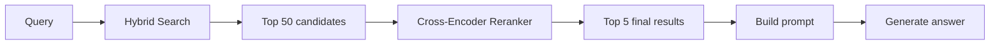
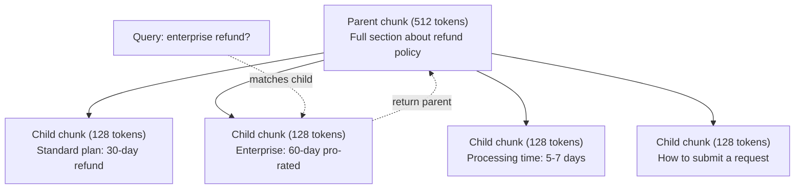
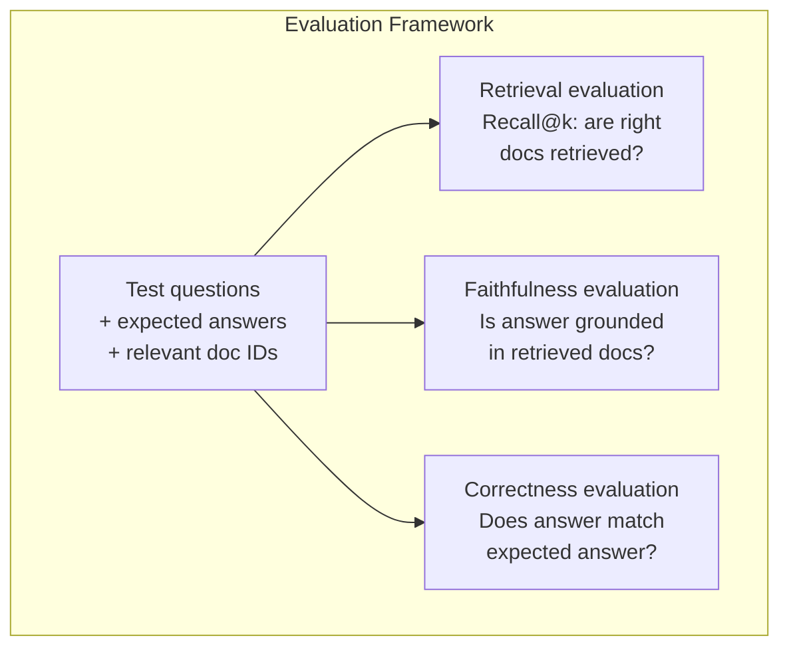

# RAG پیشرفته (تخفیف، رتبه بندی مجدد، جستجوی ترکیبی)

> RAG پایه به دست آوردن top-k بیشتر شبیه قطعات است. که برای سوالات ساده کار می کند. آن را برای استدلال چند hop، سوالات مبهم و corpora بزرگ. RAG پیشرفته تفاوت بین یک نمایش که کار می کند بر روی 10 سند و یک سیستم که کار می کند بر روی 10 میلیون است.

**Type:** Build
**Languages:** Python
**Prerequisites:** Phase 11, Lesson 06 (RAG)
**Time:** ~90 minutes
**Related:**مرحله 5 · 23 (استراتژی های شکستن برای RAG) شامل تمام شش الگوریتم شکستن است  بازگشت، معنوی، جمله، سند والدین، شکستن دیر، بازیافت زمینه ای  با معیار های Vectara / Anthropic. این درس بر روی بالا ساخته شده است: جستجوی ترکیبی، رتبه بندی مجدد، تبدیل سوال.

## اهداف یادگیری

- پیاده سازی استراتژی های پیشرفته تقسیم بندی (معنی، تکراری، والدین و فرزند) که ساختار و زمینه اسناد را حفظ کنند
- ساخت یک لوله جستجوی ترکیبی که ترکیب کلمات کلیدی BM25 با جستجوی متری معنوی و یک ریرنکر کراس کدر را ترکیب کند
- استفاده از تکنیک های تبدیل سوال (HyDE، چند سوال، قدم عقب) برای بهبود بازیافت در سوالات مبهم یا پیچیده
- تشخیص و رفع شکست های رایج RAG: بخش اشتباه بازیافت شده، پاسخ در زمینه نیست، تجزیه استدلال چند رک

## مشکل

تو در درس 06 یک خط لوله RAG پایه ای ساختی. این برای سوالات ساده در یک کورپوس کوچک کار می کند. حالا اینو امتحان کن:

**Ambiguous query**: "سرآمدی سه ماهه گذشته چه بود؟" جستجوی معنوی قطعات مربوط به استراتژی درآمد، پیش بینی های درآمد و افکار مدیر مالی در مورد رشد درآمد را باز می گرداند. همه به لحاظ معنوی شبیه به کلمه "سرآمدی است". هیچ کدام شامل تعداد واقعی نیست. قطعه درست می گوید "$47.2M in Q3 2025" but uses the word "earnings" instead of "revenue." The embedding model thinks "revenue strategy" is closer to the query than "Q3 earnings were $۴۷٫۲ میلی متر

**Multi-hop question**: "کدام تیم بیشترین بهبود در میزان رضایت مشتری را داشته است؟" این امر نیازمند پیدا کردن نمره رضایت برای هر تیم، مقایسه آنها و شناسایی حداکثر است. هیچ بخش واحد حاوی پاسخ نیست. اطلاعات در گزارش های تیم پخش شده است.

**Large corpus problem**شما 2 میلیون قطعه دارید. پاسخ درست در قطعه #1,847,293 است. اولین 5 مورد را در قطعه #1,89,201، #1,200,000، #44, و #901,333 پیدا می کنید. فضای داخلی را نزدیک می کنید، اما هیچ کدام از آنها پاسخ را ندارد. در این مقیاس، نزدیک ترین جستجوی همسایه به اندازه کافی خطایایی را ایجاد می کند تا نتایج مربوط به بالا از top-k خارج شود.

RAG پایه شکست می خورد چون شباهت متری با ارتباط یکسان نیست. یک قطعه می تواند به لحاظ معنوی شبیه به یک سوال باشد بدون اینکه برای پاسخ دادن به آن مفید باشد. RAG پیشرفته با چهار تکنیک این موضوع را حل می کند: جستجوی ترکیبی (تضمين تطابق کلمات کلیدی) ، رتبه بندی مجدد (نمایانگر را با دقت تر رتبه بندی کنید) ، تبدیل سوال (تضمین سوال قبل از جستجو) و بهتر کردن (بازگیره کردن در غلظت درست).

## مفهوم

### جستجوی ترکیبی: معنی + کلمه کلیدی

جستجوی معنوی (مثل متری) در درک معنی خوب است. "چگونه اشتراک خود را لغو کنم؟" با "خطوات برای لغو برنامه شما" مطابقت دارد حتی اگر آنها کلمات را به اشتراک نمی گذارند. اما مطابقت دقیق را از دست می دهد. "کوید خطای E-4021" ممکن است با یک قطعه حاوی "E-4021" مطابقت نداشته باشد اگر مدل گنجاندن آن را به عنوان سر و صدا در نظر بگیرد.

جستجوی کلمات کلیدی (BM25) برعکس است. در مطابقت دقیق عالی است. "E-4021" به طور کامل مطابقت دارد. اما "منظور اشتراک من را لغو کنید" نتایج صفر را می دهد اگر سند می گوید "پلان خود را پایان دهید".

جستجو های هائبریدی هر دو را اجرا می کند، سپس نتایج را ترکیب می کند.

**BM25**(بهترین تطابق 25) الگوریتم جستجوی کلمات کلیدی استاندارد است. این ستون فقرات موتورهای جستجو از دهه 1990 بوده است. فرمول:

```
BM25(q, d) = sum over terms t in q:
    IDF(t) * (tf(t,d) * (k1 + 1)) / (tf(t,d) + k1 * (1 - b + b * |d| / avgdl))
```

در حالی که tf(t،d) فرکانس اصطلاح t در سند d، IDF(t) فرکانس متن متن معکوس است، و \ \ \ \ \ \ \ \ \ \ \ \ \ \ \ \ \ \ \ \ \ \ \ \ \ \ \ \ \ \ \ \ \ \ \ \ \ \ \ \ \ \ \ \ \ \ \ \ \ \ \ \ \ \ \ \ \ \ \ \ \ \ \ \ \ \ \ \ \ \ \ \ \ \ \ \ \ \ \ \ \ \ \ \ \ \ \ \ \ \ \ \ \ \ \ \ \ \ \ \ \ \ \ \ \ \ \ \ \ \ \ \ \ \ \ \ \ \ \ \ \ \ \ \ \ \ \ \ \ \ \ \ \ \ \ \ \ \ \ \ \ \ \ \ \ \ \ \ \ \ \ \ \ \ \ \ \ \ \ \ \ \ \ \ \ \ \ \ \ \ \ \ \ \ \ \ \ \ \ \ \ \ \ \ \ \ \ \ \ \ \ \ \ \ \ \ \ \ \ \ \ \ \ \ \ \ \ \ \ \ \ \ \ \ \ \ \ \ \ \ \ \ \ \ \ \ \ \ \ \ \ \ \ \ \ \ \ \ \ \ \ \ \ \ \ \ \ \ \ \ \ \ \ \ \ \ \ \ \ \ \ \ \ \ \ \ \ \ \ \ \ \ \ \ \ \ \ \ \ \ \ \ \ \ \ \ \ \ \ \ \ \ \ \ \ \ \ \ \ \ \ \ \ \ \ \ \ \ \ \ \ \ \ \ \ \ \ \ \ \ \ \ \ \ \ \ \ \ \ \ \ \ \ \ \ \ \ \ \ \ \ \ \ \ \ \ \ \ \ \ \ \ \ \ \ \ \ \ \ \ \ \ \ \ \ \ \ \ \ \ \ \ \ \ \ \ \ \ \ \ \ \ \ \ \ \ \ \ \ \ \ \ \ \ \ \ \ \ \ \ \ \ \ \ \ \ \ \ \ \ \ \ \ \ \ \ \ \ \ \ \ \ \ \ \ \ \ \ \ \ \ \ \ \ \ \ \ \ \ \ \ \ \ \ \ \ \ \ \ \ \ \ \ \ \ \ \ \ \ \ \ \ \ \ \ \ \ \ \ \ \ \ \ \ \ \

در شرایط ساده: BM25 اسناد را زمانی بالاتر می کند که حاوی اصطلاحات جستجو (به ویژه موارد نادر) باشند، اما با بازده کاهش یافته برای اصطلاحات تکراری. یک سند با کلمه "آموزش" 50 برابر مرتبط تر از یک سند با آن 50 برابر نیست.

### ادغام درجه متقابل (RRF)

شما دو لیست رتبه بندی دارید: یکی از جستجوی ویکتور، یکی از BM25. چگونه آنها را ترکیب می کنید؟ ترکیب رتبه متقابل رویکرد استاندارد است.

```
RRF_score(d) = sum over rankings R:
    1 / (k + rank_R(d))
```

جایی که k ثابت (معمولا 60) است که مانع از تسلط نتیجه برتر می شود.

یک سند در رتبه اول در جستجوی ویکتور و شماره 5 در BM25 می شود: 1/(60+1) + 1/(60+5) = 0.0164 + 0.0154 = 0.0318

یک سند رتبه #3 در جستجو متری و #2 در BM25 می شود: 1/(60+3) + 1/(60+2) = 0.0159 + 0.0161 = 0.0320

RRF به طور طبیعی دو سیگنال را متعادل می کند. یک سند که در هر دو لیست رتبه بالا دارد بهترین امتیاز را می گیرد. یک سند که در یک لیست شماره 1 قرار دارد اما از لیست دیگر غایب است نمره متوسط را می گیرد. این قوی است زیرا از رتبه ها استفاده می کند، نه نمره خام، بنابراین تفاوت در توزیع نمره بین دو سیستم مهم نیست.

### رتبه بندی مجدد

بازیافت (چگونه که ویکتور، کلمه کلیدی یا ترکیبی باشد) سریع اما نامحدد است. از دو کدگذاری استفاده می کند: سوال و هر سند به طور مستقل دربرگیر می شوند، سپس مقایسه می شوند. دربرگیرنده ها یک بار محاسبه می شوند و به صورت کیش می شوند. این به میلیون ها سند می رسد.

رتبه بندی از کراس کودر استفاده می کند: سوال و یک سند کاندید به یک مدل که نمره مرتبطی را تولید می کند، به همراه یکدیگر تغذیه می شود. مدل هر دو متن را به طور همزمان می بیند و می تواند تعاملات نازک بین آنها را ضبط کند. یک کراس کودر می تواند درک کند که "اقتصاد Q3 چیست؟" برای یک قطعه حاوی "$47.2 میلیون در Q3" بسیار مرتبط است حتی اگر یک دو کودر ارتباط را از دست بدهد.

معامله: کراس کودر ها 100-1000 برابر کندتر از کراس کودر ها هستند زیرا آنها زوج اسناد جستجو را به طور مشترک پردازش می کنند. شما نمی توانید نمرات کراس کودر را برای یک میلیون سند پیش از حساب کنید. راه حل: مجموعه ای از کاندیداهای بزرگتر (Top-50 از جستجوی هیبریدی) را بازیافت کنید، سپس با یک کراس کودر رتبه مجدد کنید تا اولین 5 نهایی را بدست آورید.



مدل های معمول رتبه بندی مجدد (خط بندی 2026):
- Cohere Rerank 3.5: API مدیریت شده، چندزبانی، بهترین افزایش یادآوری در کارپوه های مخلوط
- رتبه بندی مجدد سفر-2.5: API مدیریت شده، کمترین تاخیر گزینه های میزبانی شده
- Jina-Reranker-v2 چند زبانی: وزن باز، بیش از 100 زبان
- bge-reanker-v2-m3: وزن باز، خط پایه قوی
- کراس کدر/ms-marco-MiniLM-L-6-v2: وزن باز، روی CPU برای نمونه سازی اجرا می شود
- ColBERTv2 / Jina-ColBERT-v2: تعدد مجدد متریزی متقابل با تعدد دیر  O(توکین ها) نه O(دک) در زمان امتیاز

### سوال تغییر

گاهی اوقات مشکل بازیافت نیست بلکه خود سوال است. "این چیزی در مورد تغییر سیاست جدید چه بود؟" یک سوال جستجوی وحشتناک است. آن حاوی هیچ اصطلاح خاصی نیست. گنجانده شدن مبهم است. هیچ سیستم بازیافت نمی تواند اسناد مناسب را از این پیدا کند.

**Query rewriting**: عبارت سوال کاربر را به یک سوال جستجوی بهتر تبدیل کنید. یک LLM می تواند این کار را انجام دهد:

```
User: "What was that thing about the new policy change?"
Rewritten: "Recent policy changes and updates"
```

**HyDE (Hypothetical Document Embeddings)**: به جای جستجو با سوال، یک پاسخ فرضی ایجاد کنید، آن را گنجانید و به دنبال اسناد واقعی مشابه باشید.

```
Query: "What is the refund policy for enterprise?"
Hypothetical answer: "Enterprise customers are eligible for a full refund
within 60 days of purchase. Refunds are pro-rated based on the remaining
subscription period and processed within 5-7 business days."
```

پاسخ فرضیه را در داخل کنید و به دنبال اسناد واقعی مشابه آن باشید. حس: پاسخ فرضیه در داخل کردن فضای واقعی به پاسخ اصلی نزدیک تر است. سوالات و پاسخ ها ساختار زبانی متفاوتی دارند. با تولید یک پاسخ فرضیه، شکاف بین " فضای سوال " و " فضای پاسخ " در داخل داخل داخل می شود.

HyDE یک تماس LLM را قبل از بازیافت اضافه می کند. این تاخیر را 500-2000ms افزایش می دهد. ارزش آن را دارد وقتی کیفیت بازیافت ضعیف در سوالات خام است.

### کُشیدن والدین و کودکان

شکستن استاندارد باعث می شود که یک معامله انجام شود: قطعات کوچک برای بازیافت دقیق، قطعات بزرگ برای زمینه کافی.

بخش کوچک (128 توکن) را برای بازیافت شاخص کنید. هنگامی که بخش کوچک بازیافت شود، بخش اصلی خود (512 توکن) را برای پرامپت بازگردانید. بخش کوچک دقیقا با سوال مطابقت دارد. بخش اصلی زمینه کافی را برای LLM برای تولید پاسخ خوب فراهم می کند.



سوال "بازپرداخت شرکت؟" به طور دقیق با بخش کودک C2 مطابقت دارد. اما پرامپت بخش اصلی کامل P را دریافت می کند، که شامل زمینه اطراف در مورد زمان پردازش و فرآیند ارسال می شود.

### فیلتر کردن متاداتا

قبل از انجام جستجوی متری، کرپوس را با متاداتا: تاریخ، منبع، دسته، نویسنده، زبان فیلتر کنید. این فضای جستجو را کاهش می دهد و از نتایج بی ربط جلوگیری می کند.

"ماه ماه گذشته در سیاست امنیتی چه تغییراتی رخ داد؟" باید فقط اسناد ۳۰ روز گذشته را در دسته امنیتی جستجو کند. بدون فیلتر کردن متاداتا، شما کل کورپوس را جستجو می کنید و ممکن است یک سند امنیتی دو ساله را پیدا کنید که به طور معنوی مشابه است.

سیستم های تولید RAG متاداتا را در کنار هر قطعه ذخیره می کنند: سند منبع، تاریخ ایجاد، دسته بندی، نویسنده، نسخه. پایگاه داده های ویکتور از فیلتر کردن پیش از متاداتا قبل از جستجوی شباهت پشتیبانی می کنند، که برای عملکرد در مقیاس حیاتی است.

### ارزیابی

تو يه سيستم RAG ساختي از کجا ميدوني که جواب ميده؟

**Retrieval relevance (Recall@k)**: برای مجموعه ای از سوالات آزمون با اسناد مرتبط شناخته شده، چه درصد از اسناد مرتبط در نتایج top-k ظاهر می شوند؟ اگر پاسخ به یک سوال در بخش #47, آیا بخش #47 در top-5 ظاهر می شود؟

**Faithfulness**اگر قطعات بازیافت شده "چنان که در حال بازیافت است، پنجره 60 روز بازپرداخت است" و مدل "چنان که در حال بازپرداخت 90 روز است" می گوید، این یک شکست وفاداری است.

**Answer correctness**: آیا پاسخ تولید شده با پاسخ انتظار می رود؟ این متریک پایان به پایان است. این کیفیت بازیافت و کیفیت تولید را ترکیب می کند.

یک بررسی ساده صداقت: هر ادعای در پاسخ تولید شده را بگیرید و بررسی کنید که در قطعات بازیافت شده ظاهر می شود. اگر پاسخ حاوی یک واقعیت نیست که در هیچ قطعه بازیافت شده نباشد، احتمالاً توهم دارد.



```figure
agentic-rag-loop
```

## آن را بسازید

### مرحله ی ۱: پیاده سازی BM25

```python
import math
from collections import Counter

class BM25:
    def __init__(self, k1=1.2, b=0.75):
        self.k1 = k1
        self.b = b
        self.docs = []
        self.doc_lengths = []
        self.avg_dl = 0
        self.doc_freqs = {}
        self.n_docs = 0

    def index(self, documents):
        self.docs = documents
        self.n_docs = len(documents)
        self.doc_lengths = []
        self.doc_freqs = {}

        for doc in documents:
            words = doc.lower().split()
            self.doc_lengths.append(len(words))
            unique_words = set(words)
            for word in unique_words:
                self.doc_freqs[word] = self.doc_freqs.get(word, 0) + 1

        self.avg_dl = sum(self.doc_lengths) / self.n_docs if self.n_docs else 1

    def score(self, query, doc_idx):
        query_words = query.lower().split()
        doc_words = self.docs[doc_idx].lower().split()
        doc_len = self.doc_lengths[doc_idx]
        word_counts = Counter(doc_words)
        score = 0.0

        for term in query_words:
            if term not in word_counts:
                continue
            tf = word_counts[term]
            df = self.doc_freqs.get(term, 0)
            idf = math.log((self.n_docs - df + 0.5) / (df + 0.5) + 1)
            numerator = tf * (self.k1 + 1)
            denominator = tf + self.k1 * (1 - self.b + self.b * doc_len / self.avg_dl)
            score += idf * numerator / denominator

        return score

    def search(self, query, top_k=10):
        scores = [(i, self.score(query, i)) for i in range(self.n_docs)]
        scores.sort(key=lambda x: x[1], reverse=True)
        return scores[:top_k]
```

### مرحله دوم: ادغام رتبه های متقابل

```python
def reciprocal_rank_fusion(ranked_lists, k=60):
    scores = {}
    for ranked_list in ranked_lists:
        for rank, (doc_id, _) in enumerate(ranked_list):
            if doc_id not in scores:
                scores[doc_id] = 0.0
            scores[doc_id] += 1.0 / (k + rank + 1)
    fused = sorted(scores.items(), key=lambda x: x[1], reverse=True)
    return fused
```

### مرحله سوم: خط لوله جستجوی ترکیبی

```python
def hybrid_search(query, chunks, vector_embeddings, vocab, idf, bm25_index, top_k=5, fusion_k=60):
    query_emb = tfidf_embed(query, vocab, idf)
    vector_results = search(query_emb, vector_embeddings, top_k=top_k * 3)
    bm25_results = bm25_index.search(query, top_k=top_k * 3)
    fused = reciprocal_rank_fusion([vector_results, bm25_results], k=fusion_k)
    return fused[:top_k]
```

### مرحله چهارم: تغییر رتبه ساده

در تولید، شما از یک مدل کراس کودر استفاده می کنید. در اینجا ما یک رینکر را ایجاد می کنیم که با استفاده از تعادل کلمات، اهمیت اصطلاحات و مطابقت عبارت، ارتباط سوال و سند را ارزیابی می کند.

```python
def rerank(query, candidates, chunks):
    query_words = set(query.lower().split())
    stop_words = {"the", "a", "an", "is", "are", "was", "were", "what", "how",
                  "why", "when", "where", "do", "does", "for", "of", "in", "to",
                  "and", "or", "on", "at", "by", "it", "its", "this", "that",
                  "with", "from", "be", "has", "have", "had", "not", "but"}
    query_terms = query_words - stop_words

    scored = []
    for doc_id, initial_score in candidates:
        chunk = chunks[doc_id].lower()
        chunk_words = set(chunk.split())

        term_overlap = len(query_terms & chunk_words)

        query_bigrams = set()
        q_list = [w for w in query.lower().split() if w not in stop_words]
        for i in range(len(q_list) - 1):
            query_bigrams.add(q_list[i] + " " + q_list[i + 1])
        bigram_matches = sum(1 for bg in query_bigrams if bg in chunk)

        position_boost = 0
        for term in query_terms:
            pos = chunk.find(term)
            if pos != -1 and pos < len(chunk) // 3:
                position_boost += 0.5

        rerank_score = (
            term_overlap * 1.0
            + bigram_matches * 2.0
            + position_boost
            + initial_score * 5.0
        )
        scored.append((doc_id, rerank_score))

    scored.sort(key=lambda x: x[1], reverse=True)
    return scored
```

### مرحله 5: HyDE (پایز فرضیه ثبت اسناد)

```python
def hyde_generate_hypothesis(query):
    templates = {
        "what": "The answer to '{query}' is as follows: Based on our documentation, {topic} involves specific policies and procedures that define how the process works.",
        "how": "To address '{query}': The process involves several steps. First, you need to initiate the request. Then, the system processes it according to the defined rules.",
        "default": "Regarding '{query}': Our records indicate specific details and policies related to this topic that provide a comprehensive answer."
    }
    query_lower = query.lower()
    if query_lower.startswith("what"):
        template = templates["what"]
    elif query_lower.startswith("how"):
        template = templates["how"]
    else:
        template = templates["default"]

    topic_words = [w for w in query.lower().split()
                   if w not in {"what", "is", "the", "how", "do", "does", "a", "an",
                                "for", "of", "to", "in", "on", "at", "by", "and", "or"}]
    topic = " ".join(topic_words) if topic_words else "this topic"

    return template.format(query=query, topic=topic)


def hyde_search(query, chunks, vector_embeddings, vocab, idf, top_k=5):
    hypothesis = hyde_generate_hypothesis(query)
    hypothesis_emb = tfidf_embed(hypothesis, vocab, idf)
    results = search(hypothesis_emb, vector_embeddings, top_k)
    return results, hypothesis
```

### مرحله ۶: تکه زدن والدین و کودکان

```python
def create_parent_child_chunks(text, parent_size=200, child_size=50):
    words = text.split()
    parents = []
    children = []
    child_to_parent = {}

    parent_idx = 0
    start = 0
    while start < len(words):
        parent_end = min(start + parent_size, len(words))
        parent_text = " ".join(words[start:parent_end])
        parents.append(parent_text)

        child_start = start
        while child_start < parent_end:
            child_end = min(child_start + child_size, parent_end)
            child_text = " ".join(words[child_start:child_end])
            child_idx = len(children)
            children.append(child_text)
            child_to_parent[child_idx] = parent_idx
            child_start += child_size

        parent_idx += 1
        start += parent_size

    return parents, children, child_to_parent
```

### مرحله هفتم: ارزیابی وفاداری

```python
def evaluate_faithfulness(answer, retrieved_chunks):
    answer_sentences = [s.strip() for s in answer.split(".") if len(s.strip()) > 10]
    if not answer_sentences:
        return 1.0, []

    grounded = 0
    ungrounded = []
    context = " ".join(retrieved_chunks).lower()

    for sentence in answer_sentences:
        words = set(sentence.lower().split())
        stop_words = {"the", "a", "an", "is", "are", "was", "were", "and", "or",
                      "to", "of", "in", "for", "on", "at", "by", "it", "this", "that"}
        content_words = words - stop_words
        if not content_words:
            grounded += 1
            continue

        matched = sum(1 for w in content_words if w in context)
        ratio = matched / len(content_words) if content_words else 0

        if ratio >= 0.5:
            grounded += 1
        else:
            ungrounded.append(sentence)

    score = grounded / len(answer_sentences) if answer_sentences else 1.0
    return score, ungrounded


def evaluate_retrieval_recall(queries_with_relevant, retrieval_fn, k=5):
    total_recall = 0.0
    results = []

    for query, relevant_indices in queries_with_relevant:
        retrieved = retrieval_fn(query, k)
        retrieved_indices = set(idx for idx, _ in retrieved)
        relevant_set = set(relevant_indices)
        hits = len(retrieved_indices & relevant_set)
        recall = hits / len(relevant_set) if relevant_set else 1.0
        total_recall += recall
        results.append({
            "query": query,
            "recall": recall,
            "hits": hits,
            "total_relevant": len(relevant_set)
        })

    avg_recall = total_recall / len(queries_with_relevant) if queries_with_relevant else 0
    return avg_recall, results
```

## ازش استفاده کن

با یک کراس کودر واقعی برای رتبه بندی مجدد:

```python
from sentence_transformers import CrossEncoder

reranker = CrossEncoder("cross-encoder/ms-marco-MiniLM-L-6-v2")

def rerank_with_cross_encoder(query, candidates, chunks, top_k=5):
    pairs = [(query, chunks[doc_id]) for doc_id, _ in candidates]
    scores = reranker.predict(pairs)
    scored = list(zip([doc_id for doc_id, _ in candidates], scores))
    scored.sort(key=lambda x: x[1], reverse=True)
    return scored[:top_k]
```

با بازمرکز کنترل شده توسط کوهره

```python
import cohere

co = cohere.Client()

def rerank_with_cohere(query, candidates, chunks, top_k=5):
    docs = [chunks[doc_id] for doc_id, _ in candidates]
    response = co.rerank(
        model="rerank-english-v3.0",
        query=query,
        documents=docs,
        top_n=top_k
    )
    return [(candidates[r.index][0], r.relevance_score) for r in response.results]
```

برای HyDE با مدرک LLM واقعی:

```python
import anthropic

client = anthropic.Anthropic()

def hyde_with_llm(query):
    response = client.messages.create(
        model="claude-sonnet-5",
        max_tokens=256,
        messages=[{
            "role": "user",
            "content": f"Write a short paragraph that would be a good answer to this question. Do not say you don't know. Just write what the answer would look like.\n\nQuestion: {query}"
        }]
    )
    return response.content[0].text
```

برای جستجوی هیبریدی تولید با Weaviate:

```python
import weaviate

client = weaviate.connect_to_local()

collection = client.collections.get("Documents")
response = collection.query.hybrid(
    query="enterprise refund policy",
    alpha=0.5,
    limit=10
)
```

پارامتر آلفا کنترل تعادل را کنترل می کند: 0.0 = کلمه کلیدی خالص (BM25) ، 1.0 = ویکتور خالص، 0.5 = وزن برابر. اکثر سیستم های تولید از آلفا بین 0.3 و 0.7 استفاده می کنند.

## -باده

این درس نتیجه می دهد:
- `outputs/prompt-advanced-rag-debugger.md`-- یک پیام برای تشخیص و رفع مشکلات کیفیت RAG
- `outputs/skill-advanced-rag.md`-- مهارت برای ساخت RAG های سطح تولید با جستجوی هیبریدی و رتبه بندی مجدد

## تمرینات

1. مقایسه BM25 در مقابل جستجوی ویکتور در مقابل جستجوی هیبریدی در اسناد نمونه. برای هر یک از 5 سوال آزمون، ثبت کنید که کدام رویکرد مربوط به بخش مرتبط در موقعیت # 1 را باز می کند. جستجوی هیبریدی باید حداقل 3 از 5 برنده شود.

2. فیلتر متاداتا را پیاده سازی کنید. به هر سند (امنیت، صورتحساب، API، محصول) یک فیلتر "کتابی" اضافه کنید. قبل از اجرای جستجوی ویکتور، قطعات را به تنها دسته مربوطه فیلتر کنید. با "چگونه رمزگذاری استفاده می شود؟" تست کنید و تأیید کنید که فقط قطعات گروه امنیتی را جستجو می کند.

3. با استفاده از تابع تولید ساده در درس 06، یک خط لوله HyDE کامل بسازید. کیفیت بازیافت (مرتبطیت اول 3) را بین جستجوی مستقیم سوال و جستجوی HyDE در تمام 5 سوال آزمون مقایسه کنید. HyDE باید نتایج برای سوالات مبهم را بهبود بخشد.

4. استراتژی شکستن والدین و کودکان را در اسناد نمونه اجرا کنید. از child_size=30 و parent_size=100 استفاده کنید. با قطعات کودک جستجو کنید اما قطعات والدین را در پرامپت بازگردانید. پاسخ های تولید شده برای شکستن استاندارد را با chunk_size=50 مقایسه کنید.

5. مجموعه داده های ارزیابی ایجاد کنید: 10 سوال با قطعات پاسخ شناخته شده. اندازه گیری Recall@3, Recall@5, و Recall@10 برای (a) جستجو متری فقط، (b) فقط BM25، (ج) جستجو ترکیبی، (د) جستجو ترکیبی + رتبه بندی مجدد. نتایج را نقشه برداری کنید و مشخص کنید که رتبه بندی مجدد بیشترین کمک را به چه کسانی می دهد.

## اصطلاحات کلیدی

| Term | What people say | What it actually means |
|------|----------------|----------------------|
| BM25 | "Keyword search" | A probabilistic ranking algorithm that scores documents by term frequency, inverse document frequency, and document length normalization |
| Hybrid search | "Best of both worlds" | Running semantic (vector) and keyword (BM25) search in parallel, then merging results with rank fusion |
| Reciprocal Rank Fusion | "Merge ranked lists" | Combining multiple ranked lists by summing 1/(k + rank) for each document across all lists |
| Reranking | "Second pass scoring" | Using a more expensive cross-encoder model to re-score a candidate set from initial retrieval |
| Cross-encoder | "Joint query-document model" | A model that takes a query and document as a single input, producing a relevance score; more accurate than bi-encoders but too slow for full corpus search |
| Bi-encoder | "Independent embedding model" | A model that embeds queries and documents independently; fast because embeddings are precomputed, but less accurate than cross-encoders |
| HyDE | "Search with a fake answer" | Generate a hypothetical answer to the query, embed it, and search for real documents similar to it |
| Parent-child chunking | "Small search, big context" | Index small chunks for precise retrieval but return the larger parent chunk to provide sufficient context |
| Metadata filtering | "Narrow before searching" | Filtering documents by attributes (date, source, category) before running vector search to reduce the search space |
| Faithfulness | "Did it stay grounded" | Whether the generated answer is supported by the retrieved documents, as opposed to hallucinated from the model's training data |

## خواندن بیشتر

- رابرتسون و ساراگوزا، " چارچوب مرتبطی احتمالی: BM25 و فراتر از آن" (2009) - مرجع نهایی برای BM25، توضیح دادن پایه های احتمالی پشت فرمول
- کورمک و همکارانش، "آزاد فیوژن درجه متقابل روش های یادگیری کاندرت و درجه فردی را بهتر می کند" (2009) - مقاله اصلی RRF که نشان می دهد روش های فیوژن پیچیده تر را می پیشد
- گاو و همکارانش، "بازیافت دقیق صفر شوت ضخیم بدون برچسب های مرتبط" (2022) - مقاله HyDE نشان می دهد که گنجانده شدن فرضیه سند بازیافت را بدون هیچ داده آموزشی بهبود می بخشد
- نوگوائرا و چوا، "پاسج ری رینگ با BERT" (2019) -- نشان داد که رتبه بندی مجدد کراس کدگر در بالای BM25 به طور قابل توجهی کیفیت بازیافت را بهبود می بخشد
- [Khattab et al., "DSPy: Compiling Declarative Language Model Calls into Self-Improving Pipelines" (2023)](https://arxiv.org/abs/2310.03714)-- به عنوان یک مشکل بهینه سازی بر روی خط های بازیافت، ساخت سریع و انتخاب وزن را در نظر می گیرد؛ این را برای "برنامه LLM" به جای "LLM سریع" بخوانید.
- [Edge et al., "From Local to Global: A Graph RAG Approach to Query-Focused Summarization" (Microsoft Research 2024)](https://arxiv.org/abs/2404.16130)-- مقاله گرافراگ: استخراج رابطه ی موجودیت + تشخیص جامعه ی لیدن برای خلاصه ی متمرکز بر جستجو؛ تفاوت بازیافت جهانی و محلی.
- [Asai et al., "Self-RAG: Learning to Retrieve, Generate, and Critique through Self-Reflection" (ICLR 2024)](https://arxiv.org/abs/2310.11511)-- خود ارزیابی RAG با نشانه های بازتاب؛ مرز عامل گذشته بازیافت استاتیک سپس تولید.
- [LangChain Query Construction blog](https://blog.langchain.dev/query-construction/)-- چگونه به سوالات زبان طبیعی به سوالات پایگاه داده ساختاری (متن به SQL، Cypher) به عنوان یک مرحله پیش از بازیابی ترجمه کنیم.
