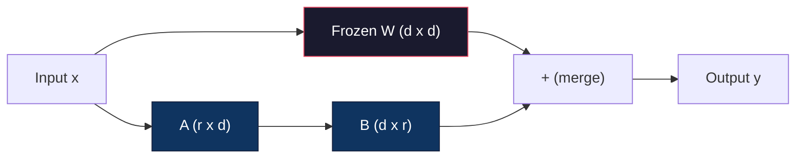
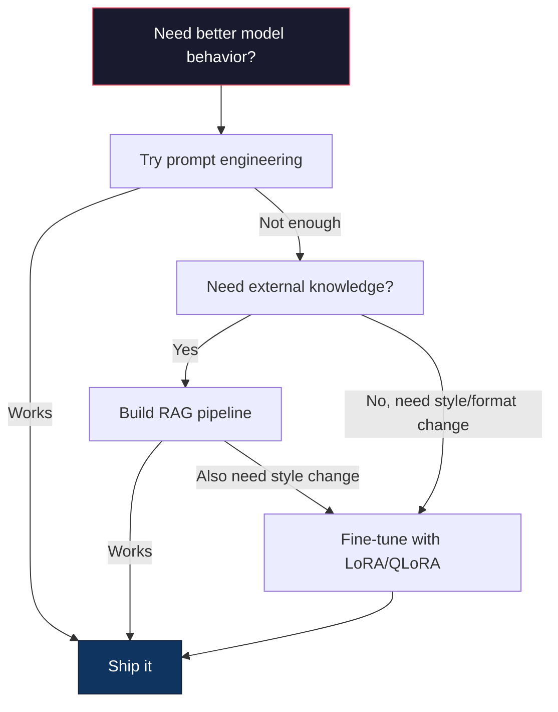

# تنظیم دقیق با LoRA و QLoRA

> تنظیم کامل یک مدل 7B به 56 گیگابایت VRAM نیاز دارد. شما این را ندارید. بیشتر شرکت ها هم نمی توانند. LoRA به شما اجازه می دهد تا همان مدل را در 6 گیگابایت با آموزش کمتر از 1 درصد از پارامترها تنظیم کنید. این یک سازش نیست - این با کیفیت کامل تنظیم بیشتر وظایف مطابقت دارد. کل اکوسیستم تنظیم دقیق منبع باز با این یک ترفند اجرا می شود.

**Type:** Build
**Languages:** Python
**Prerequisites:** Phase 10, Lesson 06 (Instruction Tuning / SFT)
**Time:** ~75 minutes
**Related:**مرحله 10 حلقه های SFT / DPO را از ابتدا پوشش می دهد. این درس آنها را به ابزار 2026 PEFT (PEFT، TRL، Unsloth، Axolotl، LLaMA-Factory) وصل می کند.

## اهداف یادگیری

- پیاده سازی LoRA با تزریق ماتریس های آداپتور درجه پایین (A و B) به لایه های توجه مدل پیش از آموزش
- محاسبه صرفه جویی پارامتر LoRA در مقابل تنظیم کامل: رتبه r با d_model dimension trains 2*r*d parameters به جای d^2
- تنظیم دقیق یک مدل با استفاده از QLoRA (4 بیت پایه کوانتزی + آداپتورهای LoRA) برای قرار دادن در حافظه GPU مصرف کننده
- وزن های LoRA را به مدل پایه برای استفاده برگردانید و سرعت نتیجه گیری را با و بدون آداپتور مقایسه کنید

## مشکل

شما یک مدل پایه دارید. Llama 3 8B. می خواهید که به بلیط های پشتیبانی مشتری با صدای شرکت شما پاسخ دهد. SFT پاسخ است. اما SFT مشکل هزینه ای دارد.

تنظیم کامل هر پارامتر در مدل را به روز می کند. Llama 3 8B دارای 8 میلیارد پارامتر است. در fp16، هر پارامتر 2 بایت نیاز دارد. این 16GB است فقط برای بارگذاری وزن. در طول آموزش، شما همچنین نیاز به گرادیانت (16GB) ، حالت بهینه سازی برای Adam (32GB برای حرکت + متغیر) و فعال سازی دارید. کل: تقریبا 56GB VRAM برای یک مدل 8B.

يه A100 80GB به سختی ميتونه اينو بپوشه دو تا A100 داره$3-4/hour on cloud providers. Training for 3 epochs on 50,000 examples takes 6-10 hours. That's $30-40 دلار در هر آزمایش انجام ده آزمایش برای درست کردن پارامترهای هیپرامیتر و 400 دلار پیش از اینکه چیزی را به کار ببرید خرج کرده اید.

این را به Llama 3 70B مقیاس دهید و اعداد بی منطق می شوند. 140 گیگابایت فقط برای وزن ها. شما نیاز به یک خوشه دارید. 100 دلار بیشتر برای هر آزمایش.

یک مشکل عمیق تر هم هست. تنظیم کامل وزن هر مدل را تغییر می دهد. اگر شما اطلاعات پشتیبانی مشتری را اصلاح کنید، ممکن است توانایی های کلی مدل را کاهش دهید. این را فراموشی فاجعه بار می نامیم. مدل در کار شما بهتر می شود و در همه چیز بدتر می شود.

شما به یک روش نیاز دارید که پارامترهای کمتری را آموزش دهد، حافظه کمتری را استفاده کند و دانش موجود مدل را نابود نکند.

## مفهوم

### لورا: سازگاری کم رتبه

ادوارد هو و همکارانش در مایکروسافت در ژوئن 2021 LoRA را منتشر کردند. بینش مقاله: به روزرسانی وزن در طول تنظیم دقیق دارای رتبه داخلی پایین هستند. شما نیازی به به روزرسانی تمام 16.7 میلیون پارامتر در یک ماتریس وزن 4096x4096 ندارید. اطلاعات مفید در به روزرسانی می تواند توسط ماتریس رتبه 16 یا 32 ضبط شود.

این ریاضی است. یک لایه خطی استاندارد محاسبه می کند:

```
y = Wx
```

در جایی که W یک ماتریس d_out x d_in است. برای یک 4096x4096 پروژکتور توجه، این 16،777,216 پارامتر است.

LoRA W را منجمد می کند و تجزیه درجه پایین را اضافه می کند:

```
y = Wx + BAx
```

جایی که B (d_out x r) و A (r x d_in) است. رتبه r بسیار کوچکتر از d است - معمولا 8, 16 یا 32.

برای r=16 در لایه 4096x4096:
- پارامترهای اصلی: 4096 x 4096 = 16،777،216
- پارامترهای LoRA: (4096 x 16) + (16 x 4096) = 65536 + 65536 = 131 072
- کاهش: 131 072 / 16 777 216 = 0.78%

شما 0.78 درصد از پارامترها را آموزش می دهید و 95 تا 100 درصد از کیفیت را می گیرید.



A با یک Gaussian تصادفی شروع می شود. B به صفر شروع می شود. این بدان معنی است که سهم LoRA از صفر شروع می شود - مدل شروع به آموزش از رفتار اصلی خود می کند و به تدریج تطبیق را یاد می گیرد.

### فاکتور مقیاس بندی: آلفا

LoRA یک فاکتور مقیاس بندی الفا را معرفی می کند که کنترل می کند که تا چه اندازه بروزرسانی درجه پایین بر خروجی تأثیر می گذارد:

```
y = Wx + (alpha / r) * BAx
```

هنگامی که آلفا = r، مقیاس 1x است. هنگامی که آلفا = 2r (پیش فرض رایج) ، مقیاس 2x است. این هیپر پارامتر سرعت یادگیری مسیر LoRA را مستقل از سرعت یادگیری پایه کنترل می کند.

راهنمایی های عملی:
- آلفا = 2 * رتبه یک کنوانسیون مشترک جامعه است (رنج اصلی استفاده شده در اکثر آزمایش ها آلفا = رتبه)
- الف = رتبه 1x مقیاس بندی، محافظه کار اما پایدار
- آلفا بالاتر به معنای بروزرسانی های بزرگتر در هر مرحله است که می تواند به سرعت به هم نزدیک شود یا باعث عدم ثبات شود

### کجا باید LoRA را بکار ببرید

یک ترانسفورماتور دارای لایه های خطی زیادی است. نیازی به اضافه کردن LoRA به همه آنها نیست. کاغذ اصلی ترکیبی مختلف را آزمایش کرد:

| Target Layers | Trainable Params (7B) | Quality |
|--------------|----------------------|---------|
| q_proj only | 4.7M | Good |
| q_proj + v_proj | 9.4M | Better |
| q_proj + k_proj + v_proj + o_proj | 18.9M | Best for attention |
| All linear (attention + MLP) | 37.7M | Marginal gain, 2x params |

نقطه شیرین برای اکثر وظایف: q_proj + v_proj. این هدف از سوال و پیش بینی ارزش در خود توجه است، که کنترل می کند که مدل به چه چیزی توجه می کند و چه اطلاعاتی را استخراج می کند. اضافه کردن لایه های MLP برای وظایف پیچیده مانند تولید کد کمک می کند اما تعداد پارامتر را برای کاهش بازده در وظایف ساده تر دو برابر می کند.

### انتخاب رتبه

رتبه r بیانگرانه ی سازگاری را کنترل می کند:

| Rank | Trainable Params (per layer) | Best For |
|------|---------------------------|----------|
| 4 | 32,768 | Simple classification, sentiment |
| 8 | 65,536 | Single-domain Q&A, summarization |
| 16 | 131,072 | Multi-domain tasks, instruction following |
| 32 | 262,144 | Complex reasoning, code generation |
| 64 | 524,288 | Diminishing returns for most tasks |
| 128 | 1,048,576 | Rarely justified |

Hu et al. نشان داد که r=4 در حال حاضر بیشتر سازگاری را برای وظایف ساده ضبط می کند. r=8 و r=16 رایج ترین انتخاب ها در عمل هستند. فراتر رفتن از r=64 به ندرت کیفیت را بهبود می بخشد و شروع به از دست دادن مزیت حافظه LoRA می کند.

### QLoRA: ۴ بیت کوانتزی + LoRA

تیم دیتمرز و همکارانش در دانشگاه واشنگتن QLoRA را در ماه مه 2023 منتشر کردند. ایده: مدل پایه یخ زده را به دقت ۴ بیتی کمی کنید، سپس آداپتورهای LoRA را در fp16 در بالا متصل کنید.

این به طور چشمگیری معادله ی حافظه را تغییر می دهد:

| Method | Weight Memory (7B) | Training Memory (7B) | GPU Required |
|--------|-------------------|---------------------|-------------|
| Full fine-tune (fp16) | 14GB | ~56GB | 1x A100 80GB |
| LoRA (fp16 base) | 14GB | ~18GB | 1x A100 40GB |
| QLoRA (4-bit base) | 3.5GB | ~6GB | 1x RTX 3090 24GB |

QLoRA سه سهم فنی دارد:

**NF4 (Normal Float 4-bit)**این نوع داده جدید که به طور خاص برای وزن شبکه عصبی طراحی شده است. وزن شبکه عصبی به طور تقریباً طبیعی توزیع شده است. NF4 16 سطح کوانتاسیون خود را در کوانتلی های توزیع استاندارد طبیعی قرار می دهد. این اطلاعات نظری برای داده های توزیع شده به طور عادی مطلوب است. اطلاعات کمتری را از دست می دهد تا یک کوانتاسیون یکپارچه 4 بیت (INT4) یا استاندارد Float4.

**Double quantization**: ثابت های کوانتایی خود حافظه را می گیرند. هر بلوک 64 وزن نیاز به یک فاکتور مقیاس fp32 (4 بایت) دارد. برای یک مدل 7B، این 0.4GB اضافی است. دوگانه کوانتایی این ثابت ها را به fp8 کوانتایی می کند، باعث کاهش هزینه های عمومی به 0.1GB می شود. کوچک اما اضافه می شود.

**Paged optimizers**در طول آموزش، حالت های بهینه سازی (حرک و متغیر آدم) می توانند از حافظه GPU در دنباله های طولانی فراتر روند. بهینه سازی صفحات از حافظه متحد NVIDIA برای خودکار صفحه سازی حالت های بهینه سازی به RAM CPU هنگامی که حافظه GPU خسته شده است استفاده می کنند و در صورت نیاز آنها را به عقب می برند. این مانع از سقوط OOM با هزینه برخی از تولید می شود.

### سوال کیفیت

آیا کاهش پارامترها یا کمی کردن پایه به کیفیت آسیب می رساند؟ نتایج چندین مقاله:

| Method | MMLU (5-shot) | MT-Bench | HumanEval |
|--------|--------------|----------|-----------|
| Full fine-tune (Llama 2 7B) | 48.3 | 6.72 | 14.6 |
| LoRA r=16 | 47.9 | 6.68 | 14.0 |
| QLoRA r=16 (NF4) | 47.5 | 6.61 | 13.4 |
| QLoRA r=64 (NF4) | 48.1 | 6.70 | 14.2 |

LoRA در r=16 در حدود 1٪ از تنظیم کامل در اکثر معیارها است. QLoRA در r=16 بخش دیگری از یک درصد را از دست می دهد. QLoRA در r=64 اساسا با تنظیم کامل مطابقت دارد در حالی که 90٪ حافظه کمتری استفاده می کند.

### هزینه های واقعی

تنظیم دقیق Llama 3 8B در 50،000 نمونه (3 دوره):

| Method | GPU | Time | Cost |
|--------|-----|------|------|
| Full fine-tune | 2x A100 80GB | 8 hours | ~$32 |
| LoRA r=16 | 1x A100 40GB | 4 hours | ~$8 |
| QLoRA r=16 | 1x RTX 4090 24GB | 6 hours | ~$5 |
| QLoRA r=16 (Unsloth) | 1x RTX 4090 24GB | 2.5 hours | ~$2 |
| QLoRA r=16 | 1x T4 16GB | 12 hours | ~$4 |

QLoRA در یک GPU مصرف کننده کمتر از ناهار است. به همین دلیل جامعه تنظیم دقیق وزن باز در سال 2023 منفجر شد و به همین دلیل هر چارچوب آموزشی زیر QLoRA به طور پیش فرض در سال 2026 ارسال می شود.

### دسته PEFT 2026

| Framework | What it is | Pick when |
|-----------|-----------|-----------|
| **Hugging Face PEFT** | The canonical LoRA/QLoRA/DoRA/IA3 library | You want raw control and your training loop is already on `transformers.Trainer` |
| **TRL** | HF's reinforcement-from-feedback trainers (SFT, DPO, GRPO, PPO, ORPO) | You need DPO/GRPO after SFT; built on top of PEFT |
| **Unsloth** | Triton-kernel rewrite of the forward/backward pass | You want 2-5x speedup + half the VRAM with no accuracy loss; Llama/Mistral/Qwen family |
| **Axolotl** | YAML-config wrapper over PEFT + TRL + DeepSpeed + Unsloth | You want reproducible, version-controlled training runs |
| **LLaMA-Factory** | GUI/CLI/API over PEFT + TRL | You want zero-code fine-tuning; 100+ model families supported |
| **torchtune** | Native PyTorch recipes, no `transformers` dep | You want minimal deps and your org already standardizes on PyTorch |

قاعده انگشت: استفاده از تحقیق یا آزمایش یک بار → PEFT. خط تولید تکراری → Axolotl با هسته Unsloth فعال شده. نمونه سازی آتشی → LLaMA-فاکتور.

### اداپترهای ادغام

پس از آموزش، دو چیز دارید: مدل پایه یخ زده و یک آداپتور کوچک LoRA (معمولا 10-100MB).

1. **Keep them separate**: مدل پایه را بارگذاری کنید، آداپتور را بالا بارگذاری کنید. آداپتورهای مختلف را برای وظایف مختلف تغییر دهید. این روش چندین نوع اصلاح شده از یک مدل پایه را ارائه می دهید.

2. **Merge them permanently**: محاسبه W' = W + (alpha/r) * BA و ذخیره نتیجه به عنوان یک مدل کامل جدید. مدل ادغام شده اندازه مشابه اصلی است. هیچ هزینه اخلاصی نیست. هیچ آداپتور برای مدیریت.

برای انجام وظایف متعدد (آداپتور پشتیبانی از مشتری، آداپتور کد، آداپتور ترجمه) ، آنها را جداگانه نگه دارید. برای انتشار یک مدل تخصصی، ترکیب کنید.

تکنیک های پیشرفته ادغام برای ترکیب چندین آداپتور:

- **TIES-Merging**(یادف و همکاران 2023): پارامترهای کوچک را ترمیم می کند، تعارضات سیگنال را حل می کند، سپس ادغام می شود. تداخل بین آداپتورها را کاهش می دهد.
- **DARE**(Yu et al. 2023): قبل از ادغام، پارامتر های آداپتور را تصادفی کاهش می دهد و بقیه را دوباره مقیاس می دهد.
- **Task arithmetic**: به سادگی اضافه کردن یا حذف وزنه های آداپتر. اضافه کردن آداپتر "کوید" و آداپتر " ریاضی" اغلب یک مدل خوب در هر دو تولید می کند.

### وقتی که نباید به خوبی تنظیم شود

تنظیم دقیق گزینه سوم است، نه اول

**First: prompt engineering.**یک دستور سیستم بهتر بنویسید. چند نمونه ی عکس اضافه کنید. از زنجیره ی تفکر استفاده کنید. این هزینه ای ندارد و چند دقیقه طول می کشد. اگر دستور به شما ۸۰ درصد از راه را می دهد، احتمالا نیازی به تنظیم دقیق ندارید.

**Second: RAG.**اگر مدل نیاز به دانستن اطلاعات خاص شما (دستنامه ها، پایگاه دانش، کتاگ محصول) دارد، بازیافت ارزان تر و حفظش قابل تر از پخت آن در وزن است.

**Third: fine-tuning.**این را زمانی استفاده کنید که شما نیاز به مدل برای اتخاذ یک سبک، فرمت یا الگوی استدلال خاص دارید که نمی توانید با استفاده از درخواست به دست آورید. هنگامی که شما نیاز به تولید منظم مداوم دارید. هنگامی که شما نیاز به تزریق یک مدل بزرگتر به یک مدل کوچکتر دارید. هنگامی که تاخیر مهم است و شما نمی توانید از درخواست چند شوت توکن اضافی را پرداخت کنید.



```figure
lora-params
```

## آن را بسازید

ما LoRA را از ابتدا در PyTorch خالص اجرا می کنیم هیچ کتابخانه ای، هیچ جادویی، شما لایه LoRA را بسازید، آن را به یک مدل تزریق کنید، آن را آموزش دهید و وزن ها را دوباره ترکیب کنید.

### مرحله ی اول: لایه ی لورا

```python
import torch
import torch.nn as nn
import math

class LoRALayer(nn.Module):
    def __init__(self, in_features, out_features, rank=8, alpha=16):
        super().__init__()
        self.rank = rank
        self.alpha = alpha
        self.scaling = alpha / rank

        self.A = nn.Parameter(torch.randn(in_features, rank) * (1 / math.sqrt(rank)))
        self.B = nn.Parameter(torch.zeros(rank, out_features))

    def forward(self, x):
        return (x @ self.A @ self.B) * self.scaling
```

A با مقدار تصادفی مقیاس بندی شده آغاز می شود. B به صفر آغاز می شود. محصول BA از صفر شروع می شود، بنابراین مدل با رفتار اصلی خود شروع می شود.

### مرحله دوم: لایه خطی پیچیده با لورا

```python
class LinearWithLoRA(nn.Module):
    def __init__(self, linear, rank=8, alpha=16):
        super().__init__()
        self.linear = linear
        self.lora = LoRALayer(
            linear.in_features, linear.out_features, rank, alpha
        )

        for param in self.linear.parameters():
            param.requires_grad = False

    def forward(self, x):
        return self.linear(x) + self.lora(x)
```

لایه خطی اصلی منجمد شده است. تنها پارامترهای LoRA (A و B) قابل آموزش هستند.

### مرحله سوم: لورای را به مدل تزریق کنید

```python
def inject_lora(model, target_modules, rank=8, alpha=16):
    for param in model.parameters():
        param.requires_grad = False

    lora_layers = {}
    for name, module in model.named_modules():
        if isinstance(module, nn.Linear):
            if any(t in name for t in target_modules):
                parent_name = ".".join(name.split(".")[:-1])
                child_name = name.split(".")[-1]
                parent = dict(model.named_modules())[parent_name]
                lora_linear = LinearWithLoRA(module, rank, alpha)
                setattr(parent, child_name, lora_linear)
                lora_layers[name] = lora_linear
    return lora_layers
```

اول، هر پارامتر در مدل را منجمد کنید. سپس با درخت مدل حرکت کنید، لایه های خطی را پیدا کنید که با نام های هدف شما مطابقت دارند و آنها را با نسخه های بسته شده LoRA جایگزین کنید. ماتریس های LoRA A و B تنها پارامترهای قابل آموزش در کل مدل هستند.

### مرحله چهارم: پارامترهای شمارش

```python
def count_parameters(model):
    total = sum(p.numel() for p in model.parameters())
    trainable = sum(p.numel() for p in model.parameters() if p.requires_grad)
    frozen = total - trainable
    return {
        "total": total,
        "trainable": trainable,
        "frozen": frozen,
        "trainable_pct": 100 * trainable / total if total > 0 else 0
    }
```

### مرحله پنجم: وزن ها را به عقب ببندید

```python
def merge_lora_weights(model):
    for name, module in model.named_modules():
        if isinstance(module, LinearWithLoRA):
            with torch.no_grad():
                merged = (
                    module.lora.A @ module.lora.B
                ) * module.lora.scaling
                module.linear.weight.data += merged.T
            parent_name = ".".join(name.split(".")[:-1])
            child_name = name.split(".")[-1]
            if parent_name:
                parent = dict(model.named_modules())[parent_name]
            else:
                parent = model
            setattr(parent, child_name, module.linear)
```

بعد از ادغام، لایه های LoRA از بین رفته است. مدل اندازه اصلی با سازگاری به وزن ها پخته شده است. هیچ نتیجه گیری هزینه های بالا.

### مرحله 6: شبیه سازی کمی QLoRA

```python
def quantize_to_nf4(tensor, block_size=64):
    blocks = tensor.reshape(-1, block_size)
    scales = blocks.abs().max(dim=1, keepdim=True).values / 7.0
    scales = torch.clamp(scales, min=1e-8)
    quantized = torch.round(blocks / scales).clamp(-8, 7).to(torch.int8)
    return quantized, scales

def dequantize_from_nf4(quantized, scales, original_shape):
    dequantized = quantized.float() * scales
    return dequantized.reshape(original_shape)
```

این شبیه سازی 4-bit کوانتاسیون با نقشه برداری وزن به 16 سطح متمایز در بلوک های 64 است. QLoRA تولید از کتابخانه بیت و باایت ها برای NF4 واقعی در GPU استفاده می کند.

### مرحله هفتم: چرخه آموزش

```python
def train_lora(model, data, epochs=5, lr=1e-3, batch_size=4):
    optimizer = torch.optim.AdamW(
        [p for p in model.parameters() if p.requires_grad], lr=lr
    )
    criterion = nn.MSELoss()

    losses = []
    for epoch in range(epochs):
        epoch_loss = 0.0
        n_batches = 0
        indices = torch.randperm(len(data["inputs"]))

        for i in range(0, len(indices), batch_size):
            batch_idx = indices[i:i + batch_size]
            x = data["inputs"][batch_idx]
            y = data["targets"][batch_idx]

            output = model(x)
            loss = criterion(output, y)

            optimizer.zero_grad()
            loss.backward()
            optimizer.step()

            epoch_loss += loss.item()
            n_batches += 1

        avg_loss = epoch_loss / n_batches
        losses.append(avg_loss)

    return losses
```

### مرحله 8: نمایش کامل

```python
def demo():
    torch.manual_seed(42)
    d_model = 256
    n_classes = 10

    model = nn.Sequential(
        nn.Linear(d_model, 512),
        nn.ReLU(),
        nn.Linear(512, 512),
        nn.ReLU(),
        nn.Linear(512, n_classes),
    )

    n_samples = 500
    x = torch.randn(n_samples, d_model)
    y = torch.randint(0, n_classes, (n_samples,))
    y_onehot = torch.zeros(n_samples, n_classes).scatter_(1, y.unsqueeze(1), 1.0)

    data = {"inputs": x, "targets": y_onehot}

    params_before = count_parameters(model)

    lora_layers = inject_lora(
        model, target_modules=["0", "2"], rank=8, alpha=16
    )

    params_after = count_parameters(model)

    losses = train_lora(model, data, epochs=20, lr=1e-3)

    merge_lora_weights(model)
    params_merged = count_parameters(model)

    return {
        "params_before": params_before,
        "params_after": params_after,
        "params_merged": params_merged,
        "losses": losses,
    }
```

در این نمایش یک مدل کوچک ایجاد می شود، LoRA را به دو لایه تزریق می کند، آن را آموزش می دهد و وزنه ها را به عقب ادغام می کند. تعداد پارامتر از کاملا قابل آموزش به ~1% قابل آموزش در طول آموزش LoRA کاهش می یابد، سپس پس از ادغام به معماری اصلی باز می گردد.

## ازش استفاده کن

با اکوسیستم Hugging Face، LoRA در یک مدل واقعی حدود 20 خط را می گیرد:

```python
from transformers import AutoModelForCausalLM, AutoTokenizer
from peft import LoraConfig, get_peft_model, TaskType

model = AutoModelForCausalLM.from_pretrained("meta-llama/Llama-3.1-8B")
tokenizer = AutoTokenizer.from_pretrained("meta-llama/Llama-3.1-8B")

lora_config = LoraConfig(
    task_type=TaskType.CAUSAL_LM,
    r=16,
    lora_alpha=32,
    lora_dropout=0.05,
    target_modules=["q_proj", "v_proj"],
)

model = get_peft_model(model, lora_config)
model.print_trainable_parameters()
```

برای QLoRA، مقدار بندی بیت و باایت اضافه کنید:

```python
from transformers import BitsAndBytesConfig

bnb_config = BitsAndBytesConfig(
    load_in_4bit=True,
    bnb_4bit_quant_type="nf4",
    bnb_4bit_compute_dtype=torch.bfloat16,
    bnb_4bit_use_double_quant=True,
)

model = AutoModelForCausalLM.from_pretrained(
    "meta-llama/Llama-3.1-8B",
    quantization_config=bnb_config,
    device_map="auto",
)

model = get_peft_model(model, lora_config)
```

همین شد، همان حلقه آموزش، همان خط داده، مدل پایه در حال حاضر در 4 بایت زندگی می کند، آداپتورهای LoRA در FP16 آموزش می دهند، و همه چیز در 6 جی بی قرار دارد.

برای آموزش با مربی صورت بوسیدن:

```python
from transformers import TrainingArguments, Trainer
from datasets import load_dataset

dataset = load_dataset("tatsu-lab/alpaca", split="train[:5000]")

training_args = TrainingArguments(
    output_dir="./lora-llama",
    num_train_epochs=3,
    per_device_train_batch_size=4,
    gradient_accumulation_steps=4,
    learning_rate=2e-4,
    fp16=True,
    logging_steps=10,
    save_strategy="epoch",
    optim="paged_adamw_8bit",
)

trainer = Trainer(
    model=model,
    args=training_args,
    train_dataset=dataset,
)

trainer.train()

model.save_pretrained("./lora-adapter")
```

آداپتور ذخیره شده 10 تا 100MB است. مدل پایه بدون لمس باقی می ماند. شما می توانید آداپتورها را در Hub Hugging Face بدون توزیع مجدد مدل کامل به اشتراک بگذارید.

## -باده

این درس نتیجه می دهد:
- `outputs/prompt-lora-advisor.md`-- یک پیامک که به شما کمک می کند رتبه بندی LoRA، ماژول های هدف و پارامترهای هیپر پارامتر برای کار خاص خود را تصمیم بگیرید
- `outputs/skill-fine-tuning-guide.md`-- يه مهارت که به ماموران مي آموزد درخت تصميم براي اينکه چه وقت و چطوري

## تمرینات

1. **Rank ablation study.**نمایش را با رتبه های ۲، ۴، ۸، ۱۶، ۳۲ و ۶۴ اجرا کنید. خسارت نهایی را در مقابل رتبه نشان دهید. نقطه بازگشت کاهش یافته را پیدا کنید که در آن دو برابر کردن رتبه دیگر خسارت را نیمی نمی کند. برای یک کار طبقه بندی ساده در ویژگی های ۲۵۶ بعدی، این باید حدود r = ۸-۱۶ باشد.

2. **Target module comparison.**تغییر inject_lora به هدف فقط لایه "0"، فقط لایه "2"، فقط لایه "4" و همه سه. تمرین هر نوع برای 20 دوره. سرعت تقارب و از دست دادن نهایی را مقایسه کنید. این منعکس کننده تصمیم واقعی هدف قرار دادن q_proj در مقابل v_proj در مقابل تمام لایه های خطی است.

3. **Quantization error analysis.**ماتریس وزن مدل آموزش داده شده را قبل و بعد از کوانتز_تا_نف4 / دکوانتز_از_نف4 بگیرید. خطای متوسط مربع، حداکثر خطای مطلق و ارتباط بین وزن های اصلی و بازسازی شده را محاسبه کنید. با ارزش های بلوک_سائز 32، 64، 128 و 256 آزمایش کنید.

4. **Multi-adapter serving.**دو آداپتور LoRA را بر روی زیر مجموعه های مختلف داده ها (حتی شاخص ها در مقابل شاخص های عجیب) آموزش دهید. هر دو آداپتور را ذخیره کنید. مدل پایه را یک بار بار بارگذاری کنید، سپس آداپتورها را عوض کنید و بررسی کنید که هر کدام از آنها در ورودی مشابه تولیدات متفاوتی را تولید می کنند. این نحوه عملکرد سیستم های تولید چندین مدل دقیق از یک پایه است.

5. **Merge vs. unmerged inference.**مقایسه محصول مدل LoRA قبل و بعد از merge_lora_weights در همان 100 ورودی. بررسی کنید که محصول یکسان است (در عرض تحمل نقطه شناور 1e-5). سپس سرعت نتیجه گیری برای هر دو - ترکیب باید کمی سریعتر باشد زیرا این یک ماتریس ضرب به جای دو است.

## اصطلاحات کلیدی

| Term | What people say | What it actually means |
|------|----------------|----------------------|
| LoRA | "Efficient fine-tuning" | Low-Rank Adaptation: freeze base weights, train two small matrices A and B whose product approximates the full weight update |
| QLoRA | "Fine-tune on a laptop" | Quantized LoRA: load the base model in 4-bit NF4, train LoRA adapters in fp16 on top, enabling 7B fine-tuning in 6GB VRAM |
| Rank (r) | "How much the model can learn" | The inner dimension of the A and B matrices; controls expressiveness vs. parameter count |
| Alpha | "LoRA learning rate" | Scaling factor applied to the LoRA output; alpha/r scales the adaptation's contribution to the final output |
| NF4 | "4-bit quantization" | Normal Float 4: a 4-bit data type with quantization levels at normal distribution quantiles, optimal for neural network weights |
| Adapter | "The small trained part" | The LoRA A and B matrices saved as a separate file (10-100MB), loadable on top of any copy of the base model |
| Target modules | "Which layers to LoRA" | The specific linear layers (q_proj, v_proj, etc.) where LoRA adapters are injected |
| Merging | "Bake it in" | Computing W + (alpha/r) * BA and replacing the original weight, eliminating the adapter overhead at inference |
| Paged optimizers | "Don't OOM during training" | Offloading optimizer states (Adam momentum, variance) to CPU when GPU memory is exhausted |
| Catastrophic forgetting | "Fine-tuning broke everything else" | When updating all weights causes the model to lose previously learned capabilities |

## خواندن بیشتر

- Hu et al., "LoRA: تنظیم درجه پایین مدل های زبان بزرگ" (2021) - مقاله اصلی معرفی روش تجزیه درجه پایین، آزمایش شده در GPT-3 175B با درجه پایین تا 4
- دیتمرز و همکارانش، "QLoRA: Finetuning Efficient of Quantized Language Models" (2023) -- NF4، دوگانه کوانتاسیون و بهینه سازی صفحه ای را معرفی می کند، که 65B را در یک GPU 48GB واحد تنظیم می کند
- مستندات کتابخانه PEFT (huggingface.co/docs/peft) - کتابخانه استاندارد برای LoRA، QLoRA و سایر روش های پارامتر کارآمد در اکوسیستم Hugging Face
- یادو و همکارانش، "TIES-Merging: حل مداخله در هنگام ادغام مدل ها" (2023) -- تکنیک های ترکیب چندین آداپتور LoRA بدون کاهش کیفیت
- [Rafailov et al., "Direct Preference Optimization: Your Language Model is Secretly a Reward Model" (NeurIPS 2023)](https://arxiv.org/abs/2305.18290)-- مشتق DPO؛ مرحله تنظیم ترجیح بعد از SFT، هیچ مدل پاداش مورد نیاز نیست.
- [TRL documentation](https://huggingface.co/docs/trl/)-- مرجع رسمی برای `SFTTrainer`،`DPOTrainer`،`KTOTrainer`, و سطح ادغام با PEFT/bitsandbytes/Unsloth.
- [Unsloth documentation](https://docs.unsloth.ai/)-- هسته های ادغام شده که تولید تنظیم دقیق را دو برابر می کنند و حافظه را نصف می کنند؛ لایه عملکرد تحت TRL.
- [Axolotl documentation](https://axolotl-ai-cloud.github.io/axolotl/)-- آموزشگاه چند GPU SFT/DPO/QLoRA با YAML پیکربندی شده؛ جایگزین پیکربندی به عنوان کد برای اسکریپت های دست نوشته شده.
