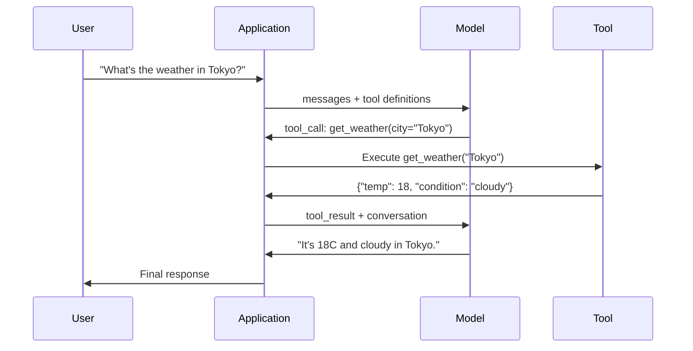

# تماس با عملکرد و استفاده از ابزار

> LLM ها نمی تونن کاری کنن اونا متن تولید ميکنن اين تمام توانايي هاست. آنها نمی توانند آب و هوا را بررسی کنند، اطلاعات را از یک پایگاه داده جستجو کنند، ایمیل ارسال کنند، کد را اجرا کنند یا یک فایل را بخوانند. هر "آژان هوش مصنوعی" که تا به حال دیده اید یک LLM است که JSON را تولید می کند که می گوید کدام تابع را بخوانید و سپس کد شما در واقع آن را می خواند. مدل مغزه ابزار دست ها هستن صداي تابع نظام اعصاب است که آنها را به هم وصل می کند.

**Type:** Build
**Languages:** Python
**Prerequisites:** Phase 11 Lesson 03 (Structured Outputs)
**Time:** ~75 minutes
**Related:**مرحله 11 · 14 (پروتوکول زمینه مدل)  هنگامی که یک ابزار در میان میزبان ها به اشتراک گذاشته می شود، از تماس با عملکرد های خطی به یک سرور MCP فارغ التحصیل می شوید. این درس مورد خطی را پوشش می دهد؛ MCP مورد پروتکل را پوشش می دهد.

## اهداف یادگیری

- پیاده سازی یک حلقه تماس عملکرد: تعریف طرح های ابزار، تجزیه و تحلیل JSON تماس ابزار مدل، اجرای عملکرد و بازگشت نتایج
- طرح های ابزار طراحی با توضیحات واضح و پارامترهای تایپ شده که مدل می تواند به طور قابل اعتماد استفاده کند
- ایجاد یک حلقه عامل چند نوبت که زنجیره های تماس های چند تابع را برای پاسخ به سوالات پیچیده
- عملکرد کنترل تماس با موارد کناری: تماس های معادل ابزار، گسترش خطاها و جلوگیری از حلقه های بی نهایت ابزار

## مشکل

شما یک چت روت بسازید. یک کاربر می پرسد: "حالا هوا در توکیو چطوره؟"

مدل پاسخ می دهد: "من به داده های هوا در زمان واقعی دسترسی ندارم، اما بر اساس فصل، توکیو احتمالاً حدود 15 درجه سانتیگراد است... "

این توهمیه ای است که به صورت یک اعلامیه پوشیده شده است مدل نمی داند که هوا چه زمانی خواهد شد هوا هر ساعت تغییر می کند داده های آموزش مدل ماه ها است

پاسخ درست نیاز به تماس با API OpenWeatherMap، دریافت دمای فعلی و بازگشت شماره واقعی دارد. مدل نمی تواند API را صدا کند. کد شما می تواند. قطعه گمشده: یک پروتکل ساختاری که به مدل اجازه می دهد بگوید "من باید با این استدلال ها API آب و هوا را صدا کنم" و اجازه می دهد کد شما آن را اجرا کند و نتیجه را بازگرداند.

این یک تماس تابع است. مدل JSON ساختاری را تولید می کند که توصیف می کند کدام تابع را با کدام استدلال ها فراخوانی کنید. برنامه شما عملکرد را اجرا می کند. نتیجه به مکالمه می رود. مدل از نتیجه برای تولید پاسخ نهایی خود استفاده می کند.

بدون وظيفه اي، رشته تحصيلي موسسات هستند و با اين عمل، به ماموران تبديل مي شوند.

## مفهوم

### عملکرد که می تواند به حلقه ای تبدیل شود

هر تعامل با استفاده از ابزار به دنبال یک حلقه 5 مرحله ای است.



مرحله ی اول: کاربر یک پیام ارسال می کند. مرحله 2: مدل پیام را همراه با تعریف ابزار دریافت می کند (شیما JSON که عملکرد های موجود را توصیف می کند). مرحله سوم: به جای پاسخ دادن با متن، مدل یک تماس ابزار را تولید می کند -- یک شی JSON ساختار یافته با نام عملکرد و استدلال. مرحله 4: کد شما عملکرد را اجرا می کند و نتیجه را ضبط می کند. مرحله 5: نتیجه به مدل برمی گردد که اکنون داده های واقعی برای ارائه پاسخ نهایی دارد.

مدل هیچ وقت چیزی را اجرا نمی کند فقط تصمیم می گیرد چه چیزی را صدا کند و با چه استدلال هایی. کد شما اجرا کننده است.

### تعریف ابزار: قرارداد طرح JSON

هر ابزار توسط یک طرح JSON تعریف می شود که به مدل می گوید عملکرد چه کاری انجام می دهد، چه استدلال هایی را می گیرد و این استدلال ها باید چه نوع باشند.

```json
{
  "type": "function",
  "function": {
    "name": "get_weather",
    "description": "Get current weather for a city. Returns temperature in Celsius and conditions.",
    "parameters": {
      "type": "object",
      "properties": {
        "city": {
          "type": "string",
          "description": "City name, e.g. 'Tokyo' or 'San Francisco'"
        },
        "units": {
          "type": "string",
          "enum": ["celsius", "fahrenheit"],
          "description": "Temperature units"
        }
      },
      "required": ["city"]
    }
  }
}
```

.`description`فیلدها حیاتی هستند. مدل آنها را برای تصمیم گیری در مورد زمان و نحوه استفاده از ابزار می خواند. یک توصیف مبهم مانند "طقس می یابد" انتخاب ابزار بدتر از "طقس فعلی را برای یک شهر دریافت کنید. دمای در سلسی و شرایط را باز می گرداند".

### مقایسه ارائه دهندگان

هر ارائه دهنده بزرگ از تماس با عملکرد پشتیبانی می کند، اما سطح API متفاوت است.

| Provider | API Parameter | Tool Call Format | Parallel Calls | Forced Calling |
|----------|--------------|-----------------|---------------|----------------|
| OpenAI (GPT-5, o4) | `tools` | `tool_calls[].function` | Yes (multiple per turn) | `tool_choice="required"` |
| Anthropic (Claude 4.6/4.7) | `tools` | `content[].type="tool_use"` | Yes (multiple blocks) | `tool_choice={"type":"any"}` |
| Google (Gemini 3) | `function_declarations` | `functionCall` | Yes | `function_calling_config` |
| Open-weight (Llama 4, Qwen3, DeepSeek-V3) | Native `tools` on Llama 4; Hermes or ChatML on others | Mixed | Model-dependent | Prompt-based or `tool_choice` if supported |

تا سال 2026 سه ارائه دهنده بسته به شکل های مبتنی بر JSON-Schema تقریبا یکسان شده اند.`tools`در حال حاضر، در حال حاضر، در حال حاضر، در حال حاضر، در حال حاضر، در حال حاضر، در حال حاضر، در حال حاضر، در حال حاضر، در حال حاضر، در حال حاضر، در حال حاضر، در حال حاضر، در حال حاضر، در حال حاضر، در حال حاضر، در حال حاضر، در حال حاضر، در حال حاضر، در حال حاضر، در حال حاضر، در حال حاضر، در حال حاضر، در حال حاضر، در حال حاضر، در حال حاضر، در حال حاضر، در حال حاضر، در حال حاضر، در حال حاضر، در حال حاضر، در حال حاضر، در حال حاضر، در حال حاضر، در حال حاضر، در حال حاضر، در حال حاضر، در حال حاضر، در حال حاضر، در حال حاضر، در حال حاضر، در حال حاضر، در حال حاضر، در حال حاضر، در حال حاضر، در حال حاضر، در حال حاضر، در حال حاضر، در حال حاضر، در حال حاضر، در حال حاضر، در حال حاضر، در حال حاضر، در حال حاضر، در حال حاضر، در حال حاضر، در حال حاضر، در حال حاضر، در حال حاضر، در حال حاضر، در حال حاضر، در حال حاضر، در حال حاضر، در حال حاضر، در حال حاضر، در حال حاضر، در حال حاضر، در حال حاضر، در حال حاضر، در حال حاضر، در حال حاضر، در حال حاضر، در حال حاضر، در حال حاضر، در حال حاضر، در حال حاضر، در حال حاضر، در حال حاضر، در حال حاضر، در حال حاضر، در حال حاضر، در حال حاضر، در حال حاضر، در حال حاضر، در حال حاضر، در حال حاضر، در حال حاضر، در حال حاضر، در حال حاضر، در حال حاضر، در حال حاضر، در حال حاضر، در حال حاضر، در حال حاضر، در حال حاضر، در حال حاضر، در حال حاضر، در حال حاضر، در حال حاضر، در حال حاضر، در حال حاضر، در حال حاضر، در حال حاضر، در حال حاضر، در حال حاضر، در حال حاضر، در حال حاضر، در حال حاضر، در حال حاضر، در حال حاضر، در حال حاضر، در حال حاضر، در حال حاضر، در حال حاضر، در حال حاضر، در حال حاضر، در حال حاضر، در حال حاضر، در حال حاضر، در حال حاضر، در حال حاضر، در حال حاضر، در حال حاضر، در حال حاضر، در حال حاضر، در حال حاضر، در حال حاضر، در حال

### انتخاب ابزار: اتوماتیک، مورد نیاز، خاص

تو کنترل میکنی که مدل از ابزار استفاده میکنه

**Auto**(به طور پیش فرض): مدل تصمیم می گیرد که آیا به یک ابزار زنگ بزند یا به طور مستقیم پاسخ دهند. "۲+۲ چیست؟" - به طور مستقیم پاسخ می دهد. "طقس چیست؟" - به وسیله می گوید.

**Required**: مدل باید حداقل یک ابزار را فراخوانی کند. از این استفاده کنید زمانی که می دانید قصد کاربر به یک ابزار نیاز دارد. از حدس زدن مدل به جای جستجوی داده های واقعی جلوگیری می کند.

**Specific function**: مجبور کردن مدل به یک تابع خاص تماس بگیرد. `tool_choice={"type":"function", "function": {"name": "get_weather"}}`این را برای رویت کردن استفاده کنید -- وقتی منطق بالا به سمت مشخص می کند که چه ابزار مورد نیاز است.

### تماس با تابع موازی

GPT-4o و کلاود می توانند چندین تابع را در یک نوبت فراخوانند. یک کاربر می پرسد: "طقس در توکیو و نیویورک چگونه است؟" مدل به طور همزمان دو تماس ابزار را انجام می دهد:

```json
[
  {"name": "get_weather", "arguments": {"city": "Tokyo"}},
  {"name": "get_weather", "arguments": {"city": "New York"}}
]
```

کد شما هر دو را اجرا می کند (به طور ایده آل همزمان) ، هر دو نتیجه را باز می آورد و مدل یک پاسخ واحد را ترکیب می کند. این سفر دور و عقب را از 2 تا 1 کاهش می دهد. برای عوامل با 5-10 تماس ابزار در هر سوال، تماس موازی تاخیر را 60-80% کاهش می دهد.

### خروجی های ساختار یافته در مقابل تماس با عملکرد

درس 03 شامل خروجی های ساختاری شده است. تماس با عملکرد از همان دستگاه JSON Schema استفاده می کند، اما برای هدف دیگری.

**Structured outputs**: مجبور کردن مدل برای تولید داده ها به شکل خاصی. محصول نهایی است. مثال: استخراج اطلاعات محصول از متن به عنوان `{name, price, in_stock}`. .

**Function calling**: مدل اعلام می کند قصد انجام یک عمل است. محصول یک مرحله میانگین است. مثال: `get_weather(city="Tokyo")`-- مدل درخواست یک عمل است، نه تولید پاسخ نهایی.

وقتی می خواهید داده ها را استخراج کنید از خروجی های ساختار یافته استفاده کنید. وقتی می خواهید مدل با سیستم های خارجی تعامل کند از تماس با عملکرد استفاده کنید.

### امنیت: قوانین غیر قابل مذاکره

درخواست کردن تابع خطرناک ترین قابلیت است که می توانید به یک LLM بدهید. مدل انتخاب می کند چه کاری را اجرا کند. اگر مجموعه ابزار شما شامل سوالات پایگاه داده است، مدل سوالات را ایجاد می کند. اگر شامل دستورات شل است، مدل آنها را می نویسد.

**Rule 1: Never pass model-generated SQL directly to a database.**مدل می تواند و خواهد تولید جدول DROP، تزریق UNION، یا سوالات که هر ردیف را باز می گردد. همیشه پارامتر. همیشه تایید. همیشه از یک لیست اجازه عملیات استفاده کنید.

**Rule 2: Allowlist functions.**مدل فقط می تواند به وظایف شما که به طور صریح تعریف می کنید تماس بگیرد. هرگز یک ابزار عمومی "در اجرای هر وظایف با نام" ایجاد نکنید. اگر شما 50 تابع داخلی دارید، فقط 5 مورد نیاز کاربر را نشان دهید.

**Rule 3: Validate arguments.**مدل ممکنه اسم شهر رو رد کنه`"; DROP TABLE users; --"`قبل از اجرای هر استدلال را با انواع، محدوده ها و فرمت های انتظار می رود تأیید کنید.

**Rule 4: Sanitize tool results.**اگر یک ابزار داده های حساس (کليد API، PII، خطاهای داخلی) را بازگرداند، قبل از ارسال آن به مدل آن را فیلتر کنید. مدل نتایج ابزار را در پاسخ آن به صورت لفظی شامل می شود.

**Rule 5: Rate limit tool calls.**یک مدل در یک حلقه می تواند صدها بار به ابزار ها تماس بگیرد. حداکثر (10-20 تماس در هر مکالمه منطقی است) را تنظیم کنید. حلقه های بی نهایت را شکستن.

### مدیریت خطا

ابزارها شکست می خورند، API ها زمان می خورند، پایگاه داده ها خراب می شوند، فایل ها وجود ندارند، مدل باید بداند که ابزار چه زمانی و چرا شکست می خورد.

اشتباهات بازپرداخت به عنوان نتایج ابزار ساختاری، نه استثنا:

```json
{
  "error": true,
  "message": "City 'Toky' not found. Did you mean 'Tokyo'?",
  "code": "CITY_NOT_FOUND"
}
```

مدل این را می خواند، استدلال های خود را تنظیم می کند و دوباره تلاش می کند. مدل ها در اصلاح خود از پیام های خطای ساختاری خوب هستند. آنها در بازیابی از پاسخ های خالی یا خطاهای عمومی "چیزی اشتباه رفت" بد هستند.

### MCP: نمونه پروتکل زمینه

MCP استاندارد باز Anthropic برای قابلیت همکاری ابزار است. به جای هر برنامه ای که ابزار خود را تعریف می کند، MCP پروتکل جهانی را ارائه می دهد: ابزارها توسط سرورهای MCP خدمت می شوند و توسط مشتریان MCP مصرف می شوند (مانند کلوید کد، کورسر یا برنامه شما).

یک سرور MCP می تواند ابزارها را به هر مشتری سازگار بازگو کند. یک سرور Postgres MCP به هر سرویس دهنده ای که با MCP سازگار است دسترسی به پایگاه داده های آژانس را می دهد. یک سرور GitHub MCP به هر سرویس دهنده دسترسی به مخزن آژانس را می دهد. ابزارها یک بار تعریف می شوند و در همه جا استفاده می شوند.

MCP برای عملکرد به شبکه ها HTTP است. این لایه حمل و نقل را استاندارد می کند تا ابزارها قابل حمل شوند.

```figure
mx-tool-call-loop
```

## آن را بسازید

### مرحله ی اول: فهرست ابزارها را تعریف کنید

یک ثبت نام بسازید که تعریف ابزار و پیاده سازی آنها را ذخیره کند. هر ابزار دارای یک تعریف JSON Schema (آنچه مدل می بیند) و یک تابع پایتون (آنچه کد شما اجرا می کند) است.

```python
import ast
import json
import math
import time
import hashlib


TOOL_REGISTRY = {}


def register_tool(name, description, parameters, function):
    TOOL_REGISTRY[name] = {
        "definition": {
            "type": "function",
            "function": {
                "name": name,
                "description": description,
                "parameters": parameters,
            },
        },
        "function": function,
    }
```

### مرحله دوم: 5 ابزار را اجرا کنید

يه ماشین حساب بساز، به دنبال هوا، سيمولاتور جستجو وب، خواننده پرونده و کد رينر

```python
def calculator(expression, precision=2):
    allowed = set("0123456789+-*/.() ")
    if not all(c in allowed for c in expression):
        return {"error": True, "message": f"Invalid characters in expression: {expression}"}
    try:
        result = eval(expression, {"__builtins__": {}}, {"math": math})
        return {"result": round(float(result), precision), "expression": expression}
    except Exception as e:
        return {"error": True, "message": str(e)}


WEATHER_DB = {
    "tokyo": {"temp_c": 18, "condition": "cloudy", "humidity": 72, "wind_kph": 14},
    "new york": {"temp_c": 22, "condition": "sunny", "humidity": 45, "wind_kph": 8},
    "london": {"temp_c": 12, "condition": "rainy", "humidity": 88, "wind_kph": 22},
    "san francisco": {"temp_c": 16, "condition": "foggy", "humidity": 80, "wind_kph": 18},
    "sydney": {"temp_c": 25, "condition": "sunny", "humidity": 55, "wind_kph": 10},
}


def get_weather(city, units="celsius"):
    key = city.lower().strip()
    if key not in WEATHER_DB:
        suggestions = [c for c in WEATHER_DB if c.startswith(key[:3])]
        return {
            "error": True,
            "message": f"City '{city}' not found.",
            "suggestions": suggestions,
            "code": "CITY_NOT_FOUND",
        }
    data = WEATHER_DB[key].copy()
    if units == "fahrenheit":
        data["temp_f"] = round(data["temp_c"] * 9 / 5 + 32, 1)
        del data["temp_c"]
    data["city"] = city
    return data


SEARCH_DB = {
    "python function calling": [
        {"title": "OpenAI Function Calling Guide", "url": "https://platform.openai.com/docs/guides/function-calling", "snippet": "Learn how to connect LLMs to external tools."},
        {"title": "Anthropic Tool Use", "url": "https://docs.anthropic.com/en/docs/tool-use", "snippet": "Claude can interact with external tools and APIs."},
    ],
    "MCP protocol": [
        {"title": "Model Context Protocol", "url": "https://modelcontextprotocol.io", "snippet": "An open standard for connecting AI models to data sources."},
    ],
    "weather API": [
        {"title": "OpenWeatherMap API", "url": "https://openweathermap.org/api", "snippet": "Free weather API with current, forecast, and historical data."},
    ],
}


def web_search(query, max_results=3):
    key = query.lower().strip()
    for db_key, results in SEARCH_DB.items():
        if db_key in key or key in db_key:
            return {"query": query, "results": results[:max_results], "total": len(results)}
    return {"query": query, "results": [], "total": 0}


FILE_SYSTEM = {
    "data/config.json": '{"model": "gpt-4o", "temperature": 0.7, "max_tokens": 4096}',
    "data/users.csv": "name,email,role\nAlice,alice@example.com,admin\nBob,bob@example.com,user",
    "README.md": "# My Project\nA tool-use agent built from scratch.",
}


def read_file(path):
    if ".." in path or path.startswith("/"):
        return {"error": True, "message": "Path traversal not allowed.", "code": "FORBIDDEN"}
    if path not in FILE_SYSTEM:
        available = list(FILE_SYSTEM.keys())
        return {"error": True, "message": f"File '{path}' not found.", "available_files": available, "code": "NOT_FOUND"}
    content = FILE_SYSTEM[path]
    return {"path": path, "content": content, "size_bytes": len(content), "lines": content.count("\n") + 1}


def run_code(code, language="python"):
    if language != "python":
        return {"error": True, "message": f"Language '{language}' not supported. Only 'python' is available."}
    try:
        tree = ast.parse(code)
    except SyntaxError as e:
        return {"error": True, "message": f"SyntaxError: {e}", "code": "SYNTAX_ERROR"}
    unsafe_names = {"exec", "eval", "compile", "__import__", "open", "globals", "locals", "vars", "getattr", "setattr", "delattr"}
    for node in ast.walk(tree):
        if isinstance(node, (ast.Import, ast.ImportFrom)):
            return {"error": True, "message": "Forbidden operation: import is not allowed", "code": "SECURITY_VIOLATION"}
        if isinstance(node, ast.Attribute) and node.attr.startswith("__") and node.attr.endswith("__"):
            return {"error": True, "message": "Forbidden operation: dunder attribute access is not allowed", "code": "SECURITY_VIOLATION"}
        if isinstance(node, ast.Name) and node.id in unsafe_names:
            return {"error": True, "message": f"Forbidden operation: {node.id} is not allowed", "code": "SECURITY_VIOLATION"}
    try:
        local_vars = {}
        exec(code, {"__builtins__": {"print": print, "range": range, "len": len, "str": str, "int": int, "float": float, "list": list, "dict": dict, "sum": sum, "min": min, "max": max, "abs": abs, "round": round, "sorted": sorted, "enumerate": enumerate, "zip": zip, "map": map, "filter": filter, "math": math}}, local_vars)
        result = local_vars.get("result", None)
        return {"success": True, "result": result, "variables": {k: str(v) for k, v in local_vars.items() if not k.startswith("_")}}
    except Exception as e:
        return {"error": True, "message": f"{type(e).__name__}: {e}"}
```

یک لیست بلاک زیر رشته کد را به عنوان متن می خواند، بنابراین هر چیزی را که مطابقت رشته به معنای واقعی کلمه نمی باشد از دست می دهد. تجزیه و تحلیل کد به یک درخت نحوی و پیاده روی آن اجازه می دهد تا نگهبان رد کند `import`اطلاعات، دسترسی به ویژگی های Dunder (تعداد`__class__`و`__globals__`زنجیره هایی که به مترجم واقعی می رسند) و نام های غیر امن ساخت شده توسط ساختار به جای املاکی. با این حال، این را به عنوان یک فیلتر آموزشی، نه یک مرز واقعی، نگاه کنید. هر نگهبان در حال انجام کار، مترجم را با کد اجرا شده اش به اشتراک می گذارد و یک تماس گیرنده مشخص هنوز می تواند اشیاء قابل دسترسی را پیدا کند. سیستم های تولید کد غیرقابل اعتماد را در یک فرآیند یا کانتینر جداگانه اجرا می کنند (یک فرعی با امتیازات حذف شده، gVisor، Firecracker، یا یک راه اندازی کد میزبان) ، جایی که یک فرار مهاجمان را به جای سرویس شما در یک جعبه تاشو قرار می دهد.

### مرحله سوم: تمام ابزارها را ثبت کنید

```python
def register_all_tools():
    register_tool(
        "calculator", "Evaluate a mathematical expression. Supports +, -, *, /, parentheses, and decimals. Returns the numeric result.",
        {"type": "object", "properties": {"expression": {"type": "string", "description": "Math expression, e.g. '(10 + 5) * 3'"}, "precision": {"type": "integer", "description": "Decimal places in result", "default": 2}}, "required": ["expression"]},
        calculator,
    )
    register_tool(
        "get_weather", "Get current weather for a city. Returns temperature, condition, humidity, and wind speed.",
        {"type": "object", "properties": {"city": {"type": "string", "description": "City name, e.g. 'Tokyo' or 'San Francisco'"}, "units": {"type": "string", "enum": ["celsius", "fahrenheit"], "description": "Temperature units, defaults to celsius"}}, "required": ["city"]},
        get_weather,
    )
    register_tool(
        "web_search", "Search the web for information. Returns a list of results with title, URL, and snippet.",
        {"type": "object", "properties": {"query": {"type": "string", "description": "Search query"}, "max_results": {"type": "integer", "description": "Maximum results to return", "default": 3}}, "required": ["query"]},
        web_search,
    )
    register_tool(
        "read_file", "Read the contents of a file. Returns the file content, size, and line count.",
        {"type": "object", "properties": {"path": {"type": "string", "description": "Relative file path, e.g. 'data/config.json'"}}, "required": ["path"]},
        read_file,
    )
    register_tool(
        "run_code", "Run a small Python snippet behind a static-analysis guard and a restricted interpreter. This is a teaching filter, not real isolation. Set a 'result' variable to return output.",
        {"type": "object", "properties": {"code": {"type": "string", "description": "Python code to execute"}, "language": {"type": "string", "enum": ["python"], "description": "Programming language"}}, "required": ["code"]},
        run_code,
    )
```

### مرحله چهارم: ایجاد یک حلقه تماس

این موتور اصلی است. این مدل را شبیه سازی می کند که تصمیم می گیرد کدام ابزار را فراخشد، ابزار را اجرا می کند و نتایج را به شما می دهد.

```python
def simulate_model_decision(user_message, tools, conversation_history):
    msg = user_message.lower()

    if any(word in msg for word in ["weather", "temperature", "forecast"]):
        cities = []
        for city in WEATHER_DB:
            if city in msg:
                cities.append(city)
        if not cities:
            for word in msg.split():
                if word.capitalize() in [c.title() for c in WEATHER_DB]:
                    cities.append(word)
        if not cities:
            cities = ["tokyo"]
        calls = []
        for city in cities:
            calls.append({"name": "get_weather", "arguments": {"city": city.title()}})
        return calls

    if any(word in msg for word in ["calculate", "compute", "math", "what is", "how much"]):
        for token in msg.split():
            if any(c in token for c in "+-*/"):
                return [{"name": "calculator", "arguments": {"expression": token}}]
        if "+" in msg or "-" in msg or "*" in msg or "/" in msg:
            expr = "".join(c for c in msg if c in "0123456789+-*/.() ")
            if expr.strip():
                return [{"name": "calculator", "arguments": {"expression": expr.strip()}}]
        return [{"name": "calculator", "arguments": {"expression": "0"}}]

    if any(word in msg for word in ["search", "find", "look up", "google"]):
        query = msg.replace("search for", "").replace("look up", "").replace("find", "").strip()
        return [{"name": "web_search", "arguments": {"query": query}}]

    if any(word in msg for word in ["read", "file", "open", "cat", "show"]):
        for path in FILE_SYSTEM:
            if path.split("/")[-1].split(".")[0] in msg:
                return [{"name": "read_file", "arguments": {"path": path}}]
        return [{"name": "read_file", "arguments": {"path": "README.md"}}]

    if any(word in msg for word in ["run", "execute", "code", "python"]):
        return [{"name": "run_code", "arguments": {"code": "result = 'Hello from the sandbox!'", "language": "python"}}]

    return []


def execute_tool_call(tool_call):
    name = tool_call["name"]
    args = tool_call["arguments"]

    if name not in TOOL_REGISTRY:
        return {"error": True, "message": f"Unknown tool: {name}", "code": "UNKNOWN_TOOL"}

    tool = TOOL_REGISTRY[name]
    func = tool["function"]
    start = time.time()

    try:
        result = func(**args)
    except TypeError as e:
        result = {"error": True, "message": f"Invalid arguments: {e}"}

    elapsed_ms = round((time.time() - start) * 1000, 2)
    return {"tool": name, "result": result, "execution_time_ms": elapsed_ms}


def run_function_calling_loop(user_message, max_iterations=5):
    conversation = [{"role": "user", "content": user_message}]
    tool_definitions = [t["definition"] for t in TOOL_REGISTRY.values()]
    all_tool_results = []

    for iteration in range(max_iterations):
        tool_calls = simulate_model_decision(user_message, tool_definitions, conversation)

        if not tool_calls:
            break

        results = []
        for call in tool_calls:
            result = execute_tool_call(call)
            results.append(result)

        conversation.append({"role": "assistant", "content": None, "tool_calls": tool_calls})

        for result in results:
            conversation.append({"role": "tool", "content": json.dumps(result["result"]), "tool_name": result["tool"]})

        all_tool_results.extend(results)
        break

    return {"conversation": conversation, "tool_results": all_tool_results, "iterations": iteration + 1 if tool_calls else 0}
```

### مرحله پنجم: اثبات استدلال

یک اعتبارسنجی ایجاد کنید که قبل از اجرای، استدلال های تماس ابزار را با طرح JSON بررسی کند.

```python
def validate_tool_arguments(tool_name, arguments):
    if tool_name not in TOOL_REGISTRY:
        return [f"Unknown tool: {tool_name}"]

    schema = TOOL_REGISTRY[tool_name]["definition"]["function"]["parameters"]
    errors = []

    if not isinstance(arguments, dict):
        return [f"Arguments must be an object, got {type(arguments).__name__}"]

    for required_field in schema.get("required", []):
        if required_field not in arguments:
            errors.append(f"Missing required argument: {required_field}")

    properties = schema.get("properties", {})
    for arg_name, arg_value in arguments.items():
        if arg_name not in properties:
            errors.append(f"Unknown argument: {arg_name}")
            continue

        prop_schema = properties[arg_name]
        expected_type = prop_schema.get("type")

        type_checks = {"string": str, "integer": int, "number": (int, float), "boolean": bool, "array": list, "object": dict}
        if expected_type in type_checks:
            if not isinstance(arg_value, type_checks[expected_type]):
                errors.append(f"Argument '{arg_name}': expected {expected_type}, got {type(arg_value).__name__}")

        if "enum" in prop_schema and arg_value not in prop_schema["enum"]:
            errors.append(f"Argument '{arg_name}': '{arg_value}' not in {prop_schema['enum']}")

    return errors
```

### مرحله 6: نمایش نمایش را اجرا کنید

```python
def run_demo():
    register_all_tools()

    print("=" * 60)
    print("  Function Calling & Tool Use Demo")
    print("=" * 60)

    print("\n--- Registered Tools ---")
    for name, tool in TOOL_REGISTRY.items():
        desc = tool["definition"]["function"]["description"][:60]
        params = list(tool["definition"]["function"]["parameters"].get("properties", {}).keys())
        print(f"  {name}: {desc}...")
        print(f"    params: {params}")

    print(f"\n--- Argument Validation ---")
    validation_tests = [
        ("get_weather", {"city": "Tokyo"}, "Valid call"),
        ("get_weather", {}, "Missing required arg"),
        ("get_weather", {"city": "Tokyo", "units": "kelvin"}, "Invalid enum value"),
        ("calculator", {"expression": 123}, "Wrong type (int for string)"),
        ("unknown_tool", {"x": 1}, "Unknown tool"),
    ]
    for tool_name, args, label in validation_tests:
        errors = validate_tool_arguments(tool_name, args)
        status = "VALID" if not errors else f"ERRORS: {errors}"
        print(f"  {label}: {status}")

    print(f"\n--- Tool Execution ---")
    direct_tests = [
        {"name": "calculator", "arguments": {"expression": "(10 + 5) * 3 / 2"}},
        {"name": "get_weather", "arguments": {"city": "Tokyo"}},
        {"name": "get_weather", "arguments": {"city": "Mars"}},
        {"name": "web_search", "arguments": {"query": "python function calling"}},
        {"name": "read_file", "arguments": {"path": "data/config.json"}},
        {"name": "read_file", "arguments": {"path": "../etc/passwd"}},
        {"name": "run_code", "arguments": {"code": "result = sum(range(1, 101))"}},
        {"name": "run_code", "arguments": {"code": "import os; os.system('rm -rf /')"}},
    ]
    for call in direct_tests:
        result = execute_tool_call(call)
        print(f"\n  {call['name']}({json.dumps(call['arguments'])})")
        print(f"    -> {json.dumps(result['result'], indent=None)[:100]}")
        print(f"    time: {result['execution_time_ms']}ms")

    print(f"\n--- Full Function Calling Loop ---")
    test_queries = [
        "What's the weather in Tokyo?",
        "Calculate (100 + 250) * 0.15",
        "Search for MCP protocol",
        "Read the config file",
        "Run some Python code",
        "Tell me a joke",
    ]
    for query in test_queries:
        print(f"\n  User: {query}")
        result = run_function_calling_loop(query)
        if result["tool_results"]:
            for tr in result["tool_results"]:
                print(f"    Tool: {tr['tool']} ({tr['execution_time_ms']}ms)")
                print(f"    Result: {json.dumps(tr['result'], indent=None)[:90]}")
        else:
            print(f"    [No tool called -- direct response]")
        print(f"    Iterations: {result['iterations']}")

    print(f"\n--- Parallel Tool Calls ---")
    multi_city_query = "What's the weather in tokyo and london?"
    print(f"  User: {multi_city_query}")
    result = run_function_calling_loop(multi_city_query)
    print(f"  Tool calls made: {len(result['tool_results'])}")
    for tr in result["tool_results"]:
        city = tr["result"].get("city", "unknown")
        temp = tr["result"].get("temp_c", "N/A")
        print(f"    {city}: {temp}C, {tr['result'].get('condition', 'N/A')}")

    print(f"\n--- Security Checks ---")
    security_tests = [
        ("read_file", {"path": "../../etc/passwd"}),
        ("run_code", {"code": "import subprocess; subprocess.run(['ls'])"}),
        ("calculator", {"expression": "__import__('os').system('ls')"}),
    ]
    for tool_name, args in security_tests:
        result = execute_tool_call({"name": tool_name, "arguments": args})
        blocked = result["result"].get("error", False)
        print(f"  {tool_name}({list(args.values())[0][:40]}): {'BLOCKED' if blocked else 'ALLOWED'}")
```

## ازش استفاده کن

### تماس با تابع OpenAI

```python
# from openai import OpenAI
#
# client = OpenAI()
#
# tools = [{
#     "type": "function",
#     "function": {
#         "name": "get_weather",
#         "description": "Get current weather for a city",
#         "parameters": {
#             "type": "object",
#             "properties": {
#                 "city": {"type": "string"},
#                 "units": {"type": "string", "enum": ["celsius", "fahrenheit"]}
#             },
#             "required": ["city"]
#         }
#     }
# }]
#
# response = client.chat.completions.create(
#     model="gpt-4o",
#     messages=[{"role": "user", "content": "Weather in Tokyo?"}],
#     tools=tools,
#     tool_choice="auto",
# )
#
# tool_call = response.choices[0].message.tool_calls[0]
# args = json.loads(tool_call.function.arguments)
# result = get_weather(**args)
#
# final = client.chat.completions.create(
#     model="gpt-4o",
#     messages=[
#         {"role": "user", "content": "Weather in Tokyo?"},
#         response.choices[0].message,
#         {"role": "tool", "tool_call_id": tool_call.id, "content": json.dumps(result)},
#     ],
# )
# print(final.choices[0].message.content)
```

OpenAI تماس های ابزار را به عنوان `response.choices[0].message.tool_calls`هر تماس يه شماره داره`id`شما باید هنگام بازگشت نتیجه را شامل کنید. مدل از این ID برای مطابقت با نتایج به تماس استفاده می کند. GPT-4o می تواند چندین تماس ابزار را در یک پاسخ واحد برگرداند - تکرار و اجرا همه آنها.

### استفاده از ابزار انسان

```python
# import anthropic
#
# client = anthropic.Anthropic()
#
# response = client.messages.create(
#     model="claude-sonnet-5",
#     max_tokens=1024,
#     tools=[{
#         "name": "get_weather",
#         "description": "Get current weather for a city",
#         "input_schema": {
#             "type": "object",
#             "properties": {
#                 "city": {"type": "string"},
#                 "units": {"type": "string", "enum": ["celsius", "fahrenheit"]}
#             },
#             "required": ["city"]
#         }
#     }],
#     messages=[{"role": "user", "content": "Weather in Tokyo?"}],
# )
#
# tool_block = next(b for b in response.content if b.type == "tool_use")
# result = get_weather(**tool_block.input)
#
# final = client.messages.create(
#     model="claude-sonnet-5",
#     max_tokens=1024,
#     tools=[...],
#     messages=[
#         {"role": "user", "content": "Weather in Tokyo?"},
#         {"role": "assistant", "content": response.content},
#         {"role": "user", "content": [{"type": "tool_result", "tool_use_id": tool_block.id, "content": json.dumps(result)}]},
#     ],
# )
```

Anthropic به عنوان بلوک های محتوا با `type: "tool_use"`. نتیجه ابزار در یک پیام کاربر با `type: "tool_result"`توجه داشته باشید تفاوت اصلی: استفاده های انسان`input_schema`برای تعریف پارامتر ابزار، در حالی که OpenAI استفاده می کند `parameters`. .

### ادغام MCP

```python
# MCP servers expose tools over a standardized protocol.
# Any MCP-compatible client can discover and call these tools.
#
# Example: connecting to a Postgres MCP server
#
# from mcp import ClientSession, StdioServerParameters
# from mcp.client.stdio import stdio_client
#
# server_params = StdioServerParameters(
#     command="npx",
#     args=["-y", "@modelcontextprotocol/server-postgres", "postgresql://localhost/mydb"],
# )
#
# async with stdio_client(server_params) as (read, write):
#     async with ClientSession(read, write) as session:
#         await session.initialize()
#         tools = await session.list_tools()
#         result = await session.call_tool("query", {"sql": "SELECT count(*) FROM users"})
```

MCP پیاده سازی ابزار را از مصرف ابزار جدا می کند. سرور Postgres SQL را می داند. سرور GitHub API را می داند. آژانس شما فقط ابزار را کشف می کند و به آنها می گوید - برای هر ادغام نیازی به کد خاص ارائه دهنده ندارد.

## -باده

این درس به ما کمک می کند`outputs/prompt-tool-designer.md`-- یک قالب فوری قابل استفاده مجدد برای طراحی تعریف ابزار. شرح آنچه می خواهید یک ابزار انجام دهد را به آن بدهید و تعریف کامل JSON Schema با توضیحات، انواع و محدودیت ها را تولید می کند.

همچنین تولید می کند`outputs/skill-function-calling-patterns.md`-- چارچوب تصمیم گیری برای اجرای عملکردی که در تولید به آن اشاره می شود، که شامل طراحی ابزار، مدیریت خطاها، امنیت و الگوهای خاص ارائه دهنده می شود.

## تمرینات

1. **Add a 6th tool: database query.**یک ابزار SQL شبیه سازی شده با یک جدول حافظه را پیاده سازی کنید. این ابزار یک نام جدول و شرایط فیلتر را (نه SQL خام) پذیرفته است. تایید کنید که نام جدول در یک لیست مجوز است و که عامل های فیلتر محدود به `=`،`>`،`<`،`>=`،`<=`. به طور JSON خط های تطابق را برگردانید

2. **Implement retry with error feedback.**هنگامی که یک تماس ابزار شکست می خورد (به عنوان مثال، شهر یافت نشد) ، پیام خطای را به تابع تصمیم گیری مدل برگردانید و اجازه دهید استدلال های خود را اصلاح کند. ردیابی کنید که هر تماس چند بار تکرار می کند. حداکثر 3 بار تکرار را در هر تماس ابزار تنظیم کنید.

3. **Build a multi-step agent.**برخی از سوالات نیاز به اتصال ابزار به زنجیره دارند: "فایل پیکربندی را بخوانید و به من بگویید که کدام مدل پیکربندی شده است، سپس در وب برای قیمت گذاری آن مدل جستجو کنید". یک حلقه را اجرا کنید تا مدل تصمیم بگیرد که دیگر ابزار مورد نیاز نیست، و نتایج جمع آوری شده را در هر مرحله تصمیم گیری منتقل کنید. برای جلوگیری از حلقه های بی نهایت، به 10 تکرار محدود کنید.

4. **Measure tool selection accuracy.**30 سوال تست با نام ابزار انتظار می رود ایجاد کنید. تابع تصمیم گیری خود را در تمام 30 و اندازه گیری درصد زمان آن را انتخاب کنید ابزار درست. شناسایی کنید که کدام سوالات باعث سردرگمی بیشتر بین ابزار است.

5. **Implement tool call caching.**اگر در عرض 60 ثانیه با استدلال های یکسان به همان ابزار تماس بگیرید، نتیجه ذخیره شده را به جای اجرای مجدد برگردانید. از یک فرهنگ لغت با کلید  استفاده کنید`(tool_name, frozenset(args.items()))`. اندازه گیری نرخ ضربه های حافظه در یک مکالمه با 20 سوال

## اصطلاحات کلیدی

| Term | What people say | What it actually means |
|------|----------------|----------------------|
| Function calling | "Tool use" | The model outputs structured JSON describing a function to invoke with specific arguments -- your code executes it, not the model |
| Tool definition | "Function schema" | A JSON Schema object describing a tool's name, purpose, parameters, and types -- the model reads this to decide when and how to use the tool |
| Tool choice | "Calling mode" | Controls whether the model must call a tool (required), may call a tool (auto), or must call a specific tool (named) |
| Parallel calling | "Multi-tool" | The model outputs multiple tool calls in a single turn, reducing round trips -- GPT-4o and Claude both support this |
| Tool result | "Function output" | The return value from executing a tool, sent back to the model as a message so it can use real data in its response |
| Argument validation | "Input checking" | Verifying that model-generated arguments match the expected types, ranges, and constraints before executing the tool |
| MCP | "Tool protocol" | Model Context Protocol -- Anthropic's open standard for exposing tools via servers that any compatible client can discover and call |
| Agent loop | "ReAct loop" | The iterative cycle of model-decides-tool, code-executes-tool, result-feeds-back until the model has enough information to respond |
| Tool poisoning | "Prompt injection via tools" | An attack where tool results contain instructions that manipulate the model's behavior -- sanitize all tool outputs |
| Rate limiting | "Call budget" | Setting a maximum number of tool calls per conversation to prevent infinite loops and runaway API costs |

## خواندن بیشتر

- [OpenAI Function Calling Guide](https://platform.openai.com/docs/guides/function-calling)-- مرجع نهایی برای استفاده از ابزار با GPT-4o، از جمله تماس های موازی، تماس های اجباری و استدلال های ساختاری
- [Anthropic Tool Use Guide](https://docs.anthropic.com/en/docs/tool-use)-- ابزار کلود استفاده از پیاده سازی با input_schema، پاسخ های چند ابزار و پیکربندی tool_choice
- [Model Context Protocol Specification](https://modelcontextprotocol.io)-- استاندارد باز برای قابلیت همکاری ابزار در میان برنامه های هوش مصنوعی، با معماری سرور/کلائنت
- [Schick et al., 2023 -- "Toolformer: Language Models Can Teach Themselves to Use Tools"](https://arxiv.org/abs/2302.04761)-- مقاله اساسی در مورد آموزش LLM برای تصمیم گیری در زمان و چگونه به ابزار خارجی
- [Patil et al., 2023 -- "Gorilla: Large Language Model Connected with Massive APIs"](https://arxiv.org/abs/2305.15334)-- تنظیم دقیق LLM برای تماس های دقیق API در 1645 API با کاهش توهم
- [Berkeley Function Calling Leaderboard](https://gorilla.cs.berkeley.edu/leaderboard.html)-- مقايسه زماني واقعي با عملکردي که صداي درستي را در GPT-4o، Claude، Gemini و مدل هاي باز مي بينيم
- [Yao et al., "ReAct: Synergizing Reasoning and Acting in Language Models" (ICLR 2023)](https://arxiv.org/abs/2210.03629)-- حلقه فکر عمل مشاهده که حلقه عامل خارجی اطراف هر تماس ابزار است؛ جایی که این درس به پایان می رسد، مرحله 14 شروع می شود.
- [Anthropic — Building effective agents (Dec 2024)](https://www.anthropic.com/research/building-effective-agents)-- پنج الگوی ترکیب شده (سلسل سریع، مسیر، موازی، کارساز، ارزیابی کننده- بهینه ساز) که از یک ابزار ساده ساخته شده اند.
