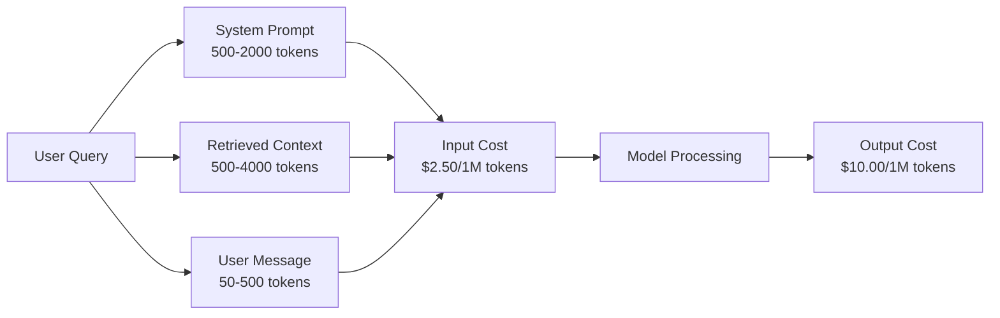
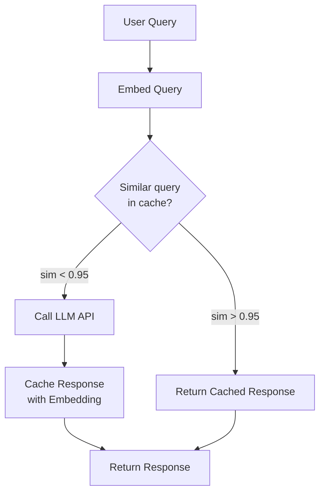
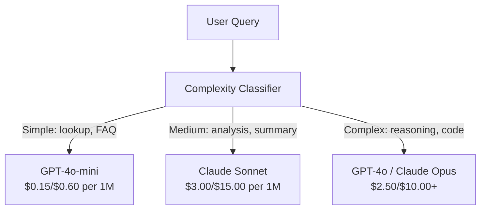

# ذخیره سازی، محدودیت نرخ و بهینه سازی هزینه

> اکثر استارت آپ های هوش مصنوعی از مدل های بد نمی میرند. آنها از اقتصاد واحد بد می میرند. یک تماس GPT-4o تنها یک درصد هزینه دارد. ده هزار کاربر که 10 تماس در روز انجام می دهند تنها 250 دلار در توکن ورودی هزینه دارد - قبل از اینکه یک دلار هزینه کنید. شرکت هایی که زنده می مانند، کسانی هستند که هر تماس API را به عنوان یک معامله مالی، نه یک تماس عملکردی، می گیرند.

**Type:** Build
**Languages:** Python
**Prerequisites:** Phase 11 Lesson 09 (Function Calling)
**Time:** ~45 minutes
**Related:**مرحله 11 · 15 (Caching فوری)  این درس شامل کیش لایه ای برنامه (Cache معنوی، کیش هشت دقیق، روتینگ مدل) است. درس 15 شامل کیش لایه ای ارائه دهنده (Anthropic cache_control، OpenAI خودکار، Gemini CachedContent) است. هر دو را برای کاهش هزینه 50-95٪ ترکیب کنید.

## اهداف یادگیری

- پیاده سازی حافظه پیشگیری معنوی که به جای انجام یک تماس API جدید به سوالات تکراری یا مشابه از حافظه پیشگیری خدمت می کند
- محاسبه هزینه های هر درخواست در بین ارائه دهندگان و پیاده سازی محدودیت نرخ و هشدار بودجه در مورد توکن
- یک لایه بهینه سازی هزینه با فشرده سازی سریع، مسیر دادن مدل (خرجی در مقابل ارزان) و ذخیره سازی پاسخ ایجاد کنید
- طراحی یک استراتژی ذخیره سازی طبقه بندی شده با استفاده از مطابقت دقیق، شباهت معنوی و ذخیره سازی پیشگویی برای انواع مختلف جستجو

## مشکل

تو يه چت روبات RAG بسازي، خيلي خوب کار ميکنه، کاربران عاشقش هستن

و بعد فاکتور میاد

هزینه های GPT-5 $5 per million input tokens and $15 در هر میلیون تولید. کلود اوپوس 4.7 هزینه دارد$15 input / $75 محصول Gemini 3 Pro هزینه داره$1.25 input / $5 خروجی GPT-5-مینی$0.25/$قیمت های زیر نشان دهنده ای هستند؛ همیشه صفحه قیمت گذاری فعلی ارائه دهنده را بررسی کنید.

این ریاضی است که باعث می شود استارت آپ ها کشته شوند:

- ۱۰ هزار کاربر فعال روزانه
- 10 سوال در هر کاربر در روز
- ۱۰۰۰ توکن ورودی در هر سوال (سائستمهای سیستم + زمینه + پیام کاربر)
- 500 توکن خروجی در هر پاسخ

**Daily input cost:**10 هزار x 10 x 1000 / 1 میلیون x$2.50 = **$250/روز**
**Daily output cost:**10 هزار تا 10 هزار تا 500 تا 1000 هزار تا$10.00 = **$500/روز**
**Monthly total:** **$22,500/month**

این فقط مدرک لیسانس است. اضافه کردن گنجانده ها، میزبانی پایگاه داده ویکتور، زیرساخت. شما به دنبال $30,000/ماه برای یک چت روبات هستید.

بخش خشن: ۴۰ تا ۶۰ درصد از این سوالات تقریباً دوگونی هستند. کاربران سوالات مشابهی را با کلمات کمی متفاوت می پرسند. درخواست سیستم شما - یکسان در هر درخواست - هر بار صورت می گیرد. اسناد زمینه ای که توسط RAG بازیافت می شود در میان کاربران تکرار می شود که در مورد همان موضوع سوال می کنند.

شما برای محاسبه های اضافی قیمت کامل را می پردازید.

## مفهوم

### آناتومی هزینه های یک تماس LLM

هر تماس API پنج بخش هزینه دارد.



پیام های سیستم قاتل خاموش هستند. یک پیام سیستم 1500 توکن با هر درخواست هزینه میرسد$3.75 per million requests just for that prefix. At 100K requests per day, that is $۳۷۵ دلار در ماه برای متن که هرگز تغییر نمی کند.

### ذخیره سازی ارائه دهنده: تخفیف های داخلی

در سال 2026، هر سه ارائه دهنده اصلی پیشگیری سریع در پیشاپیش ارائه می دهند، اما مکانیک ها متفاوت است. برای عمیق شدن، مرحله 11 · 15 را ببینید.

| Provider | Mechanism | Discount | Minimum | Cache Duration |
|----------|-----------|----------|---------|----------------|
| Anthropic | Explicit cache_control markers | 90% on cache hits (pay 25% extra on write) | 1,024 tokens (Sonnet/Opus), 2,048 (Haiku) | 5 min default; 1h extended (2x write premium) |
| OpenAI | Automatic prefix matching | 50% on cache hits | 1,024 tokens | Best-effort up to 1 hour |
| Google Gemini | Explicit CachedContent API | ~75% reduction (plus storage) | 4,096 (Flash) / 32,768 (Pro) | User-configurable TTL |

**Anthropic's approach**شما بخش هایی از پیام خود را با `cache_control: {"type": "ephemeral"}`. اولین درخواست 25 درصد هزینه نوشتن را پرداخت می کند. درخواست های بعدی با همان پیش فرض 90 درصد تخفیف می گیرند. یک سیستم 2000 توکن به این هزینه اشاره می کند$0.005 normally costs $.000625 در مورد بازدیدهای حافظه کش بیش از 100 هزار درخواست که 437.50 دلار در روز را ذخیره می کند

**OpenAI's approach**هر پیشگویی فوری که با درخواست قبلی مطابقت دارد، تخفیف ۵۰٪ دریافت می کند. هیچ نشانه ای لازم نیست. تخفیف کمتر، کنترل کمتر، اما تلاش اجرای صفر.

### ذخیره سازی معنوی: لایه سفارشی شما

پیشگیری از پیشگیری از ارائه دهنده تنها برای پیشگام های یکسان کار می کند. پیشگام سازی معنوی پرونده سخت تر را اداره می کند: سوالات مختلف با معنی مشابه.

"سیستم بازگشت چیست؟" و "چگونه یک آیتم را بازگردانم؟" رشته های مختلفی هستند اما قصد یکسان هستند. یک کش معنوی هر دو سوال را دربر می گیرد، شباهت کوسین را محاسبه می کند و پاسخ ذخیره شده را اگر شباهت از حد عبور کند (معمولا 0.92-0.95) باز می گرداند.



هزینه های گنجانده شدن قابل توجهی است. گنجانده شدن متن 3 کوچک OpenAI هزینه 0.02 $ در هر میلیون توکن. بررسی حافظه پیش فرض تقریبا هیچ هزینه در مقایسه با یک تماس LLM کامل.

### کیش دقیق: هاش و مطابقت

برای تماس های تعیین کننده (حرارتی=0، همان مدل، همان پرامپت) ، ذخیره دقیق ساده تر و سریع تر است. پرامپت کامل را هاش کنید، حافظه کش را بررسی کنید، اگر یافت شود، برگردید.

این کار برای:
- سیستم فوری + زمینه ثابت + سوالات کاربر یکسان
- تماس با تابع با تعاریف ابزار یکسان
- پردازش دسته ای که در آن یک سند چندین بار پردازش می شود

### محدودیت نرخ: محافظت از بودجه

محدود کردن نرخ فقط درباره عدالت نیست بلکه درباره زنده ماندن است.

**Token bucket algorithm:**هر کاربر یک سطل از N توکن ها را دریافت می کند که با سرعت R در ثانیه پر می شود. یک درخواست توکن ها را از سطل مصرف می کند. اگر سطل خالی باشد، درخواست رد می شود. این اجازه می دهد تا انفجار (با استفاده از سطل کامل در یک بار) در حالی که یک نرخ متوسط را اجرا می کند.

**Per-user quotas:**محدودیت های روزانه/ماهانه توکن ها را برای هر سطح کاربر تعیین کنید.

| Tier | Daily Token Limit | Max Requests/min | Model Access |
|------|------------------|------------------|-------------|
| Free | 50,000 | 10 | GPT-4o-mini only |
| Pro | 500,000 | 60 | GPT-4o, Claude Sonnet |
| Enterprise | 5,000,000 | 300 | All models |

### راهبرد مدل: مدل مناسب برای شغل مناسب

نه هر سوال به GPT-4o نیاز داره

"بازار ساعت چه ساعته بسته میشه؟" نیازی به یک سوال نیست$10/M-output model. GPT-4o-mini at $0.60 / M محصول به طور کامل انجام می دهد. کلاود هیکو در 1.25 $ / M محصول به طور کامل انجام می دهد. یک طبقه بندی ساده راه اندازی سوالات ارزان به مدل های ارزان و سوالات پیچیده به مدل های گران قیمت.



یک روتر خوب تنظیم شده تنها ۴۰ تا ۷۰ درصد از هزینه های مدل را صرفه جویی می کند.

### ردیابی هزینه ها: دانستن کجا پول می رود

شما نمی توانید آنچه را که اندازه گیری نمی کنید بهینه سازی کنید. هر تماس API را با:

- زمان
- نام مدل
- توکن های ورودی
- توکن های خروجی
- تاخیر (ms)
- هزینه محاسبه شده ($)
- شناسه کاربری
- کاشه
- دسته درخواست

این داده ها نشان می دهد که کدام ویژگی ها گران هستند، کدام کاربران مصرف کنندگان سنگین هستند و کجا کیشینگ بیشترین تاثیر را دارد.

### دسته بندی: تخفیف های عمده

API دسته ای OpenAI درخواست ها را به صورت غیرمسلح با تخفیف 50٪ پردازش می کند. شما یک دسته تا 50،000 درخواست را ارسال می کنید و نتایج در عرض 24 ساعت به شما باز می گردند.

استفاده از دسته بندی برای:
- پردازش اسناد شبانه
- طبقه بندی عمده
- دوره های ارزیابی
- خط لوله های غنی سازی داده ها

برای: سوالات کاربر در زمان واقعی (موضوعات تاخیر)

### هشدار بودجه و قطع مدار

اگر به حد محدود رسیدید، یک قطع مدار هزینه را متوقف می کند. بدون یک خطای یا سوء استفاده می تواند در چند ساعت بودجه ماهانه شما را سوختد.

سه حد مقرر کنید:
1. **Warning**(70 درصد بودجه): ارسال هشدار
2. **Throttle**(85 درصد بودجه): صرفاً به مدل های ارزان تر تغییر دهید
3. **Stop**(95 درصد بودجه): درخواست های جدید رد می شود، تنها پاسخ های ذخیره شده را باز می گرداند

### ستک بهینه سازی

اين روش ها رو به ترتيب اجرا کنين. هر لایه ي مخلوط به اون هاي قبل مياد.

| Layer | Technique | Typical Savings | Implementation Effort |
|-------|-----------|----------------|----------------------|
| 1 | Provider prompt caching | 30-50% | Low (add cache markers) |
| 2 | Exact caching | 10-20% | Low (hash + dict) |
| 3 | Semantic caching | 15-30% | Medium (embeddings + similarity) |
| 4 | Model routing | 40-70% | Medium (classifier) |
| 5 | Rate limiting | Budget protection | Low (token bucket) |
| 6 | Prompt compression | 10-30% | Medium (rewrite prompts) |
| 7 | Batching | 50% on eligible | Low (batch API) |

یک برنامه RAG که لایه های 1-5 را اعمال می کند معمولا هزینه ها را از $22,500/month to $4000 تا 6000 دلار در ماه، این تفاوت بین سوختن راه فرود و ساختن کسب و کار است

### پس انداز واقعی: قبل و بعد

این یک خرابی واقعی برای یک چت روت RAG که 10 هزار DAU را خدمت می کند.

| Metric | Before Optimization | After Optimization | Savings |
|--------|--------------------|--------------------|---------|
| Monthly LLM cost | $22,500 | $5,200 | 77% |
| Avg cost per query | $0.0075 | $0.0017 | 77% |
| Cache hit rate | 0% | 52% | -- |
| Queries routed to mini | 0% | 65% | -- |
| P95 latency | 2,800ms | 900ms (cache hits: 50ms) | 68% |
| Monthly embedding cost | $0 | $180 | (new cost) |
| Total monthly cost | $22,500 | $5,380 | 76% |

هزینه های گنجانده شدن برای ذخیره سازی زیرنویس (۱۸۰ دلار در ماه) در عرض اولین ساعت از بازدید از زیرنویس خود را پرداخت می کند.

```figure
semantic-cache
```

## آن را بسازید

### مرحله ی اول: حسابدار هزینه

یک ماشین حساب هزینه توکن بسازید که قیمت فعلی مدل های اصلی را می داند.

```python
import hashlib
import time
import json
import math
from dataclasses import dataclass, field


MODEL_PRICING = {
    "gpt-4o": {"input": 2.50, "output": 10.00, "cached_input": 1.25},
    "gpt-4o-mini": {"input": 0.15, "output": 0.60, "cached_input": 0.075},
    "gpt-4.1": {"input": 2.00, "output": 8.00, "cached_input": 0.50},
    "gpt-4.1-mini": {"input": 0.40, "output": 1.60, "cached_input": 0.10},
    "gpt-4.1-nano": {"input": 0.10, "output": 0.40, "cached_input": 0.025},
    "o3": {"input": 2.00, "output": 8.00, "cached_input": 0.50},
    "o3-mini": {"input": 1.10, "output": 4.40, "cached_input": 0.55},
    "o4-mini": {"input": 1.10, "output": 4.40, "cached_input": 0.275},
    "claude-opus-4": {"input": 15.00, "output": 75.00, "cached_input": 1.50},
    "claude-sonnet-4": {"input": 3.00, "output": 15.00, "cached_input": 0.30},
    "claude-haiku-3.5": {"input": 0.80, "output": 4.00, "cached_input": 0.08},
    "gemini-2.5-pro": {"input": 1.25, "output": 10.00, "cached_input": 0.3125},
    "gemini-2.5-flash": {"input": 0.15, "output": 0.60, "cached_input": 0.0375},
}


def calculate_cost(model, input_tokens, output_tokens, cached_input_tokens=0):
    if model not in MODEL_PRICING:
        return {"error": f"Unknown model: {model}"}
    pricing = MODEL_PRICING[model]
    non_cached = input_tokens - cached_input_tokens
    input_cost = (non_cached / 1_000_000) * pricing["input"]
    cached_cost = (cached_input_tokens / 1_000_000) * pricing["cached_input"]
    output_cost = (output_tokens / 1_000_000) * pricing["output"]
    total = input_cost + cached_cost + output_cost
    return {
        "model": model,
        "input_tokens": input_tokens,
        "output_tokens": output_tokens,
        "cached_input_tokens": cached_input_tokens,
        "input_cost": round(input_cost, 6),
        "cached_input_cost": round(cached_cost, 6),
        "output_cost": round(output_cost, 6),
        "total_cost": round(total, 6),
    }
```

### مرحله دوم: ذخیره دقیق

تمام پیامک ها را هاش کنید و پاسخ های ذخیره شده را برای درخواست های یکسان برگردانید.

```python
class ExactCache:
    def __init__(self, max_size=1000, ttl_seconds=3600):
        self.cache = {}
        self.max_size = max_size
        self.ttl = ttl_seconds
        self.hits = 0
        self.misses = 0

    def _hash(self, model, messages, temperature):
        key_data = json.dumps({"model": model, "messages": messages, "temperature": temperature}, sort_keys=True)
        return hashlib.sha256(key_data.encode()).hexdigest()

    def get(self, model, messages, temperature=0.0):
        if temperature > 0:
            self.misses += 1
            return None
        key = self._hash(model, messages, temperature)
        if key in self.cache:
            entry = self.cache[key]
            if time.time() - entry["timestamp"] < self.ttl:
                self.hits += 1
                entry["access_count"] += 1
                return entry["response"]
            del self.cache[key]
        self.misses += 1
        return None

    def put(self, model, messages, temperature, response):
        if temperature > 0:
            return
        if len(self.cache) >= self.max_size:
            oldest_key = min(self.cache, key=lambda k: self.cache[k]["timestamp"])
            del self.cache[oldest_key]
        key = self._hash(model, messages, temperature)
        self.cache[key] = {
            "response": response,
            "timestamp": time.time(),
            "access_count": 1,
        }

    def stats(self):
        total = self.hits + self.misses
        return {
            "hits": self.hits,
            "misses": self.misses,
            "hit_rate": round(self.hits / total, 4) if total > 0 else 0,
            "cache_size": len(self.cache),
        }
```

### مرحله سوم: مخزن معنوی

سوالات را دربرگیرید و پاسخ های ذخیره شده را به هنگام مشابهی که از حد عبور می کند، برگردانید.

```python
def simple_embed(text):
    words = text.lower().split()
    vocab = {}
    for w in words:
        vocab[w] = vocab.get(w, 0) + 1
    norm = math.sqrt(sum(v * v for v in vocab.values()))
    if norm == 0:
        return {}
    return {k: v / norm for k, v in vocab.items()}


def cosine_similarity(a, b):
    if not a or not b:
        return 0.0
    all_keys = set(a) | set(b)
    dot = sum(a.get(k, 0) * b.get(k, 0) for k in all_keys)
    return dot


class SemanticCache:
    def __init__(self, similarity_threshold=0.85, max_size=500, ttl_seconds=3600):
        self.entries = []
        self.threshold = similarity_threshold
        self.max_size = max_size
        self.ttl = ttl_seconds
        self.hits = 0
        self.misses = 0

    def get(self, query):
        query_embedding = simple_embed(query)
        now = time.time()
        best_match = None
        best_sim = 0.0
        for entry in self.entries:
            if now - entry["timestamp"] > self.ttl:
                continue
            sim = cosine_similarity(query_embedding, entry["embedding"])
            if sim > best_sim:
                best_sim = sim
                best_match = entry
        if best_match and best_sim >= self.threshold:
            self.hits += 1
            best_match["access_count"] += 1
            return {"response": best_match["response"], "similarity": round(best_sim, 4), "original_query": best_match["query"]}
        self.misses += 1
        return None

    def put(self, query, response):
        if len(self.entries) >= self.max_size:
            self.entries.sort(key=lambda e: e["timestamp"])
            self.entries.pop(0)
        self.entries.append({
            "query": query,
            "embedding": simple_embed(query),
            "response": response,
            "timestamp": time.time(),
            "access_count": 1,
        })

    def stats(self):
        total = self.hits + self.misses
        return {
            "hits": self.hits,
            "misses": self.misses,
            "hit_rate": round(self.hits / total, 4) if total > 0 else 0,
            "cache_size": len(self.entries),
        }
```

### مرحله چهارم: محدودیت نرخ

محدود کننده نرخ تکه توکن با کوتا در هر کاربر

```python
class TokenBucketRateLimiter:
    def __init__(self):
        self.buckets = {}
        self.tiers = {
            "free": {"capacity": 50_000, "refill_rate": 500, "max_requests_per_min": 10},
            "pro": {"capacity": 500_000, "refill_rate": 5_000, "max_requests_per_min": 60},
            "enterprise": {"capacity": 5_000_000, "refill_rate": 50_000, "max_requests_per_min": 300},
        }

    def _get_bucket(self, user_id, tier="free"):
        if user_id not in self.buckets:
            tier_config = self.tiers.get(tier, self.tiers["free"])
            self.buckets[user_id] = {
                "tokens": tier_config["capacity"],
                "capacity": tier_config["capacity"],
                "refill_rate": tier_config["refill_rate"],
                "last_refill": time.time(),
                "request_timestamps": [],
                "max_rpm": tier_config["max_requests_per_min"],
                "tier": tier,
                "total_tokens_used": 0,
            }
        return self.buckets[user_id]

    def _refill(self, bucket):
        now = time.time()
        elapsed = now - bucket["last_refill"]
        refill = int(elapsed * bucket["refill_rate"])
        if refill > 0:
            bucket["tokens"] = min(bucket["capacity"], bucket["tokens"] + refill)
            bucket["last_refill"] = now

    def check(self, user_id, tokens_needed, tier="free"):
        bucket = self._get_bucket(user_id, tier)
        self._refill(bucket)
        now = time.time()
        bucket["request_timestamps"] = [t for t in bucket["request_timestamps"] if now - t < 60]
        if len(bucket["request_timestamps"]) >= bucket["max_rpm"]:
            return {"allowed": False, "reason": "rate_limit", "retry_after_seconds": 60 - (now - bucket["request_timestamps"][0])}
        if bucket["tokens"] < tokens_needed:
            deficit = tokens_needed - bucket["tokens"]
            wait = deficit / bucket["refill_rate"]
            return {"allowed": False, "reason": "token_limit", "tokens_available": bucket["tokens"], "retry_after_seconds": round(wait, 1)}
        return {"allowed": True, "tokens_available": bucket["tokens"]}

    def consume(self, user_id, tokens_used, tier="free"):
        bucket = self._get_bucket(user_id, tier)
        bucket["tokens"] -= tokens_used
        bucket["request_timestamps"].append(time.time())
        bucket["total_tokens_used"] += tokens_used

    def get_usage(self, user_id):
        if user_id not in self.buckets:
            return {"error": "User not found"}
        b = self.buckets[user_id]
        return {
            "user_id": user_id,
            "tier": b["tier"],
            "tokens_remaining": b["tokens"],
            "capacity": b["capacity"],
            "total_tokens_used": b["total_tokens_used"],
            "utilization": round(b["total_tokens_used"] / b["capacity"], 4) if b["capacity"] else 0,
        }
```

### مرحله 5: ردیابی هزینه

هر تماس رو ثبت کن و کل اجرا رو محاسبه کن

```python
class CostTracker:
    def __init__(self, monthly_budget=1000.0):
        self.logs = []
        self.monthly_budget = monthly_budget
        self.alerts = []

    def log_call(self, model, input_tokens, output_tokens, cached_input_tokens=0, latency_ms=0, user_id="anonymous", cache_status="miss"):
        cost = calculate_cost(model, input_tokens, output_tokens, cached_input_tokens)
        entry = {
            "timestamp": time.time(),
            "model": model,
            "input_tokens": input_tokens,
            "output_tokens": output_tokens,
            "cached_input_tokens": cached_input_tokens,
            "latency_ms": latency_ms,
            "cost": cost["total_cost"],
            "user_id": user_id,
            "cache_status": cache_status,
        }
        self.logs.append(entry)
        self._check_budget()
        return entry

    def _check_budget(self):
        total = self.total_cost()
        pct = total / self.monthly_budget if self.monthly_budget > 0 else 0
        if pct >= 0.95 and not any(a["level"] == "stop" for a in self.alerts):
            self.alerts.append({"level": "stop", "message": f"Budget 95% consumed: ${total:.2f}/${self.monthly_budget:.2f}", "timestamp": time.time()})
        elif pct >= 0.85 and not any(a["level"] == "throttle" for a in self.alerts):
            self.alerts.append({"level": "throttle", "message": f"Budget 85% consumed: ${total:.2f}/${self.monthly_budget:.2f}", "timestamp": time.time()})
        elif pct >= 0.70 and not any(a["level"] == "warning" for a in self.alerts):
            self.alerts.append({"level": "warning", "message": f"Budget 70% consumed: ${total:.2f}/${self.monthly_budget:.2f}", "timestamp": time.time()})

    def total_cost(self):
        return round(sum(e["cost"] for e in self.logs), 6)

    def cost_by_model(self):
        by_model = {}
        for e in self.logs:
            m = e["model"]
            if m not in by_model:
                by_model[m] = {"calls": 0, "cost": 0, "input_tokens": 0, "output_tokens": 0}
            by_model[m]["calls"] += 1
            by_model[m]["cost"] = round(by_model[m]["cost"] + e["cost"], 6)
            by_model[m]["input_tokens"] += e["input_tokens"]
            by_model[m]["output_tokens"] += e["output_tokens"]
        return by_model

    def cache_savings(self):
        cache_hits = [e for e in self.logs if e["cache_status"] == "hit"]
        if not cache_hits:
            return {"saved": 0, "cache_hits": 0}
        saved = 0
        for e in cache_hits:
            full_cost = calculate_cost(e["model"], e["input_tokens"], e["output_tokens"])
            saved += full_cost["total_cost"]
        return {"saved": round(saved, 4), "cache_hits": len(cache_hits)}

    def summary(self):
        if not self.logs:
            return {"total_calls": 0, "total_cost": 0}
        total_latency = sum(e["latency_ms"] for e in self.logs)
        cache_hits = sum(1 for e in self.logs if e["cache_status"] == "hit")
        return {
            "total_calls": len(self.logs),
            "total_cost": self.total_cost(),
            "avg_cost_per_call": round(self.total_cost() / len(self.logs), 6),
            "avg_latency_ms": round(total_latency / len(self.logs), 1),
            "cache_hit_rate": round(cache_hits / len(self.logs), 4),
            "cost_by_model": self.cost_by_model(),
            "cache_savings": self.cache_savings(),
            "budget_remaining": round(self.monthly_budget - self.total_cost(), 2),
            "budget_utilization": round(self.total_cost() / self.monthly_budget, 4) if self.monthly_budget > 0 else 0,
            "alerts": self.alerts,
        }
```

### مرحله 6: مدل روتر

ازمطلبات رويت به ارزانترين مدل که ميتونه باهاشون برخورد کنه

```python
SIMPLE_KEYWORDS = ["what time", "hours", "address", "phone", "price", "return policy", "hello", "hi", "thanks", "yes", "no"]
COMPLEX_KEYWORDS = ["analyze", "compare", "explain why", "write code", "debug", "architect", "design", "trade-off", "evaluate"]


def classify_complexity(query):
    q = query.lower()
    if len(q.split()) <= 5 or any(kw in q for kw in SIMPLE_KEYWORDS):
        return "simple"
    if any(kw in q for kw in COMPLEX_KEYWORDS):
        return "complex"
    return "medium"


def route_model(query, tier="pro"):
    complexity = classify_complexity(query)
    routing_table = {
        "simple": {"free": "gpt-4.1-nano", "pro": "gpt-4o-mini", "enterprise": "gpt-4o-mini"},
        "medium": {"free": "gpt-4o-mini", "pro": "claude-sonnet-4", "enterprise": "claude-sonnet-4"},
        "complex": {"free": "gpt-4o-mini", "pro": "gpt-4o", "enterprise": "claude-opus-4"},
    }
    model = routing_table[complexity].get(tier, "gpt-4o-mini")
    return {"query": query, "complexity": complexity, "model": model, "tier": tier}
```

### مرحله 7: نمایش نمایش را اجرا کنید

```python
def simulate_llm_call(model, query):
    input_tokens = len(query.split()) * 4 + 500
    output_tokens = 150 + (len(query.split()) * 2)
    latency = 200 + (output_tokens * 2)
    return {
        "model": model,
        "response": f"[Simulated {model} response to: {query[:50]}...]",
        "input_tokens": input_tokens,
        "output_tokens": output_tokens,
        "latency_ms": latency,
    }


def run_demo():
    print("=" * 60)
    print("  Caching, Rate Limiting & Cost Optimization Demo")
    print("=" * 60)

    print("\n--- Model Pricing ---")
    for model, pricing in list(MODEL_PRICING.items())[:6]:
        cost_1k = calculate_cost(model, 1000, 500)
        print(f"  {model}: ${cost_1k['total_cost']:.6f} per 1K in + 500 out")

    print("\n--- Cost Comparison: 100K Requests ---")
    for model in ["gpt-4o", "gpt-4o-mini", "claude-sonnet-4", "claude-haiku-3.5"]:
        cost = calculate_cost(model, 1000 * 100_000, 500 * 100_000)
        print(f"  {model}: ${cost['total_cost']:.2f}")

    print("\n--- Anthropic Cache Savings ---")
    no_cache = calculate_cost("claude-sonnet-4", 2000, 500, 0)
    with_cache = calculate_cost("claude-sonnet-4", 2000, 500, 1500)
    saving = no_cache["total_cost"] - with_cache["total_cost"]
    print(f"  Without cache: ${no_cache['total_cost']:.6f}")
    print(f"  With 1500 cached tokens: ${with_cache['total_cost']:.6f}")
    print(f"  Savings per call: ${saving:.6f} ({saving/no_cache['total_cost']*100:.1f}%)")

    exact_cache = ExactCache(max_size=100, ttl_seconds=300)
    semantic_cache = SemanticCache(similarity_threshold=0.75, max_size=100)
    rate_limiter = TokenBucketRateLimiter()
    tracker = CostTracker(monthly_budget=100.0)

    print("\n--- Exact Cache ---")
    messages_1 = [{"role": "user", "content": "What is the return policy?"}]
    result = exact_cache.get("gpt-4o-mini", messages_1, 0.0)
    print(f"  First lookup: {'HIT' if result else 'MISS'}")
    exact_cache.put("gpt-4o-mini", messages_1, 0.0, "You can return items within 30 days.")
    result = exact_cache.get("gpt-4o-mini", messages_1, 0.0)
    print(f"  Second lookup: {'HIT' if result else 'MISS'} -> {result}")
    result = exact_cache.get("gpt-4o-mini", messages_1, 0.7)
    print(f"  With temp=0.7: {'HIT' if result else 'MISS (non-deterministic, skip cache)'}")
    print(f"  Stats: {exact_cache.stats()}")

    print("\n--- Semantic Cache ---")
    test_queries = [
        ("What is the return policy?", "Items can be returned within 30 days with receipt."),
        ("How do I return an item?", None),
        ("What are your store hours?", "We are open 9am-9pm Monday through Saturday."),
        ("When does the store open?", None),
        ("Tell me about quantum computing", "Quantum computers use qubits..."),
        ("Explain quantum mechanics", None),
    ]
    for query, response in test_queries:
        cached = semantic_cache.get(query)
        if cached:
            print(f"  '{query[:40]}' -> CACHE HIT (sim={cached['similarity']}, original='{cached['original_query'][:40]}')")
        elif response:
            semantic_cache.put(query, response)
            print(f"  '{query[:40]}' -> MISS (stored)")
        else:
            print(f"  '{query[:40]}' -> MISS (no match)")
    print(f"  Stats: {semantic_cache.stats()}")

    print("\n--- Rate Limiting ---")
    for i in range(12):
        check = rate_limiter.check("user_1", 1000, "free")
        if check["allowed"]:
            rate_limiter.consume("user_1", 1000, "free")
        status = "OK" if check["allowed"] else f"BLOCKED ({check['reason']})"
        if i < 5 or not check["allowed"]:
            print(f"  Request {i+1}: {status}")
    print(f"  Usage: {rate_limiter.get_usage('user_1')}")

    print("\n--- Model Routing ---")
    routing_queries = [
        "What time do you close?",
        "Summarize this quarterly earnings report",
        "Analyze the trade-offs between microservices and monoliths",
        "Hello",
        "Write code for a binary search tree with deletion",
    ]
    for q in routing_queries:
        route = route_model(q, "pro")
        print(f"  '{q[:50]}' -> {route['model']} ({route['complexity']})")

    print("\n--- Full Pipeline: Before vs After Optimization ---")
    queries = [
        "What is the return policy?",
        "How do I return something?",
        "What are your hours?",
        "When do you open?",
        "Explain the difference between TCP and UDP",
        "Compare TCP vs UDP protocols",
        "Hello",
        "What is your phone number?",
        "Write a Python function to sort a list",
        "Analyze the pros and cons of serverless architecture",
    ]

    print("\n  [Before: no caching, single model (gpt-4o)]")
    tracker_before = CostTracker(monthly_budget=1000.0)
    for q in queries:
        result = simulate_llm_call("gpt-4o", q)
        tracker_before.log_call("gpt-4o", result["input_tokens"], result["output_tokens"], latency_ms=result["latency_ms"], cache_status="miss")
    before = tracker_before.summary()
    print(f"  Total cost: ${before['total_cost']:.6f}")
    print(f"  Avg cost/call: ${before['avg_cost_per_call']:.6f}")
    print(f"  Avg latency: {before['avg_latency_ms']}ms")

    print("\n  [After: caching + routing + rate limiting]")
    exact_c = ExactCache()
    semantic_c = SemanticCache(similarity_threshold=0.75)
    tracker_after = CostTracker(monthly_budget=1000.0)

    for q in queries:
        messages = [{"role": "user", "content": q}]
        cached = exact_c.get("gpt-4o", messages, 0.0)
        if cached:
            tracker_after.log_call("gpt-4o-mini", 0, 0, latency_ms=5, cache_status="hit")
            continue
        sem_cached = semantic_c.get(q)
        if sem_cached:
            tracker_after.log_call("gpt-4o-mini", 0, 0, latency_ms=15, cache_status="hit")
            continue
        route = route_model(q)
        result = simulate_llm_call(route["model"], q)
        tracker_after.log_call(route["model"], result["input_tokens"], result["output_tokens"], latency_ms=result["latency_ms"], cache_status="miss")
        exact_c.put(route["model"], messages, 0.0, result["response"])
        semantic_c.put(q, result["response"])

    after = tracker_after.summary()
    print(f"  Total cost: ${after['total_cost']:.6f}")
    print(f"  Avg cost/call: ${after['avg_cost_per_call']:.6f}")
    print(f"  Avg latency: {after['avg_latency_ms']}ms")
    print(f"  Cache hit rate: {after['cache_hit_rate']:.0%}")

    if before["total_cost"] > 0:
        savings_pct = (1 - after["total_cost"] / before["total_cost"]) * 100
        print(f"\n  SAVINGS: {savings_pct:.1f}% cost reduction")
        print(f"  Latency improvement: {(1 - after['avg_latency_ms'] / before['avg_latency_ms']) * 100:.1f}% faster")

    print("\n--- Budget Alerts Demo ---")
    alert_tracker = CostTracker(monthly_budget=0.01)
    for i in range(5):
        alert_tracker.log_call("gpt-4o", 5000, 2000, latency_ms=500)
    print(f"  Total spent: ${alert_tracker.total_cost():.6f} / ${alert_tracker.monthly_budget}")
    for alert in alert_tracker.alerts:
        print(f"  ALERT [{alert['level'].upper()}]: {alert['message']}")

    print("\n--- Cost Breakdown by Model ---")
    multi_tracker = CostTracker(monthly_budget=500.0)
    for _ in range(50):
        multi_tracker.log_call("gpt-4o-mini", 800, 200, latency_ms=150)
    for _ in range(30):
        multi_tracker.log_call("claude-sonnet-4", 1500, 500, latency_ms=400)
    for _ in range(10):
        multi_tracker.log_call("gpt-4o", 2000, 800, latency_ms=600)
    for _ in range(10):
        multi_tracker.log_call("claude-opus-4", 3000, 1000, latency_ms=1200)
    breakdown = multi_tracker.cost_by_model()
    for model, data in sorted(breakdown.items(), key=lambda x: x[1]["cost"], reverse=True):
        print(f"  {model}: {data['calls']} calls, ${data['cost']:.6f}, {data['input_tokens']:,} in / {data['output_tokens']:,} out")
    print(f"  Total: ${multi_tracker.total_cost():.6f}")

    print("\n" + "=" * 60)
    print("  Demo complete.")
    print("=" * 60)


if __name__ == "__main__":
    run_demo()
```

## ازش استفاده کن

### ذخیره سازی سریع انسان

```python
# import anthropic
#
# client = anthropic.Anthropic()
#
# response = client.messages.create(
#     model="claude-sonnet-5",
#     max_tokens=1024,
#     system=[
#         {
#             "type": "text",
#             "text": "You are a helpful customer support agent for Acme Corp...",
#             "cache_control": {"type": "ephemeral"},
#         }
#     ],
#     messages=[{"role": "user", "content": "What is the return policy?"}],
# )
#
# print(f"Input tokens: {response.usage.input_tokens}")
# print(f"Cache creation tokens: {response.usage.cache_creation_input_tokens}")
# print(f"Cache read tokens: {response.usage.cache_read_input_tokens}")
```

اولین تماس به حافظه کش می نویسد (پریم 25٪). هر تماس بعدی با همان پیشگویی سیستم فوری از حافظه کش می خواند (90٪ تخفیف). حافظه کش 5 دقیقه طول می کشد و تایمر را در هر ضربه تنظیم می کند.

### OpenAI خودکار ذخیره سازی

```python
# from openai import OpenAI
#
# client = OpenAI()
#
# response = client.chat.completions.create(
#     model="gpt-4o",
#     messages=[
#         {"role": "system", "content": "You are a helpful customer support agent..."},
#         {"role": "user", "content": "What is the return policy?"},
#     ],
# )
#
# print(f"Prompt tokens: {response.usage.prompt_tokens}")
# print(f"Cached tokens: {response.usage.prompt_tokens_details.cached_tokens}")
# print(f"Completion tokens: {response.usage.completion_tokens}")
```

OpenAI به طور خودکار ذخیره می شود. هر پیشگویی فوری از 1,024+ توکن که با یک درخواست اخیر مطابقت دارد، تخفیف 50٪ دریافت می کند. هیچ تغییر کد لازم نیست - فقط چک کنید`prompt_tokens_details.cached_tokens`در پاسخ به بررسی اینکه کار می کنه.

### API دسته OpenAI

```python
# import json
# from openai import OpenAI
#
# client = OpenAI()
#
# requests = []
# for i, query in enumerate(queries):
#     requests.append({
#         "custom_id": f"request-{i}",
#         "method": "POST",
#         "url": "/v1/chat/completions",
#         "body": {
#             "model": "gpt-4o-mini",
#             "messages": [{"role": "user", "content": query}],
#         },
#     })
#
# with open("batch_input.jsonl", "w") as f:
#     for r in requests:
#         f.write(json.dumps(r) + "\n")
#
# batch_file = client.files.create(file=open("batch_input.jsonl", "rb"), purpose="batch")
# batch = client.batches.create(input_file_id=batch_file.id, endpoint="/v1/chat/completions", completion_window="24h")
# print(f"Batch ID: {batch.id}, Status: {batch.status}")
```

API دسته ای 50 درصد تخفیف را در تمام توکن ها می دهد. نتایج در عرض 24 ساعت می رسند. برای بار کاری غیر واقعی مناسب: ارزیابی، برچسب گذاری داده ها، خلاصه ی عمده.

### تولید Cache معنوی با Redis

```python
# import redis
# import numpy as np
# from openai import OpenAI
#
# r = redis.Redis()
# client = OpenAI()
#
# def get_embedding(text):
#     response = client.embeddings.create(model="text-embedding-3-small", input=text)
#     return response.data[0].embedding
#
# def semantic_cache_lookup(query, threshold=0.95):
#     query_emb = np.array(get_embedding(query))
#     keys = r.keys("cache:emb:*")
#     best_sim, best_key = 0, None
#     for key in keys:
#         stored_emb = np.frombuffer(r.get(key), dtype=np.float32)
#         sim = np.dot(query_emb, stored_emb) / (np.linalg.norm(query_emb) * np.linalg.norm(stored_emb))
#         if sim > best_sim:
#             best_sim, best_key = sim, key
#     if best_sim >= threshold and best_key:
#         response_key = best_key.decode().replace("cache:emb:", "cache:resp:")
#         return r.get(response_key).decode()
#     return None
```

در تولید، اسکن خطی را با یک شاخص ویکتور (Redis Vector Search، Pinecone، یا pgvector) جایگزین کنید. اسکن خطی برای <1,000 ورودی کار می کند. فراتر از آن، برای جستجوی O(log n) از ANN (تقریباً نزدیکترین همسایه) استفاده کنید.

## -باده

این درس به ما کمک می کند`outputs/prompt-cost-optimizer.md`-- یک پیامک قابل استفاده مجدد که درخواست LLM شما را تجزیه و تحلیل می کند و بهینه سازی هزینه های خاص را با پس انداز پیش بینی شده توصیه می کند.

همچنین تولید می کند`outputs/skill-cost-patterns.md`-- چارچوب تصمیم گیری برای انتخاب استراتژی ذخیره سازی ذخیره سازی مناسب، تنظیمات محدود کردن نرخ و قوانین رویتینگ مدل برای مورد استفاده شما.

## تمرینات

1. **Implement LRU eviction for the semantic cache.**جایگزین قدیمی ترین اولین تخلیه با کمتر استفاده شده. آخرین زمان دسترسی برای هر ورودی را ردیابی کنید و واردات را با قدیمی ترین زمان دسترسی که حافظه پنهان پر است، تخلیه کنید. نرخ ضربه بین دو استراتژی بیش از 100 سوال را مقایسه کنید.

2. **Build a cost projection tool.**با توجه به یک دفترچه تماس های API (نویس CostTracker) ، هزینه ماهانه را بر اساس متوسط 7 روز عقب برآورد کنید. الگوهای روزهای هفته/ آخر هفته را حساب کنید. هشدار را در صورت افزایش هزینه های ماهانه بیش از 20٪ از بودجه ایجاد کنید.

3. **Implement tiered semantic caching.**از دو حداد مشابهی استفاده کنید: 0.98 برای ضربه های با اعتماد بالا (به سرعت باز می گردد) و 0.90 برای ضربه های با اعتماد متوسط (باز می گردد با یک معافیت مسئولیت: "به اساس یک سوال مشابه قبلی..."). ردیابی از هر سطح ضربه آمده و تفاوت رضایت کاربر را اندازه گیری کنید.

4. **Build a model routing classifier.**طبقه بندی کننده مبتنی بر کلمات کلیدی را با طبقه بندی مبتنی بر گنجانده جایگزین کنید. 50 سوال با برچسب (ساده / متوسط / پیچیده) را گنجانید، سپس با پیدا کردن نزدیک ترین مثال با برچسب، سوالات جدید را طبقه بندی کنید. دقت طبقه بندی را با مجموعه آزمایشی 20 سوال اندازه گیری کنید.

5. **Implement a circuit breaker with degradation levels.**در ۷۰ درصد بودجه، یک هشدار ثبت کنید. در ۸۵ درصد، تمام مسیرها را به ارزان ترین مدل (gpt-4o-مینی) تغییر دهید. در ۹۵ درصد، فقط پاسخ های ذخیره شده را ارائه دهید و سوالات جدید را رد کنید. با شبیه سازی ۱۰۰۰ درخواست در مقابل بودجه ۱.۰۰ دلار، آزمایش کنید و هر حد فعال را به درستی تأیید کنید.

## اصطلاحات کلیدی

| Term | What people say | What it actually means |
|------|----------------|----------------------|
| Prompt caching | "Cache the system prompt" | Provider-level caching where repeated prompt prefixes get a discount (90% Anthropic, 50% OpenAI) -- no code changes for OpenAI, explicit markers for Anthropic |
| Semantic caching | "Smart caching" | Embedding the query, computing similarity to past queries, and returning the cached response if similarity exceeds a threshold -- catches paraphrases that exact matching misses |
| Exact caching | "Hash caching" | Hashing the full prompt (model + messages + temperature) and returning the cached response for identical inputs -- only works for temperature=0 deterministic calls |
| Token bucket | "Rate limiter" | An algorithm where each user has a bucket of N tokens that refills at rate R per second -- allows bursts up to N while enforcing an average rate of R |
| Model routing | "Cheapskate routing" | Using a classifier to send simple queries to cheap models (GPT-4o-mini, Haiku) and complex queries to expensive models (GPT-4o, Opus) -- saves 40-70% on model costs |
| Cost tracking | "Metering" | Logging every API call with model, tokens, latency, cost, and user ID so you know exactly where money goes and which features are expensive |
| Circuit breaker | "Kill switch" | Automatically degrading service (cheaper models, cached-only) or stopping requests entirely when spending approaches the budget limit |
| Batch API | "Bulk discount" | OpenAI's asynchronous processing at 50% discount -- submit up to 50,000 requests, get results within 24 hours |
| Prompt compression | "Token diet" | Rewriting system prompts and context to use fewer tokens while preserving meaning -- shorter prompts cost less and often perform better |
| Cache hit rate | "Cache efficiency" | The percentage of requests served from cache instead of calling the LLM -- 40-60% is typical for production chatbots, saves proportionally on cost |

## خواندن بیشتر

- [Anthropic Prompt Caching Guide](https://docs.anthropic.com/en/docs/build-with-claude/prompt-caching)-- اسناد رسمی برای شاخص های کنترل آشکار کش Anthropic، قیمت گذاری و رفتار طول عمر کش
- [OpenAI Prompt Caching](https://platform.openai.com/docs/guides/prompt-caching)-- حافظه پیشگیری خودکار OpenAI، چگونگی تأیید ضربه های پیشگیری از طریق زمینه های استفاده و حداقل طول پیشگویی
- [OpenAI Batch API](https://platform.openai.com/docs/guides/batch)-- تخفیف ۵۰٪ برای پردازش غیر هماهنگ، فرمت JSONL، پنجره تکمیل ۲۴ ساعت و محدودیت درخواست ۵۰ هزار
- [GPTCache](https://github.com/zilliztech/GPTCache)-- کتابخانه ذخیره سازی رمزنگاری شده منبع باز که از چندین پس زمینه داخلی، فروشگاه های ویکتور و سیاست های اخراج پشتیبانی می کند
- [Martian Model Router](https://docs.withmartian.com)-- روتینگ مدل تولید که به طور خودکار ارزان ترین مدل را که قادر به انجام هر سوال است انتخاب می کند
- [Not Diamond](https://www.notdiamond.ai)-- روتر مدل مبتنی بر ML که از الگوهای ترافیک شما برای بهینه سازی معامله های هزینه / کیفیت بین ارائه دهندگان یاد می گیرد
- [Helicone](https://www.helicone.ai)-- پلتفرم مشاهده LLM با ردیابی هزینه، ذخیره سازی، محدودیت نرخ و هشدار بودجه به عنوان لایه نماینده
- [Dean & Barroso, "The Tail at Scale" (CACM 2013)](https://research.google/pubs/the-tail-at-scale/)-- تاخیر، تولید، درصد TTFT/TPOT، و درخواست های پوشش داده شده؛ مدل هزینه پشت "خريد ارزان ترین مدل که هنوز هم با P95 مطابقت دارد".
- [Kwon et al., "Efficient Memory Management for Large Language Model Serving with PagedAttention" (SOSP 2023)](https://arxiv.org/abs/2309.06180)-- مقاله vLLM؛ چرا KV-cache + batching مداوم صفحه ای از سرورهای ساده 24x در تولید، لایه زیرزمینی تحت "کیشینگ و هزینه" میسر است.
- [Dao et al., "FlashAttention-2: Faster Attention with Better Parallelism and Work Partitioning" (ICLR 2024)](https://arxiv.org/abs/2307.08691)-- کاهش هزینه در سطح هسته orthogonal برای prompt caching; همراه با رمزگذاری حدس و زن و GQA برای تصویر کامل منحنی هزینه.
