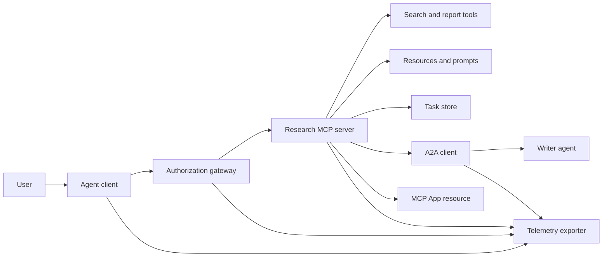
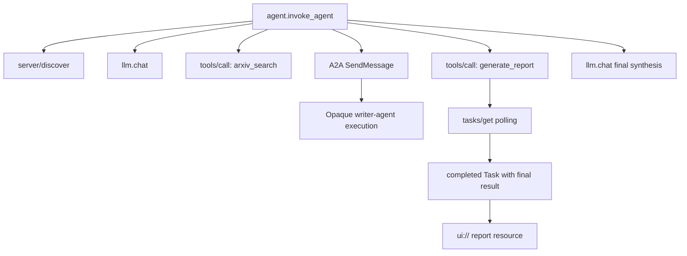
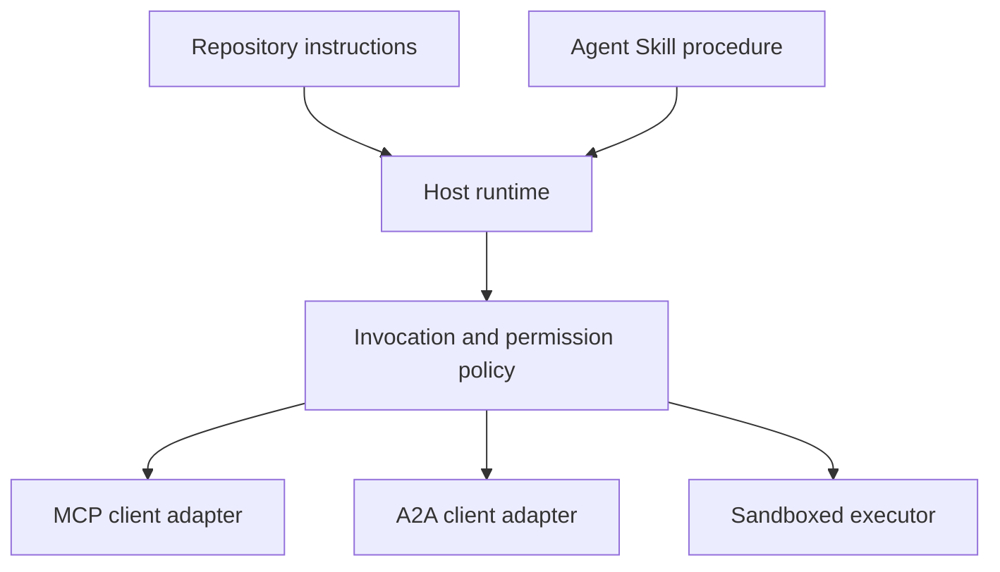

# سنگ اصلی: اکوسیستم ابزار بی تابعیت

> یک سیستم عامل تولید مجموعه ای از مرزهای است، نه یک توده از ویژگی ها. این سنگ پایانی یک شبیه سازی قابل خواندن در فرآیند را از مشتریان پروتکل، سرور مجوز، sandbox و صادرات تله متری که هنوز به کارگیری واقعی نیاز دارد جدا می کند.

**Type:** Build
**Languages:** Python (stdlib, in-process simulation)
**Prerequisites:** Phase 13 · 01 through 22, using MCP revision `2026-07-28`
**Time:** ~120 minutes

## اهداف یادگیری

- تماس های ابزار، نتایج به شکل کار، کار اختصاصی، منابع UI، سیاست مجوز و ردیابی سوابق را در یک جریان ترکیب کنید.
- نسخه پروتکل، هویت مشتری و قابلیت ها را در هر درخواست MCP حمل کنید به جای اعتماد به یک جلسه اتصال.
- قبل از استفاده از یک سرور را کشف کنید و از طریق تمدید رسمی وظایف کار طولانی را انجام دهید.
- یک شبیه سازی به شکل پروتکل را از یک پیاده سازی MCP، A2A، OAuth یا OpenTelemetry تشخیص دهید.
- هر مرز شبیه سازی شده را به بخش تولید که باید جایگزین آن شود نقشه برداری کنید.
- نگه دار`AGENTS.md`، مهارت مامور، آداپتورهای زمان اجرا، ابزارها و سیاست امنیتی در نقش های درستشون
- توضیح دهید که کدام ادعاها می توانند از طریق تولید محلی تأیید شوند و کدامها نیاز به آزمایش های ادغام زنده دارند.

## مشکل

طراحی یک سیستم تحقیق و گزارش. یک کاربر از اسناد در مورد پروتکل های عامل درخواست می کند. سیستم یک کتالوگ کاغذی را جستجو می کند، خلاصه را به ارمغان می آورد، گزارش تولید می کند، یک منبع UI را باز می آورد و مسیر را از طریق سیستم ثبت می کند.

اين جمله چند قرارداد مستقل رو پنهان ميکنه:

- یک طرح ابزار به صورت مدل؛
- یک پاکت درخواست بدون تابعیت و قرارداد کشف سرور؛
- یک تصمیم دروازه ای برای بازیگر، دامنه و هویت ابزار؛
- قرارداد عملیاتی طولانی مدت؛
- پروتکل تفویض؛
- یک پل از میزبان به برنامه؛
- گسترش و صادرات ردیف
- یک روش عملیاتی قابل استفاده مجدد.

`code/main.py`این سیستم، این سیستم را به صورت خودکار و با استفاده از قابلیت های معمول پایتون و لغات قابل مشاهده نگه می دارد. این سیستم نمی تواند یک ترانسپورت را باز کند، با arXiv تماس بگیرد، OAuth را انجام دهد، به یک سرور A2A تماس بگیرد، یک برنامه MCP را ارائه دهد یا از دور اندازه گیری صادر کند. این امر باعث می شود که کنترل جریان را بدون ارائه شبیه سازی به عنوان یک سرویس سازگار، آسان تر از نظر بگیرد.

## مفهوم

### معماری هدف



معماری یک ترکیب مفهومی از الگوهای پروتکل عمومی است. این ادعا در مورد داخلی خصوصی هر محصول نیست.

### ردیابی هدف



در یک پیاده سازی واقعی، هر hop زمینه ردیابی را گسترش می دهد. نام ها و ویژگی های اسپان باید از کنوانسیون های معنایی OpenTelemetry پشتیبانی شده توسط نسخه ابزار انتخاب شده پیروی کنند. یک شناسه ردیابی مشترک به تنهایی ثابت نمی کند که والدین، صادرات یا مصرف پس زمینه درست است.

### سطوح پروتکل فعلی

از نام های روش تعریف شده توسط پروتکل فعلی استفاده کنید، نه نام هایی که از یک مسود قدیمی به یاد می آیند:

| Boundary | Current surface | What the capstone simulates |
|---|---|---|
| MCP discovery | Mandatory `server/discover` | A direct function returning versions, capabilities, and server identity |
| MCP request context | Version, capabilities, and client identity in every `params._meta` | Fresh request metadata passed to every simulated call |
| MCP tool call | `tools/call` | Direct Python function dispatch |
| MCP task polling | `io.modelcontextprotocol/tasks` with `tasks/get` | A working handle followed by a completed task carrying its final result |
| A2A delegation | `SendMessage` in gRPC and JSON-RPC; `POST /message:send` in HTTP+JSON | One nested span with no remote call or artificial delay |
| MCP App calling a server tool | `app.callServerTool({ name, arguments })` | An HTML string with no live bridge |
| OAuth authorization | Authorization server, protected-resource metadata, audience and scope validation | Static token lookup and scope membership |
| OpenTelemetry | SDK, propagator, exporter, and collector or backend | In-memory span dictionaries |

نام پروتکل تنها لایه اول است. تست های تولید باید سریالیزاسیون، شکست های تأیید هویت، لغو، زمان بندی، تکرار و سازگاری نسخه را در سراسر سیم واقعی انجام دهند.

### MCP بی تابعیت تغییر مرز ادغام

نظرسنجی`2026-07-28`جلسه های پروتکل و برنامه های`initialize`-`notifications/initialized`دست زدن هم از دست دادن`Mcp-Session-Id`هر درخواست اين نام ها رو داره`_meta`زمینه ها:

```json
{
  "io.modelcontextprotocol/protocolVersion": "2026-07-28",
  "io.modelcontextprotocol/clientCapabilities": {
    "extensions": {
      "io.modelcontextprotocol/tasks": {}
    }
  },
  "io.modelcontextprotocol/clientInfo": {
    "name": "capstone-client",
    "version": "1.0.0"
  }
}
```

سرور باید اجرا کند`server/discover`. استفاده از نتایج معمول`resultType: "complete"`؛ یک دستی وظیفه استفاده می کند`resultType: "task"`هر نتیجه باید سرور را در `_meta.io.modelcontextprotocol/serverInfo`. .

تمدید وظایف`tasks/get`،`tasks/update`و`tasks/cancel`. یه ابزار ممکنه اول برگردد`resultType: "task"`.`tasks/get`خودش برگرده`resultType: "complete"`و تکمیل شده`Task`در این قسمت، نتیجه نهایی موجود است.`tasks/result`و`tasks/list`روش ها بخشی از گسترش فعلی نیستند.`io.modelcontextprotocol/tasks`در همان درخواست که ممکن است یک دستی کار دریافت کند. اگر این کار را انجام ندهد، سرور باز می گردد `-32021`با`requiredCapabilities`شکل به عنوان شی قادر به کار مشتری گم شده، از جمله `extensions.io.modelcontextprotocol/tasks`. .

### حالت امنیتی

در برنامه ریزی قرار دادن به دفاعی عمق استفاده می شود:

- مجوز OAuth با PKCE در صورتی که نوع مشتری آن را نیاز داشته باشد؛
- ارتباط منابع و مخاطبان برای توکن های دسترسی صادر شده؛
- دروازه RBAC که ابزار و دامنه درخواست شده را بررسی می کند؛
- اعتبارات پیش از راه که خارج از زمینه قابل مشاهده مدل نگهداری می شود؛
- یک مانیفری از توصیف ابزار که به صورت بسته یا بررسی شده است؛
- بررسی قاعده دوم برای ورودی های غیرقابل اعتماد، داده های حساس و اقدامات بعدی؛
- یک جعبه قشنگ اجرای که سیستم فایل، فرآیند، شبکه، اعتبار و محدودیت منابع خارج از مهارت اعمال می شود.

این دمو فقط توکن های جامد، بررسی دامنه و هاش های توصیف را اجرا می کند. این برای جریان سیاست مفید است، نه اعتبار امنیتی.

### مهارت ها روش هستند نه حمل و نقل

یک مهارت عامل می تواند به زمان اجرا بگوید که چگونه جریان کار تحقیقاتی را انجام دهد، چه ابزار هایی را انتظار دارد، چه شواهد را ذخیره کند و چه زمانی متوقف شود. نمی تواند یک سرور MCP وجود داشته باشد، مطابقت A2A را تعیین کند، دامنه های اعطا کند یا یک جعبه شن را ایجاد کند.



در این روش، فایل های همراه را به اشتراک بگذارید. این آرتیفاکت مسطح در این سنگ اصلی قدیمی یک طرح دوره است، نه شواهد مبنی بر اینکه میزبان یک بسته حمل پذیر را حفظ می کند. درس های 24 تا 27 چرخه عمر کامل بسته را ایجاد و آزمایش می کنند.

### متاداتا آثار دوره یک آداپتور محلی است

کتاگول و نصب کننده دوره ها فایل های مسطح را با نام شناسایی می کنند `skill-*.md`این درس به همین دلیل زمینه های هویت حمل پذیر و زمینه های کاتالوگ دوره ها را در سطح یکسان نگه می دارد:

```yaml
---
name: ecosystem-blueprint
description: Produce a full Phase 13 ecosystem architecture for a product need.
version: "1.0.0"
phase: "13"
lesson: "23"
tags: [mcp, capstone, ecosystem, architecture, a2a, otel]
---
```

`name`و`description`این ها زمینه های هویت قابل حمل هستند.`version`،`phase`،`lesson`و`tags`برنامه های توسعه ی کاتالوگ مخصوص دوره ای هستند.`tags`به عنوان یک لیست خطی`--tag capstone`می تونم با اون مطابقت داشته باشم

یک مهارت دایرکتوری قابل حمل ممکن است از گزینه اختیاری استفاده کند`metadata`نقشه برای داده های افزونه با ارزش رشته ای.`metadata`با اسکیما کاتالوگ این مخزن قابل تعویض است. اگر این فایل مسطح`version`یا`tags`زیر`metadata`، پارسر حداقل کلید های زیر را رد می کند، کاتالوگ نسخه خالی را ثبت می کند و فیلتر کردن برچسب نمی تواند آرتیفکت را پیدا کند. میزبان تولید باید از یک پارسر YAML امن استفاده کند و شیما مستند خود را تأیید کند.

### شبیه سازی در مقابل تولید

| Layer | `code/main.py` | Production replacement | Required evidence |
|---|---|---|---|
| Discovery | `server_discover()` plus static `TOOLS` | `server/discover` followed by cache-aware `tools/list` | Wire transcript, deterministic order, and schema validation |
| Authentication | Token-keyed dictionary | OAuth authorization and resource server validation | Issuer, audience, scope, expiry, and failure tests |
| Authorization | Scope membership | Gateway policy bound to actor, tool, target, and tenant | Allow and deny audit cases |
| Search | Static paper fixtures | Search API or MCP server | Source provenance, ranking, and error tests |
| Tasks | Local handle plus immediate `tasks/get` | Durable `io.modelcontextprotocol/tasks` store with `tasks/get`, `tasks/update`, `tasks/cancel`, and TTL | State-transition, input, cancellation, and recovery tests |
| Delegation | Sleep plus nested span | A2A client and remote Agent Card | Contract, timeout, retry, and opacity tests |
| App | HTML string and URI | MCP Apps resource and `App` bridge | CSP, permissions, tool-call, and browser tests |
| Telemetry | In-memory list | OTel SDK and exporter | Collector receipt and trace-parent assertions |
| Sandbox | None | Host-enforced isolated executor | Escape, egress, secret, and resource-limit tests |

این جدول مرز انتقال است. یک راه اندازی محلی سبز فقط شبیه سازی را تأیید می کند.

### نقشه مرحله 13

| Lessons | Contribution |
|---|---|
| 01-05 | Tool interfaces, calls, schemas, structured results, and deterministic validation |
| 06-14 | Stateless MCP request envelopes, discovery, transports, resources, prompts, extensions, and Apps |
| 15-18 | Poisoning defenses, OAuth, gateways, registries, and production authentication |
| 19 | A2A message and task delegation |
| 20 | OpenTelemetry GenAI trace design |
| 21 | Model-provider routing |
| 22 | Portable skill contract and runtime boundary |

```figure
t3-capstone-chain
```

## آن را بسازید

پشتيباني هاي در حال انجام رو اجرا کنيد:

```bash
cd phases/13-tools-and-protocols/23-capstone-tool-ecosystem
python3 code/main.py
```

پنج تا چيز رو بررسی کنيد:

1. `server/discover`اعلامیه اصلاح`2026-07-28`و تمديد وظایف
2. آليس ميتونه گزارش رو بخونه و پيدا کنه، در حالي که تماس با باب که از روي نوشتن انجام شده رد ميشه.
3. هر زمان محلی در یک اجرا سازنده یک شناسه ردیابی را به اشتراک می گذارد و شناسه های زمان والدین را ثبت می کند.
4. گزارش به عنوان یک کار شروع می شود.`tasks/get`یک کار تکمیل شده را بازمی گرداند که نتیجه نهایی آن متن و یک `ui://`مرجع
5. نویسنده ای که به او اختصاص داده شده است، شفاف نیست، زیرا نوازنده فقط طول مرز را ضبط می کند.
6. هیچ ادعای خروجی وجود ندارد که اتصال شبکه، تبادل OAuth، صادرات جمع کننده، رندر مرورگر یا اجرای sandbox رخ داده باشد.

اسکریپت دو بار اجرا می شود، بنابراین دو ردیف ریشه تولید می کند. ورودی های حسابرسی در محل فرآیند هستند و در اجرا بعدی تنظیم مجدد می شوند.

## ازش استفاده کن

یک لایه در یک زمان را ارتقا دهید:

1. جایگزینش کن`server_discover()`و لیست ابزار جامد با real `server/discover`و`tools/list`تماس ها. ارسال نسخه، هویت و قابلیت ها در هر درخواست.
2. توکن های جامد را با یک سرور مجوز و اعتبار منبع محافظت شده جایگزین کنید.
3. اجرای `io.modelcontextprotocol/tasks`گسترش و آزمایش`tasks/get`،`tasks/update`،`tasks/cancel`, زمان توقف , TTL , و بازپديد بازپديد .`tasks/result`یا`tasks/list`. .
4. از اونم به يه A2A کلاينت که يه کارت مامور رو حل ميکنه و پيام ميفرستد
5. با استفاده از SDK رسمی اپلیکیشن را بسازید و از طریق ابزار سرور تماس بگیرید `app.callServerTool`. .
6. صادرات به یک جمع کننده آزمایش و ادعا کردن پدر و مادر در گیرنده.
7. ابزار و اجرای اسکریپت رو در داخل قرارداد سند باکس از درس 26 اجرا کن
8. این روش را به عنوان یک بسته کامل دایرکتوری بسته بندی کنید و دروازه انتشار درس 27 را عبور کنید.

هر ارتقاء نیاز به یک آزمون ادغام دارد که مرز جدید را عبور کند. آزمایش های سیاست سطح پایین تر را هنگامی که سیم واقعی می شود حذف نکنید.

## -باده

این درس به ما کمک می کند`outputs/skill-ecosystem-blueprint.md`این یک معماری یک صفحه ای را که شامل ابتدایی ها، امنیت، نمایندگی، تله متری، بسته بندی و سخت ترین ریسک عملیاتی است، می طلبد. زمینه های کاتالوگ سطح بالا آن توسط کاتالوگ واقعی و نصب کننده های ذخیره سازی استفاده می شود.

از آنجا که این یک بسته دایرکتوری نیست، نمی تواند مرجع، اسکریپت، دارایی یا تنظیمات ارزیابی را حمل کند. از قالب بسته از درس 22 و 24 تا 27 هنگام انتشار یک مهارت قابل استفاده مجدد خارج از این دوره استفاده کنید.

## تمرینات

1. فرار کن`code/main.py`.حقایق جداگانه ای که توسط تولید از ادعاهای تولید اثبات شده است که هنوز به شواهد ادغام نیاز دارند.
2. یک پس زمینه ای جامد دوم اضافه کنید و قانون برخورد را برای دو ابزار با همان نام تعریف کنید. سپس هر دو لیست را با واقعی جایگزین کنید `tools/list`تماس ها
3. از اون جا که نوشته شده رو به سرور آزمايشي A2A عوض کن کارت مامور، درخواست پيام، راه زمان و آثار بازگردانده شده رو ضبط کن
4. یک ذخیره کاری را اضافه کنید که از بازخورد فرآیند زنده بماند. ثابت کنید که یک مشتری می تواند با `tasks/get`، احترام`pollIntervalMs`، و نتیجه نهایی کار انجام شده را بدون خواندن`tasks/result`. .
5. یک اپلیکیشن MCP کم و کم بسازید و تایید کنید`app.callServerTool`در مرورگر با یک CSP محدود و مجوزهای صریح.
6. دامنه های شبیه سازی شده را از طریق یک SDK OTel به یک جمع کننده محلی صادر کنید. دریافت، شناسه های ردیابی، نسب و وضعیت خطا را تأیید کنید.
7. بنویس`AGENTS.md`برای قوانین نگهداری در کل مخزن و یک بسته تخصصی جداگانه برای روش تحقیق قابل استفاده مجدد توضیح دهید که چرا هیچ یک از پرونده ها مجوز ابزار را نمی دهند.

## اصطلاحات کلیدی

| Term | What people say | What it actually means |
|---|---|---|
| Capstone | "Everything wired together" | A staged integration whose simulated and live boundaries remain explicit |
| Protocol-shaped simulation | "It is basically MCP" | Local data and calls that resemble a protocol without implementing its wire contract |
| Tasks extension | "Long tool call" | An optional `io.modelcontextprotocol/tasks` lifecycle with durable identity, polling, client input, final result, and cancellation semantics |
| Opacity boundary | "The other agent handles it" | The caller sees the declared interface and artifacts, not private reasoning or internal state |
| Runtime adapter | "Skill integration" | Host code that maps portable procedure to discovery, invocation, tools, policy, and context |
| Integration evidence | "It passed" | A transcript, artifact, or receiver-side observation proving the real boundary was crossed |

## خواندن بیشتر

- [MCP specification 2026-07-28](https://modelcontextprotocol.io/specification/2026-07-28)برای درخواست های بی تابعیت، کشف، ابزار، مجوز و رفتار حمل و نقل.
- [MCP 2026-07-28 key changes](https://modelcontextprotocol.io/specification/2026-07-28/changelog)برای حذف جلسه، متاداتا در هر درخواست، MRTR، تمدید و حذف.
- [MCP Tasks extension](https://tasks.extensions.modelcontextprotocol.io/specification/draft/tasks)برای`tasks/get`،`tasks/update`،`tasks/cancel`، و نتایج نهایی انجام شده توسط وظایف نهایی.
- [MCP Apps SDK](https://github.com/modelcontextprotocol/ext-apps/blob/main/docs/overview.md)برای`App`و`app.callServerTool`. .
- [A2A protocol](https://a2a-protocol.org/latest/)برای کارت های عامل، تحویل پیام، وظایف، آثار هنری و ارتباطات حمل و نقل.
- [OpenTelemetry GenAI semantic conventions](https://opentelemetry.io/docs/specs/semconv/gen-ai/)برای کنوانسیون های ردیابی و ویژگی ها
- [Agent Skills specification](https://agentskills.io/specification)برای قرارداد بسته برداری قابل حمل که توسط لایه ی قانونی استفاده می شود.
