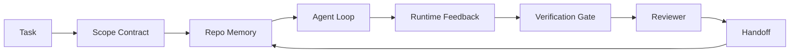

# مهندسی کامپینچ: چرا مدل های قادر هنوز شکست می خورند

> یک مدل قادر کافی نیست. ماموران قابل اعتماد به یک میز کار نیاز دارند: دستورالعمل، حالت، دامنه، بازخورد، تأیید، بررسی و تحویل. آنها را دور کنید و حتی یک مدل مرزی کار را تولید می کند که برای حمل و نقل غیر امن است.

**Type:** Learn + Build
**Languages:** Python (stdlib)
**Prerequisites:** Phase 14 · 01 (Agent Loop), Phase 14 · 26 (Failure Modes)
**Time:** ~45 minutes

## اهداف یادگیری

- قابلیت الگوی مدل از قابلیت اطمینان اجرا.
- هفت سطح کامپيوتر که ميگه آيا يک مامور ميخواد بره نامش رو بيان کن
- یک اجرا فقط در زمان فوری را با یک اجرا با راهنمای میز کاری در یک کار کوچک ریپو مقایسه کنید.
- گزارش وضع شکست را تهیه کنید که هر سطح گمشده را به علائم ایجاد شده نقشه می زند.

## مشکل

شما یک مدل مرز را به یک repo واقعی می اندازید و از آن می خواهید اعتبار ورودی اضافه کند. این چهار فایل را باز می کند، کد قابل قبول را می نویسد، موفقیت را اعلام می کند و متوقف می شود. شما آزمایشات را اجرا می کنید. دو شکست می خورند. یک فایل سوم لمس می شود که هیچ ارتباطی با اعتبار ندارد. هیچ گونه ثبتاتی از آنچه که عامل فرض کرده است، چه کاری را که ابتدا تلاش کرده است یا چه کاری را که باید انجام دهد وجود ندارد.

مدل در مورد پایتون اشتباه نبود. در مورد کار اشتباه بود. هیچ ایده ای نداشت که چه چیزی به عنوان انجام شده حساب می شود، کجا اجازه می دهد که بنویسد، چه تست هایی معتبر هستند، یا اینکه جلسه بعدی چگونه باید شروع شود.

این یک خطا مدل نیست، بلکه یک خطا میز کاری است. سطح اطراف عامل از قطعات غیاب شده که یک نسل یک شوت را به مهندسی قابل اعتماد و قابل تجدید تبدیل می کنند.

## مفهوم

یک میز کاری محیط عملیاتی است که مدل را در طول یک کار پیچیده می کند. این دارای هفت سطح است:

| Surface | What it carries | Failure when missing |
|---------|-----------------|----------------------|
| Instructions | Startup rules, forbidden actions, definition of done | Agent guesses what shipping means |
| State | Current task, touched files, blockers, next action | Each session restarts from zero |
| Scope | Allowed files, forbidden files, acceptance criteria | Edits leak into unrelated code |
| Feedback | Real command output captured into the loop | Agent declares success on a 400 |
| Verification | Tests, lint, smoke run, scope check | "Looks good" reaches main |
| Review | A second pass with a different role | Builder marks own homework |
| Handoff | What changed, why, what is left | Next session re-discovers everything |

میز کار مستقل از مدل است. شما می توانید مدل را عوض کنید و سطوح را نگه دارید. شما نمی توانید سطوح را عوض کنید و قابلیت اطمینان را حفظ کنید.



حلقه در پرونده دولت بسته می شود نه در تاریخچه چت چت. چت متغیر است. ریپو سیستم ثبت است.

### میز کاری در مقابل مهندسی سریع

به عنوان مثال، یک میز کاری به مدل می گوید که چه کاری را می خواهید در این نوبت انجام دهید. یک میز کاری به مدل می گوید که چگونه در طول نوبت ها و در طول جلسات کار را انجام دهید. اکثر داستان های شکست عامل، شکست های میز کاری با پوشیدن لباس های مهندسی سریع هستند.

### میز کاری در مقابل چارچوب

یک چارچوب به شما زمان اجرا می دهد (LangGraph، AutoGen، Agents SDK) یک میز کاری به عامل یک مکان برای کار در این زمان اجرا می دهد. شما به هر دو نیاز دارید. این آهنگ کوچک در مورد دوم است.

### استدلال از ابتدایی ها نه از تاکسونمی های فروشنده

الان درباره "هندس سازی هارنس" خیلی نوشته شده آدی اسمانی، OpenAI، انسان شناسی، لانگ چین، مارتین فولر، مونگودبی، هیومن لیئر، کد افزونه، فکرکاری، لیست شگفت انگیز walkinglabs، و یک طبل ثابت از قطعات Medium و Hacker News همه آن را حمل می کنند. آنها در مورد مرز آنچه که یک آرم است، در محدوده و چه لغت استفاده می شود اختلاف می کنند. ما نیازی به انتخاب طرف نیستیم. هفت سطح یک لایه UX هستند؛ زیر هر میز کار همان مجموعه از سیستم های اولیه توزیع شده است که هر پس زمینه قابل اعتماد را نگه می دارند.

برچسب عامل را برای لحظه ای خاموش کنید. یک عامل اجرا محاسبه ای است که زمان، فرآیندهای و ماشین ها را عبور می کند. برای اینکه قابل اعتماد شود شما به همان ابتدایی ها نیاز دارید که هر سیستم تولید نیاز دارد.

| Primitive | What it is | What it carries for an agent |
|-----------|------------|------------------------------|
| Function | Typed handler. Pure where possible. Owns its inputs and outputs. | A tool call, a rule check, a verification step, a model invocation |
| Worker | Long-lived process that owns one or more functions and a lifecycle | The builder, the reviewer, the verifier, an MCP server |
| Trigger | Event source that invokes a function | Agent loop tick, HTTP request, queue message, cron, file change, hook |
| Runtime | The boundary that decides what runs where, with what timeouts and resources | Claude Code's process, LangGraph's runtime, a worker container |
| HTTP / RPC | The wire between caller and worker | Tool-call protocol, MCP request, model API |
| Queue | Durable buffer between trigger and worker; back-pressure, retry, idempotency | The task board, the feedback log, the review inbox |
| Session persistence | State that survives crashes, restarts, model swaps | `agent_state.json`, checkpoints, KV stores, the repo itself |
| Authorization policy | Who can call what function with which scope | Allowed/forbidden files, approval boundaries, MCP capability lists |

حالا هفت سطح میز کار رو روی اون بومیان نقشه برداری کن

- **Instructions** سیاست + متاداتا عملکرد. قوانین چک (کار) هستند. روتر (`AGENTS.md`) سیاست مربوط به شروع زمان اجرا است.
- **State** دوام جلسه. یک ذخیره سازی کلید زمان اجرا را در هر مرحله می خواند. فایل، KV یا DB؛ دوام معنوی مهم است، پس زمینه ذخیره سازی نمی کند.
- **Scope** سیاست مجوز در هر وظیفه. گلوب های مجاز/ ممنوع یک ACL هستند. مجوزهای مورد نیاز یک شبکه مجوز هستند.
- **Feedback** ثبت نام دعوت نامه در یک صف نوشته شده. هر تماس پوسته یک ضبط است، پایدار، قابل باز کردن.
- **Verification** یک تابع. تعیین کننده بر روی ورودی. در زمان تکمیل کار ایجاد می شود. شکست می یابد.
- **Review** یک کارگر جداگانه با تنها خواندن حق در آثار ساختمانی و تنها نوشتن حق در گزارش های بررسی.
- **Handoff** یک رکورد پایدار که توسط یک تگگ آخر جلسه منتشر می شود. تگ شروع جلسه بعدی آن را می خواند.

خود حلقه عامل یک کارگر است که رویدادها را مصرف می کند (رسال کاربر، نتیجه ابزار، تایمر تایک) ، به عملکردها (مودل، سپس ابزارها که مدل انتخاب می کند) تماس می گیرد، سوابق (حالات، بازخورد) را می نویسد و محرک ها را می فرستد (تحقق، بررسی، تحویل).

### الگوهای در گردش، به ابتدایی ها ترجمه شده

هر الگوي مشهور دستبند به هشت نوع ابتدایی کاهش می یابد.

| Vendor or community pattern | What it actually is |
|------------------------------|--------------------|
| Ralph Loop (Claude Code, Codex, agentic_harness book) — re-inject original intent into a fresh context window when the agent tries to stop early | A trigger that re-enqueues a task with a clean context; session persistence carries the goal forward |
| Plan / Execute / Verify (PEV) | Three workers, one per role, communicating via state and a queue between phases |
| Harness-compute separation (OpenAI Agents SDK, April 2026) — split control plane from execution plane | Restating control-plane / data-plane. Predates the agent label by decades |
| Open Agent Passport (OAP, March 2026) — sign and audit every tool call against a declarative policy before execution | An authorization policy enforced by a pre-action worker, with a signed audit queue |
| Guides and Sensors (Birgitta Böckeler / Thoughtworks) — feedforward rules + feedback observability | Authorization policy + verification functions + observability traces |
| Progressive compaction, 5-stage (Claude Code reverse engineering, April 2026) | A state-management worker that runs cron-like over session persistence to keep it within a budget |
| Hooks / middleware (LangChain, Claude Code) — intercept model and tool calls | Triggers + functions wrapped around the runtime's invocation path |
| Skills as Markdown with progressive disclosure (Anthropic, Flue) | A function registry where the function metadata is loaded into context just-in-time |
| Sandbox agents (Codex, Sandcastle, Vercel Sandbox) | The compute plane: a runtime with isolated filesystem, network, and lifecycle |
| MCP servers | Workers exposing functions over a stable RPC, with capability lists as authorization |

هر ورودی در این جدول، جامعه ی عامل است که به یک ابتدایی که قبلاً نامی در سیستم های توزیع شده داشت می رسد و به آن نام جدیدی می دهد. برچسب های مفید برای بازاریابی؛ مفید به عنوان یک لغت مهندسی نیست.

### چه چيزي در واقع در رساله ها نوشته شده

ادعای استفاده از مدل های فوق العاده تعداد زیادی در پشت آن دارد. ارزش دانستن، چون آنها تنها استدلال صادقانه علیه "فقط منتظر یک مدل هوشمندتر" هستند.

- بنچ ترمینال 2.0  همان مدل، تغییر استفاده از یک عامل کدگذاری را از خارج از 30 درجه اول به رتبه پنجم منتقل کرد (LangChain، * Anatomy of an Agent Harness*).
- ورسل  ۸۰٪ از ابزارهای عامل خود را حذف کرد؛ نرخ موفقیت از ۸۰٪ به ۱۰۰٪ (MongoDB) افزایش یافت.
- Harvey  نمایندگان حقوقی بیش از دو برابر دقت را تنها از طریق بهینه سازی استفاده (MongoDB) افزایش دادند.
- 88 درصد از پروژه های آژانس هوش مصنوعی شرکت ها به تولید نمی رسند. شکست ها در زمان اجرا، نه استدلال (preprints.org، * Harness Engineering for Language Agents*, مارس 2026) جمع می شوند.
- یک مطالعه مقایسه ای در سال 2025 در سه چارچوب منبع باز محبوب گزارش کرد ~ 50% تکمیل وظیفه؛ WebAgent در زمینه طولانی از 40-50% به کمتر از 10% در شرایط طولانی سقوط کرد، عمدتا از حلقه های بی نهایت و از دست دادن هدف (در اوایل 2026 در نوشتن به طور گسترده پوشش داده شده است).

نکته مهم این است که امروزه، مهندسی حمل و نقل در اطراف مدل است نه داخل آن، و ابتدایی که این بار را حمل می کنند، همان چیزی هستند که هر سیستم تولید همیشه به آن نیاز دارد.

### جایی که نوشته های فروشنده کوتاه می شوند

اين قسمتي که لازم نيست با ادب رفتار کني

- آناتومی یک آژانت هارنس LangChain * ۱۱ عنصر را فهرست می کند: پرامپت ها، ابزارها، هوک ها، جعبه های شن، آرکیستراسیون، حافظه، مهارت ها، زیرنویس ها و یک "لپ" احمقانه در زمان اجرا.
- ادي اوسماني "آجنت هيرنس انجنيري" نقشه رو مي زنه`Agent = Model + Harness`و الگوی رخت، اما نمی گوید که یک آستین از چه چیزی ساخته شده است.
- اینترنتی و OpenAI در سطح عمیق ترین هستند اما در زمان اجرا خود باقی می مانند. اعلام "تفرق هارنس-کمپیوتر" در آوریل 2026 در SDK آژانس اولین فروشنده است که به طور صریح تقسیم کنترل-طرح / داده-طرح را تأیید می کند. این یک ایده ابتدایی است، نه یک ایده جدید.
- کتاب agentic_harness به عنوان یک شی تشکیل دهنده (Jaymin West *Agentic Engineering * فصل 6) ، با استفاده از آن، با توجه به این که "harness مرز امنیتی اصلی در یک سیستم agentic است" ، قوی ترین خط آن است.
- موضوعات اخبار هکر به همان مکان می رسند. موضوع آوریل 2026 * آرم عامل متعلق به خارج از جعبه قمار* استدلال می کند که آرم باید "بیشتر شبیه یک هیپرویزر باشد که در خارج از همه چیز قرار دارد و بر اساس زمینه و کاربر دسترسی را مجاز می کند". این یک بار دیگر، سیاست مجوز به عنوان یک هواپیما جداگانه است.

شما نیازی به مخالفت با هیچ یک از این قطعات برای توجه به شکاف نیست. آنها توصیفات UX از یک سیستم که قبلا وجود دارد را می نویسند. ما در حال نوشتن سیستم هستیم. هنگامی که سیستم درست ساخته شده است، هفت سطح از ابتدایی ها سقوط می کند. هنگامی که اشتباه ساخته شده است، مقدار زیادی از `AGENTS.md`پولش صف گمشده رو درست مي کنه

پس وقتی "هینرینگ هارنز" را در جای دیگه ای بشنوید، به ابتدایی ها ترجمه کنید. دستورات و قوانين، سياسات و وظايف هستند. . سکهفولدن زمان اجراست ريل هاي نگهباني اجازه + تصديقي هستند. هک ها باعث تيرگ شدن هستن حافظه دوام جلسه است رالف لوپ به دنباله دار هست افراد زیر کار هستند جعبه های شنو هواپیماهای کامپیوتری هستند. لغات تغییر می کند، مهندسی تغییر نمی کند. میز کار UX در مقابل عامل است؛ در مفهوم که از بازسازنده بعدی زنده می ماند، عملکردها، کارگران، محرک ها، زمان اجرا، صف ها، استقامت و سیاست ها به درستی به هم متصل شده است.

```figure
wb-seven-surfaces
```

## آن را بسازید

`code/main.py`یک کار کوچک را دو بار انجام می دهد. ابتدا فقط به عنوان پرامپ، سپس با هفت سطح متصل شده است. همان مدل، همان کار. اسکریپت حساب می کند که در اجرای شکست خورده چه سطوحی از دست رفته است و گزارش حالت شکست را چاپ می کند.

وظیفه ریپو به طور خاص کوچک است: تأیید ورودی را به یک دستیار یک فایل به سبک FastAPI اضافه کنید و یک آزمون عبور را بنویسید.

اجرا کن

```
python3 code/main.py
```

تولید: یک دفترچه دو رنز کنار هم، یک `failure_modes.json`خلاصه ي سريع و يک خطي براي سريع ترين دوره

عامل یک ستون کوچک مبتنی بر قوانین است، نکته ی اصلی سطح است نه مدل. در بقیه ی این مسیر کوچک شما هر سطح را به عنوان یک اثر هنری واقعی و قابل استفاده مجدد بازسازی خواهید کرد.

## ازش استفاده کن

سه مکان سطح میز کاری در طبیعت وجود دارد، حتی اگر کسی آنها را به این نام ننواند:

- **Claude Code, Codex, Cursor.** `AGENTS.md`و`CLAUDE.md`. فرمان ها دامنه هستند . هک ها تایید هستند
- **LangGraph, OpenAI Agents SDK.**نقاط بازرسی و فروشگاه های جلسه سطح ایالت هستند.
- **CI on a real repo.**تست ها، کلاهک ها و چک نوعها تایید هستند. قالب روابط عمومی به دست می آید.

مهندسی کامپانی رشته ای است که این سطوح را آشکار و قابل استفاده مجدد می کند، به جای اینکه هر تیم را برای کشف مجدد آنها رها کند.

## -باده

`outputs/skill-workbench-audit.md`این یک مهارت قابل حمل است که یک بازبینی موجود را برای هفت سطح میز کاری و گزارش هایی که از دست رفته، که جزئی هستند و سالم هستند، بررسی می کند. آن را در کنار هر تنظیم کننده ای بگذارید؛ آن را به شما می گوید که چه چیزی را برای اصلاح اول.

## تمرینات

1. پس یک repo را انتخاب کنید که قبلاً یک عامل را اجرا می کنید. هفت سطح را از 0 (متفق) تا 2 (صحتمند) امتیاز دهید. ضعیف ترین سطح شما کدام است؟
2. طولاني`main.py`پس فقط به سرعت اجرا می کند که یک ادعای "موفقیت" جعلی تولید می کند.
3. به محصول خود سطح هشتمی اضافه کنید و دلیل اینکه چرا به یکی از هفت محصول موجود سقوط نمی کند را توجیه کنید.
4. دوباره اسکریپت رو با یک عامل مختلف اجرا کن که یه فایل اضافی رو به ذهنت بیاره
5. پنج حالت شکست مکرر صنعت را از مرحله 14 · 26 به هفت سطح نقشه برداری کنید. هر سطح برای جذب کدام حالت طراحی شده است؟

## اصطلاحات کلیدی

| Term | What people say | What it actually means |
|------|----------------|------------------------|
| Workbench | "The setup" | Engineered surfaces around the model that make work reliable |
| Surface | "A doc" or "a script" | A named, machine-readable input the agent reads or writes every turn |
| System of record | "The notes" | The file the agent treats as truth when chat history is gone |
| Definition of done | "Acceptance" | An objective, file-backed checklist the agent cannot fake |
| Workbench audit | "Repo readiness check" | A pass over the seven surfaces that flags missing pieces before work begins |

## خواندن بیشتر

این را به عنوان نقاط داده، نه به عنوان مقامات بخوانید. هر یک از آنها یک طبقه بندی جزئی است. قبل از تصمیم گیری در مورد پذیرش آن، هر مفهوم را به یک اولیه (کار، کارکن، محرک، زمان اجرا، HTTP/RPC، صف، استقامت، سیاست) ترجمه کنید.

فریم فروشنده:

- [Addy Osmani, Agent Harness Engineering](https://addyosmani.com/blog/agent-harness-engineering/) `Agent = Model + Harness`و الگوی رختری؛ نازک در زیرساخت
- [LangChain, The Anatomy of an Agent Harness](https://blog.langchain.com/the-anatomy-of-an-agent-harness/) 11 عنصر: پیام، ابزار، هک، ورق بندی، جعبه های شن، حافظه، مهارت ها، زیربند، زمان اجرا؛ صف ها، انتشار، authz حذف می شود
- [OpenAI, Harness engineering: leveraging Codex in an agent-first world](https://openai.com/index/harness-engineering/) دیدگاه تیم کودکس در مورد سطوح اطراف زمان اجرا
- [OpenAI, Unrolling the Codex agent loop](https://openai.com/index/unrolling-the-codex-agent-loop/) حلقه عامل به یک کاهش می یابد `while`در تماس های تابع
- [Anthropic, Effective harnesses for long-running agents](https://www.anthropic.com/engineering/effective-harnesses-for-long-running-agents) سطوح افق بلند در یک زمان اجرا خاص
- [Anthropic, Harness design for long-running application development](https://www.anthropic.com/engineering/harness-design-long-running-apps) یادداشت های طراحی اعمال شده
- [LangChain Deep Agents harness capabilities](https://docs.langchain.com/oss/python/deepagents/harness) سطح تنظیم زمان اجرا

قطعات تمرین کننده با جزئیات قابل استفاده:

- [Martin Fowler / Birgitta Böckeler, Harness engineering for coding agent users](https://martinfowler.com/articles/harness-engineering.html) راهنما (فید فارورد) + سنسورها (فید بیک) ؛ تمیز ترین چارچوب نظریه کنترل
- [HumanLayer, Skill Issue: Harness Engineering for Coding Agents](https://www.humanlayer.dev/blog/skill-issue-harness-engineering-for-coding-agents) "این یک مشکل مدل نیست، این یک مشکل پیکربندی است"
- [MongoDB, The Agent Harness: Why the LLM Is the Smallest Part of Your Agent System](https://www.mongodb.com/company/blog/technical/agent-harness-why-llm-is-smallest-part-of-your-agent-system) رسید: 80 تا 100 درصد، دقت هاروی 2 برابر، بینچ ترمینال 30 تا 5
- [Augment Code, Harness Engineering for AI Coding Agents](https://www.augmentcode.com/guides/harness-engineering-ai-coding-agents) محدودیت - اولین راه رفتن
- [Sequoia podcast, Harrison Chase on Context Engineering Long-Horizon Agents](https://sequoiacap.com/podcast/context-engineering-our-way-to-long-horizon-agents-langchains-harrison-chase/) نگرانی های زمان اجرا نسبت به نگرانی های مدل

کتاب ها، مقالات و اجرای مرجع:

- [Jaymin West, Agentic Engineering — Chapter 6: Harnesses](https://www.jayminwest.com/agentic-engineering-book/6-harnesses) درمان طول کتاب، استفاده از آستین به عنوان مرز امنیتی اصلی
- [preprints.org, Harness Engineering for Language Agents (March 2026)](https://www.preprints.org/manuscript/202603.1756) چارچوبی علمی به عنوان کنترل / آژانس / زمان اجرا
- [walkinglabs/awesome-harness-engineering](https://github.com/walkinglabs/awesome-harness-engineering) لیست خواندن در هر زمینه، ارزیابی، مشاهده، آرکیستر
- [ai-boost/awesome-harness-engineering](https://github.com/ai-boost/awesome-harness-engineering) لیست انتخاب شده جایگزین (وسائل، ارزیابی، حافظه، MCP، مجوزها)
- [HKUDS/OpenHarness](https://github.com/HKUDS/OpenHarness) آرم باز با آرم شخصی ساخته شده

موضوعات خبر هکر ارزش خواندن را برای اختلافات، نه توافق:

- [HN: Effective harnesses for long-running agents](https://news.ycombinator.com/item?id=46081704)
- [HN: Improving 15 LLMs at Coding in One Afternoon. Only the Harness Changed](https://news.ycombinator.com/item?id=46988596)
- [HN: The agent harness belongs outside the sandbox](https://news.ycombinator.com/item?id=47990675) برای مجوز به عنوان یک هواپیما جداگانه استدلال می کند

مرجع های متقابل در این برنامه آموزشی:

- مرحله 14 · 23  کنوانسیون های GenAI OpenTelemetry: لایه مشاهده ای که ادبیات سنسورها به آن اشاره می کند
- مرحله 14 · 26  حالت های شکست کاتالوگ هفت سطح طراحی شده برای جذب
- مرحله 14 · 27  دفاع های تزریق فوری که در سیاست های اولیه مجوز قرار دارند
- مرحله 14 · 29  زمان اجرا تولید (صف، رویداد، cron): جایی که ابتدایی ها در این درس در حال استفاده هستند
