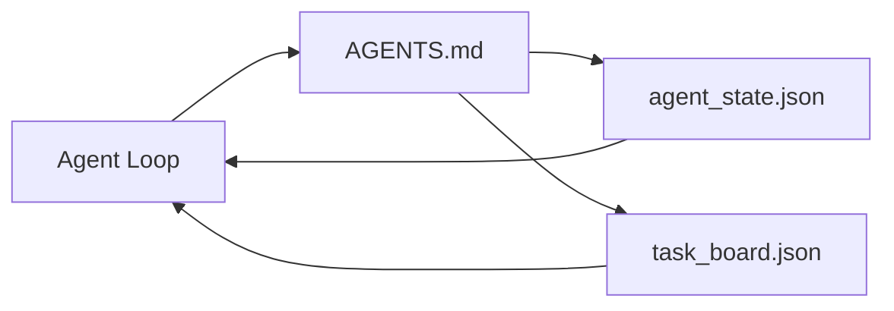

# کمترین کارگاه عامل

> کوچکترین کامپانی مفید سه فایل است: یک روتر دستورالعمل ریشه، یک فایل حالت و یک صفحه کار. همه چیز دیگر در بالای لایه قرار دارد. اگر یک repo نمی تواند این سه را حمل کند، هیچ مدل آن را ذخیره نمی کند.

**Type:** Build
**Languages:** Python (stdlib)
**Prerequisites:** Phase 14 · 31 (Why Capable Models Still Fail)
**Time:** ~45 minutes

## اهداف یادگیری

- سه فایل که حداقل میز کاری قابل اجرا را تشکیل می دهند را تعریف کنید.
- توضیح بده چرا روتر روت کوتاه روتر بلند روتر مونوالیتی روتر می کنه`AGENTS.md`. .
- يه پرونده اي بساز که مامور ميتونه در هر نوبت بخونه و در آخرش بنويسه
- یک صفحه کار بسازید که بدون سابقه چت از کار چند جلسه زنده بماند.

## مشکل

بیشتر تیم ها با نوشتن خط 3000 به سمت یک میز کار می رسند `AGENTS.md`مدل آن را بار می زند، بخش هایی را که نمی تواند خلاصه کند نادیده می گیرد و هنوز هم در همان سطوح شکست می گیرد که همیشه شکست خورده است.

شما به برعکس نیاز دارید. یک فایل کوچک ریشه ای که عامل را به فایل های عمیق تر هدایت می کند فقط زمانی که مربوط باشد. حالت پایدار که عامل قبل از عمل می خواند و بعد از آن می نویسد. یک صفحه کار که می گوید چه چیزی در پرواز است، چه چیزی مسدود شده است و چه چیزی بعد از آن است.

سه پرونده، هرکدوم با یک کار، هرکدوم به اندازه کافی قابل خواندن ماشین برای تکامل به یک سیستم واقعی در آینده.

## مفهوم



### AGENTS.md روتر است نه راهنما

خوبي`AGENTS.md`کوتاه است. اين به مامور اشاره ميکنه:

- پرونده اي که در آن هستي
- هیئت مدیره (چه باقی مانده)
- قوانین عمیق تر (در زیر)`docs/agent-rules.md`)
- دستور تایید (چگونه می توان آن را دانست که کار می کند)

هر چیزی که طولانی تر باشد در اسناد عمیق تر می رود، فقط زمانی که لازم باشد بارگذاری می شود. دستورالعمل های طولانی نادیده گرفته می شوند. روتر های کوتاه دنبال می شوند.

### agent_state.json سیستم ثبت

حالت حمل: کار فعال ID، فایل های لمس شده، فرضیه های ساخته شده، مسدود کننده ها و عمل بعدی. آژانس آن را در هر نوبت می خواند. جلسه بعدی آن را به جای بازی مجدد چت می خواند.

دولت در پرونده اي زندگي ميکنه چون تاريخ چت قابل اعتماد نيست جلسات مي ميرن مکالمه ها کوتاه مي شوند پرونده ها نمي ميرن

### task_board.json صف است

هیئت مدیره هر کار رو با وضعیت انجام میده`todo | in_progress | done | blocked`این صف است که مامور از آن می کشد وقتی که حالت خالی است و صف است که شما می خوانید وقتی می خواهید بدانید که آیا مامور در مسیر است.

یک کار روی هیئت مدیره یک شناسه، یک هدف، یک مالک دارد (`builder`،`reviewer`، یا`human`در واقع، وقتی که از یک صفحه عبور می کند، شما یک مشکل برنامه ریزی دارید، نه یک مشکل صفحه.

### سه پرونده کف است نه سقف

در درس های بعد قراردادهای دامنه، بازخورد رانر، دروازه های تأیید، چک لیست بازرس و بسته های تحویل اضافه می شود. سه فایل در اینجا آنچه که همه آنها فرض می کنند.

```figure
wb-three-files
```

## آن را بسازید

`code/main.py`حداقل میز کار را به یک repo خالی می نویسد و نشان می دهد یک عامل واحد می تواند:

1. میخواد`agent_state.json`. .
2. کار بعدی رو از `task_board.json`اگه دولت خالی باشه
3. فقط به یک فایل در محدوده دسترسی می رسد.
4. حالت تازه اش رو باز ميکنه

اجرا کن

```
python3 code/main.py
```

اسکریپت ایجاد می کنه`workdir/`در کنار خودش، سه فایل را می گذارد، یک نوبت را اجرا می کند و تفاوت را چاپ می کند. دوباره آن را اجرا می کند تا ببینید که نوبت دوم چگونه از جایی که نوبت اول متوقف شده است ادامه می یابد.

## ازش استفاده کن

در داخل محصولات عامل تولید، سه فایل مشابه با نام های مختلف ظاهر می شوند:

- **Claude Code:** `AGENTS.md`یا`CLAUDE.md`برای روتر،`.claude/state.json`-مکان هاي سبک براي دولت، هک ها براي بورد
- **Codex / Cursor:**قوانین فضای کاری برای روتر، حافظه جلسه برای حالت، وظایف صف در لبه ی طرفی چت برای صفحه نمایش.
- **Custom Python agent:**همون پرونده هایی که الان نوشتی

نام ها عوض میشن شکلش عوض نمیشه

## الگوهای تولید در طبیعت

حداقل میز کاری در تماس با یک واحد اصلی زنده می ماند وقتی سه الگوی بر روی آن قرار گرفته است. آنها مستقل هستند؛ آنهایی را که repo شما واقعا نیاز دارد انتخاب کنید.

**Nested `AGENTS.md` with nearest-wins precedence.**کشتی های OpenAI 88 `AGENTS.md`فایل های اصلی در ریپو، یکی از هر زیرنویس. کدکس، کورسور، کلوید کد و Copilot همه از فایل کار به سمت ریپو ریشه و همبستگی هر`AGENTS.md`اونها در راه مي گيرند.فايل هاي فرعي فهرست، فايل روت رو گسترش ميده.`AGENTS.override.md`برای جایگزینی به جای گسترش، مکانیسم تخلف خاص کدکس است و برای کار در میان ابزارها از آن اجتناب می شود. اندازه گیری کد افزوده خط مهم است: بهترین `AGENTS.md`فایل ها به کیفیت بالا می روند که به ارتقا از هیکو به اپوس معادل است؛ بدترین فایل ها از هیچ فایل بدتر هستند.

**Anti-patterns to refuse, even when they look like coverage.**دستورالعمل های متناقض به طور خاموش، عامل را از حالت تعاملی به حالت طمع (ICLR 2026 AMBIG-SWE: 48.8% → 28% میزان حل) رها می کند؛ اولویت های شماره گذاری را به جای جمع کردن آنها مسطح کنید. قوانین سبک غیر قابل تأیید ("پیروشی از راهنمای سبک گوگل پایتون") بدون هیچ دستور اجرای اجازه دهید نماینده ایجاد موافقت؛ هر قانون سبک را با دستور lint دقیق جفت کنید. هدایت با سبک به جای دستورات مسیر تأیید را دفن می کند؛ دستورات اول، سبک آخر. نوشتن برای انسان ها به جای عوامل بودجه زمینه ای را تلف می کند؛ کوتاه بودن یک ویژگی است.

**Cross-tool symlinks.**یک فایل ریشه ی واحد با لینک های متمایز (`ln -s AGENTS.md CLAUDE.md`،`ln -s AGENTS.md .github/copilot-instructions.md`،`ln -s AGENTS.md .cursorrules`) هر عامل کدگذاری رو در منبع درستي اي نگه مي داره`nx ai-setup`این کار را در کلود کد، کورسور، کوپایلوت، جمینی، کودکس و اوپن کود از یک پیکربندی خودکار می کند.

## -باده

`outputs/skill-minimal-workbench.md`تولید می کند که ۳ فایل کامپانی برای هر repo جدید:`AGENTS.md`روتر به پروژه متصل شده`agent_state.json`با کلید های درست و یک`task_board.json`با پس انداز فعلی.

## تمرینات

1. اضافه کنید`last_run`تا زمان`agent_state.json`.در صورت که فایل بیش از 24 ساعت باشد، اجرا را رد کنید مگر اینکه یک اپراتور تایید کند.
2. اضافه کنید`priority`به صفحه ی کار و تغییر کشش را برای همیشه اولویت بالا انتخاب کنید `todo`. .
3. مهاجرت کن`task_board.json`به خطوط JSON پس هر کار یک خط است و تفاوت ها در کنترل نسخه پاک هستند.
4. يه حرف بنويس`lint_workbench.py`که شکست می خورد اگه`AGENTS.md`بیش از 80 خط یا اشاره به یک فایل وجود ندارد.
5. تصميم بگير که از سه پرونده کي بيشتر درد ميکنه که از دست بده

## اصطلاحات کلیدی

| Term | What people say | What it actually means |
|------|----------------|------------------------|
| Router | `AGENTS.md` | Short root file that points the agent at deeper docs and files |
| State file | "The notes" | Machine-readable record of where the agent is, written every turn |
| Task board | "The backlog" | JSON queue of work with status, owner, acceptance |
| System of record | "Source of truth" | The file the workbench treats as authoritative when chat is gone |

## خواندن بیشتر

- [agents.md — the open spec](https://agents.md/) توسط Cursor، Codex، Claude Code، Copilot، Gemini، OpenCode پذیرفته شده
- [Augment Code, A good AGENTS.md is a model upgrade. A bad one is worse than no docs at all](https://www.augmentcode.com/blog/how-to-write-good-agents-dot-md-files) قفسه های کیفیت اندازه گیری شده
- [Blake Crosley, AGENTS.md Patterns: What Actually Changes Agent Behavior](https://blakecrosley.com/blog/agents-md-patterns) چه چیزی به طور تجربی کار می کند، چه چیزی کار نمی کند
- [Datadog Frontend, Steering AI Agents in Monorepos with AGENTS.md](https://dev.to/datadog-frontend-dev/steering-ai-agents-in-monorepos-with-agentsmd-13g0) اولویت های موجود در عمل
- [Nx Blog, Teach Your AI Agent How to Work in a Monorepo](https://nx.dev/blog/nx-ai-agent-skills) تولید یک منبع در شش ابزار
- [The Prompt Shelf, AGENTS.md Best Practices: Structure, Scope, and Real Examples](https://thepromptshelf.dev/blog/agents-md-best-practices/) بخش سفارش که از بررسی زنده مانده
- [Anthropic, Claude Code subagents](https://code.claude.com/docs/en/sub-agents)
- مرحله 14 · 31  حالت شکست این حداقل جذب می کند
- مرحله 14 · 34  طرح حالت پایدار این درس پیش نمایش
