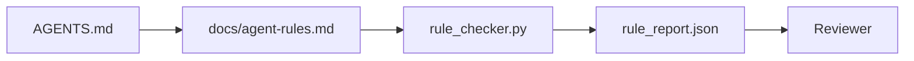

# دستورالعمل های عامل به عنوان محدودیت های قابل اجرا

> دستورالعمل هایی که به صورت پروزه نوشته می شوند آرزوها هستند. دستورالعمل هایی که به صورت محدودیت نوشته می شوند آزمایشات هستند. میز کار هر قاعده را به چیزی تبدیل می کند که یک عامل می تواند در زمان اجرا بررسی کند و یک بازرس می تواند پس از واقعیت آن را تأیید کند.

**Type:** Build
**Languages:** Python (stdlib)
**Prerequisites:** Phase 14 · 32 (Minimal Workbench)
**Time:** ~50 minutes

## اهداف یادگیری

- -از قواعد عملیاتی متن رویتینگ را جدا کنید
- قوانین راه اندازی، اقدامات ممنوع، تعریف انجام شده، مدیریت عدم اطمینان و محدودیت های تأیید به عنوان محدودیت های قابل چک ماشین.
- یک چکگر قوانین را اجرا کنید که یک رند را با مجموعه قوانین انجام دهد.
- قانون را با تفاوت سازگار کنید تا بررسی بتواند ببیند که چه چیزی تغییر کرده است.

## مشکل

یک نمونه ی معمول`AGENTS.md`این به مامور میگه "به دقت" و "به دقت امتحان کن" و "اگر مطمئن نباشین بپرسید". سه روز بعد، مامور بدون آزمایش، یک تغییر ارسال می کند، به یک دایرکتوری ممنوع می نویسد و هرگز نمی پرسد چون هرگز نمی دانست خط کجاست.

دستورالعمل ها وقتی عملی هستند قوی هستند و وقتی آرزوی دارند ضعیف هستند. راه حل این است که قوانین را بنویسید که میز کار می تواند تفسیر کند و بازرس می تواند امتیاز دهد.

## مفهوم

قوانین مربوط به`docs/agent-rules.md`هر قانون يه اسم، يه دسته و يه چک داره



### پنج دسته که بیشتر قوانین را پوشش می دهند

| Category | Question the rule answers | Example |
|----------|---------------------------|---------|
| Startup | What must be true before work begins? | "state file exists and is fresh" |
| Forbidden | What must never happen? | "do not edit `scripts/release.sh`" |
| Definition of done | What proves the task is complete? | "pytest exits 0 and acceptance line passes" |
| Uncertainty | What does the agent do when unsure? | "open a question note instead of guessing" |
| Approval | What requires human approval? | "any new dependency, any prod write" |

یک قانون که با یکی از این پنج قانون مطابقت ندارد معمولاً دو قانون می خواهد.

### قوانین قابل خواندن ماشین هستند

هر قانون يه گلوله، يه دسته، يک خط توصيف و يه`check`فیلدی که نام یک تابع را در `rule_checker.py`اضافه کردن یک قانون به معنای اضافه کردن یک چک است. چکگر با میز کار رشد می کند.

### قوانین متفاوت هستند

قوانین یک در هر عنوان در یک فایل نشان داده می شود. نام های جدید در تفاوت ها قابل مشاهده هستند. قوانین جدید در بالای دسته خود قرار دارند. قوانین قدیمی حذف می شوند، نه اظهار نظر می شوند، زیرا میز کار منبع حقیقت است، نه دفترچه چت چگونه تیم در سه ماهه گذشته احساس کرد.

### قوانین در مقابل محافظ های چارچوب

محافظ های فریم ورک (OpenAI Agents SDK guardrails، LangGraph interrupts) قوانین را در سطح زمان اجرا اجرا می کنند. قانون تعیین شده در این درس قرارداد قابل خواندن و قابل بررسی است که این محافظها اجرا می کنند. شما هر دو را نیاز دارید: زمان اجرا نقض را در طول یک نوبت می گیرد، تنظیم قوانین ثابت می کند که زمان اجرا کار درست را انجام می دهد.

### افشا کردن به تدریج: نقشه، نه یک انسائیکلوپیدی

دلیلش`AGENTS.md`هر حادثه یک قانون اضافه می کند و هیچ حادثه یک را حذف نمی کند. یک سال بعد، فایل دو هزار خط است، و نماینده صفحه اول را می خواند، بودجه توجه را از دست می دهد و بر اساس بخش کوچکی از آنچه گفته شده عمل می کند. یک فایل دستورالعمل عظیم به همان دلیل که یک مستند ۴۰ صفحه ای شکست می خورد شکست می خورد: خواننده آن را یک بار بررسی می کند و هرگز به بخش مهم بر نمی گردد.

راه حل یک فایل کوتاه تر نیست. یک فایل لایه ای است. روتر ریشه به اندازه کافی کوچک است تا هر جلسه را بخواند و جز اشاره ها را نگه نمی دارد. عمق در فایل های موضوعی زندگی می کند که عامل فقط زمانی بارگذاری می کند که وظیفه آنها را لمس کند. به عامل یک نقشه ، نه کل انسیکلوپیڈیا را بدهید و اجازه دهید تا به صفحه ای که نیاز دارد برود.

```
AGENTS.md                  # router, < 50 lines: what this repo is, where to look, the 5 hard rules
docs/
  agent-rules.md           # the full rule set (this lesson)
  architecture.md          # loaded when the task touches module boundaries
  testing.md               # loaded when the task writes or runs tests
  deploy.md                # loaded only for release work, gated behind an approval rule
feature_list.json          # the backlog (Phase 14 · 36)
```

| Tier | Lives in | Read when | Size budget |
|------|----------|-----------|-------------|
| Router | `AGENTS.md` | Every session, always | Under ~50 lines |
| Rules | `docs/agent-rules.md` | Every session, on startup | One screen per category |
| Topic docs | `docs/<topic>.md` | Only when the task touches that topic | As deep as needed |

دو تست باعث می شه لایه ها صادقانه باشند. آزمون دسترسی: یک عامل باید هر قاعده را در حداکثر دو پرتاب از روتر به دست آورد، بنابراین روتر باید هر موضوع را با مسیر پیوند دهد، نه آن را به صورت نثر توصیف کند. آزمون تازه بودن: روتر به اندازه کافی کوتاه است که یک بازرس آن را در هر PR دوباره بخواند، که تنها چیزی است که مانع از رشد آن به طور ساکت به انسائیکلوپیڈیا است که جایگزین آن شد. یک اشاره ای که دیگر حل نمی شود، یک شکست بدتر از یک قانون گم شده است، بنابراین یک پیوند شکسته در روتر خود یک نقض شروع چک است.

```figure
wb-rule-checkoff
```

## آن را بسازید

`code/main.py`کشتی ها:

- `agent-rules.md`پارسر که قوانین را به یک کلاس داده ها بار می کند.
- `rule_checker.py`عملکردهای چک کننده سبک، یک تا `check`مرجع
- يه مامور آزمايشي که دو قانون رو نقض ميکنه و يه چک پاس که اونا رو ميگيره

اجرا کن

```
python3 code/main.py
```

خروجی: مجموعه ای از قوانین تجزیه شده، ردیابی اجرا، عبور/فشل در هر قانون و یک `rule_report.json`در کنار اسکریپت ذخیره شده

## الگوهای تولید در طبیعت

سه الگوی یک مجموعه قوانینی را که یک چهارم دوام دارد از یک که در یک هفته تجزیه می شود جدا می کند.

**Severity tagging at write time.**هر قانوني که هست`severity`.`block`،`warn`، یا`info`. چکگر همه سه تا رو گزارش ميده . زمان اجرا فقط رد ميشه`block`اکثر تیم ها شدت را زود بالا می برند و سپس به تدریج تحت فشار مهلت آن را ضعیف می کنند؛ برچسب گذاری در زمان نوشتن کالیبراسیون را در جلو می کند.`block`قانون به یک`overrides.jsonl`دفترچه حسابرسی

**Rule expiry as a forcing function.**هر قانون يه قانون داره`expires_at`تاریخ (پیش فرض 90 روز از زمان نوشتن) چکگر هشدار می دهد وقتی یک قانون غیرفعال برای 60 روز متوالی نقض صفر داشته باشد. بررسی سه ماهه بعدی یا حفظ آن را توجیه می کند، یا آن را به طور ضعیف به `info`داده های بررسی کد تولید AI Cloudflare (اپریل 2026, 131,246 بررسی در 5169 repos در 30 روز) نشان داد که مجموعه های قاعده با انقضاء صریح تحت 30 قاعده در هر repo باقی ماند؛ مجموعه های بدون افزایش به 80 + با اکثر هرگز شلیک.

**Markdown-as-source, JSON-as-cache.** `agent-rules.md`پرونده ی نویسنده است. `agent-rules.lock.json`این یک کش است که چکگر در مسیر داغ می خواند. قفل با یک قوس قبل از انجام مجدد می شود. تفاوت های مارکدوین قابل بررسی هستند. تجزیه و تحلیل JSON در هر نوبت باقی می ماند. شکل مشابه با`package.json`-`package-lock.json`و`Cargo.toml`-`Cargo.lock`. .

## ازش استفاده کن

در تولید:

- کلوید کد، کودکس، کورسور قوانین را در آغاز جلسه می خوانند و وقتی اقداماتی را رد می کنند، آنها را نقل می کنند. چکگر آنها را دوباره در CI اجرا می کند تا حرکت خاموش را بگیرد.
- محافظ های SDK OpenAI Agents همان چک ها را با محافظ های ورودی و خروجی ثبت می کنند. نشان داده سطح اسناد است؛ SDK سطح زمان اجرا است.
- لینگ گراف وقتی یک گره در پرواز یک قانون را نقض می کند آتش را قطع می کند. دستیار قطع کردن قانون را می خواند، از انسان می پرسد و ادامه می دهد.

مجموعه قوانین در هر سه مورد قابل حمل است زیرا فقط نشان دادن و نام عملکرد است.

## -باده

`outputs/skill-rule-set-builder.md`مصاحبه با یک صاحب پروژه، دستورالعمل های موجود آنها را به پنج دسته طبقه بندی می کند و یک نسخه نسخه ای را منتشر می کند `agent-rules.md`و يه چکر استوب

## تمرینات

1. اگر محصول شما واقعا به آن نیاز دارد، یک دسته ششم اضافه کنید.
2. این چک را گسترش دهید تا یک قانون دارای شدت باشد (`block`،`warn`،`info`) و گزارش به طور مربوطه جمع آوری می شود.
3. کنترل کننده را به CI متصل کنید: اگر قاعده سختی بلاک در آخرین اجرا عامل شکست خورده باشد، ساخت شکست خورده است.
4. پس از 90 روز بدون شکست چک، قانون برای بررسی است.
5. يه زن واقعي پيدا کن`AGENTS.md`و آن را به عنوان پنج دسته قواعد دوباره بنویسید. چند خط آن عملیاتی بود؟ چند خط آن آرزوی بود؟

## اصطلاحات کلیدی

| Term | What people say | What it actually means |
|------|----------------|------------------------|
| Operational rule | "A real instruction" | A rule the workbench can check at runtime |
| Aspirational rule | "Be careful" | A rule with no check; either delete or upgrade |
| Definition of done | "Acceptance" | An objective, file-backed proof the task is complete |
| Block severity | "Hard rule" | Violation halts the run; cannot be silenced without an operator |
| Rule expiry | "Stale rule sweep" | A rule with no fails in N days is up for retirement |

## خواندن بیشتر

- [OpenAI Agents SDK guardrails](https://openai.github.io/openai-agents-python/guardrails/)
- [LangGraph interrupts](https://langchain-ai.github.io/langgraph/how-tos/human_in_the_loop/breakpoints/)
- [Anthropic, Building Effective Agents](https://www.anthropic.com/research/building-effective-agents)
- [Rick Hightower, Agent RuleZ: A Deterministic Policy Engine](https://medium.com/@richardhightower/agent-rulez-a-deterministic-policy-engine-for-ai-coding-agents-9489e0561edf) شدت بلاک/تنبیه/ اطلاعات در تولید
- [Cloudflare, Orchestrating AI Code Review at Scale](https://blog.cloudflare.com/ai-code-review/) 131 هزار بار بازبینی، درس ترکیب قوانین
- [microservices.io, GenAI development platform — part 1: guardrails](https://microservices.io/post/architecture/2026/03/09/genai-development-platform-part-1-development-guardrails.html) دفاع عمیق بین قوانین و CI
- [Type-Checked Compliance: Deterministic Guardrails (arXiv 2604.01483)](https://arxiv.org/pdf/2604.01483) Lean 4 به عنوان مرز بالای قوانین چک
- [logi-cmd/agent-guardrails](https://github.com/logi-cmd/agent-guardrails) اجرای دروازه ادغام: دامنه، آزمایش جهش، بودجه نقض
- مرحله 14 · 32  حداقل سطح کار این قانون
- مرحله 14 · 38  دروازه تایید که گزارش قاعده را مصرف می کند
- مرحله 14 · 39  نماینده بازرس که رعایت قوانین را ارزیابی می کند
