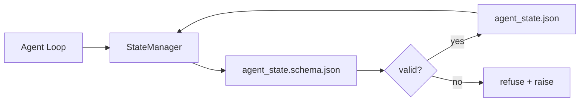

# حافظه ریپو و وضعیت پایدار

> تاریخچه چت متغیر است. ریپو پایدار است. بانک کار در فایل های نسخه ای ذخیره می کند بنابراین جلسه بعدی، نماینده بعدی و بازرس بعدی همه از همان منبع حقیقت می خوانند.

**Type:** Build
**Languages:** Python (stdlib + `jsonschema` optional)
**Prerequisites:** Phase 14 · 32 (Minimal Workbench)
**Time:** ~60 minutes

## اهداف یادگیری

- تعریف کنید که چه چیزی در حافظه repo و چه چیزی در تاریخچه چت است.
- Author JSON Schemas برای `agent_state.json`و`task_board.json`. .
- يه مدير دولت بسازيد که به صورت اتوميک دولت رو بار بزنه، تصديق کنه، جهش کنه و ادامه بده
- از طرح استفاده کنید تا قبل از اینکه روی میز کار خراب شود، نوشته های بد را رد کنید.

## مشکل

این عامل یک جلسه را تمام می کند. چت بسته می شود. جلسه بعدی باز می شود و می پرسد که از کجا شروع کنیم. مدل می گوید "به من اجازه دهید پرونده ها را بررسی کنم"، یادداشت های قدیمی را می خواند و کار را که قبلاً تکمیل شده بود دوباره انجام می دهد. یا بدتر، یک فایل کامل را دوباره می نویسد زیرا هیچ کس به او نگفت که فایل تمام شده است.

تنظیمات کامپیوتری حافظه repo است: حالت در فایل های JSON در repo زندگی می کند، تحت یک طرح نوشته شده، به طور اتمی ادامه می یابد، در بررسی کد دوستانه است. چت یک فید موقت است؛ repo سیستم ثبت است.

## مفهوم



### چه چیزی در حافظه repo قرار دارد

| Belongs | Does not belong |
|---------|-----------------|
| Active task id | Raw chat transcripts |
| Touched files this session | Token-level reasoning traces |
| Assumptions the agent made | "The user seemed frustrated" |
| Open blockers | Sampled completions |
| Next action | Vendor-specific model ids |

تست دوام است: آیا این در سه ماه آینده در یک تکرار CI مفید خواهد بود؟ اگر بله، ریپو. اگر نه، تلومیتری.

### حالت اول طرح

JSON Schema قرارداد است. بدون آن، هر عامل زمینه های جدید را اختراع می کند، هر بازرس شکل جدیدی را یاد می گیرد و هر اسکریپت CI باید به نسخه های گذشته مورد ویژه ای باشد. با آن، نوشتن بد، نوشتن رد شده است.

این طرح شامل:

- کليد لازم
- اجازه داده شده`status`ارزش ها
- ارزش های ممنوع (مثلاً `null`برای آرایه ها
- محدودیت های الگوی (توابع هویت کار)`T-\d{3,}`)
- فیلدی نسخه برای مهاجرت

### آتميك نوشته

نوشته های دولت نیاز به زنده ماندن از شکست های جزئی: نوشتن به یک فایل موقت، fsync، تغییر نام بر روی هدف. فایل دولت منبع حقیقت است؛ یک نیمه نوشته بدتر از هیچ فایل است.

### مهاجرت

وقتی که شیما تغییر می کند، یک اسکریپت مهاجرت را به کنار شقای شیما ارسال کنید. فایل حالت دارای یک `schema_version`فیلدی که مدیر از بارگذاری یک فایل از یک نسخه که نمی تواند مهاجرت کند، انکار می کند.

```figure
wb-state-persist
```

## آن را بسازید

`code/main.py`ابزار:

- `agent_state.schema.json`و`task_board.schema.json`. .
- یک اعتبار دهنده فقط stdlib (تکلیف از طرح JSON: مورد نیاز، نوع، enum، الگوی، عناصر).
- `StateManager.load`،`StateManager.update`،`StateManager.commit`با نام اتوماتیک و نام نويسنده
- يه دمو که حالت رو عوض ميکنه، ادامه ميده، بارش رو دوباره بار ميکنه و ثابت ميکنه که سفر برگشت و برگشت

اجرا کن

```
python3 code/main.py
```

اسکریپتون میگه`workdir/agent_state.json`و`workdir/task_board.json`، آنها را در دو نوبت تغییر می دهد و حالت تایید شده را در هر مرحله چاپ می کند.

## الگوهای تولید در طبیعت

چهار الگوي حداقل درس رو به چيزي تبديل ميکنه که يه واحد چند عامل ميتونه زنده بمونه

**Atomic temp-and-rename is not optional.**گزارش خطای پروژه Hive در ماه مارس 2026 حالت شکست را به صورت تمیز مستند می کند: `state.json`از طریق`write_text()`و استثنايي هم دستگير شده و خاموش شده است. جزئي نوشته است جلسات چپ ادامه به ضد دولت فاسد بدون هیچ سیگنال.`tempfile.mkstemp`در همان دایرکتوری که هدف است، بنویسید:`fsync`،`os.replace`(تغيير نام اتم در POSIX و Windows)`atomic_write`دقیقاً همین کار رو می کنه.

**Idempotency keys on every non-idempotent tool call.**اگر یک عامل پس از تماس با یک ابزار، اما قبل از چک پوائنت نتیجه، بازیابی دوباره تماس ابزار را امتحان می کند. امن برای خواندن؛ خطرناک برای ایمیل ها، ورودی DB، بارگذاری فایل. الگوی: ثبت هر ابزار تماس ID قبل از اجرای به یک `pending_calls.jsonl`در زمان تکرار، چک برای شناسه را بررسی کنید؛ اگر موجود باشد، تماس را رد کنید و از نتیجه ذخیره شده استفاده کنید. هر دو Anthropic و LangChain این را در راهنمای 2026 اعلام می کنند؛ چک پوائنتر LangGraph همچنان در انتظار نوشته ها به همین دلیل است.

**Separate large artifacts from state.**CSV ها، نقل نامه های طولانی و یا فایل های تولید شده را در آن ذخیره نکنید`agent_state.json`. آثار آثار را به عنوان یک فایل جداگانه ذخیره کنید (یا به ذخیره سازی اشیاء اپلود کنید) و فقط مسیر را در حالت نگه دارید. نقاط بازرسی کوچک و سریع باقی می مانند؛ آثار آثار به طور مستقل رشد می کنند.

**Event sourcing for audit, snapshots for resume.**به یک دفترچه رویداد اضافه کنید (`state.events.jsonl`) در هر جهش، به طور دوره ای به `state.json`. ادامه نامه عکس را می خواند، سپس هر رویداد بعد از زمان مهر عکس را تکرار می کند. این هزینه دیسک بیشتری دارد اما به شما اجازه می دهد تصمیمات عامل را به معنای واقعی کلمه تکرار کنید.

**Schema migrations or refuse to load.**.`schema_version`عدد کامل قرارداد است. وقتی مدیر یک فایل را با نسخه ناشناخته بارگذاری می کند، خواندن را رد می کند. یک اسکریپت مهاجرت را در کنار شکیم هوم ارسال کنید. `tools/migrate_state.py`در هر راه اندازی، بی اختیار اجرا می شود.

## ازش استفاده کن

در تولید:

- **LangGraph checkpointers.**همان ایده، ذخیره سازی متفاوت. چک پوائنتر حالت گرافیک را به SQLite، Postgres، یا یک پس زمینه سفارشی حفظ می کند. طرحی که این درس می آموزد، زمانی است که چک پوائنتر می میراند و شما نیاز به خواندن حالت به دست دارید.
- **Letta memory blocks.**بلوک های مداوم با طرح های ساختاری (فاز 14 · 08).
- **OpenAI Agents SDK session store.**پس زمینه های قابل وصل، آگاه از طرح، فایل دولت در این درس پس زمینه فایل محلی است.

## -باده

`outputs/skill-state-schema.md`یک جفت طرح JSON مخصوص پروژه (حالت + صفحه) ، یک پایتون را تولید می کند `StateManager`به نوشته های اتمیک متصل شده و یک استقرار مهاجرت به طوری که ضربه بعدی طرح نمی شکند که میز کار.

## تمرینات

1. اضافه کنید`last_human_touch`.مطبع زمان .هر کارگزاري که در پنج ثانيه بعد از تصويب انساني نوشته بشه ردش کنه
2. اعتبار دهنده را به حمایت گسترش دهید `oneOf`بنابراین یک کار می تواند یک کار ساخت یا یک کار بازبینی با زمینه های مختلف مورد نیاز باشد.
3. اضافه کنید`schema_version`در این زمینه و نوشتن مهاجرت از v1 به v2 (تغییر نام `blockers`به`risks`)
4. پس زمینه ذخیره سازی را از یک فایل محلی به SQLite منتقل کنید. `StateManager`API همديگه
5. دوتا مامور رو با يک پرونده اي که 50 ميليون ميليون ميليون ميليون ميليون ميليون ميليون ميليون ميليون ميليون ميليون ميليون ميليون ميليون ميليون ميليون ميليون ميليون ميليون ميليون ميليون ميليون ميليون ميليون ميليون ميليون ميليون ميليون ميليون ميليون ميليون ميليون ميليون ميليون ميليون ميليون ميليون ميليون ميليون ميليون ميليون ميليون ميليون ميليون ميليون ميليون ميليون ميليون ميليون ميليون ميليون ميليون ميليون ميليون ميليون ميليون ميليون ميليون ميليون ميليون ميليون ميليون ميليون ميليون ميليون ميليون ميليون ميليون ميليون ميليون ميليون ميليون ميليون ميليون ميليون ميليون ميليون ميليون ميليون ميليون ميليون ميليون ميليون

## اصطلاحات کلیدی

| Term | What people say | What it actually means |
|------|----------------|------------------------|
| Repo memory | "Notes file" | State stored in tracked files in the repo, under schema |
| Schema-first | "Validate inputs" | Define the contract before the writer, refuse drift |
| Atomic write | "Just rename" | Write to temp, fsync, rename, so partial failures cannot corrupt |
| Migration | "Schema bump" | A script that turns vN state into v(N+1) state |
| System of record | "Source of truth" | The artifact the workbench treats as authoritative |

## خواندن بیشتر

- [JSON Schema specification](https://json-schema.org/specification.html)
- [LangGraph checkpointers](https://langchain-ai.github.io/langgraph/concepts/persistence/)
- [Letta memory blocks](https://docs.letta.com/v1-sdk/memory/memory-blocks)
- [Fast.io, AI Agent State Checkpointing: A Practical Guide](https://fast.io/resources/ai-agent-state-checkpointing/) اولین چکپوینت با امتیاز
- [Fast.io, AI Agent Workflow State Persistence: Best Practices 2026](https://fast.io/resources/ai-agent-workflow-state-persistence/) کنترل همزمان، TTL، منابع رویداد
- [Hive Issue #6263 — non-atomic state.json writes silently ignored](https://github.com/aden-hive/hive/issues/6263) حالت شکست در یک پروژه واقعی
- [eunomia, Checkpoint/Restore Systems: Evolution, Techniques, Applications](https://eunomia.dev/blog/2025/05/11/checkpointrestore-systems-evolution-techniques-and-applications-in-ai-agents/) اولیه های CR از تاریخچه OS برای عوامل اعمال شده
- [Indium, 7 State Persistence Strategies for Long-Running AI Agents in 2026](https://www.indium.tech/blog/7-state-persistence-strategies-ai-agents-2026/)
- [Microsoft Agent Framework, Compaction](https://learn.microsoft.com/en-us/agent-framework/agents/conversations/compaction) مدیر نقطه بازرسی فروشنده
- مرحله 14 · 08  بلوک های حافظه و محاسبه زمان خواب
- مرحله 14 · 32  حداقل سه فایل این درس طرح
- مرحله 14 · 40  بسته های انتقال از همان طرح خوانده شده
