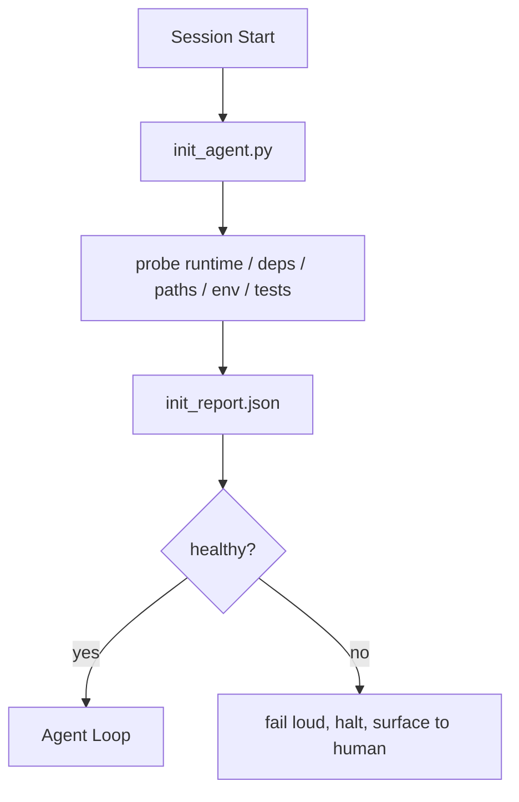

# اسکریپت های ابتدایی برای عوامل

> هر جلسه که سرد شروع بشه مالیات ميده، مامور پرونده هاي مشابه رو ميخواد، دوباره آزمايش هاي مشابه رو ميکنه و دوباره راه هاي مشابه رو پيدا ميکنه، يک اسکریپت init يک بار مالیات ميده و جواب ها رو به صورت ايالت مي نويسه

**Type:** Build
**Languages:** Python (stdlib)
**Prerequisites:** Phase 14 · 32 (Minimal Workbench), Phase 14 · 34 (Repo Memory)
**Time:** ~45 minutes

## اهداف یادگیری

- مشخص کنين چه کاري بايد يک مامور هرگز در هر جلسه انجام نده
- یک اسکریپت تعیین کننده ای ایجاد کنید که زمان اجرا، وابستگی ها و سلامت ریپو را بررسی کند.
- نتیجه ی تحقیقات رو ادامه بده تا مامور آن را بخونه بجای دوباره چک کردن
- وقتی شروع کار شکست می خورد، بلند و سریع و با یک مکان برای نگاه کردن شکست می خورد.

## مشکل

یک جلسه را باز کنید. آژانس نسخه پایتون را حدس می زند. دستور آزمون را حدس می زند. ریشه ریپو را پنج بار لیست می کند تا نقطه ورود را پیدا کند. سعی می کند یک بسته ای را وارد کند که نصب نشده است. از کاربر می پرسد که فایل پیکربندی کجا زندگی می کند. تا زمانی که ویرایش واقعی انجام می شود، ده هزار توکن به کار تنظیم رفته است که باید یک اسکریپت واحد باشد.

تصحيح يه اسكريت شروع كردن است كه قبل از اينکه مامور كار ديگه اي انجام بده اجرا ميشه و يه`init_report.json`مامور در شروع کار ميخواد

## مفهوم



### آنچه که اسکریپت init بررسی می کند

| Probe | Why it matters |
|-------|----------------|
| Runtime versions | Wrong Python or Node version means silent wrong-version bugs |
| Dependency availability | A missing package later costs ten times the cost of catching it now |
| Test command | The agent must know how to verify; if the command is missing the workbench is broken |
| Repo paths | Hard-coded paths drift; resolve them once and pin |
| Environment variables | Missing `OPENAI_API_KEY` is a failure surface, not a runtime mystery |
| State + board freshness | Stale state from a crashed session is a footgun |
| Last-known-good commit | Anchor for the handoff diff at the end of the session |

### شکست بلند، شکست سریع، شکست در یک مکان

يک شکست دربارگي به معني توقف و سطح به انسان. نه "آژانتو به اين مسئله رسيد".

### بی قدرت

دو بار متوالی اجرا کنید. دومین اجرا باید بدون عملیات باشد به جز یک تایم استیمپ جدید. بی وقت بودن چیزی است که به شما اجازه می دهد اسکریپت را به CI، هک، یا یک دستور پیش از کار به کار ببرید.

### قوانین ابتدایی در مقابل قوانین راه اندازی

قوانین (فاز 14 · 33) توصیف آنچه باید برای عمل درست باشد. این متن است که نشان می دهد که این قوانین می توانند بررسی شوند. قوانین بدون init تبدیل به "حذر باشید".

```figure
wb-init-probes
```

## آن را بسازید

`code/main.py`ابزارها`init_agent.py`:

- پنج مورد: نسخه پایتون، وابستگی های فهرست شده از طریق `importlib.util.find_spec`, کنترل کنترل تست , نیاز به محیط , تازه بودن پرونده
- هر بارگوشي برگرده`(name, status, detail)`. .
- اسکریپتون میگه`init_report.json`با مجموعه کامل ساند و خارج از صفر اگر هر ساند سختی بلاک شکست.

اجرا کن

```
python3 code/main.py
```

اسکریپتر میز سوندها رو چاپ میکنه، میگه`init_report.json`، و از صفر در مسیر خوشبختی خارج می شود یا بدون صفر با لیست از سوند های شکست خورده.

## الگوهای تولید در طبیعت

سه الگوی یک اسکریپت مفید را از یک مراسم جدا می کند.

**Last-known-good commit anchoring.**ثابت کردن تعهد فعلی در برابر یک`LKG`فایل نوشته شده در آخرین ادغام موفق. اگر تفاوت بیش از بودجه (فایل های پیش فرض 50) باشد، شروع را رد کنید و نیاز به یک انسان برای تأیید خط پایه جدید داشته باشید. این چیزی است که بررسی کد هوش مصنوعی Cloudflare برای بررسی عوامل بازبینی استفاده می کند: هر جلسه بازبینی در برابر همان آخرین خوب شناخته شده است و هرگز ترکیب ها در طول جلسات حرکت نمی کنند.

**Lock files with TTL.**يه حرف بنويس`prereqs.lock`پس از اولین عبور موفق از ساند. اجراهای بعدی به قفل برای N ساعت (24 ساعت پیش فرض) اعتماد می کنند و ساند های گران قیمت را رد می کنند. اسکریپت init قفل را اول می خواند؛ اگر تازه باشد و مانیست وابستگی هاش مطابقت داشته باشد، کوتاه می شود. این همان الگوی است که Docker برای کیش لایه ها استفاده می کند: ساند idempotent + محتوای هاش = skip.

**No network, no LLM, no surprises in the hot path.**یک سوند که به یک LLM برای طبقه بندی یک شکست یا که به یک سرویس خارجی برای بررسی مجوز می رسد، یک سوند نیست؛ این یک جریان کار است. اگر یک سوند بیش از سه ثانیه در یک اجرا خشک طول بکشد، آن را به عنوان یک بوی میز کار و یا آن را از init منتقل کنید یا نتیجه آن را ذخیره کنید.

## ازش استفاده کن

در تولید:

- **Claude Code hooks.** `pre-task`هوک اسکریپت init رو صدا ميکنه و اگه شکست خورد، از راه انداختن مامور رد ميشه
- **GitHub Actions.**A`setup-agent`کار اسکریپت init رو اجرا میکنه، کار مامور بستگی به اون داره
- **Docker entrypoint.**کانتینر عامل قبل از اجرای زمان اجرا، اسکریپت init را اجرا می کند؛ در صورت شکست، سطح را ثبت می کند.

اسکریپت init قابل حمل است زیرا هیچ تماس به یک چارچوب خاص انجام نمی دهد. Bash، Make یا یک فایل وظایف می توانند همه آن را بسته بندی کنند.

## -باده

`outputs/skill-init-script.md`مصاحبه پروژه را انجام می دهد، کار راه اندازی آن را به صوتی ها طبقه بندی می کند و یک گزارش خاص پروژه را منتشر می کند `init_agent.py`و همچنین یک جریان کار اطلاعات که قبل از هر قدم عامل اجرا می شود.

## تمرینات

1. یک سوند اضافه کنید که کمیت فعلی را با آخرین کمیت خوب شناخته شده متفاوت کند و اگر بیش از 50 فایل تغییر کند شروع نمی کند.
2. براي نوشتن متن رو به خط کن`prereqs.lock`پرونده و انکار شروع اگر قفل بیش از هفت روز است.
3. اضافه کنید`--fix`پرچم که به طور خودکار وابستگی های توسعه دهنده گمشده را نصب می کند اما هرگز بدون تایید وابستگی های زمان اجرا را تغییر نمی دهد.
4. از تابع هاي سخت کد شده به يه ثبت YAML منتقل کنيد.
5. هر سوند زمان بندی شده رو اضافه کنید. سوند که بیشتر از سه ثانیه طول می کشد بوی میز کار است.

## اصطلاحات کلیدی

| Term | What people say | What it actually means |
|------|----------------|------------------------|
| Probe | "A check" | A deterministic function returning `(name, status, detail)` |
| Init report | "Setup output" | JSON written next to state with the probe results |
| Idempotent | "Safe to re-run" | Two runs in a row produce identical reports modulo timestamp |
| Fail loud | "Don't swallow" | Halt and surface to the human; no silent fallback |
| Setup tax | "Bootstrap cost" | The tokens the agent spends per session rediscovering the obvious |

## خواندن بیشتر

- [Anthropic, Effective harnesses for long-running agents](https://www.anthropic.com/engineering/effective-harnesses-for-long-running-agents)
- [GitHub Actions, composite actions for setup](https://docs.github.com/en/actions/sharing-automations/creating-actions/creating-a-composite-action)
- [microservices.io, GenAI dev platform: guardrails](https://microservices.io/post/architecture/2026/03/09/genai-development-platform-part-1-development-guardrails.html) پیش از تعهد + بررسی های CI به عنوان init
- [Augment Code, How to Build Your AGENTS.md (2026)](https://www.augmentcode.com/guides/how-to-build-agents-md) انتظارات اولیه
- [Codex Blog, Codex CLI Context Compaction](https://codex.danielvaughan.com/2026/03/31/codex-cli-context-compaction-architecture/) شروع جلسه به عنوان شروع کمپیکشن
- مرحله 14 · 33  قانون مقرر شده در این اسکریپت امکان پذیر است
- مرحله 14 · 34  فایل دولت این سکریپ تخم
- مرحله 14 · 38  دروازه تایید متن init
- مرحله 14 · 40  انتقال که مصرف آخرین خبر خوب گزارش init
