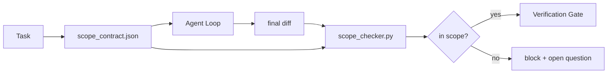

# محدوده ی قرارداد ها و محدودیت های وظایف

> مدل نمی داند که کار کجا پایان می یابد. قرارداد دامنه یک فایل در هر کار است که می گوید کار کجا شروع می شود، کجا پایان می یابد و چگونه به عقب برگردد اگر ریخته شود. قرارداد از یک خواسته به چک تبدیل می شود.

**Type:** Build
**Languages:** Python (stdlib)
**Prerequisites:** Phase 14 · 32 (Minimal Workbench), Phase 14 · 33 (Rules as Constraints)
**Time:** ~50 minutes

## اهداف یادگیری

- یک قرارداد دامنه را بنویسید که یک عامل در آغاز کار و یک تأیید کننده در پایان کار می خواند.
- فایل های مجاز، فایل های ممنوع، معیارهای پذیرش، برنامه برگشت و محدودیت های تأیید را مشخص کنید.
- یک چک کننده دامنه را اجرا کنید که تفاوت را با قرارداد مقایسه کند و نقض را نشان دهد.
- اجازه دهید که دامنه ی آن قابل مشاهده، خودکار و قابل بررسی باشد.

## مشکل

در این بخش، این تفاوت به مسیر ورود، دستیار ایمیل، راننده پایگاه داده، README و اسکریپت انتشار مربوط می شود. هر لمس یک دلیل قابل قبول در لحظه داشت. با هم آنها تغییر متفاوتی از آن است که مورد بررسی قرار گرفت.

Scope creep در کار مامور، زیر نظارت ترین حالت شکست است زیرا مامور هر مرحله را با ایمان خوب روایت می کند. اصلاح یک درخواست سختگیرانه تر نیست. اصلاح یک قرارداد در دیسک است که آنچه را که وعده داده شده است می گوید و چک است که نتیجه را با وعده مقایسه می کند.

## مفهوم



### چه چیزی در قرارداد دامنه وجود دارد

| Field | Purpose |
|-------|---------|
| `task_id` | Links to the task on the board |
| `goal` | One sentence the reviewer can verify |
| `allowed_files` | Globs the agent may write |
| `forbidden_files` | Globs the agent must not touch even by accident |
| `acceptance_criteria` | Test commands or assertion lines that prove done |
| `rollback_plan` | One paragraph the operator can execute if a halt is required |
| `approvals_required` | Actions outside scope that need explicit human sign-off |

قرارداد بدون`forbidden_files`.کامل نشده است. فضای منفی نصف قرارداد است

### گلوب ها، نه مسیرهای خام

فایل های واقعی را منتقل می کند.`app/**/*.py`،`tests/test_signup*.py`) بنابراین یک عامل بین جلسات قرارداد را باطل نمی کند.

### رول بیک بخشی از حوزه است

فهرست چگونگی برگشت قرارداد، نویسنده قرارداد را مجبور می کند که به فکر آنچه که ممکن است اشتباه شود کند.

### بررسی دامنه یک بررسی تفاوت است

عامل یک تفاوت می نویسد. چکگر تفاوت، گلوب های مجاز، گلوب های ممنوع و لیست هر دستور پذیرش اجرا شده را می خواند. هر نقض یک برچسب است که دروازه تأیید می تواند رد کند.

### دو ارتفاع دامنه: لیست ویژگی ها و قرارداد وظایف

قرارداد دامنه یک کار را محدود می کند. این پروژه را محدود نمی کند. یک نماینده می تواند کاملاً در یک قرارداد برای اصلاح ورود بماند و هنوز هم در نوبت بعدی تصمیم بگیرد که پروژه نیز نیاز به یک صفحه تنظیمات، یک تغییر حالت تاریک و یک نوسخه مجدد روتر دارد. قرارداد هرگز از آن پرسیده نشد که کدام کار در محدوده پروژه بود، فقط کدام فایل ها در محدوده وظیفه بودند.

اون ارتفاع دوم به يک ابتدایی خودش نياز داره:`feature_list.json`این یک فایل قابل خواندن و سفارش شده است. این یک ویژگی را انتخاب می کند که`status`.`todo`، نوشته شده است`id`"یک ویژگی در یک زمان" متوقف می شود که یک خط در پرامپت است که عامل می تواند منطقی گذشته و تبدیل به یک ارزش آن را می خواند از دیسک و یک چک دروازه اعمال می شود.

```json
{
  "project": "knowledge-base",
  "active": "import-pdf",
  "features": [
    { "id": "import-pdf",   "status": "in_progress", "goal": "import a PDF into the library",        "done_when": "pytest tests/test_import.py && a sample PDF appears in the library view" },
    { "id": "full-text-search", "status": "todo",     "goal": "search document text and rank hits",   "done_when": "query returns ranked results with snippets" },
    { "id": "cite-answers", "status": "todo",         "goal": "answers carry source citations",        "done_when": "every answer renders at least one clickable citation" }
  ]
}
```

| Field | Purpose |
|-------|---------|
| `active` | The single feature the current session may touch; empty means pick one and set it |
| `features[].id` | Stable slug the scope contract's `task_id` points at |
| `features[].status` | `todo`, `in_progress`, `done`, `blocked`; only one `in_progress` at a time |
| `features[].goal` | One sentence the reviewer can verify |
| `features[].done_when` | The acceptance line that flips `in_progress` to `done` |

دو قانون باعث می شود لیست تحمل بار به جای تزئینی شود. اول، نامتعدی "به حداکثر یک`in_progress`" خود یک بررسی راه اندازی است (فاز 14 · 33): اگر لیست دو را نشان دهد، جلسه شروع شدن را تا زمانی که یک انسان آن را حل کند انکار می کند. دوم، لیست ویژگی ها یک فایل است، نه یک پیام چت، زیرا چت از زمینه خارج می شود و فایل در طول جلسات و در میان عوامل باقی می ماند. انتقال (فاز 14 · 40) وضعیت ویژگی نهایی را به `done`بنابراین جلسه بعدی به یک صفحه دقیق باز می شود به جای باز کردن آنچه باقی مانده است.

قرارداد و لیست با کمترین امتیاز تشکیل می شوند، همان ادغام که در زیر توضیح داده شده است: قرارداد وظیفه `allowed_files`باید داخل هر چیزی که ویژگی فعال لمس می کند، قرار بگیرد، هرگز خارج از آن نباشد.

```figure
wb-scope-bounce
```

## آن را بسازید

`code/main.py`ابزار:

- `scope_contract.json`schema (تعداد فرعی از JSON Schema، glob arrays).
- یک پارسر متفاوت که یک لیست از فایل های لمس شده و همچنین یک لیست از دستورات اجرا را به یک `RunSummary`. .
- A`scope_check`که باز میاد`(violations, in_scope, off_scope)`خلاف قرارداد
- دو نمایش: یکی که در محدوده باقی می ماند، یکی که در حال ترسیدن است. چکگر با فایل و دلیل دقیق به این کس نشان می دهد.

اجرا کن

```
python3 code/main.py
```

نتیجه: قرارداد، دو رند، حکم هر رند و یک رزرو`scope_report.json`. .

## الگوهای تولید در طبیعت

یک تمرین کننده که "اسپکسماکسینگ" (عقود دامنه در YAML قبل از استفاده از عامل) را اجرا می کند گزارش می دهد که نرخ سوراخ خرگوش از 52٪ به 21٪ در سه هفته بدون تغییر عامل کاهش یافته است. قرارداد کار را انجام داد، نه مدل. سه الگوی باعث می شود که سود باقی بماند.

**Violation budgets, not binary failures.** `agent-guardrails`(گورت ادغام OSS مورد استفاده توسط کلوید کد، کورسور، وینسرف، کدکس از طریق MCP)`violationBudget`در هر وظیفه: خط های کوچک در بودجه به عنوان هشدار ظاهر می شوند؛ تنها زمانی که بودجه از آن فراتر رفته است، دروازه ادغام رد می شود.`violationSeverity: "error" | "warning"`بودجه تفاوت بين يه دروازه اي که مياد و يه دروازه اي که توسط تيمي که ازش متنفر بود تعطيل ميشه

**Severity asymmetry by path family.**خارج از محدوده نامه به`docs/**`معمولاً`warn`؛ خارج از محدوده نامه به `scripts/**`،`migrations/**`،`config/prod/**`همیشه`block`این عدم همتایی باید در قرارداد زندگی کند نه در زمان اجرا، زیرا برای پروژه خاص است و در هر کار تغییر می کند.

**Time and network budgets next to file budgets.**A`time_budget_minutes`میدان محدوده ساعت دیواری است؛ زمان اجرا از عبور از آن بدون تایید مجدد انکار می کند.`network_egress`Allowlist در نام های میزبان مانع از اینکه عامل به طور آرام به API خارجی که بخشی از کار نبود ضربه بزند. این ابعاد دامنه نیز هستند؛ گلوب های فایل ضروری هستند، کافی نیستند.

**Multi-contract merge semantics (least privilege).**وقتی دو قرارداد حوزه اعمال می شود (به عنوان مثال، یک قرارداد برای کل پروژه و یک قرارداد خاص برای وظایف) ، ادغام: **intersect** `allowed_files`(هر دو قرارداد باید مسیر را مجاز کنند)**union** `forbidden_files`(هر دو می توانند ممنوع باشند)`time_budget_minutes`محدود کننده ترین (من) است`approvals_required`جمع می شه.`network_egress`.`None`برای اجرای قانون`[]`و همه را تکذیب کردند.`[...]`به عنوان یک شرکت کننده؛ در حال ادغام،`None`این در طرح قرارداد بیان کنید تا ادغام مکانیکی و قابل بازبینی باشد.

## ازش استفاده کن

الگوهای تولید:

- **Claude Code slash commands.**A`/scope`فرمان قرارداد را می نویسد و آن را به عنوان زمینه جلسه می زند.
- **GitHub PRs.**قرارداد را به عنوان یک فایل JSON در بدن روابط عمومی یا به عنوان یک اثر ثبت شده فشار دهید. CI بررسی دامنه را در برابر تفاوت ادغام اجرا می کند.
- **LangGraph interrupts.**نقض دامنه باعث قطع می شود؛ مدیر از انسان می پرسد آیا قرارداد باید رشد کند یا عامل باید عقب نشینی کند.

قرارداد با این کار همراه است. وقتی که کار بسته می شود، قرارداد تحت عنوان `outputs/scope/closed/`. .

## -باده

`outputs/skill-scope-contract.md`یک قرارداد دامنه برای یک توصیف وظیفه و یک چکگر جهانی که در IC برای هر عامل متفاوت اجرا می شود، تولید می کند.

## تمرینات

1. اضافه کنید`network_egress`لیست کردن فیلدها اجازه میزبانی خارجی را می دهد. اجراهای رد شده که به میزبانی های دیگر مربوط می شوند.
2. چکر رو به سرعت بگذرونيد تا نرم بشه`docs/**`و سخت به`scripts/**`. اين عدم همت را توجيه کن
3. قرارداد رو به پايان بده`allowed_files`از یک`goal`با استفاده از یک مجموعه قوانین جامد (هیچ LLM) چه اتفاقی در مورد اول کناره می افتد؟
4. اضافه کنید`time_budget_minutes`و بعد از اينکه ساعت ديواري از اون بالا رفته، از ادامه دادن خودداری ميکنن
5. دو قرارداد را با یک تفاوت اجرا کنید.

## اصطلاحات کلیدی

| Term | What people say | What it actually means |
|------|----------------|------------------------|
| Scope contract | "The task brief" | Per-task JSON listing allowed/forbidden files, acceptance, rollback |
| Scope creep | "It also touched..." | Files outside the contract changed in the same task |
| Rollback plan | "We can revert" | The one-paragraph operator runbook for halting |
| Approval boundary | "Needs sign-off" | An action listed in the contract as requiring explicit human approval |
| Diff check | "Path audit" | Comparing touched files against the contract globs |

## خواندن بیشتر

- [LangGraph human-in-the-loop interrupts](https://langchain-ai.github.io/langgraph/concepts/human_in_the_loop/)
- [OpenAI Agents SDK tool approval policies](https://platform.openai.com/docs/guides/agents-sdk)
- [logi-cmd/agent-guardrails — merge gates and scope validation](https://github.com/logi-cmd/agent-guardrails) بودجه های نقض، سطوح شدت
- [Dev|Journal, Preventing AI Agent Configuration Drift with Agent Contract Testing](https://earezki.com/ai-news/2026-05-05-i-built-a-tiny-ci-tool-to-keep-ai-agent-configs-from-drifting-in-my-repo/) `--strict`حالت بدون دپ های خارجی
- [Agentic Coding Is Not a Trap (production logs)](https://dev.to/jtorchia/agentic-coding-is-not-a-trap-i-answered-the-viral-hn-post-with-my-own-production-logs-33d9) رسید های مشخصات: 52% → 21%
- [OpenCode permission globs](https://opencode.ai/docs/agents/) دامنه هر مجوز ذرات نازک
- [Knostic, AI Coding Agent Security: Threat Models and Protection Strategies](https://www.knostic.ai/blog/ai-coding-agent-security) دامنه به عنوان بخشی از حداقل امتیاز
- [Augment Code, AI Spec Template](https://www.augmentcode.com/guides/ai-spec-template) سیستم مرزی سه سطح (ضروری/خواستن/هیچ وقت)
- مرحله 14 · 27  دفاعی های تزریق سریع که با قفل های محدوده همبستگی دارند
- مرحله 14 · 33  قانون تعیین شده در این قرارداد تخصصی در هر وظیفه
- مرحله 14 · 38  دروازه تایید کننده گزارشات
