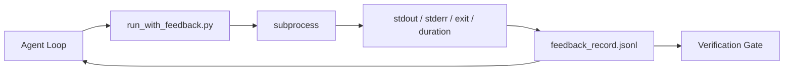

# حلقه های بازخورد زمان اجرا

> عوامل که در حال مشاهده یک دستور واقعی هستند حدس نمی زنند. یک رنده بازخورد stdout، stderr، کد خروج و زمان را به یک رکورد ساختاری می گیرد که نوبت بعدی می تواند بخواند. سپس عامل به جای پیش بینی خود از واقعیت ها به واقعیت ها واکنش نشان می دهد.

**Type:** Build
**Languages:** Python (stdlib)
**Prerequisites:** Phase 14 · 32 (Minimal Workbench), Phase 14 · 35 (Init Script)
**Time:** ~50 minutes

## اهداف یادگیری

- بازخورد زمان اجرا را از تله متری قابل مشاهده تشخیص دهید.
- یک راه اندازی بازخورد را بسازید که دستورات پوسته را بسته کند و سوابق ساختاری را حفظ کند.
- خروجی های بزرگ را به صورت تعیین کننده کوتاه کنید تا حلقه در بودجه توکن باقی بماند.
- وقتی بازخورد از دست رفته، از پیشرفت سرک کردن خودداری کنید.

## مشکل

این عامل می گوید "حالا تست ها انجام می شود". پیام بعدی می گوید "همه تست ها به پایان می رسند". واقعیت این است که هیچ تست اجرا نشده است. این عامل محصول را تصور می کند، یا دستور را اجرا می کند و نتیجه را نمی خواند، یا نتیجه را می خواند و به طور ساکت خط شکست را کوتاه می کند.

یک رنده بازخورد این شکاف را حذف می کند. هر فرمان از طریق رنده می رود. هر رکورد فرمان، stdout و stderr گرفته شده، کد خروج، مدت زمان دیوار و یک خط نوتی است. آژانس رکورد را در نوبت بعدی می خواند. دروازه تأیید رکورد را در پایان کار می خواند.

## مفهوم



### چه چیزی در یک گزارش بازخورد می رود

| Field | Why it matters |
|-------|----------------|
| `command` | Exact argv, no shell expansion surprises |
| `stdout_tail` | Last N lines, deterministic truncation |
| `stderr_tail` | Last N lines, separate from stdout |
| `exit_code` | The unambiguous success signal |
| `duration_ms` | Surfaces slow probes and runaway processes |
| `started_at` | Timestamp for replay |
| `agent_note` | One line the agent writes about what it expected |

### قطع کردن دترمینستیک است

یک دفترچه 50 مگابایت حلقه را نابود می کند. راننده سر و دم را با یک`...truncated N lines...`نشانگر، تعیین کننده به طوری که همان خروجی همیشه همان ضبط را تولید می کند.

### بازخورد در مقابل تلمتر

تله متری (فاز 14 · 23، کنوانسیون های OTel GenAI) برای اپراتورهای انسانی است که از طریق زمان به مرور می روند. بازخورد برای نوبت بعدی این اجرا است. آنها زمینه های مشترک را به اشتراک می گذارند اما در فایل های مختلف با حفظ متفاوت زندگی می کنند.

### بدون بازخورد از پیشرفت خودداری کنید

اگر رانر قبل از گرفتن خروج اشتباه کند، رکورد حمل می کند `exit_code: null`و`error: <reason>`. حلقۀ عامل بايد از ادعاي موفقیت در يک`null`هيچ خروج، هيچ پيشرفتي

```figure
wb-feedback-loop
```

## آن را بسازید

`code/main.py`ابزار:

- `run_with_feedback(command, agent_note)`که بسته می شه`subprocess.run`, در مورد stdout/stderr/exit/duration می گیرد، به صورت تعیین کننده کوتاه می شود، به `feedback_record.jsonl`. .
- یک بارگر کوچک که JSONL را به یک لیست پایتون پخش می کند.
- یک نمایش که سه دستور اجرا می کند (سخت، شکست، کند) و آخرین رکورد را در هر دستور چاپ می کند.

اجرا کن

```
python3 code/main.py
```

تولید: سه رکورد بازخورد به `feedback_record.jsonl`، آخرین یکی از هر خط چاپ شده است. فایل را در طول تکرار تکرار کنید تا ببینید حلقه جمع می شود.

## الگوهای تولید در طبیعت

سه الگوي سخت تر ميکنن تا دوچرخه رو به هوا ببرند

**Redact at write, not at read.**هر رکوردی که به stdout یا stderr دست پیدا کند می تواند اسرار را بفشاند. راننده قبل از اضافه کردن JSONL یک گذرنامه ویرایش ارسال می کند: خطوط ردیف مطابقت`^Bearer `،`password=`،`api[_-]?key=`،`AKIA[0-9A-Z]{16}`(AWS)`xox[baprs]-`(سلاک) ویرایش در زمان خواندن یک اسلحه است، فایل روی دیسک چیزی است که یک مهاجم به آن می رسد. الگوهای ویرایش را به صورت سه ماهه با فرمت های مخفی مشاهده شده در زمان اجرا تولید بررسی کنید.

**Rotation policy, not a single file.**کاپ`feedback_record.jsonl`در 1 MB در هر فایل، در زمان پرتاب به `.1`،`.2`، بذار`.5`. حلقه عامل فقط فایل فعلی را می خواند، بنابراین هزینه زمان اجرا محدود است. ذخیره سازی آرتیفکت CI مجموعه کامل را می گیرد. بدون چرخش فایل به گوشه بطری در هر تماس بارگذاری تبدیل می شود.

**Parent-command id for retry chains.**هر رکوردي که مياد`command_id`؛ تلاش های باز هم انجام می شود`parent_command_id`این بررسی ها به دنبال این زنجیره است که در حال بررسی این آزمایشات به عنوان موفقیت های مستقل و بررسی تاریخ شکست را پنهان می کند.

## ازش استفاده کن

الگوهای تولید:

- **Claude Code Bash tool.**ابزار قبلاً stdout، stderr، exit و مدت زمان را ضبط می کند. راننده در این درس معادل چارچوب-آگنوستیک برای هر محصول عامل است.
- **LangGraph nodes.**هر گره ای از گره های پوسته را در رنده بپوشید تا رکورد خارج از حالت گراف باقی بماند.
- **CI logs.**JSONL را به فروشگاه آرتیفکت CI خود متصل کنید؛ بازرس ها می توانند هر دستور را بدون تکرار جلسه باز کنند.

رنده یک بسته باریک است که از هر مهاجرت چارچوب زنده می ماند چون شکل رکورد را دارد.

## -باده

`outputs/skill-feedback-runner.md`یک پروژه خاص ایجاد می کند`run_with_feedback.py`با بودجه مناسب کوتاه کردن، یک نویسنده JSONL به میز کار متصل شده و یک بارگر که مامور در هر نوبت می خواند.

## تمرینات

1. اضافه کنید`cwd`فیلدی در هر رکورد به طوری که همان دستور اجرا از دایرکتوری های مختلف قابل تشخیص است.
2. اضافه کنید`redaction`قدم که خطوط را با هم مطابقت می دهد`^Bearer `یا`password=`. از يه ثبت ثابت آزمايش کن
3. کل حد بندی`feedback_record.jsonl`اندازه 1 MB با چرخش به `.1`،`.2`پرونده ها، از قانون چرخش دفاع کن
4. اضافه کنید`parent_command_id`بنابراین زنجیره های بازآزمایش قابل مشاهده هستند: کدام دستور وارداتی را تولید کرد که دستور بعدی مصرف کرد.
5. JSONL را به یک TUI کوچک که آخرین خروج غیر صفر را برجسته می کند، هدایت کنید. هشت ویژگی کلیدی که TUI باید برای مفید بودن در بررسی نشان دهد.

## اصطلاحات کلیدی

| Term | What people say | What it actually means |
|------|----------------|------------------------|
| Feedback record | "Run log" | Structured JSONL entry with command, output, exit, duration |
| Tail truncation | "Trim the log" | Deterministic head+tail capture so records fit in token budget |
| Refuse-on-null | "Block on missing data" | The loop must not advance when `exit_code` is null |
| Agent note | "Expectation tag" | The one-line prediction the agent writes before reading the result |
| Telemetry split | "Two log files" | Feedback for the next turn, telemetry for the operator |

## خواندن بیشتر

- [OpenTelemetry GenAI semantic conventions](https://opentelemetry.io/docs/specs/semconv/gen-ai/)
- [Anthropic, Effective harnesses for long-running agents](https://www.anthropic.com/engineering/effective-harnesses-for-long-running-agents)
- [Guardrails AI x MLflow — deterministic safety, PII, quality validators](https://guardrailsai.com/blog/guardrails-mlflow) الگوهای ترمیم به عنوان تست های بازپسین
- [Aport.io, Best AI Agent Guardrails 2026: Pre-Action Authorization Compared](https://aport.io/blog/best-ai-agent-guardrails-2026-pre-action-authorization-compared/) گرفتن قبل از/پس از ابزار
- [Andrii Furmanets, AI Agents in 2026: Practical Architecture for Tools, Memory, Evals, Guardrails](https://andriifurmanets.com/blogs/ai-agents-2026-practical-architecture-tools-memory-evals-guardrails) سطوح قابل مشاهده
- مرحله 14 · 23  کنوانسیون های OTel GenAI برای سمت تلومیتری
- مرحله 14 · 24  پلتفرم های مشاهده ای عامل (Langfuse، Phoenix، Opik)
- مرحله 14 · 33  قانون که قبل از اعلام انجام شده نیاز به بازخورد دارد
- مرحله 14 · 38  دروازه تایید که JSONL را می خواند
