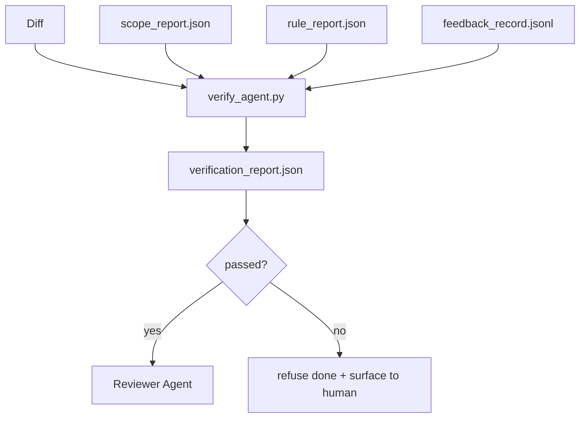

# دروازه های تأیید

> یک دروازه تأیید قرارداد دامنه، دفترچه بازخورد، گزارش قوانین و تفاوت را می خواند و به یک سوال پاسخ می دهد: آیا این کار واقعاً تکمیل شده است؟ اگر دروازه جواب نه دهد، کار انجام نشده است، مهم نیست چیت چه بگوید.

**Type:** Build
**Languages:** Python (stdlib)
**Prerequisites:** Phase 14 · 33 (Rules), Phase 14 · 36 (Scope), Phase 14 · 37 (Feedback)
**Time:** ~55 minutes

## اهداف یادگیری

- یک دروازه تأیید را به عنوان یک تابع تعیین کننده بر روی آثار میز کاری تعریف کنید.
- گزارش قاعده، گزارش دامنه، گزارش بازخورد و تفاوت را در یک حکم واحد ترکیب کنید.
- یک .`verification_report.json`مامور بازرس و اطلاعاتي هر دو ميتونن بخونن
- بدون استثناء، از پیشبرد یک کار در مورد هر گونه شکست سختی بلاک، انکار کنید.

## مشکل

ماموران موفقيت رو خيلي راحت اعلام ميکنن. سه شکل شکست برشون مسلط است:

- "به نظر خوب میاد" مدل تفاوت خودش رو خوند و تصمیم گرفت درست باشه
- "تست ها موفق شدند" با اعتماد به نفس گفت. هیچ سابقه ای از آزمایش در واقع اجرا نشده است.
- "اقبولی به دست آمده" معیارهای پذیرش به اندازه کافی به طور آزادانه تفسیر شده که به معنای "هر کاری که شبیه به انجام شده است" باشد.

دروازه ی ورژن کنترلی است، دروازه به CI متصل است، عامل نمی تواند آن را رشوه دهد. دروازه ی ورژن کنترلی است. دروازه ای که در ورژن کنترلی است، دروازه ای است که در ورژن کنترلی است. دروازه ای که در ورژن کنترلی است. دروازه ای که در ورژن کنترلی است. در ورژن کنترلی است. در ورژن کنترلی است. در ورژن کنترلی است. در ورژن کنترلی است. در ورژن کنترلی است. در ورژن کنترلی است. در ورژن کنترلی است. در ورژن کنترلی است. در ورژن کنترلی است. در ورژن کنترلی است. در ورژن کنترلی است. در ورژن کنترلی است. در ورژن کنترلی است. در ورژن کنترلی است.

## مفهوم



### چه چيزهايي که دروازه ميگيره

| Check | Source artifact | Severity |
|-------|-----------------|----------|
| All acceptance commands ran | `feedback_record.jsonl` | block |
| All acceptance commands exited zero | `feedback_record.jsonl` | block |
| Scope check has no forbidden writes | `scope_report.json` | block |
| Scope check has no off-scope writes | `scope_report.json` | block or warn |
| All block-severity rules pass | `rule_report.json` | block |
| No `null` exit codes in feedback | `feedback_record.jsonl` | block |
| Touched files match `scope.allowed_files` | both | warn |

A`warn`پیدا کردن به حکم اشاره می کند.`block`پیدا کردن مانع`passed: true`. .

### تعیین کننده، نه احتمال

دروازه باید هر بار برای همان آرتیفاکت تنظیم شده حکم مشابهی را ارائه دهد. هیچ قاضی LLM وجود ندارد. قاضی LLM به طرف بازرس تعلق دارد (فاز 14 · 39) که هدف ارزیابی کوالیتی است نه وضعیت.

### یک گزارش، یک مسیر

دروازه يه نفر رو مي فرستد`verification_report.json`در زیر نوشته شده است`outputs/verification/<task_id>.json`.آريايي ها به همان راه ميرن .دروازه هاي مختلف با راه هاي مختلف به منبع حقيقت ميرن

### بدون استثناء رد

یافته های شدت بلوک نمیتوانند توسط عامل رد شوند.`override_reason`و یک`overridden_by`اسم کاربری، تغییرنامه امضا شده، نه تصمیم نماینده

```figure
wb-gate-sequence
```

## آن را بسازید

`code/main.py`ابزار:

- يه بارگيري براي هر اثر وارداتي که همه ي آن ها به صورت محلي به دست مياد تا درس خودشون رو به خود بگيره
- A`verify(task_id, artifacts) -> VerdictReport`عملکرد خالص
- یک پرینتر که نتایج هر چک و آخرین پاس/فایل را نشان می دهد.
- یک نمایشگاه با سه سناریوی کار: گذرگاه پاک، دامنه ترسناک، پذیرش از دست رفته.

اجرا کن

```
python3 code/main.py
```

نتیجه: سه گزارش حکم، هرکدوم کنار اسکریپت ذخیره شده

## الگوهای تولید در طبیعت

چهار الگوي دروازه را از "کار ديگه اي" به "حرفي مهم" بلند مي کنند.

**Defense-in-depth, not single gate.**هر لایه تعیین کننده است بنابراین شکست در یک لایه توسط بعدی گیر می شود. کتاب بازی مارس 2026 microservices.io واضح است: هک قبل از تعهد غیر قابل عبور است زیرا برخلاف مهارت های طرف مدل، به عامل پیروی از دستورالعمل بستگی ندارد. دروازه تأیید در لایه CI / قبل از ادغام قرار دارد.

**Defense by deterministic check, model-judge only for nuance.**جفت بندی استاندارد های ترکیبی 2026 Anthropic: پاداش قابل تأیید (تست های واحد، چک های طرح، کد خروج) پاسخ "کد مشکل را حل کرد؟"  Rubrics LLM پاسخ "کد قابل خواندن، ایمن، در سبک است؟" دروازه کلاس اول را اجرا می کند؛ بازرس (فاز 14 · 39) کلاس دوم را اجرا می کند. مخلوط کردن آنها سیگنال را فرو می برد.

**Signed override log, not Slack threads.**هر رد رد يه رد در مياد`outputs/verification/overrides.jsonl`با: تایم استیمپ، پیدا کردن کد، دلیل، کاربر امضا کننده، تعهد فعلی HEAD. زمان اجرا هرگونه رد که از دستمزد محروم است را رد می کند؛ مسیر حسابرسی git-tracked است. این خط بین یک سیاست رد و یک تئاتر رد است.

**Coverage floor as a first-class check.**A`coverage_report.json`غذا می دهد`coverage_floor`(پیش فرض 80٪) بررسی. دروازه شکست می خورد اگر پوشش اندازه گیری شده از طبقه یا زیر طبقه ادغام قبلی بیش از 1 درصد کاهش یابد. بدون این بررسی، عوامل به طور آرام آزمایشات شکست خورده را حذف می کنند و گزارش های تأیید سبز باقی می ماند.

**`--strict` mode promotes warns to blocks.**برای شاخه های آزاد، روابط عمومی برای مسدود کردن کشتی یا تشخیص پس از حادثه`--strict`هر هشدار یک شکست سخت است. پرچم انتخاب با شاخه است؛ نه پیش فرض جهانی، زیرا سخت در همه چیز جریان روزانه را خراب می کند.

## ازش استفاده کن

الگوهای تولید:

- **CI step.**A`verify_agent`.کار دروازه رو به سمت آثار نهایی مامور اجرا ميکنه .حمايت ادغام بدون اجازه`passed: true`. .
- **Pre-handoff hook.**مامور زمان اجرا قبل از تولید اسناد تحویل به دروازه زنگ می زند.
- **Manual triage.**اپراتورها وقتي گزارش رو مي خوانند که يه مامور موفق مي شه و يه انسان به اون شک ميکنه

دروازه حاشیه ی تعیین کننده در جریان میز کاری است. هر سطح دیگری که در جریان آن است.

## -باده

`outputs/skill-verification-gate.md`دروازه را به یک پروژه خاص متصل می کند: کدام دستورات پذیرش آن را تغذیه می کنند، قوانین سختی بلاک کدامند، چه نوشته های خارج از محدوده پذیرفته می شوند، چگونه دفترچه حسابرسی رد ذخیره می شود.

## تمرینات

1. اضافه کنید`coverage_floor`بررسی: فرماندهی آزمایش باید گزارش پوشش را با حداقل 80٪ ارائه دهد. تصمیم بگیرید که چه اثری کف را حمل می کند.
2. حمایت از`--strict`روشي که هر`warn`به`block`. پرونده هایی را که حالت سخت است، به طور پیش فرض درست است، مستند کنید.
3. دروازه را به عنوان یک خلاصه Markdown به علاوه JSON تولید کنید. دفاع کنید که کدام زمینه ها در خلاصه تعلق دارند.
4. اضافه کنید`time_since_last_human_touch`چک: هر فایل ای که در عرض 60 ثانیه از فشار کلید انسانی ویرایش شده است از پرچم های خارج از محدوده معاف است.
5. دروازه را روی یک عامل واقعی که متفاوت از محصول شما اجرا کنید. چند تا یافته واقعی و چند تا شور هستند؟ دروازه باید کجا رشد کند؟

## اصطلاحات کلیدی

| Term | What people say | What it actually means |
|------|----------------|------------------------|
| Verification gate | "The check that stops things" | Deterministic function over workbench artifacts producing a pass/fail verdict |
| Block severity | "Hard fail" | A finding that prevents `passed: true` and requires a signed override |
| Override log | "Why we let it through" | Signed entries with reason and user id, audited by review |
| Acceptance command | "The proof" | A shell command whose zero exit is what `done` means |
| One report path | "Source of truth" | `outputs/verification/<task_id>.json`, consumed by CI and humans alike |

## خواندن بیشتر

- [Anthropic, Harness design for long-running application development](https://www.anthropic.com/engineering/harness-design-long-running-apps)
- [OpenAI Agents SDK guardrails](https://openai.github.io/openai-agents-python/guardrails/)
- [microservices.io, GenAI dev platform: guardrails](https://microservices.io/post/architecture/2026/03/09/genai-development-platform-part-1-development-guardrails.html) دفاع عمیق بین پیش از تعهد و CI
- [ICMD, The 2026 Playbook for Agentic AI Ops](https://icmd.app/article/the-2026-playbook-for-agentic-ai-ops-guardrails-costs-and-reliability-at-scale-1776661990431) پله ی دروازه های تأیید (مطرحی → تایید → اتوماتیک زیر سنین)
- [Type-Checked Compliance: Deterministic Guardrails (arXiv 2604.01483)](https://arxiv.org/pdf/2604.01483) Lean 4 به عنوان مرز بالای گاتینگ تعیین کننده
- [logi-cmd/agent-guardrails — merge gate spec](https://github.com/logi-cmd/agent-guardrails) دامنه + دروازه های آزمایش جهش
- [Guardrails AI x MLflow](https://guardrailsai.com/blog/guardrails-mlflow) اعتبارگرهای تعیین کننده به عنوان نمرات CI
- مرحله 14 · 27  دفاع های تزریق سریع (دفتر مخالف دروازه)
- مرحله 14 · 36  قرارداد دامنه این دروازه اجرا می شود
- مرحله 14 · 37  گزارش بازخورد این دروازه امتیازات
- مرحله 14 · 39  مامور بازرس دروازه دست ها را به
