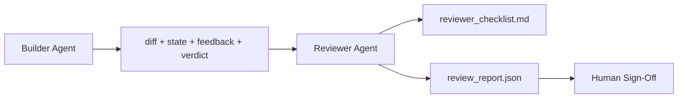

# بازرس: ساختگر جداگانه از مارکر

> یک بازرس یک حلقه دوم است که یک دستور سیستم متفاوت، یک هدف متفاوت و دسترسی به هر چیزی که سازنده تولید کرده است فقط به خواندن است. شکاف بین سازنده و بازرس جایی است که بیشترین قابلیت اطمینان زندگی می کند.

**Type:** Build
**Languages:** Python (stdlib)
**Prerequisites:** Phase 14 · 38 (Verification Gate)
**Time:** ~55 minutes

## اهداف یادگیری

- توضیح بده که چرا همان عامل نمی تواند به طور قابل اعتماد کار خود را بررسی کند.
- یک حلقه از عوامل بازرس ایجاد کنید که آثار ساختمانی را مصرف کند و گزارش بازرسی ساختار یافته را صادر کند.
- نویسنده ی یک عنوان بازبینی که ابعاد خاصی را رتبه بندی می کند نه وایبرها.
- اون را به میز کار ببند تا مرحله بررسی انسان از یک اثر هنری واقعی شروع بشه

## مشکل

شما از آژانس می خواهید یک خطای را اصلاح کند. آن چهار فایل را ویرایش می کند، آزمایشات را اجرا می کند و گزارش ها انجام می شود. دروازه تأیید (فاز 14 · 38) تایید پذیرش اجرا شده و دامنه برقرار شده است. دروازه می گوید `passed: true`دو روز بعد متوجه میشی که درست کردن نصف اشتباه از کیسه رو حل کرده

پذیرش ضروری است، کافی نیست. بازرس پرسش هایی را می پرسد که پذیرش نمی تواند بپرسد: آیا این مسئله را درست حل کرد؟ آیا دامنه را بدون نشان دادن آن گسترش داد؟ آیا فرضیه هایی را که باید مورد سوال قرار می گرفتند مستند کرد؟ آیا این میز کار را در یک حالت باقی گذاشت که جلسه بعدی می تواند آن را بگیرد؟

## مفهوم



### عنوان بازرس

پنج ابعاد، هر کدام 0 تا 2 امتیاز داشتند.

| Dimension | Question |
|-----------|----------|
| Problem fit | Did the change solve the task as stated, not a nearby task? |
| Scope discipline | Were edits confined to the contract or was the contract grown deliberately? |
| Assumptions | Are all hidden assumptions written down somewhere reviewable? |
| Verification quality | Does the acceptance command actually prove the goal, or did it prove a weaker version? |
| Handoff readiness | Could the next session pick up cleanly from the current state? |

کل از 10، یک مسابقه زیر 7 شکست نرم است؛ یک مسابقه زیر 5 شکست سخت است.

### بازرس نقش جداگانه ای است نه یک مدل جداگانه

شما می توانید بازبینی را با همان مدل که سازنده است اجرا کنید. رشته جداسازی نقش است: دستور سیستم مختلف، ورودی های مختلف، دسترسی نوشتن به تفاوت. تغییر در حالت تغییر در سیگنال است.

### بازرس نمی تواند تفاوت را ویرایش کند

بازرس تفاوت، وضعیت، بازخورد، حکم را می خواند. گزارش می نویسد. تفاوت را اصلاح نمی کند. اگر گزارش می گوید "این را اصلاح کنید،" نوبت بعدی سازنده اصلاح می کند؛ بازرس به بررسی باز می گردد. مخلوط کردن نقش ها شکاف را شکست می دهد.

### عنوان بازرس در مقابل دروازه تأیید

دروازه (فاز 14 · 38) حقایق تعیین کننده را بررسی می کند: آیا پذیرش اجرا شده است، آیا قوانین تصویب شده است، آیا دامنه اعمال می شود. بازرس قضاوت های کوالیتی را انجام می دهد: آیا این کار درست است، آیا مستند شده است، آیا تحویل قابل استفاده است. هر دو مورد مورد نیاز است.

```figure
wb-builder-marker
```

## آن را بسازید

`code/main.py`ابزار:

- A`ReviewerInputs`کلاس داده ها که آثار هنری را که بازرس می خواند جمع می کند.
- یک امتیاز دهنده rubric با یک تابع در هر ابعاد. هر تابع برای درس تعیین کننده و Stub-grade است؛ پیاده سازی واقعی LLM نامیده می شود.
- A`review_report.json`نویسنده با پنج امتیاز، کل و حکم (`pass`،`soft_fail`،`hard_fail`)
- دو مورد دمو: تغییر پاک و تغییر "تست درست، مشکل اشتباه".

اجرا کن

```
python3 code/main.py
```

تولید: دو گزارش بررسی نوشته شده به دیسک و یک جدول کنسول از امتیازات ابعاد.

## الگوهای تولید در طبیعت

رسید ها: سیستم بررسی کد هوش مصنوعی Cloudflare در آوریل 2026 در طول 30 روز 131,246 بار بررسی را در 48،095 درخواست ادغام در 5،169 بازبینی انجام داد. بررسی متوسط در 3 دقیقه و 39 ثانیه تمام شد. تا هفت بازرس متخصص (امنیت، عملکرد، کیفیت کد، اسناد، مدیریت انتشار، مطابقت، کد مهندسی) در موازی تحت یک هماهنگی بازرسی که یافته ها را تکرار و شدت قضاوت کرد، اجرا کردند. مدل سطح بالا که فقط برای هماهنگ کننده اختصاص داده شده بود؛ متخصصین در سطوح ارزان تر اجرا می شدند.

چهار الگوی این کار را در مقیاس انجام می دهند.

**Specialist pool, not one big reviewer.**یک بازرس با یک ربریک 5 بعدی برای repos های تک نفره کار می کند. هنگامی که پایگاه کد دارای سطوح امنیتی، عملکرد و مدارک است، به متخصصان با پیام های کوچکتر تقسیم می شود. هماهنگ کننده تخفیف می کند؛ متخصصان هرگز ربریک کامل را اجرا نمی کنند. جداسازی سطح مدل خارج می شود: متخصصان ارزان قیمت، هماهنگ کننده گران قیمت.

**Bias mitigation as design requirement, not optimization.**قاضیان LLM چهار تعصب قابل اعتماد را نشان می دهند (ادنان مسعود، آوریل 2026): تعصب موقعیت (GPT-4 ~ 40% متناقض در (A،B) در مقابل (B،A) ترتیب) ، تعصب کلامی (~15٪ امتیاز تورم نسبت به نتایج طولانی تر) ، خود ترجیح (قضاة ترجیح می دهند نتایج از همان خانواده مدل) ، اقتدار (قضاة بیش از حد نرخ مرجع به نویسندگان شناخته شده). کاهش: ارزیابی هر دو ترتیب و فقط شمارش برندهای ثابت؛ استفاده از 1-4 مقیاس که به طور صریح پاداش لنگرایی؛ گردش داوران در سراسر خانواده های مدل؛ حذف نام نویسندگان قبل از امتیاز.

**Calibration set, not vibes.**یک مجموعه تاریخی 10-20 وظیفه با حکم های صحیح شناخته شده. بررسی کننده را در هر تغییر فوری از آن اجرا کنید. اگر توافق با رکورد تاریخی کمتر از 80٪ باشد، باید قبل از اینکه بررسی کننده ارسال شود، به بررسی بپردازد. این چیزی است که هر تیم در نهایت دوباره کشف می کند؛ بهتر است با آن شروع کنید.

**Hybrid norm with the gate.**دروازه تایید (فاز 14 · 38) بررسی های تعیین کننده را انجام می دهد (آیا پذیرش اجرا شده است، آیا آزمایش ها گذشتند، آیا دامنه نگه داشته شده است). بازرس بررسی های معنوی را انجام می دهد (اگر این کار درست باشد، فرضیه ها مستند شده است، آیا انتقال قابل استفاده است). راهنمای 2026 Anthropic در این تقسیم واضح است: از بازرس درخواست نکنید که آنچه که دروازه قبلاً ثابت می کند را دوباره انجام دهد.

## ازش استفاده کن

الگوهای تولید:

- **Claude Code subagents.**یک زیرمدیری که یک کار را انجام می دهد، بعد از اینکه کار را به پایان رساند، می رود و یک نظر در مورد روابط عمومی با نمرات Rubric را منتشر می کند.
- **OpenAI Agents SDK handoffs.**تعمیر کننده به بازرس در هنگام تکمیل کار می دهد. بازرس می تواند با یک لیست از یافته ها یا تا به یک انسان به او بازگو کند.
- **Two-model pairing.**سازنده روی مدل سریع تر و ارزان تر کار می کند. بازرس روی مدل قوی تر با زمینه کوچکتر، تمرکز بر قضاوت می کند.

بازبینی کننده، دوین چشم است که وقتی انسان ها نمی توانند هر بازبینی را خودشان انجام دهند، میز کار رشد می کند.

## -باده

`outputs/skill-reviewer-agent.md`یک عنوان بررسی کننده پروژه خاص، یک ستون بازرس عامل به آثار ساختمانی متصل شده و یک ادغام با دروازه تأیید را تولید می کند تا بررسی انسانی از یک گزارش نوشته شده به جای یک صفحه خالی شروع شود.

## تمرینات

1. یک ابعاد ششم خاص به دامنه محصول خود اضافه کنید. دفاع کنید که چرا توسط پنج ابعاد موجود جذب نمی شود.
2. با دو دستور سیستم مختلف (ترس، Verbose) بررسی کننده را اجرا کنید. کدام یک گزارش را که انسان بیشتر می تواند بخواند، تولید می کند؟
3. اضافه کنید`confidence`در هر طول، در صورتی که اطمینان در پایین ترین طول کمتر از 0.6 باشد، از ارسال گزارش انکار می شود.
4. یک مجموعه کالیبراسیون بسازید: ۱۰ کار تاریخی که با حکم های صحیح شناخته شده انجام شده است. بررسی کننده را بر روی آنها اجرا کنید. در چه زمینه ای با سوابق تاریخی مخالف است؟
5. یک پیشنهاد "طلب شواهد بیشتر" اضافه کنید: بازرس می تواند از سازنده قبل از امتیاز، یک آزمایش خاص را درخواست کند. پس از این که این حلقه نباشد، مناسب ترین بازخورد چیست؟

## اصطلاحات کلیدی

| Term | What people say | What it actually means |
|------|----------------|------------------------|
| Reviewer rubric | "Checklist" | Five-dimension 0-2 scoring with a written question per dimension |
| Soft fail | "Needs revisions" | Total below 7; builder gets findings to address |
| Hard fail | "Reject" | Total below 5 or any dimension at 0; halt and surface to human |
| Role separation | "Different prompt" | Same model can be both roles; the discipline is inputs and posture |
| Confidence floor | "Don't ship low-signal reports" | Refuse to emit a verdict when the rubric is uncertain |

## خواندن بیشتر

- [OpenAI Agents SDK handoffs](https://openai.github.io/openai-agents-python/handoffs/)
- [Anthropic Claude Code subagents](https://code.claude.com/docs/en/sub-agents)
- [Cloudflare, Orchestrating AI Code Review at Scale](https://blog.cloudflare.com/ai-code-review/) 7 متخصص + هماهنگی معماری، 131 هزار اجرا / 30 روز
- [Agent-as-a-Judge: Evaluating Agents with Agents (OpenReview / ICLR)](https://openreview.net/forum?id=DeVm3YUnpj) شاخص مرجع DevAI، 366 نیاز به راه حل های سلسله مراتبی
- [Adnan Masood, Rubric-Based Evaluations and LLM-as-a-Judge: Methodologies, Biases, Empirical Validation](https://medium.com/@adnanmasood/rubric-based-evals-llm-as-a-judge-methodologies-and-empirical-validation-in-domain-context-71936b989e80) چهار تعصب و کاهش
- [MLflow, LLM-as-a-Judge Evaluation](https://mlflow.org/llm-as-a-judge) ابزار تولید برای سازنده/مقدّر جداگانه
- [LangChain, How to Calibrate LLM-as-a-Judge with Human Corrections](https://www.langchain.com/articles/llm-as-a-judge) جریان کار تنظیم شده برای کالیبریشن
- [Evidently AI, LLM-as-a-judge: a complete guide](https://www.evidentlyai.com/llm-guide/llm-as-a-judge)
- [Arize, LLM as a Judge — Primer and Pre-Built Evaluators](https://arize.com/llm-as-a-judge/)
- مرحله 14 · 05  خود تصحیح و انتقاد (مطابق اصلی خود بررسی یک عامل)
- مرحله 14 · 30  توسعه عامل Eval (گناور مجموعه کالیبریشن)
- مرحله 14 · 38  دروازه تاییدیه که بازرس می خواند
- مرحله 14 · 40  بسته ی انتقال را که گزارش بازرس می دهد
