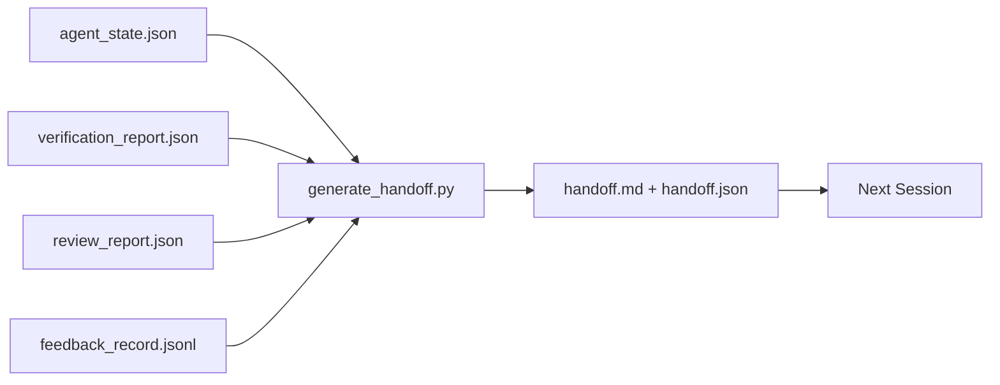

# انتقال چند جلسه

> جلسه به پایان می رسد. کار نیست. بسته ی تحویل این است که "اعمال یک ساعت کار کرده" را به "مجلس بعدی در دقیقه اول بهره مند است" تبدیل می کند. آن را عمدا بسازید، نه به عنوان یک فکر بعد.

**Type:** Build
**Languages:** Python (stdlib)
**Prerequisites:** Phase 14 · 34 (Repo Memory), Phase 14 · 38 (Verification), Phase 14 · 39 (Reviewer)
**Time:** ~50 minutes

## اهداف یادگیری

- هفت زمینه ای را که هر بسته ی انتقال نیاز دارد شناسایی کنید.
- از آثار دستکشي بدون نوشتن به دستي بازيابي ميکنه
- پس از این، به یک خلاصه ی بزرگ تبدیل کنید.
- اولين عمل جلسه ي بعد رو تعیین کننده سازيد

## مشکل

جلسه پایان می یابد. مامور می گوید "خوب، پیشرفت کردیم". جلسه بعدی باز می شود. مامور بعدی می پرسد " کجا به پایان رسیدیم؟" پاسخ اولین مامور ناپدید شده است. مامور بعدی دوباره همان دستورات را کشف می کند، دوباره از انسان همان سوالات را می پرسد و سی دقیقه را می سوزاند تا آخرین سی ثانیه از جلسه قبلی را بازیابی کند.

هزینه یک تحویل بد در هر جلسه برای عمر کار پرداخت می شود. اصلاح یک بسته است که به طور خودکار در پایان جلسه تولید می شود: چه چیزی تغییر کرده است، چرا، چه چیزی را امتحان کرده است، چه چیزی را شکست داده است، چه چیزی باقی مانده است، چه کاری را باید در دفعه بعدی انجام دهد.

## مفهوم



### هفت میدان که هر دست دادن حمل می کند

| Field | Question it answers |
|-------|---------------------|
| `summary` | One paragraph of what was done |
| `changed_files` | The diff at a glance |
| `commands_run` | What was actually executed |
| `failed_attempts` | What was tried and why it did not work |
| `open_risks` | What could bite next session, with severity |
| `next_action` | The first concrete step next session takes |
| `verdict_pointer` | Path to the verification + review reports |

.`next_action`.به هر چيزي که در اين جا هست ، به جز`next_action`اين گزارش وضعيت است نه ارسال

### ارسال ها به مردم داده می شود نه نوشته می شود

یک تحویل دست نوشته یک تحویل است که در روز سختی رد می شود. ژنراتور آثار میز کار را می خواند و بسته را منتشر می کند. کار آژانس این است که میز کار را در حالت ای که ژنراتور می تواند خلاصه کند، رها کند، نه خلاصه را بنویسد.

### دو شکل: قابل خواندن توسط انسان و قابل خواندن توسط ماشین

`handoff.md`اين چيزيه که انسان بخواند`handoff.json`هر دو از اثاثیهای منبع مشابه هستند. اگر متمایز شوند، JSON برنده می شود.

### تراشیدن سوابق

تمام`feedback_record.jsonl`ممکن است صدها ورودی باشد. انتقال فقط آخرین K به علاوه هر ورودی با خروج غیر صفر را حمل می کند. جلسه بعدی به صورت لازم کل دفترچه را بارگذاری می کند، اما بسته کوچک باقی می ماند.

### حالت پاکت رو ترک کن

یک تحويل کار را توصیف می کند. یک حالت تمیز کار را قابل شروع مجدد می کند. آنها یکسان نیستند. یک کامل.`handoff.md`اگر جلسه بعدی با یک تفاوت نیمه کاربردی، یک فایل موقت که عامل فراموش کرده، یک شاخه بی راه و آزمایش این خطا قبل از حتی اجرا، بی ارزش است. سپس عامل بعدی ده دقیقه اول خود را صرف تمیز کردن پس از آخرین به جای ساخت، و هزینه ها هر جلسه برای زندگی کار.

بنابراین جلسه زمانی که ویژگی کار می کند پایان نمی یابد. زمانی که میز کار در حالت است که ژنراتور می تواند خلاصه کند و جلسه بعدی می تواند اعتماد کند. تمیز کردن مرحله خودش است، قبل از تحویل اجرا می شود، و این یک چک است، نه یک عادت، زیرا یک عادت چیزی است که در روز سختی از آن تخلیه می شود.

| Check | Clean means | Dirty blocks because |
|-------|-------------|----------------------|
| Working tree | Every change committed or explicitly stashed with a note | A half-applied diff looks like intentional work to the next agent |
| Temp artifacts | No `*.tmp`, scratch dirs, debug prints, or commented-out blocks left behind | Stray files pollute the diff and the next agent's mental model |
| Tests | Green, or red with the failure named in `open_risks` | A silent red test is a trap the next session steps in |
| Feature board | `feature_list.json` status reflects reality (Phase 14 · 36) | A stale board sends the next session to work that is already done |
| Branch | On the expected branch, no detached HEAD, no orphan branches | Wrong branch means the next session's first commit lands in the wrong place |

مرحله پاکسازی یک`clean_state.json`یک لیست خالی شرط پیش شرط است که ژنراتور ارسال قبل از نوشتن یک بسته ادعا می کند. یک ارسال ساخته شده بر روی یک درخت کثیف یک ارسال نیست، این یک آشفتگی است. دو اثار جفت: تمیز کردن ثابت می کند که میز کار امن است برای ترک، تحویل ثابت می کند جلسه بعدی می داند که از کجا شروع شود.

```figure
wb-handoff-packet
```

## آن را بسازید

`code/main.py`ابزار:

- يه بارنده که بيانات، حکم، بازرسي و بازخورد رو به يک واحد جمع ميکنه`WorkbenchSnapshot`. .
- A`generate_handoff(snapshot) -> (markdown, payload)`عملکرد
- فیلتر که آخرین ورودی K را به همراه تمام خروج های غیر صفر انتخاب می کند.
- يه نمایشي که ميگه`handoff.md`و`handoff.json`کنار اسکریپت

اجرا کن

```
python3 code/main.py
```

خروجی: یک جسم چاپ شده و دو فایل روی دیسک

## الگوهای تولید در طبیعت

کدوکس CLI، کلوڈ کد و OpenCode هر یک یک داستان فشرده سازی متفاوتی را ارسال می کنند؛ بسته های ساختاری در بالای هر سه قرار دارند.

**Compaction strategies vary; the packet schema does not.**POST /v1/responses/compact CLI یک نقطه AES نامشفق در سمت سرور (راه سریع برای مدل های OpenAI) است؛ بازپسین یک "مجموعه ی پشتیبانی" محلی است که به عنوان یک `_summary`کلوید کد، فشرده سازی پنج مرحله ای در 95 درصد از زمینه را اجرا می کند. OpenCode، پنهان کردن پیام مبتنی بر مهر زمانی و همچنین خلاصه LLM 5 سر. سه مکانیسم مختلف، نیاز یکسان: سریال سازی آنچه از فشرده سازی زنده مانده به یک آرتیفکت قابل حمل است. بسته آن آرتیفکت است.

**Fresh-session handoff is not compaction.**کمپیکشن یک جلسه را طولانی می کند؛ انتقال یک جلسه را به خوبی می بندد و جلسه بعدی را شروع می کند. فریمینگ شماره 20372 هرمز (اپریل 2026) درست است: هنگامی که فشرده سازی در محل شروع به کاهش می کند، عامل باید یک دست دادن کامپکت بنویسد، جلسه را پایان دهد و در زمینه تازه ادامه دهد. بسته چیزیه که باعث میشه این انتقال ارزان باشه اشتباه این است که تا زمانی که کیفیت خراب شود، فشرده سازی را ادامه دهید؛ مشکل این است که برای یک تحویل زودرس و تمیز بودجه بندی کنید.

**One active handoff per branch and topic.**هماهنگی چند عامل در دست دادن های قدیمی بیشتر از در تولید مدل ضعیف خراب می شود. همیشه شامل `branch`،`last_known_good_commit`، و یک`status`از`active | superseded | archived`. ارسال های ثابت به ارشیو می شوند؛ تنها یکی فعال جلسه بعدی را هدایت می کند. این تفاوت بین ارسال به عنوان یادداشت و ارسال به عنوان حالت است.

**Wrap up before 50-75% context, not at the wall.**کتاب بازی طرح های نوشته شده به دست (CLAUDE.md + HANDOVER.md) بهترین نتایج را در زمانی گزارش می کند که جلسه با بودجه زمینه 50-75% به جای 95٪ پایان می یابد. ژنراتور بسته قبل از اینکه آثار فشرده سازی وضعیت منبع را آلوده کنند، تمیز اجرا می شود. نوشتن ارزان است در حالی که زمینه سالم است؛ گران است زمانی که مدل در حال از دست دادن مکان خود است.

## ازش استفاده کن

الگوهای تولید:

- **Session-end hook.**زمان اجرا وقتی که کاربر چت رو ببندد ژنراتور رو روشن می کنه.`outputs/handoff/<session_id>/`. .
- **PR template.**.ملاحظه کاران بدون باز کردن پنج پرونده دیگه
- **Cross-agent handoff.**با یک محصول (کد کلو) بسازید، با دیگری (کدکس) ادامه دهید.

بسته کوچک، منظم و ارزان تر برای تولید است. هزینه های صرفه جویی با هر جلسه.

## -باده

`outputs/skill-handoff-generator.md`تولید یک ژنراتور تنظیم به مسیرهای آرتیفاکت پروژه، یک هک پایان جلسه که آن را اجرا می کند، و یک `handoff.json`برنامه ي عميل بعدي در زمان شروع به کار مياد

## تمرینات

1. اضافه کردن یک`assumptions_to_validate`این میدان که هر فرضیه ای را که سازنده ثبت کرده اما بازرس بالاتر از 1 نمره ندیده است، ظاهر می کند.
2. خلاصه بازخورد را برای اجراهای شکست خورده در مقابل اجراهای عبور متفاوت تر کنید. از عدم همت دفاع کنید.
3. یک سوال برای یک پیام در مقابل یک پیام در چت چه حد برای یک سوال قرار دارد؟
4. ژنراتور را بی قدرت کنید: دو بار اجرا کردن آن بسته مشابهی را تولید می کند. چه چیزی برای نگه داشتن آن مستحکم است؟
5. بخش "پیش فرض جلسه بعدی" را اضافه کنید که دقیقاً فهرست اثاثاتی را که جلسه بعدی باید قبل از عمل بارگذاری کند.

## اصطلاحات کلیدی

| Term | What people say | What it actually means |
|------|----------------|------------------------|
| Handoff packet | "Session summary" | Generated artifact carrying the seven fields, both markdown and JSON |
| Next action | "What to do first" | The one concrete step that starts the next session |
| Feedback trim | "Log summary" | Last K records plus every non-zero exit |
| Status report | "What we did" | A document missing `next_action`; useful, but not a handoff |
| Verdict pointer | "Receipt" | Path to the verification + review reports for traceability |

## خواندن بیشتر

- [Anthropic, Effective harnesses for long-running agents](https://www.anthropic.com/engineering/effective-harnesses-for-long-running-agents)
- [OpenAI Agents SDK handoffs](https://openai.github.io/openai-agents-python/handoffs/)
- [Codex Blog, Codex CLI Context Compaction: Architecture, Configuration, Managing Long Sessions](https://codex.danielvaughan.com/2026/03/31/codex-cli-context-compaction-architecture/) POST /v1/ پاسخ ها/کمپکت و عقب نشینی محلی
- [Justin3go, Shedding Heavy Memories: Context Compaction in Codex, Claude Code, OpenCode](https://justin3go.com/en/posts/2026/04/09-context-compaction-in-codex-claude-code-and-opencode) مقایسه فشرده سازی سه فروشنده
- [JD Hodges, Claude Handoff Prompt: How to Keep Context Across Sessions (2026)](https://www.jdhodges.com/blog/ai-session-handoffs-keep-context-across-conversations/) CLAUDE.md + HANDOVER.md، 50 تا 75 درصد بودجه زمینه ای
- [Mervin Praison, Managing Handoffs in Multi-Agent Coding Sessions: Fresh Context Without Losing Continuity](https://mer.vin/2026/04/managing-handoffs-in-multi-agent-coding-sessions-fresh-context-without-losing-continuity/) چارچوب بندی سیستم های توزیع شده
- [Hermes Issue #20372 — automatic fresh-session handoff when compression becomes risky](https://github.com/NousResearch/hermes-agent/issues/20372)
- [Hermes Issue #499 — Context Compaction Quality Overhaul](https://github.com/NousResearch/hermes-agent/issues/499) دستورات مربوط به انتقال در کد CLI
- [Microsoft Agent Framework, Compaction](https://learn.microsoft.com/en-us/agent-framework/agents/conversations/compaction)
- [OpenCode, Context Management and Compaction](https://deepwiki.com/sst/opencode/2.4-context-management-and-compaction)
- [LangChain, Context Engineering for Agents](https://www.langchain.com/blog/context-engineering-for-agents)
- مرحله 14 · 34  فایل حالت ژنراتور می خواند
- مرحله 14 · 38  حکم تایید بسته ها در
- مرحله 14 · 39  گزارش بازرس در بسته بسته بندی شده
