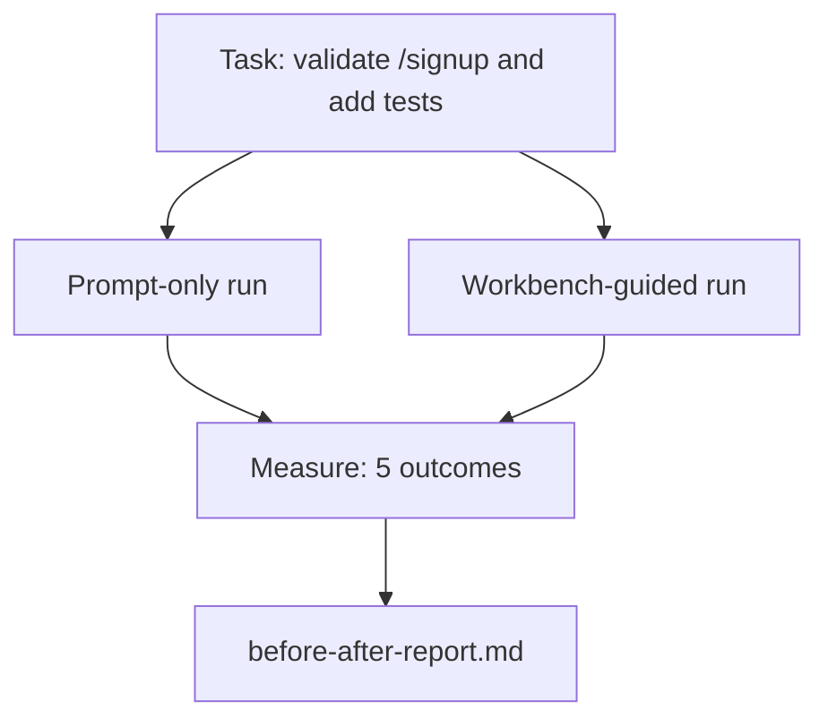

# میز کار در یک ریپو واقعی

> 11 درس از سطوح هیچ ارزشی ندارند اگر آنها از تماس با یک پایگاه کد واقعی زنده بمانند. این درس دو بار در یک برنامه نمونه کوچک کار مشابه را انجام می دهد: فقط به صورت فوری در مقابل هدایت شده توسط میز کار. اعداد استدلال می کنند.

**Type:** Build
**Languages:** Python (stdlib)
**Prerequisites:** Phases 14 · 32 to 14 · 40
**Time:** ~60 minutes

## اهداف یادگیری

- هفت سطح میز کار را روی یک برنامه کوچک به هم ببندید.
- دو بار یک کار را انجام دهید (تنها سریع و با راهنمایی روی میز کار) و پنج نتیجه را اندازه گیری کنید.
- گزارش قبل/پس را بخوانید و تصمیم بگیرید که کدام سطوح بیشترین نفوذ را داشته باشند.
- از دست دادن "اما مدل من به اندازه کافی خوب است" دفاع کنید.

## مشکل

یک نمایش در یک کار اسباب بازی هیچ کس را متقاعد نمی کند. پرونده برای میز کار زمانی ساخته می شود که یک کار واقعی در یک کار بازبینی واقعی با شکست های کمتر، بازگشت های کمتر و یک بسته ای که جلسه بعدی می تواند استفاده کند، در تولید قرار می گیرد.

این درس این حس واقعی را به ارمغان می آورد و از طریق هر دو خط لوله کار مشابهی را انجام می دهد. نتیجه یک گزارش قبل / بعد است که می توانید به یک تردید کننده بدهید.

## مفهوم



### اپلیکیشن نمونه

يه دسترسي کمي به سبک FastAPI در`sample_app/`:

- `app.py`با`/signup`(حالا تایید نشده)
- `test_app.py`با يک آزمون راه خوشبختی
- `README.md`و`scripts/release.sh`به عنوان طعمه منطقه ممنوعه

### وظیفه

> اعتبار ورودی را به  اضافه کنید`/signup`: رد رمز عبور کمتر از 8 حرف، بازگشت 422 با یک پاکت خطای تایپ شده. اضافه کردن یک آزمون که رفتار جدید را ثابت می کند.

### دو خط لوله

فقط به محض:

1. README رو بخونيد
2. بخون`app.py`. .
3. پرونده ها رو ویرایش کن
4. ادعا تموم شد

با راهنمای میز کاری:

1. اسکریپت init رو اجرا کن (درسه 35).
2. قرارداد را مطالعه کنید (درسه 36).
3. حالت خواندن (درسه 34).
4. فقط پرونده های مجاز را ویرایش کنید.
5. دستور پذیرش را از طریق بازخورد (درسی ۳۷) اجرا کنید.
6. دروازه تایید رو اجرا کن (درسه 38).
7. بازرس اجرا (درسه 39).
8. ایجاد تبادل دست (درسه ۴۰)

### پنج نتیجه اندازه گیری شده

| Outcome | Why it matters |
|---------|----------------|
| `tests_actually_run` | Most "tests passed" claims are unverifiable |
| `acceptance_met` | The test that proves the goal must be the test that ran |
| `files_outside_scope` | Scope creep is the dominant silent failure |
| `handoff_quality` | The next session pays for or benefits from this |
| `reviewer_total` | Qualitative judgment on top of the gate |

```figure
wb-ab-runs
```

## آن را بسازید

`code/main.py`این برنامه به صورت یک برنامه ای که با یک برنامه مشابه است، دو خط لوله را تنظیم می کند. هر دو خط لوله به صورت اسکریپت (هیچ LLM در حلقه) نوشته شده است، بنابراین اندازه گیری قابل تکرار است. اسکریپت مقایسه را به `before-after-report.md`و`comparison.json`. .

اجرا کن

```
python3 code/main.py
```

خروجی: یک جدول کنسول نتایج هر خط، گزارش نشان دادن ذخیره شده در کنار اسکریپت، و JSON برای هر کسی که می خواهد آن را نقشه برداری.

## الگوهای تولید در طبیعت

سوال شکمند این است که "برقی که میز کار واقعا کمک می کند؟" اعداد 2026 خیلی بیشتر از توضیح می گویند.

**Terminal Bench Top-30 to Top-5 on the same model.***آناطومی یک آژانت هارنس LangChain * (اپریل 2026): یک آژانت کوڈنگ از خارج از 30 درجه اول به رتبه پنجم در ترمینال بنچ 2.0 با تغییر فقط هارنس. همان مدل. سطوح مختلف. بیست و پنج درجه دلتا.

**Vercel 80% to 100% by deleting tools.**ورسل گزارش داد که حذف 80 درصد از ابزار های عاملش باعث شد میزان موفقیت از 80 درصد به 100 درصد برسد. سطح ابزار کوچکتر، دامنه تیز تر، راه های کمتری برای شکست. فضای منفی برنده می شود.

**Harvey 2x accuracy via harness alone.**ماموران حقوقی دقت خود را بیش از دو برابر با بهینه سازی استفاده از، هیچ تغییر مدل.

**88% of enterprise AI agent projects fail to reach production.**مقاله preprints.org *Harness Engineering for Language Agents* (مارس 2026) به دلیل شکست ها به زمان اجرا، نه استدلال، نشان می دهد: حالت قدیمی، تلاش های ضعیف، زمینه های بیش از حد رشد کرده، بهبود ضعیف از اشتباهات میانگین.

**Long-context collapse.**در شرایط طولانی مدت، موفقیت 40-50٪ در شرایط طولانی، عمدتا از حلقه های بی نهایت و از دست دادن هدف کاهش می یابد.

**False negatives still exist.**وظایف واقعی یک مرحله ای، یک خط، اجراهای فرمتر، هر چیزی که مدل به معنای واقعی کلمه یاد گرفته است  این ها فقط سریعتر به سرعت اجرا می شوند. معیار باید آنها را صادقانه لیست کند تا میز کار به عنوان بیش از حد تعریف نشود.

این نکته مهم نیست که "هیرنس برای همیشه برنده می شود". مدل ها در طول زمان ترفند های هیرنس را جذب می کنند. نکته مهم این است که امروزه، بار مهندسی در هفت سطح قرار دارد و اعداد آن را ثابت می کند.

## ازش استفاده کن

اين درس پرونده پرونده اي است که شما در موردش نقل مي كنيد

- کسي مي پرسد چرا هر پي آر يه`agent-rules.md`و قرارداد محدوده
- يه تيم ميخواد دروازه ي تصديق رو از دست بده فقط براي اين اسپرينت
- یک محصول جدید از آژانس عرضه می شود و شما نیاز به یک معیار قابل حمل برای اینکه آیا آن را در واقع زمان صرفه جویی.

اعداد از توضیح فراتر می روند.

## -باده

`outputs/skill-workbench-benchmark.md`یک ابزار ارزیابی قابل حمل است که هر محصول عامل را از طریق هر دو خط لوله با برنامه نمونه پروژه خود اجرا می کند و پنج نتیجه را گزارش می دهد.

## تمرینات

1. یک نتیجه ششم اضافه کنید: زمان به اولین ویرایش معنی دار. چگونه آن را تمیز اندازه گیری کنید؟
2. در مورد يه کار واقعي روز دوم در پايه کد خود مقایسه رو انجام بده
3. اضافه کردن یک "منفی نادرست": وظایف که فقط به سرعت انجام می شود و هزینه بالای میز کار هزینه واقعی است. به هر حال دفاع از حفظ میز کار کنید.
4. "آژانت" متنش رو با يه تماس واقعي براي مدرک تحصيلي عوض کنيد.
5. نویسنده خلاصه ی یک صفحه ای که به یک غیر مهندسین هدف قرار داده شده است.

## اصطلاحات کلیدی

| Term | What people say | What it actually means |
|------|----------------|------------------------|
| Sample app | "Toy repo" | Small but realistic enough to exercise all seven surfaces |
| Pipeline | "Workflow" | Ordered sequence of surface reads/writes the agent follows |
| Before/after report | "The receipts" | The artifact you hand to a skeptic |
| False negative | "Workbench overkill" | Tasks where prompt-only is faster; useful to enumerate honestly |
| Workbench benchmark | "Reliability score" | Portable harness that runs the comparison on your codebase |

## خواندن بیشتر

- [LangChain, The Anatomy of an Agent Harness](https://blog.langchain.com/the-anatomy-of-an-agent-harness/) رسید بینچ ترمینال Top-30 تا Top-5
- [MongoDB, The Agent Harness: Why the LLM Is the Smallest Part of Your Agent System](https://www.mongodb.com/company/blog/technical/agent-harness-why-llm-is-smallest-part-of-your-agent-system) ارقام ورسل + هاروی
- [preprints.org, Harness Engineering for Language Agents](https://www.preprints.org/manuscript/202603.1756) 88٪ نرخ شکست شرکت، علت اصلی زمان اجرا
- [HN: Improving 15 LLMs at Coding in One Afternoon. Only the Harness Changed](https://news.ycombinator.com/item?id=46988596) در 15 مدل تکرار شده است
- [Cloudflare, Orchestrating AI Code Review at Scale](https://blog.cloudflare.com/ai-code-review/) 131 هزار بار بازرسی / 30 روز تولید
- [Anthropic, Building Effective Agents](https://www.anthropic.com/research/building-effective-agents)
- مراحل 14 · 32 تا 14 · 40  سطوح این درس تمرینات پایان به پایان
- مرحله 14 · 19  SWE-بینچ، GAIA، AgentBench به عنوان معیار های ماکرو این درس تکمیل می شود
- مرحله 14 · 30  توسعه عامل ارزیابی شده همان وصل های آرمینش به
