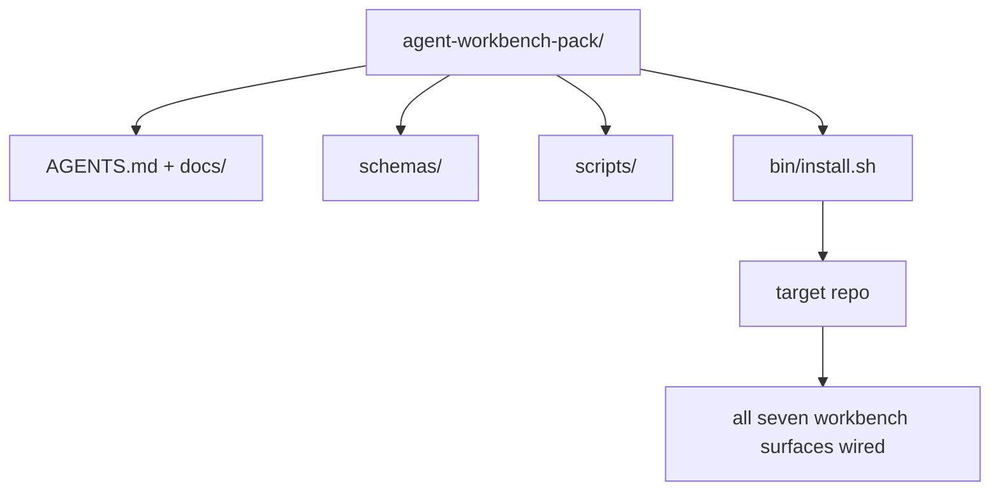

# سنگ سنگ: یک بسته کارکن عامل قابل استفاده مجدد ارسال کنید

> اين آهنگ کوچولو با يه بسته اي که تو هر رپو به دست مياد تموم ميشه.`cp -r`و صبح بعد یک مامور به طور قابل اعتماد کار کند. سنگ اصلی این آرتیفاکت است که این برنامه آموزشی در آن معامله می کند.

**Type:** Build
**Languages:** Python (stdlib)
**Prerequisites:** Phases 14 · 31 to 14 · 41
**Time:** ~75 minutes

## اهداف یادگیری

- هفت صفحه ی میز کاری را به یک دایرکتوری جمع کنید.
- طرح ها، اسکریپت ها و قالب ها را پیک کنید تا یک repo جدید یک خط پایه شناخته شده داشته باشد.
- یک اسکریپت نصب کننده را اضافه کنید که بسته را بی وقت و بدون قدرت قرار دهد.
- تصمیم بگیرید چه چیزی در بسته باقی می ماند و چه چیزی خارج می ماند، دفاع از برش برای هر یک.

## مشکل

یک میز کاری که در یک Google Doc، یک تاریخچه چت و سه اسکریپت نیمه یاد شده زندگی می کند، یک میز کاری است که هر سه ماهه بازسازی می شود. درمان یک بسته نسخه ای است: یک repo یا دایرکتوری با سطوح، طرح ها، اسکریپت ها و یک نصب یک فرمان.

تو اين درس رو با`outputs/agent-workbench-pack/`در دیسک و یک`bin/install.sh`که به هر هدف بازتاب داده شود.

## مفهوم



### طرح بسته

```
outputs/agent-workbench-pack/
├── AGENTS.md
├── docs/
│   ├── agent-rules.md
│   ├── reliability-policy.md
│   ├── handoff-protocol.md
│   └── reviewer-rubric.md
├── schemas/
│   ├── agent_state.schema.json
│   ├── task_board.schema.json
│   └── scope_contract.schema.json
├── scripts/
│   ├── init_agent.py
│   ├── run_with_feedback.py
│   ├── verify_agent.py
│   └── generate_handoff.py
├── bin/
│   └── install.sh
└── README.md
```

### چه چيزي در مي ماند و چه چيزي خارج

در:

- نقشه هاي سطح، اينها قرارداد هستن
- چهار اسکریپت بالا، زمان اجرا هستن
- چهار سند، قانون و قانون

بیرون:

- وظایف خاص پروژه، وظایف متعلق به هیئت ارجاع هدف هستند نه به بسته
- فروشنده SDK تماس می گیرد. بسته از چارچوب های بیگانه است.
- اون کليپ ها در کنار کليپ هاي موجود تیم زندگي ميکنن نه داخلشون

### نصب کننده

يه کوتاه`bin/install.sh`(یا `bin/install.py`):

1. بدون اینکه `--force`. .
2. کپي بسته رو به بازخريد هدف ميکنه
3. تار ها به صورت CI`.github/workflows/`وجود داره
4. مراحل بعدی را چاپ کنید: صفحه را پر کنید، دستورات پذیرش را تنظیم کنید، اسکریپت init را اجرا کنید.

### نسخه بندی

بسته ای با یک`VERSION`فایل. سکیم ها و تغییرات اسکریپت که نیاز به مهاجرت دارند، بزرگ را افزایش می دهند. تغییرات فقط در اسناد، پیچ را افزایش می دهند.`agent_state.json`ثبت کرد که با کدام نسخه بسته شروع شده است.

```figure
wb-pack-install
```

## آن را بسازید

`code/main.py`بسته را به `outputs/agent-workbench-pack/`در کنار درس، با طرح ها و اسکریپت ها از درس های قبلی در این آهنگ کوچک و اسناد که قبلاً نوشته اید.

اجرا کن

```
python3 code/main.py
```

اسکریپت صفحات را کپی و پین می کند، README را می نویسد، درخت بسته را چاپ می کند و صفر را ترک می کند. تکرار بی اختیار است.

## الگوهای تولید در طبیعت

یک بسته تنها زمانی ارزشمند است که از شکاف ها، تازه ها و یک جریان ضد دوستانه در مقابل آن زنده بماند.

**`VERSION` is the contract, not the marketing.**ضربه های بزرگ نیاز به مهاجرت حالت دارند، ضربه های کوچک نیاز به چک دوباره اجرا می کنند، ضربه های پیچ فقط در اسناد هستند، نصب کننده می نویسد`.workbench-version`در هر نصب به ریپو هدف وارد می شود`lint_pack.py`اگر قفل هدف با بسته مخالف باشد، از حمل رد می شود`VERSION`اينطوره`npm`،`Cargo`و`pyproject.toml`10 سال از کار کردن زنده بمونيم، هيچ چيز در مورد ماموران قوانين رو عوض نميکنه

**Single source for cross-tool distribution.**نکس سفینه ی اول`nx ai-setup`که میگه`AGENTS.md`،`CLAUDE.md`،`.cursor/rules/`،`.github/copilot-instructions.md`این بسته باید همین کار را انجام دهد؛ نصب کننده لینک های سیمنامی را ارسال می کند (`ln -s AGENTS.md CLAUDE.md`پس یک منبع واقعی برای هر عامل کدگذاری پخش می شود.

**`uninstall.sh` that refuses on non-trivial state.**حذف بسته نباید پیام های کاربر را حذف کند `agent_state.json`،`task_board.json`، یا`outputs/`. دستگاه حذف کردن نقشه ها، اسکریپت ها، اسناد و`AGENTS.md`(با `--keep-agents-md`این برنامه در حال حاضر در حال انجام است و در صورت تغییر نامبرده در پرونده های دولتی، از ادامه کار خودداری می کند.

**Skill-as-publishable. SkillKit-style distribution.**بسته ها به عنوان مهارت SkillKit:`skillkit install agent-workbench-pack`این برنامه را در 32 عامل هوش مصنوعی از یک منبع واحد قرار می دهد. بسته ریپو منبع حقیقت است؛ SkillKit کانال توزیع است. قفل فروشنده سقوط می کند؛ هفت سطح یکسان باقی می ماند.

## ازش استفاده کن

سه جايگاه سفينه هاي بسته:

- **As a directory you drop into a repo.** `cp -r outputs/agent-workbench-pack /path/to/repo`. .
- **As a public template repo.**فارک و سفارشی کردن`VERSION`کنترل حرکت
- **As a SkillKit skill.**به محصول مامور شما متصل شده تا با يک فرمان بهشون اطلاع بده

بسته رو دستور کار ميکنه.هر بار يک وعده ميکنه.

## -باده

`outputs/skill-workbench-pack.md`یک بسته پروژه ای را ایجاد می کند: قوانین به تاریخچه تیم، دامنه های مربوط به repo، ابعاد Rubric با یک ورودی خاص دامنه گسترش می یابد.

## تمرینات

1. تصميم بگيريد که چه دوکيت پنجمي که لايق ترفيدي به گروه قنونيک باشه
2. نصبگر را به عنوان پایتون با یک `--dry-run`. پرچم .برابر ارگونومی با بش
3. اضافه کنید`bin/uninstall.sh`که بسته را به طور ایمن حذف می کند و اگر پرونده های دولتی سابقه ای غیر معمولی داشته باشند، انکار می کند.
4. اضافه کنید`lint_pack.py`که وقتی بسته از`VERSION`. به اطلاعات مربوطه براي بازپرداخت خودِ بسته منتقل کن
5. نویسنده کتاب حرکت مهاجرت از یک میز کاری دستی به این بسته.

## اصطلاحات کلیدی

| Term | What people say | What it actually means |
|------|----------------|------------------------|
| Workbench pack | "The starter kit" | A versioned directory carrying all seven surfaces |
| Installer | "Setup script" | `bin/install.sh` that lays the pack down idempotently |
| Pack version | "VERSION" | Major bumps for schema/script changes, patch for doc-only |
| Drop-in pack | "cp -r and go" | Pack works without per-repo customization on day one |
| Forkable template | "GitHub template" | Public repo that GitHub's "Use this template" can clone from |

## خواندن بیشتر

- مراحل 14 · 31 تا 14 · 41  هر سطحی که این بسته بسته بندی می کند
- [SkillKit](https://github.com/rohitg00/skillkit) این مهارت را در 32 عامل هوش مصنوعی نصب کنید
- [Nx Blog, Teach Your AI Agent How to Work in a Monorepo](https://nx.dev/blog/nx-ai-agent-skills) ژنراتور واحد در شش ابزار
- [agents.md — the open spec](https://agents.md/) آنچه را که روتر بسته شما باید پیاده سازی کند
- [HKUDS/OpenHarness](https://github.com/HKUDS/OpenHarness) اجرای مرجع یک بسته بندی معادل
- [Augment Code, A good AGENTS.md is a model upgrade](https://www.augmentcode.com/blog/how-to-write-good-agents-dot-md-files) بسته بندی اسناد کیفیت بار
- [Anthropic, Effective harnesses for long-running agents](https://www.anthropic.com/engineering/effective-harnesses-for-long-running-agents)
- [Anthropic, Harness design for long-running application development](https://www.anthropic.com/engineering/harness-design-long-running-apps)
- مرحله 14 · 30  توسعه یک عامل مبتنی بر ارزیابی که دروازه تأیید بسته را مصرف می کند
- مرحله 14 · 41  قبل از/ پس از این بسته بهبود می یابد
