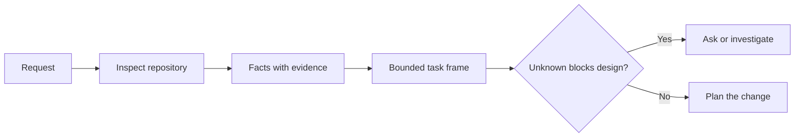

# قبل از اينکه مامور کد بنويسند، کار رو آماده کن

> یک عامل کدگذاری می تواند یک کار واضح را به سرعت اجرا کند. همچنین می تواند یک کار نامشخص را به سرعت اجرا کند. سرعت یکسان است. هزینه نیست.

**Type:** Learn + Build
**Languages:** Python (stdlib)
**Prerequisites:** Phase 14 lessons 31 and 36
**Time:** ~60 minutes

## اهداف یادگیری

- قبل از ویرایش یک درخواست را به یک فریم کار محدود تبدیل کنید.
- حقایق ذخیره سازی را از فرضیه ها و سوالات باز جدا کنید.
- راه های مجاز، راه های ممنوع و شواهد پذیرش را تعریف کنید.
- تصمیم بگیرید که چه زمانی شناسایی کافی برای شروع کار است.

## شکست گران قیمت

 اضافه کردن حفاظت دوگانه ایمیل به نظر می رسد مشخص است. این نیست. آیا منحصر به فرد بودن متعلق به API، سرویس دامنه یا پایگاه داده است؟ آیا مقایسه حساس است؟ چه شکل خطایی در حال حاضر عمومی است؟ آیا مهاجرت مجاز است؟ چه آزمون رفتار را ثابت می کند؟

یک عامل با توانایی این شکاف ها را با گزینه های قابل قبول پر می کند. این یک مورد خطرناک است زیرا اجرای می تواند تمیز، آزمایش شده و هنوز هم با سیستم سازگار نباشد.

بنابراین اولین واحد کار عامل کدگذاری، ویرایش نیست. این یک چارچوب کاری است که توسط شواهد ذخیره سازی پشتیبانی می شود.

## چارچوب وظایف

یک قاب مفید شش زمینه دارد:

| Field | Question |
|---|---|
| Goal | What observable behavior must change? |
| Repository facts | What did you verify in code, tests, config, or history? |
| Allowed paths | Where may the change land? |
| Forbidden paths | What must remain untouched? |
| Acceptance evidence | Which commands or observations prove the goal? |
| Unknowns | Which decisions still need evidence or human judgment? |

حقایق نیاز به رسید دارد. API 409 را برای تکراری استفاده می کند تا زمانی که شما می توانید به آزمون یا دستیار موجود اشاره کنید، واقعیت نیست. یک مسیر فایل و خط کافی است. یک نتیجه دستور بهتر است وقتی رفتار مهم است.



## شناختن به دنبال محدودیت ها است

کل مخزن را مطالعه نکنید. به دنبال سطوحی باشید که تغییر را محدود می کنند:

1. رفتار فعلی و دعوت کننده آن
2. نزديکترين آزمون موجود
3. قرارداد عمومی یا شکل سریالی
4. دستورالعمل پروژه که مسیر را اداره می کند.
5. دستورات ساخت و تایید
6. تغییرات مشابهی که الگوهای محلی را نشان می دهد

وقتی هر تصمیم برنامه ریزی شده یا با شواهد پشتیبانی می شود، به طور صریح به ارمغان می آید یا به عنوان نامعلوم ذکر می شود، متوقف شوید.

## ناشناخته ها شکست نیستند

یک ناشناخته شکاف کنترل شده است. یک فرضیه یک پاسخ کنترل نشده به آن شکاف است.

هر نامعلوم رو طبقه بندي کن:

- **Discoverable:**مخزن یا سیستم اجرا می تواند پاسخ دهد.
- **Decidable:**قرارداد وظیفه به مامور اجازه انتخاب را می دهد.
- **Human:**انتخاب تغییر رفتار محصول، هزینه، خطر یا سازگاری عمومی را تغییر می دهد.
- **Deferred:**انتخاب خارج از این قسمت است و متعلق به اهداف غیر هدف است.

اين مامور بايد از طریق ناشناخته هاي کشف شده و اختصاص داده شده ادامه بده و قبل از اينکه انتخاب به رمز دفن بشه بايد در ناشناختهاي انساني توقف کنه

## پذیرش قبل از اجرا

قبل از تکه ثابت رو بنویس

- یک واحد متمرکز یا یک فرمان آزمون ادغام؛
- یک سفر مرورگر با یک پورت دید نامگذاری شده و حالت انتظار می رود؛
- درخواست برق و قرارداد پاسخ دقیق
- اندازه گیری عملکرد با یک حد
- یک بررسی دامنه که تایید می کند هیچ فایل مرتبط با آن تغییر نکرده است.

تخت های موفق یک طرح اثبات نیست. آزمون معتبر و ادعای پشتیبانی شده را نام دهید.

## آن را بسازید

آزمایشگاه ساخت یک`TaskFrame`، مرزها و شواهدش رو تایید ميکنه و مي نويسه`outputs/task-frame.md`. .

از اين فهرست درس ها اجرا کنيد:

```bash
python3 code/main.py
python3 -m unittest discover code/tests -v
```

مثال را به چهار راه شکستن: حذف هدف، حذف رسید واقعیت، تعویض یک مسیر مجاز و ممنوع و حذف فرمان پذیرش. اعتبارگر باید هر فریم را به دلیل متفاوتی رد کند.

## از آن در یک مخزن واقعی استفاده کنید

قبل از اينکه از يه مامور درخواست تصميم بدم:

1. هدف رو به عنوان رفتار بنویس نه تغییر فایل
2. دو تا تا حقایق را با شواهد دقیق ثبت کنید.
3. کوچکترین مسیر مجاز را نام بزنید.
4. به طور صریح فضای منفی را نام بزنید.
5. دستور یا مشاهده ای را بنویسید که وظیفه را به پایان می رساند.
6. تصمیمات که هنوز به دست نیاوردی را لیست کن.

قاب باید روی یک صفحه نمایش قرار گیرد. اگر این کار نمی تواند انجام شود، ممکن است شامل چندین تغییر مستقل باشد.

## تمرینات

1. يه بگ واقعي از يکي از مخزن هاي تو رو باز کن بدون اينکه راه حل پيشنهاد کني
2. در چارچوب یه ادعای که در واقع فرضیه ای باشه پیدا کن و با شواهد جایگزینش کن
3. يه نفر ناشناس رو اضافه کن که جوابش مي تونه قرارداد رو عوض کنه
4. یک مسیر گسترده را به کوچکترین مجموعه امن تقسیم کنید.
5. به مدرک پذیرش رسید دامنه اضافه کنید.

## خواندن بیشتر

- [Nuseibeh and Easterbrook, Requirements Engineering: A Roadmap](https://www.cs.toronto.edu/~sme/papers/2000/ICSE2000.pdf)، برای تقویت اجرای اهداف دنیای واقعی و محدودیت های در حال تکامل.
- [Yang et al., SWE-agent: Agent-Computer Interfaces Enable Automated Software Engineering](https://arxiv.org/abs/2405.15793)، برای اثبات اینکه رابط اطراف یک عامل کدگذاری اثربخشی آن را تغییر می دهد.

## آنچه را که نگه داری

نگه دار`outputs/task-frame.md`. این ورودی برای درس بعدی است، جایی که چارچوب تبدیل به یک برنامه اجرا مبتنی بر شواهد می شود.
