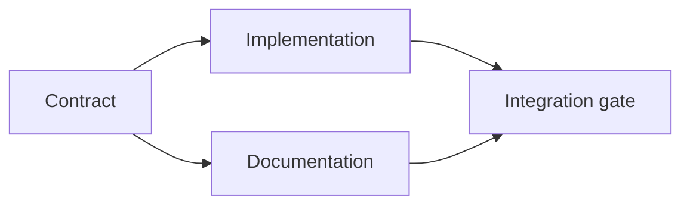

# برنامه ای برای اعدام که با شواهد پشتیبانی شود

> یک برنامه یک لیست کارهای زیبا نیست. این یک نمودار وابستگی است که در آن هر تغییر دلیل دارد و هر گره پایانی اثبات دارد.

**Type:** Learn + Build
**Languages:** Python (stdlib)
**Prerequisites:** Phase 14 lesson 43
**Time:** ~65 minutes

## اهداف یادگیری

- یک چارچوب کار را به عناصر کاری با شواهد و اثبات تبدیل کنید.
- ترتیب مدل به عنوان وابستگی ها به جای ترتیب پروزه
- کشف نکات گمشده، وابستگی های ناشناخته و چرخه های قبل از ویرایش.
- گام های جداگانه ای که می توانند با هم حرکت کنند از گام هایی که باید صبر کنند.

## چرا برنامه های مامورها شکست می خورند

برنامه های ضعیف درخواست را در زمان آینده تکرار می کنند:

1. API رو به روز کن
2. تست ها رو اضافه کن
3. اسناد تازه شده

هیچ چیز در این لیست نمی گوید چه چیزی یافت شده است، چرا این فایل ها درست هستند، کدام قرارداد در ابتدا تغییر می کند، یا چه چیزی می تواند همزمان اتفاق بیفتد. یک نماینده می تواند هر مرحله را دنبال کند و هنوز هم کار مجدد ایجاد کند.

یک برنامه قوی پنج تعهد را برای هر قطعه کاری می کند:

| Commitment | Purpose |
|---|---|
| Identifier | Stable reference for dependencies and handoff |
| Change | The smallest behavior or contract change |
| Evidence | Repository facts that justify the change |
| Dependencies | Work that must be true first |
| Proof | The exact check that closes the item |

## قبل از اجرای قرارداد برنامه ریزی کنید

هنگامی که سطوح متعدد به رفتار مشابه بستگی دارد، ابتدا رفتار را تعریف کنید. آزمایش ها، پیاده سازی، مستند سازی و ادغام می توانند سپس یک قرارداد را به جای اختراع چهار نسخه به اشتراک بگذارند.



این نمودار مواقعی امن را نشان می دهد. اجرای و اسناد می توانند پس از تعیین قرارداد با هم ادامه دهند. ادغام انتظار هر دو را دارد.

## شواهد برنامه را تغییر می دهد

شواهد ذخیره سازی تزئین نیست. باید قادر به تغییر کار باشد:

- یک دستیار موجود یک تجرید جدید برنامه ریزی شده را حذف می کند.
- یک آزمایش سازگاری یک مرحله مهاجرت را مجبور می کند.
- محدودیت های پیاده سازی تغییر طرح را به یک کار دیگر منتقل می کند.
- یک نوع پاسخ عمومی ترتیب اجرای و مستند سازی را تغییر می دهد.

اگر شواهد نمی توانند برنامه را تغییر دهند، احتمالاً این شواهد برای این تصمیم نیست.

## طراحی برای قطع

جلسات عامل کوڈنگ به طور غیر منتظره پایان می یابد. یک برنامه بازپذیرنده شامل موارد کاری کوچک است که می تواند جلسه دیگری تعیین کند:

- کدام کالا کامل است؟
- که چه مدرکی در جریان است؛
- چه آثار هنری تغییر کرده اند؛
- که کدام وابستگی ها اکنون باز شده اند؛
- . چه چيزي بايد به عنوان يه مورد امن بعد قرار بگيره

فقط در جعبه های انتخاب شده داخل چت حالت را رمزگذاری نکنید. برنامه را در کنار کار ذخیره کنید.

## اعتبار برنامه

برنامه قبل از اجرای آن را رد کنید اگر:

- یک شناسه دوگانه است؛
- یک قطعه کار هیچ مدرکی ندارد؛
- یک قطعه کار هیچ مدرک ندارد؛
- یک وابستگی نام یک عنصر ناشناخته را می نامد.
- نمودار شامل یک چرخه است؛
- اولین اقدام غیرقابل برگشت قبل از حل عدم اطمینان مربوطه رخ می دهد.

پنج چک اول مکانیک هستند، آخرین مورد نیاز قضاوت است و باید به طور صریح مطرح شود.

## آن را بسازید

`code/main.py`مدل های کار از موارد، تایید رسید های آنها، محاسبه امواج اجرا با یک نوع توپولوژیکی، و نوشتن `outputs/evidence-plan.json`. .

راه رفتن:

```bash
python3 code/main.py
python3 -m unittest discover code/tests -v
```

مثال سه موج تولید می کند. تعریف قرارداد اول اجرا می شود. پیاده سازی و اسناد با هم اجرا می شوند. دروازه ادغام آخر اجرا می شود.

## با یک عامل کدگذاری استفاده کنید

از مامور بگي قبل از اينکه پرونده ها رو عوض کنه نقشه رو درست کنه

1. هر ادعاي راه و رفتار يک رسيدگي ذخيره اي داره
2. هر کدوم از کدوم از کدوم از کدوم از کدوم از کدوم از کدوم از کدوم از کدوم از کدوم از کدوم از کدوم از کدوم از کدوم از کدوم از کدوم از کدوم از کدوم از کدوم از کدوم از کدوم از کدوم از کدوم از کدوم از کدوم از کدوم از کدوم از کدوم از کدوم از کدوم از کدوم از کدوم از کدوم از کدوم از کدوم از کدوم از کدوم از کدوم از کدوم از کدوم از کدوم از کدوم از کدوم از کدوم از کدوم از کدوم از کدوم از کدوم از کدوم از کدوم از کدوم از کدوم از کدوم از کدوم از کدوم از کدوم از کدوم از کدوم از کدوم از کدوم از کدوم از کدوم از کدوم از کدوم از کدوم از کدوم از کدوم از کدوم از کدوم از کدوم از کدوم از کدوم از کدوم از کدوم از کدوم از کدوم از کدوم از کدوم از کدوم از کدوم از کدوم از کدوم از کدوم از کدوم از کدوم از کدوم از کدوم از کدوم از کدوم از کدوم از کدوم از کدوم از کدوم از کدوم از کدوم از کدوم از کدوم از کدوم از کدوم از کدوم از کدوم از کدوم از کدوم از کدوم از کدوم از کدوم از کدوم از کدوم از کدوم از کدوم از کدوم از کدوم از کدوم از کدوم از کدوم از کدوم از کدوم از کدوم از کدوم از کدوم از کدوم از کدوم از کدوم از کدوم از کدوم از کدوم از کدوم از کدوم از کدوم از کدوم از کدوم از کدوم از کدوم از کدوم از کدوم از کدوم از کدوم از کدوم از کدوم از کدوم از کدوم از کدوم از کدوم از کدوم از کدوم از کدوم از کدوم از کدوم از کدوم از کدوم از کدوم از کدوم از کدوم از کدوم از کدوم از کدوم از کدوم از کدوم از کدوم از کدوم از کدوم از کدوم از کدوم از کدوم از کدوم از کدوم از کدوم از کدوم از کدوم از کدوم
3. این نمودار کار گران یا غیر قابل برگشت را تا زمانی که عدم اطمینان که از آن بستگی دارد حل شود، به تاخیر می اندازد.

برنامه رو تایید کن، نه یه قول مبهم که مراقب باشی

## تمرینات

1. یک آیتم مهاجرت که نیاز به تایید صریح انسان دارد اضافه کنید.
2. یک چرخه ایجاد کنید و اختلافات محصول پنهان را پشت آن توضیح دهید.
3. یک عنصر را که دو دستور اثبات دارد تقسیم کنید.
4. یک قطعه کاری را اضافه کنید که می تواند در موج دوم بدون لمس هر شاخه موجود اجرا شود.
5. نقشه رو به عنوان مارک داون برگردونيد و JSON رو به عنوان منبع حقيقت نگه داريد.

## خواندن بیشتر

- [Nuseibeh and Easterbrook, Requirements Engineering: A Roadmap](https://www.cs.toronto.edu/~sme/papers/2000/ICSE2000.pdf)، برای رابطه تکراری بین اهداف، مشخصات، توافق و تکامل.
- [Barry Boehm, A Spiral Model of Software Development and Enhancement](https://dl.acm.org/doi/10.1145/12944.12948)، برای ترتیب توسعه در مورد حل ریسک به جای یک ردیف خطی ثابت.

## آنچه را که نگه داری

نگه دار`outputs/evidence-plan.json`در درس بعد اين قرارداد به عنوان تفويضي تبديل ميشه
