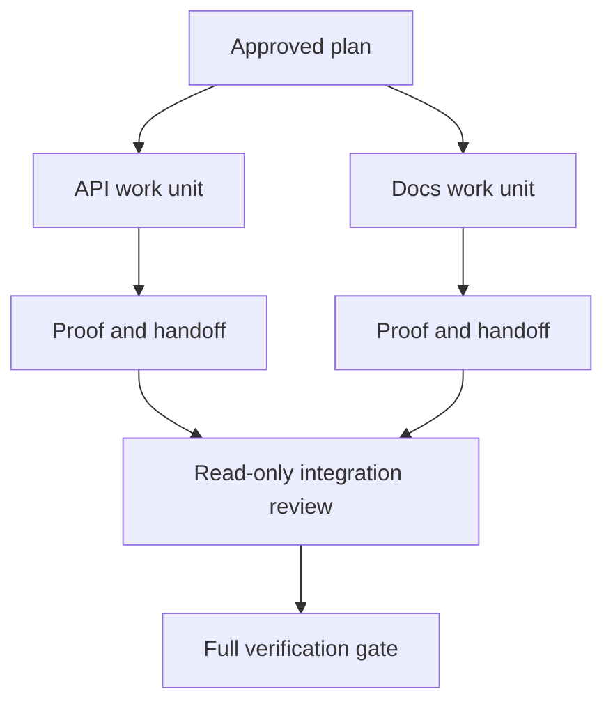

# نماینده با قراردادهای جداسازی و ادغام همکاری می کند

> عوامل موازی زمان دیوار را تنها زمانی که کار مستقل است صرفه جویی می کنند. در غیر این صورت آنها یک کار واضح را به یک مشکل هماهنگی با نرخ شکست سریع تر تبدیل می کنند.

**Type:** Learn + Build
**Languages:** Python (stdlib)
**Prerequisites:** Phase 14 lessons 39 and 44
**Time:** ~70 minutes

## اهداف یادگیری

- تصمیم گیری کنید که آیا انتقال به وسیله استقلال واقعی توجیه می شود یا خیر.
- به هر کارگر اجازه مالکیت پرونده و اثبات صریح بده
- موج های اجرا محاسبه از وابستگی ها
- یک قرارداد ادغام را برای ترکیب کار مامور به طور ایمن طراحی کنید.

## آزمون موازی

به خاطر اینکه عوامل بیشتری در دسترس هستند، به نمایندگی اختصاص ندهید.

- دو تحقیق می توانند به طور مستقل به ناشناخته های مختلف پاسخ دهند.
- دو اجرای پرونده و قرارداد های متمایز را دارند؛
- یک بازرس می تواند یک اثر هنری کامل را بدون تغییر آن بازرسی کند؛
- یک چک خارجی آهسته می تواند در حالی که کار محلی ادامه دارد اجرا شود.

وقتی که ماموران به پرونده های مشابه، تصمیمات حل نشده و یا محیط تغییر پذیر نیاز دارند، کار را سریال نگه دارید.

## یک واحد کار یک قرارداد است

هر واحد اختصاصی نیاز به:

| Field | Meaning |
|---|---|
| Goal | One observable result |
| Owner | One accountable worker |
| Paths | Exclusive write ownership |
| Dependencies | Completed units required before starting |
| Proof | Exact evidence returned to the integrator |
| Handoff | Files changed, decisions made, remaining risk |

داراگیری پشت سرانه یک واحد کار نیست. تطبيق چک دوگانه `app/accounts.py`و با آزمون حساب متمرکز ثابتش کن

## جداسازی سه لایه دارد

1. **Filesystem isolation:**درختان کار یا جعبه های شن جداگانه مانع ویرایش های مشترک تصادفی می شوند.
2. **Ownership isolation:**قراردادها مانع از اینکه دو کارگر عمداً مسیر یکسانی را ویرایش کنند می شود.
3. **State isolation:**ثبت و ثبت اطلاعات جداگانه مانع از اینکه یک کارگر مدارک کارگر دیگر را بیش از حد نوشته باشد.

جداسازی سیستم فایل ها مالکیت را حل نمی کند. دو درخت کار تمیز هنوز هم می توانند طرح های متناقض را تولید کنند. قرارداد ادغام باید قبل از شروع کار، رابط های مشترک را حل کند.



## سازنده کار را بازسازی نمی کند

یکپارچه کننده باید:

1. تایید کند که هر انتقال با دامنه اختصاصی اش مطابقت دارد؛
2. به دست آوردن مدرک را بخوانید نه فقط خلاصه کارکن
3. ترکیب تغییرات در ترتیب وابستگی؛
4. دروازه عبور واحد را به طور کامل اجرا کنید.
5. از گسترش دامنه پنهان انکار می کند؛
6. درگیری ها را به عنوان تصمیمات جدید ثبت کنید نه ویرایش های خاموش.

اگر ادغام نیاز به نوشتن بیشتر نتایج یک کارگر دارد، تجزیه اولیه اشتباه بود.

## نقش انسان و عامل

نمایندگی قضاوت انسانی را حذف نمی کند. انسان هنوز هم انتخاب هایی را دارد که رفتار عمومی، ریسک، اختیار یا هزینه های غیر قابل برگشت را تغییر می دهد. ماموران می توانند تحقیقات محدود، اجرای، تأیید و بررسی را داشته باشند.

این یک استقلال معیاری است: سیستم در صورتی که شواهد و بازپسین قوی باشد آزادی را فراهم می کند و در صورتی که پیامدهای آن زیاد باشد، یک نقطه کنترل را نیاز دارد.

## آن را بسازید

آزمایشگاه مسیرها رو بررسی می کنه، وابستگی ها رو تایید می کنه، امواج اجرا امن رو محاسبه می کنه و می نویسد`outputs/delegation-plan.json`. .

راه رفتن:

```bash
python3 code/main.py
python3 -m unittest discover code/tests -v
```

اون واحد دوک ها رو به مالکيت تبديل کن`app/`برنامه باید مسدود بشه چون مسیر اصلی واحد API رو همپوشه می کنه

## تمرینات

1. یک تغییر واقعی را به دو واحد کار مستقل و یک ادغامگر تجزیه کنید.
2. یک تقسیم موازی پیشنهاد شده را پیدا کنید که فقط مستقل به نظر می رسد.
3. یک کارمند تحقیقاتی را اضافه کنید که فقط برای خواندن است و نتیجه اش یک جدول واقعیت است.
4. یک دروازه ادغام را اضافه کنید که مجموعه فایل های تغییر شده نهایی را با تمام قراردادهای واحد بررسی کند.
5. یک قانون لغو برای کارگر که وابسته به آن باطل می شود تعریف کنید.

## خواندن بیشتر

- [Reid Smith, The Contract Net Protocol](https://doi.org/10.1109/TC.1980.1675516)، برای یک درمان رسمی اولیه توزیع وظایف و گزارش نتایج.
- [Eric Horvitz, Principles of Mixed-Initiative User Interfaces](https://dl.acm.org/doi/10.1145/302979.303030)، برای تصمیم گیری در مورد اینکه چه زمانی باید اتوماسیون عمل کند و چه زمانی باید کنترل را به یک فرد برگرداند.

## آنچه را که نگه داری

نگه دار`outputs/delegation-plan.json`این ثبت می کند که چرا تقسیم امن است، چه کسی مالک هر مسیر است و چه مدرک ادغام باید دریافت کند.
