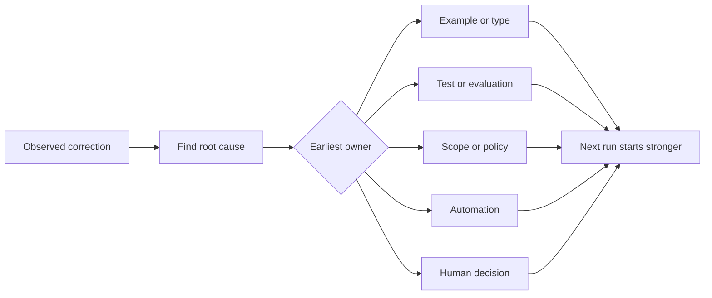

# هر تصحیح عامل را به بهبود سیستم تبدیل کنید

> اصلاحی که فقط در چت زندگی می کند یک اجرا را اصلاح می کند. اصلاحی که به یک آزمون، مرز، مثال یا ابزار ارتقا می یابد هر اجرا بعدی بهبود می یابد.

**Type:** Learn + Build
**Languages:** Python (stdlib)
**Prerequisites:** Phase 14 lessons 37 to 41
**Time:** ~65 minutes

## اهداف یادگیری

- اصلاحات عامل را به کنترل های دوامدار تبدیل کنید.
- هر کنترل رو در اولین لایه قرار بده که مانع تکرارش بشه
- درس های تکراری را با اثر انگشت ثابت تکرار کنید.
- کنترل های بازنشسته ای که دیگر از خطر واقعی محافظت نمی کنند.

## اصلاح ها شواهد هستند

وقتی به یک نماینده می گویید نویسی آن فایل نکنید، شما متوجه شده اید که محدوده دامنه اجرا نمی شود. وقتی می گویید این شکل خروجی اشتباه است، شما متوجه شده اید که یک مثال یا آزمایش گم شده است. وقتی تنظیم دوباره شکست می خورد، شما متوجه شده اید که دانش محیط زیست متعلق به اتوماسیون است.

اصلاح را به عنوان یک ملاحظه در مورد سیستم کار، نه به عنوان یک شکست در نوشتن فوری، رفتار کنید.

## به زودترین لایه موثر ارتقا دهید

از اين ترتيب استفاده کنيد:

| Recurring failure | Durable destination |
|---|---|
| Wrong result or regression | Test or evaluation |
| Off-scope or unsafe action | Scope or permission policy |
| Repeated setup or command mistake | Automation or tool |
| Repeated output-format mistake | Canonical example plus validator |
| Ambiguous local convention | Instruction with a scenario check |
| Product disagreement | Human decision record |

کنترل های قبلی ارزان تر هستند. یک نوع که از وضعیت ناشناس جلوگیری می کند قوی تر از یک نظرسنجی است که بعداً آن را دریافت می کند. یک آزمون متمرکز قوی تر از پاراگراف است که از عامل می خواهد به یاد داشته باشد.



## ثبت راتش

گرفتن:

- علائم
- علت اصلی؛
- نتیجه؛
- تعداد تکرار ها
- کنترل انتخاب شده؛
- بررسی برای کنترل؛
- مالک؛
- تاریخ بررسی یا بازنشستگی آن

هر یک از ترجیحات یک بار را تشویق نکنید، بلکه اصلاح را تشویق کنید وقتی تکرار یا نتیجه باعث پیچیدگی دائمی می شود.

## علت و نشانه های مختلف

آژان اصلاح شده README یک علائم است.

- وظیفه اجازه داده است ریشه مخزن را انجام دهد.
- اسناد ضمنی امن محسوب می شدند؛
- اجرای برنامه و اسناد مربوط به آن؛
- دو کارگر مالکيت متداول داشتند.

هر علت متعلق به کنترل متفاوتی است. یک قانون که فقط علائم را تکرار می کند در مورد مورد بعدی که کمی متفاوت است شکست می خورد.

## کنترل ها هم زوال می یابند

کنترل های قدیمی می توانند درگیری کنند، زمینه را بلعین کنند و یک سیستم که دیگر وجود ندارد را کدگذاری کنند. هر قاعده تبلیغاتی نیاز به چک بازنشستگی دارد. آن را حذف یا دوباره بنویسید زمانی که:

- ساختار اساسی تغییر کرده است؛
- کنترل قابل اجرا قوی تر جایگزین آن شد؛
- شکست در یک پنجره معنی دار تکرار نشده است؛
- کنترل موجب تحریک بیشتر از خطر جلوگیری می شود.

هدف این نیست که طولانی ترین فایل دستورالعمل باشد بلکه کوچکترین سیستم است که حریم قضاوت سخت بدست آمده را حفظ می کند.

## آن را بسازید

آزمایشگاه تصحیحات را طبقه بندی می کند، آنها را به کنترل ها معرفی می کند، اثر انگشت ها را دوبرابر می کند و می نویسد`outputs/feedback-ratchet.json`. .

راه رفتن:

```bash
python3 code/main.py
python3 -m unittest discover code/tests -v
```

دو اصلاح با کلمات متفاوت با یک علت اضافه کنید. به طور معمول سازی را بهبود بخشید تا آنها به یک کنترل بدون سقوط شکست های مرتبط سقوط کنند.

## تمرینات

1. پنج اصلاح از یک جلسه کد نویسی اخیر را بگیرید و صاحبان واقعی آنها را طبقه بندی کنید.
2. یک قانون در پروزه را با یک آزمون قابل اجرا جایگزین کنید.
3. وزن گیری نتیجه را اضافه کنید تا یک حادثه شدید اول بلافاصله ایجاد شود.
4. يه مالکي و تاريخ بازنشستي رو به محصول آزمايشگاه اضافه کن
5. یک دستور عامل موجود را بررسی کنید و آن را فقط پس از اثبات وجود کنترل قوی تر حذف کنید.

## خواندن بیشتر

- [Basili, Caldiera, and Rombach, The Goal Question Metric Approach](https://www.cs.toronto.edu/~sme/CSC444F/handouts/GQM-paper.pdf)، برای تبدیل اهداف به سوالات و اندازه گیری های عملیاتی.
- [Shinn et al., Reflexion](https://arxiv.org/abs/2303.11366)، برای استفاده از ردعمل برای بهبود تصمیمات بعدی بدون تغییر وزن مدل.
- [Madaan et al., Self-Refine](https://arxiv.org/abs/2303.17651)، برای بازخورد تکراری و بازبینی در یک حلقه کار.

## آنچه را که نگه داری

نگه دار`outputs/feedback-ratchet.json`. این پایان پایدار مسیر مهندسی کمک کننده است و ورودی برای تغییرات آینده در میز کار است.
