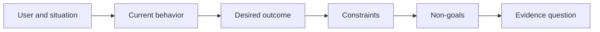

# پیش از انتخاب محصول، نتیجه را تعریف کنید

> اجرا سریع مجازات انتخاب مشکل اشتباه را افزایش می دهد. ابتدا نتیجه را شکل دهید تا سرعت به سمت درست اشاره کند.

**Type:** Learn + Build
**Languages:** Python (stdlib)
**Prerequisites:** None
**Time:** ~60 minutes

## اهداف یادگیری

- یک چارچوب نتیجه را بدون نام گذاری یک راه حل بنویسید.
- کاربر، موقعیت، رفتار فعلی و تغییر مطلوب را شناسایی کنید.
- محدودیت ها و اهداف غیر مشخص را مشخص کنید.
- کشف خروجی محلول قبل از اینکه در محدوده سخت شود.

## نتیجه نتیجه ای نیست

بنیای دستیار حادثه نام محصول را نام می دهد. آن را نمی گوید چه کسی به آن نیاز دارد، چه چیزی بهتر می شود یا چه چیزی باید ایمن بماند.

یک چارچوب نتیجه می گوید:

> وقتی یک هشدار تولید وارد می شود، مهندس در تماس، سرویس شکست خورده و یک اقدام بعدی ایمن را در عرض دو دقیقه شناسایی می کند، در حالی که تشخیص تنها قابل خواندن و قابل بررسی است.

این جمله می تواند با نرم افزار، یک کتاب اجرا، تعمیر داده یا تغییر رابط کوچک تر برآورده شود. این باعث می شود تیم به جای اولین اثر که کسی تصور می کند به نتیجه متصل باشد.

## چهارچوب شش بخش

| Part | Question |
|---|---|
| User | Who experiences the problem directly? |
| Situation | When and where does it occur? |
| Current behavior | What happens today, including workarounds? |
| Desired outcome | What observable state should improve? |
| Constraints | Which safety, policy, cost, or compatibility limits are fixed? |
| Non-goals | What tempting adjacent work is excluded? |



## پیدا کردن راه حل

بیانیه های نتیجه گیری راه حل هایی را که حاوی فرم محصول، رابط، انتخاب مدل، چارچوب یا معماری است که توسط شواهد بدست نیاورده شده است، از بین می برند.

- استفاده کنندگان یک خلاصه ی هفتگی هوش مصنوعی دریافت می کنند خلاصه و ترتیب آن را به دست می آورند.
- استفاده کنندگان قبل از تایید نتیجه را درک می کنند.
- بزارید یک پایگاه داده ویکتور انفراسٹرکچر دزدید
- در طول بررسی شواهد مربوطه در مورد سیاست ها در دسترس است بیان می کند که توانایی وجود دارد.

محدودیت ها می توانند تکنولوژی را نام دهند وقتی که سازگاری واقعاً آن را اصلاح می کند.

## محدودیت ها از نتیجه محافظت می کنند

محدودیت ها جزئیات اجرای نیستند. آنها بخشی از هدف دنیای واقعی هستند:

- هیچ محصولی در طول تشخیص نوشته نمی شود؛
- پاسخ در بودجه زمان وقوع حادثه
- رویدادهای موجود در مورد حسابرسی معتبر باقی می مانند؛
- هیچ وابستگی جدید در زمان اجرا وجود ندارد؛
- رفتارهای دسترسی باقی می ماند.

ساختمانی که با نقض محدودیت به نتیجه می رسد به نتیجه نمی رسد.

## اهداف غیرمستقیم، مرز را تعیین می کنند

اهداف غیرقابل هدف مانع از تبدیل یک قطعه مفید به یک پلتفرم می شوند. اهداف غیرقابل هدف خوب به اندازه کافی مشخص هستند تا کار را رد کنند:

- هیچ اصلاح خودکار وجود ندارد؛
- هیچ سیستم جدید جهت گیری هشدار داده نمی شود؛
- هیچ جایگزینی از فرمانده حادثه؛
- هيچ تحليل تاريخي در اين قسمت وجود نداره

## آن را بسازید

آزمایشگاه تاییدیه`OutcomeFrame`و می نویسد`outputs/outcome-frame.json`. .

```bash
python3 code/main.py
python3 -m unittest discover code/tests -v
```

نتیجه مطلوب را با استفاده از دستیار حادثه جایگزین کنید. اعتبار دهنده باید نشان دهد که محصول پیشنهادی به نتیجه نفوذ کرده است.

## تمرینات

1. یک درخواست ویژگی را از پس انداز خود به عنوان یک چارچوب نتیجه بازنویسی کنید.
2. یک محدودیت اضافه کنید که تغییر می کند که کدام راه حل ها هنوز ممکن هستند.
3. دو هدف غیر هدف اضافه کنید که قسمت اول را کوچک نگه دارند.
4. اولین ملاحظه ای را شناسایی کنید که نتیجه مطلوب را رد می کند.
5. سه نتیجه متفاوت را بنویسید که می تواند نتیجه مشابه را برآورده کند.

## خواندن بیشتر

- [Nuseibeh and Easterbrook, Requirements Engineering: A Roadmap](https://www.cs.toronto.edu/~sme/papers/2000/ICSE2000.pdf)، برای برخورد با اهداف دنیای واقعی به عنوان لنگر برای کار نرم افزار.
- [Dardenne, van Lamsweerde, and Fickas, Goal-Directed Requirements Acquisition](https://doi.org/10.1016/0167-6423(93)90021-G) برای اصلاح اهداف سطح بالا به محدودیت ها و الزامات عملیاتی.

## آنچه را که نگه داری

نگه دار`outputs/outcome-frame.json`درس بعدی این را با جریان کار مردم در واقع انجام می دهد.
