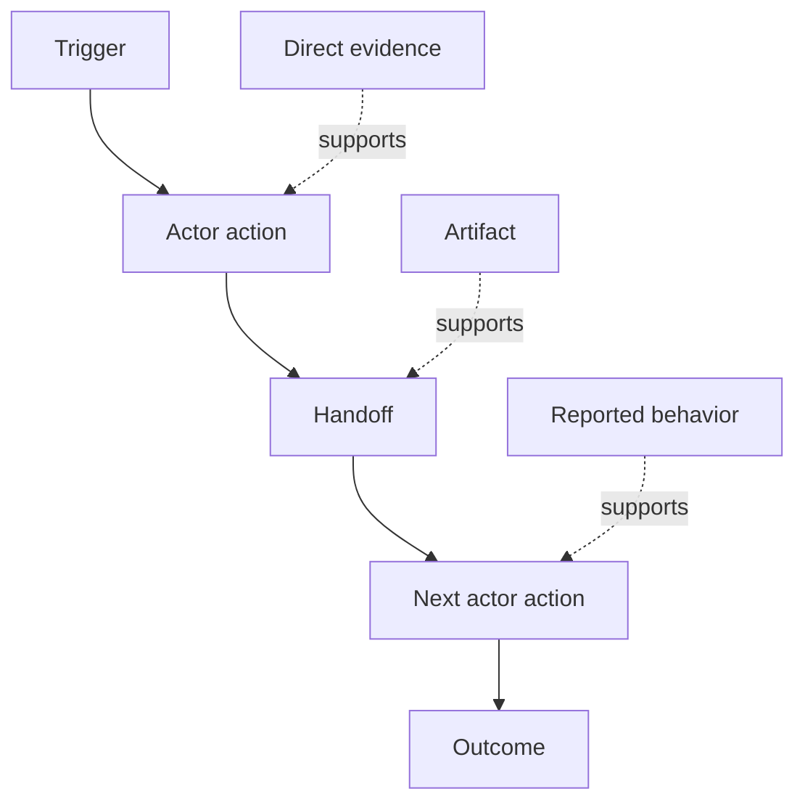

# کشف کنید که مردم واقعا چه کاری انجام می دهند

> الزامات در جلسه منتظر جمع آوری نیستند بلکه در میان اقدامات، راه حل ها، سوابق و اختلافات پخش می شوند.

**Type:** Learn + Build
**Languages:** Python (stdlib)
**Prerequisites:** Phase 14 lesson 47
**Time:** ~70 minutes

## اهداف یادگیری

- مدل جریان کار فعلی به عنوان اقدامات سفارش شده با شواهد.
- مشاهده مستقیم را از رفتار گزارش شده یا نتیجه گیری شده جدا کنید.
- در مورد تعصب، دست دادن، قدرت و حالت پنهان پیدا کنید.
- ادعاهای نامشخص را در نظر بگیرید و آن ها را به شرط تبدیل نکنید.

## با سیستم فعلی شروع کنید

از این که از مردم بپرسید چه ویژگی هایی می خواهند شروع نکنید، از این که آنچه که در حال حاضر اتفاق می افتد را بازسازی کنید شروع کنید.

برای هر مرحله، ثبت کنید:

| Field | Example |
|---|---|
| Actor | On-call engineer |
| Trigger | Production alert arrives |
| Action | Opens alert, then searches dashboards |
| Input | Alert payload and deployment record |
| Output | Candidate service and owner |
| Friction | Context switching across three tools |
| Authority | Incident commander approves a write |
| Evidence | Screen recording, incident log, runbook |

جریان کار بزرگتر از صفحه است. شامل انتظار، کپی-پست، کانال های جانبی، تایید، بازیابی خطا و مراحل که مردم متوجه نشده اند.

## شواهد قوی هستند

از یک پله ی ساده ی شواهد استفاده کنید:

1. **Direct behavior:**مشاهده، ردیابی، ضبط یا رویداد سیستم
2. **Artifact:**بلیط، دفترچه، دفترچه، فرم یا محصول تکمیل شده.
3. **Reported behavior:**یک فرد آنچه را که انجام می دهد توصیف می کند.
4. **Inference:**تیم نتیجه گیری می کنه که احتمالاً چه اتفاقی میفته

هر چهار مورد می توانند مفید باشند. تنها دو مورد اول رفتار فعلی را مستقیماً ثابت می کنند. بقیه را برچسب بزنید تا اعتماد به نفس به طور ساکت افزایش پیدا نکند.



## چهار چیز را جستجو کنید

- **Friction:**تلاش مکرر، تاخیر، بازگشت یا بهبود.
- **Hidden state:**حقایق که در حافظه، چت یا یادداشت های شخصی حمل می شوند.
- **Authority:**فرد یا سیستم اجازه داده شده تا تغییراتی را انجام دهد.
- **Exceptions:**در صورتی که جریان کار عادی عادی به حالت عادی دست پیدا کند.

ویژگی های هوش مصنوعی اغلب در ارائه و استثناء شکست می خورند زیرا مسیر خوشبختی تنها مسیر شکل گرفته بود.

## اختلافات را به طور متوسط دور نکنید

دو کاربر می توانند از دلایل خوبی جریان کار متفاوتی انجام دهند.

- نقش های مختلف؛
- سطوح خطر متفاوت؛
- سنت و روند فعلی؛
- تفاوت های تخصصی؛
- اختلاف واقعی در سیاست ها

یک جریان کار متوسط نمی تواند کسی را توصیف کند.

## آن را بسازید

آزمایشگاه شواهد را در هر مرحله از جریان کار ذخیره می کند، سفارش و اعتماد را تأیید می کند، نسبت شواهد مستقیم را محاسبه می کند و می نویسد`outputs/workflow-evidence.json`. .

```bash
python3 code/main.py
python3 -m unittest discover code/tests -v
```

یک مسیر استثنایی اضافه کنید که در آن رکورد انتشار گم شده است. دستور اصلی را سالم نگه دارید و ثبت کنید که شاخه از کجا شروع می شود.

## تمرینات

1. دوباره یک جریان کار را از یک دفترچه بدون مصاحبه با کسی بازسازی کنید.
2. مصاحبه با یک کاربر و هر ادعایی را که هنوز شواهد مستقیم ندارد، نشان دهید.
3. اضافه کردن یک مرز صلاحیت و یک مرحله بازیافت شکست.
4. مدل دو نوع جریان کار بدون ادغام آنها
5. ویژگی پیشنهادی را شناسایی کنید که یک گام قابل مشاهده را حذف می کند اما کار پنهان را بدون لمس می کند.

## خواندن بیشتر

- [Nuseibeh and Easterbrook, Requirements Engineering: A Roadmap](https://www.cs.toronto.edu/~sme/papers/2000/ICSE2000.pdf)، به خصوص رفتارش با ایجاد به عنوان تفسیر، مدل سازی و اعتبارگذاری به جای گرفتن ساده.
- [Gotel and Finkelstein, An Analysis of the Requirements Traceability Problem](https://doi.org/10.1109/ICRE.1994.292398)، برای مشکل حفظ رابطه بین الزامات و منابع آنها.

## آنچه را که نگه داری

نگه دار`outputs/workflow-evidence.json`. این در مورد تعریق و عدم اطمینان مشاهده شده به نقشه فرضیه در درس بعدی تبدیل می شود.
