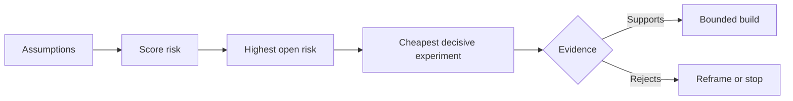

# فرضیه های نقشه برداری و اول ریسک پذیری را حل کنید

> نقشه راه عدم اطمینان را در داخل ویژگی ها پنهان می کند. نقشه فرضیه آنچه را که باید قبل از اینکه این ویژگی ها شایستگی وجود داشته باشند آشکار می کند.

**Type:** Learn + Build
**Languages:** Python (stdlib)
**Prerequisites:** Phase 14 lesson 48
**Time:** ~65 minutes

## اهداف یادگیری

- کار پیشنهادی را به فرضیه های صریح تبدیل کنید.
- تاثیر، عدم اطمینان و عدم برگشت پذیری را جداگانه ارزیابی کنید.
- تجربه بعدی رو با ریسک انتخاب کن نه با شور
- فرضیه های مورد آزمایش را با شواهد و تصمیمات جایگزین کنید.

## هر ساختمان شرط بندی دارد

یک ابزار حادثه ممکن است به این بستگی داشته باشد که همه اینها درست باشند:

- زمینه هشدار حاوی اطلاعات کافی برای شناسایی یک سرویس است؛
- مهندسان به توصیه ای که خودشان به آن ها نرسیده اند، اعتماد دارند.
- زمان پاسخ مطلوب از نظر عملیاتی مهم است؛
- داده های مورد نیاز بدون اجازه امنیتی قابل دسترسی هستند.
- جریان کار به اندازه کافی برای توجیه نگهداری اتفاق می افتد.

این ها وظایف پیاده سازی نیستند بلکه شرایطی برای ساخت ارزشمند، قابل استفاده، قابل اجرا و ایمن هستند.

## کلاس های فرضیه

| Class | Question |
|---|---|
| Value | Will the outcome matter enough? |
| Usability | Can the user understand and act on it? |
| Feasibility | Can the system produce it with available data and constraints? |
| Viability | Can the organization sustain cost, ownership, and operation? |
| Safety | Can it fail without unacceptable consequence? |

فرضیه ها را به عنوان اظهارات جعلی بنویسید. تفصیل مفید است نمی تواند آزمایش شود. 8 نفر از 10 مهندس در تماس با نتایج فقط برای خواندن می توانند خدمات درست را سریعتر شناسایی کنند.

## خطر یک عدد نیست

آزمایشگاه از سه ابعاد از یک تا پنج استفاده می کند:

- **Impact:**اگر فرض غلط باشد، آسیب می بیند.
- **Uncertainty:**ضعف شواهد فعلی.
- **Irreversibility:**هزینه یادگیری پس از تعهد.

نماد مثال تاثیر و عدم اطمینان را چند برابر می کند، سپس غیر قابل برگشتگی را اضافه می کند. فرمول جهانی نیست. هدف آن این است که تیم را مجبور کند که توضیح دهد چرا یک ناشناخته باید قبل از دیگری حل شود.



## یک آزمایش را طراحی کنید، نه یک مراسم تایید

یک آزمایش مفید شامل:

- ادعایی که می تواند نادرست باشد؛
- یک جمعیت یا نمونه واقعی؛
- یک نتیجه قابل مشاهده؛
- یک حد تعیین شده قبل از نتیجه؛
- تصمیم بعدی برای عبور، شکست و شواهد مبهم

از آزمایشاتی که فقط نشان می دهد تیم می تواند ایده را بسازد اجتناب کنید.

## برگشت پذیری تغییر ترتیب

انتخاب های با نتیجه ای بالا و غیر قابل برگشت نیاز به شواهد قبلی دارند. یک بازی مجدد فقط برای خواندن می تواند پیش از یک ادغام تولید باشد. یک آداپتور موقت می تواند پیش از مهاجرت داده ها باشد. یک توصیه تایید شده توسط انسان می تواند پیش از عمل خودکار باشد.

شکل ساخت باید شکل عدم اطمینان را دنبال کند.

## آن را بسازید

آزمایشگاه فرضیه ها را مرتب می کند، ادعاهای باز را از ادعاهای آزمایش شده جدا می کند، بالاترین ریسک باز را انتخاب می کند و می نویسد`outputs/assumption-map.json`. .

```bash
python3 code/main.py
python3 -m unittest discover code/tests -v
```

شواهد را در فرضیه خطر بالا تغییر دهید و مشاهده کنید که آزمایش بعدی چگونه تغییر می کند.

## تمرینات

1. پنج فرضیه برای یک ویژگی که می خواهید بسازید بنویسید.
2. یک فرضیه ایمنی اضافه کنید که لیست ویژگی های شما حذف شده است.
3. يه حد مشخص کن که باعث بشه ساختمون رو متوقف کني
4. یک آزمایش بزرگ را با یک آزمایش مهم ارزان تر جایگزین کنید.
5. رتبه بندی ریسک را با اولویت نقشه راه مقایسه کنید و عدم مطابقت را توضیح دهید.

## خواندن بیشتر

- [Barry Boehm, A Spiral Model of Software Development and Enhancement](https://dl.acm.org/doi/10.1145/12944.12948)، برای یک چرخه توسعه مبتنی بر ریسک که قبل از تعهد عمیق تر عدم اطمینان را حل می کند.
- [Dardenne, van Lamsweerde, and Fickas, Goal-Directed Requirements Acquisition](https://doi.org/10.1016/0167-6423(93)90021-G) برای اصلاح اهداف در حالی که مانع و محدودیت ها را در سطح می گیرد.

## آنچه را که نگه داری

نگه دار`outputs/assumption-map.json`دروس بعدی ازش استفاده می کنه تا کوچکترین قطعه رو انتخاب کنه که میتونه شواهد حتمي رو به دست بیاره
