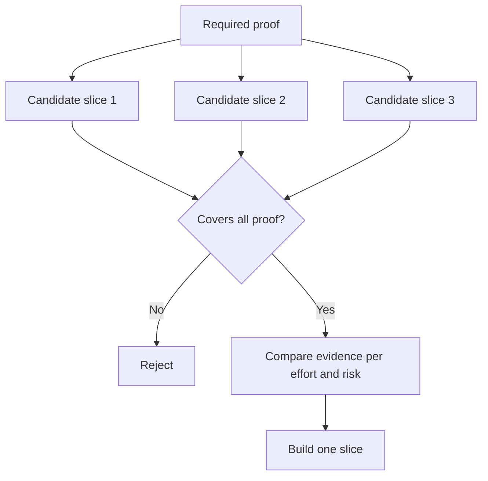

# کوچکترین قطعه را انتخاب کنید که می تواند تصمیم را تغییر دهد

> کوچک تنها زمانی مفید است که چیزی مهم را ثابت کند. یک ساخت کوچک که نمی تواند تصمیم بعدی را تغییر دهد، فقط نامکمل است.

**Type:** Learn + Build
**Languages:** Python (stdlib)
**Prerequisites:** Phase 14 lesson 49
**Time:** ~65 minutes

## اهداف یادگیری

- از فرضيهايي که ثابت ميکنه، يه قطعه رو تعريف کن
- ارزش نتیجه، کاهش عدم اطمینان، تلاش و نتیجه را متعادل کنید.
- شواهد برگشت پذیر را به نسبت تعهد به تولید زودرس ترجیح می دهم.
- قطعات را که بخش خطرناک جریان کار را حذف می کنند رد کنید.

## شواهد عمودی از آخر تا آخر

یک قطعه مفید حداقل جریان کار واقعی مورد نیاز برای مشاهده یک نتیجه را عبور می کند. می تواند در کاربران، داده ها، مدت زمان و قابلیت محدود باشد. نباید با حذف عدم اطمینان دقیق که شما نیاز به آزمایش دارید، محدود باشد.

نمونه هایی:

- بازي فقط براي خواندن در 10 حادثه واقعي، شناسایی خدمات و اعتماد اپراتور را امتحان ميکنه.
- یک داشبورد رنگی بر روی داده های مصنوعی می تواند درک را آزمایش کند اما امکان پذیر بودن داده ها را نمی تواند.
- یک دستگاه خودسازي تولید همه چیز را به یکباره با عواقب غیرقابل قبول آزمایش می کند.

## اول اثبات مورد نیاز را تعریف کنید

فرضیه های باز با بالاترین ریسک را بگیرید و آنها را به مجموعه اثبات مورد نیاز تبدیل کنید. یک قطعه کاندید تنها زمانی واجد شرایط است که آن مجموعه را پوشش دهد.

سپس قطعات واجد شرایط را در:

| Dimension | Direction |
|---|---|
| Outcome value | More is better |
| Uncertainty reduced | More is better |
| Effort | Less is better |
| Consequence | Less is better |
| Reversibility | More is better |

نمره لابراتوار عمدا ساده است. دروازه واجد شرایطی مهم تر از حساب است.



## حداقل های نادرست رایج

- **The UI-only minimum:**داده ها و عدم اطمینان عملیاتی را حذف می کند.
- **The infrastructure-only minimum:**امکان فنی بدون ارزش کاربر را اثبات می کند.
- **The happy-path minimum:**استثنایی که بیشترین ریسک را ایجاد می کند را حذف می کند.
- **The demo minimum:**یک اثر متقاعد کننده تولید می کند اما هیچ اندازه گیری تکراری وجود ندارد.
- **The platform minimum:**ماشین آلات قابل استفاده مجدد را قبل از اینکه یک جریان کار به آن دست یابد، می سازد.

## اضافه کردن قاعده توقف

قبل از اجرای، اگر برش شکست یابد چه اتفاقی می افتد را بنویسید:

- از نتیجه دست دادن؛
- تغییر در کاربر هدف یا وضعیت؛
- آزمایش مکانیسم دیگری؛
- جمع آوری شواهد بهتر؛
- قدرت محدود تر

اگر هر نتیجه به ساخت ادامه دهد، قطعه آزمایش نیست.

## آن را بسازید

آزمایشگاه کاندیداها را با مدرک مورد نیاز فیلتر می کند، قطعات واجد شرایط را نمره می زند و می نویسد`outputs/slice-decision.json`. .

```bash
python3 code/main.py
python3 -m unittest discover code/tests -v
```

یک کاندیدای ارزان تر را اضافه کنید که فقط یک فرضیه مورد نیاز را ثابت کند. حتی اگر نمره عددی اش بالا باشد، باید غیرقابل انتخاب بماند.

## تمرینات

1. سه برش برای یک نتیجه در سطوح مختلف نتیجه طراحی کنید.
2. قبل از نمره دادنشون مدرک لازم رو بيان کن
3. در حالی که شواهد قطعی را حفظ می کنیم، یک قابلیت را حذف کنیم.
4. براي خلبان شکست خورده يه قاعده توقف اضافه کن
5. یک قطعه پلیتفورم قابل استفاده مجدد را شناسایی کنید که باید تا بعد از برش صبر کند.

## خواندن بیشتر

- [Barry Boehm, A Spiral Model of Software Development and Enhancement](https://dl.acm.org/doi/10.1145/12944.12948)، برای تطابق هر چرخه توسعه با ریسک هایی که باید حل کند.
- [Lenarduzzi and Taibi, MVP Explained: A Systematic Mapping Study on the Definitions of Minimal Viable Product](https://arxiv.org/abs/1609.07592)، برای عدم وضوح در مورد کمترین و قابل اجرا در شیوه تولید نرم افزار.

## آنچه را که نگه داری

نگه دار`outputs/slice-decision.json`اون میگه چرا این قطعه کوچک ترین قطعه است که می تونه تصمیم رو تغییر بده
