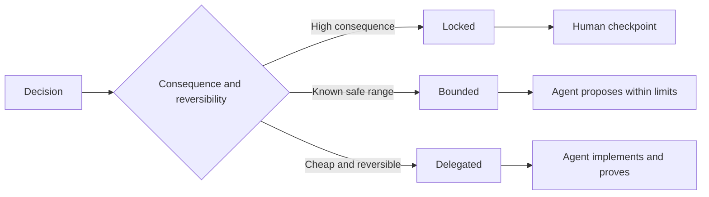

# توضیحاتی که قضاوت را حفظ می کند بنویسید

> یک مشخصات مفید متغیرها و شواهد را درست می کند و در عین حال گزینه های قابل برگشت را باز می کند. این یک مرز تصمیم گیری است، نه یک سیناریو.

**Type:** Learn + Build
**Languages:** Python (stdlib)
**Prerequisites:** Phase 14 lesson 50
**Time:** ~75 minutes

## اهداف یادگیری

- نتیجه جداگانه، غیر متغیر، مثال، غیر اهداف و اثبات.
- تصمیمات را به عنوان بسته، محدود یا اختصاص داده شده نشان دهید.
- در جایی که انتخاب ها ارزان و قابل برگشت باشند، قضاوت های عامل را حفظ کنید.
- به نقاط بازرسی انسانی نیاز داشته باشید که در آن نتیجه یا رفتار عمومی تغییر کند.

## دو نوع بد

یک کار زیر مشخص کردن از یک عامل می خواهد که سیستم را حدس بزند. یک کار بیش از حد مشخص شده از او می خواهد که یک طرح را که ممکن است اشتباه باشد نقل کند.

وسط مفید یک قرارداد قابل اجرا است:

| Surface | Purpose |
|---|---|
| Outcome | The observable result |
| Invariants | Conditions that must always remain true |
| Examples | Concrete cases that reveal intent |
| Non-goals | Adjacent behavior intentionally excluded |
| Decision policy | Which choices are locked, bounded, or delegated |
| Proof | Evidence required before completion |

## سه روش تصمیم گیری

- **Locked:**استفاده برای مطابقت عمومی، صلاحیت، ایمنی، هزینه های غیر قابل برگشت یا تعهد محصول.
- **Bounded:**در این حالت، این عامل می تواند در محدوده های صریح انتخاب کند. برای بودجه های جستجو، شمارش مجدد، وابستگی های مجاز یا یک خانواده رابط شناخته شده استفاده شود.
- **Delegated:**این عامل مالک انتخاب است و باید آن را توضیح دهد. استفاده برای ساختار محلی، نام، ریفاکتورهای برگشت پذیر و جزئیات پیاده سازی.



## رفتار را از طریق مثال مشخص کنید

مثال ها قصد را بهتر از صفت ها فشرده می کنند.  مفید، قوی، و  آماده تولید قابل اجرا نیستند. مجموعه کوچک از مثال های عادی، لبه، شکست و ممنوع هر دو به سازنده و تأیید کننده چیزی مشخص می دهد.

مثال ها جایگزین متغیرات نمی شوند. یک مورد عبور نمی تواند یک قانون ایمنی جهانی را ثابت کند.

## شواهد باید با ادعای مربوط باشد

- یک آزمایش واحد یک قرارداد عملکرد محلی را ثابت می کند.
- یک آزمایش سیم ثابت می کند که سریالیزاسیون و رفتارهای حمل و نقل
- سفر مرورگر ثابت می کند که مسیر رابط است.
- مجموعه بازي نشان دهنده رفتار در مورد موارد تمثيلي است.
- یک دفترچه حسابرسی ثابت می کند که مرز های اختیار برقرار شده است.

یک لایه پایین تر را به عنوان اثبات ادعای لایه بالاتر قبول نکنید.

## به خاطر خاطر داشته باشید که چه چیزی را نمی دانید

یک مشخصات می تواند بگوید تطبيق می تواند هر منبع صرفا برای خواندن را انتخاب کند که در بودجه زمانی باز می گردد. این نامعلمی نیست. این یک تصمیم ارادی و مرخصی با یک مرز و اثبات است.

مشخصات باید در زمان تغییر شواهد تکامل یابد. دلیل انتخاب های بسته و محدود را حفظ کنید تا تیم های بعدی بتوانند بدون باستان شناسی آنها را بررسی کنند.

## آن را بسازید

آزمایشگاه هر سطح قرارداد رو تایید ميکنه، روش تصميم رو چک ميکنه و مي نويسه`outputs/executable-specification.json`. .

```bash
python3 code/main.py
python3 -m unittest discover code/tests -v
```

تصمیم نوشتن تولید را از قفل به تفویض منتقل کنید. توضیح دهید که چرا طرح ارزش را قبول می کند اما خطر محصول قبول نمی کند.

## تمرینات

1. یک بلیط پس انداز را به شش سطح مشخصات تبدیل کنید.
2. سه دستورالعمل پیاده سازی را با یک متغیر و دو مثال جایگزین کنید.
3. هر تصميم رو مشخص کن و هر تصميمي که بسته يا محدود شده باشه رو توجيه کن
4. برای هر متغیر، یک رسید اثبات اضافه کنید.
5. محدودیت هایی را که هیچ مدرک و دلیل ریسک ندارند حذف کنید.

## خواندن بیشتر

- [Nuseibeh and Easterbrook, Requirements Engineering: A Roadmap](https://www.cs.toronto.edu/~sme/papers/2000/ICSE2000.pdf)، برای رابطه بین اهداف، مشخصات دقیق، اعتبار، توافق و تکامل.
- [Zave and Jackson, Four Dark Corners of Requirements Engineering](https://doi.org/10.1145/237432.237434)، برای جدا کردن فرضیه ها، الزامات و مشخصات زیست محیطی.
- [Gotel and Finkelstein, An Analysis of the Requirements Traceability Problem](https://doi.org/10.1109/ICRE.1994.292398)، برای حفظ اینکه چرا یک تقاضا وجود دارد و از کجا آمده است.

## آنچه را که نگه داری

نگه دار`outputs/executable-specification.json`اين قراردادي ميشه که ماموران کودينگ و بازرس هاي انساني با هم ميکنن
