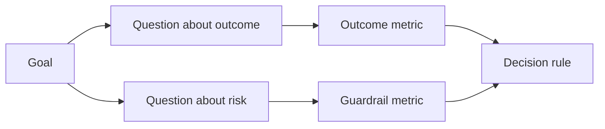

# اندازه گیری موفقیت قبل از اینکه نتیجه وجود داشته باشد

> اندازه گیری باید به یک تصمیم پاسخ دهد نه یک داشبورد را تزئین کند. از هدف شروع کنید، سوالات را اخذ کنید، سپس کوچکترین متریک را انتخاب کنید که به آنها پاسخ دهد.

**Type:** Learn + Build
**Languages:** Python (stdlib)
**Prerequisites:** Phase 14 lessons 47 and 51
**Time:** ~70 minutes

## اهداف یادگیری

- سوالات و معیارهای را از یک هدف نتیجه گیری اخذ کنید.
- قبل از مشاهده نتایج، محدودیت ها، پنجره ها، منابع و مسیرها را تعریف کنید.
- اندازه گیری نتایج را با رایل های نگهبانی و متریک های ضد سازید.
- شواهد ارزیابی با تصمیم ساخت باید پشتیبانی شود.

## هدف، سوال، متریک

با يه هدف شروع کن:

> زمان شناسایی سرویس آسیب دیده را کاهش دهید بدون افزایش اقدامات غیر ایمن.

سوالات مربوط به:

- چه طور سریع خدمات درست را شناسایی می کنیم؟
- چند بار اين سرویس مشخص شده درست است؟
- آیا تشخیص فقط برای خواندن باقی می ماند؟
- آیا جریان کار حذف هشدارها یا بار کاری کاربری را افزایش می دهد؟

سپس متریک هایی را انتخاب کنید که این سوالات را عملیاتی کنند.



## یک متریک به قرارداد نیاز دارد

هر اندازه گیری نیاز داره:

| Field | Example |
|---|---|
| Name | `median_identification_seconds` |
| Direction | at most |
| Threshold | 120 |
| Window | ten incident replays |
| Source | replay event log |
| Population | on-call engineers in the pilot |
| Kind | outcome or guardrail |

بدون منبع و پنجره، یک عدد نمی تواند بازیافت شود. بدون یک حد، نمی تواند تصمیم گیری را هدایت کند.

## نتیجه، رایل نگهبان و متریک ضد

- **Outcome metric:**حالت مطلوب بهبود يافته است؟
- **Guardrail:**آیا یک محدودیت ثابت هنوز درست است؟
- **Counter-metric:**آیا تغییر مکان محلی هزینه یا آسیب به جای دیگر داشته است؟

برای یک جریان کار حادثه، سرعت کافی نیست. درستگی، نوشته های تولید، بار کاری اپراتور و هشدارهای از دست رفته از یک نتیجه سریع اما ناامن محافظت می کند.

## شواهد آنلاین و غیر آنلاین

بازی مجدد غیر آنلاین برای تکرار و پوشش حاشیه مفید است. یک پیلوتی محدود برای رفتار واقعی، اعتماد و اثرات جریان کار مفید است. هیچ یک از جایگزین های دیگری نیست.

با استفاده از ارزان ترین شواهد که می تواند به تصمیم فعلی پاسخ دهد استفاده کنید. کاربران واقعی را فقط به خاطر آماده سازی قرار ندهید.

## قبل از اندازه گیری تصمیم بگیرید

قبل از اينکه نتيجه رو ببينيد، گذر و شکست و راه هاي مبهم رو بنويسيد.

مثال:

- گذر: سرعت درست حداقل 0.9 و متوسط زمان حداکثر 120 ثانیه
- شکست: هر نوع ثبت تولید یا نرخ اصلاح کمتر از 0.75؛
- مبهم: بهبود کوچکی با تنوع گسترده ای که نیاز به مجموعه بازخورد بزرگتر دارد.

## آن را بسازید

آزمایشگاه یک برنامه اندازه گیری را تأیید می کند، آستانه های شامل را ارزیابی می کند، مقادیر گمشده را ثبت می کند و می نویسد `outputs/measurement-report.json`. .

```bash
python3 code/main.py
python3 -m unittest discover code/tests -v
```

متریک رایل نگهبان را حذف کنید و ببینید که چرا برنامه حتی زمانی که متریک نتیجه باقی می ماند، باطل می شود.

## تمرینات

1. از یک هدف نتیجه سه سوال اخذ کنید.
2. اضافه کردن یک متریک ضد که هزینه های تغییر به نقش دیگری را ضبط می کند.
3. منبع، جمعیت و پنجره هر متریک را تعریف کنید.
4. قبل از تولید ارزش ها، تصمیمات عبور، شکست و دوجوهر را بنویسید.
5. یک متریک را شناسایی کنید که جمع آوری آن آسان است اما نمی تواند تصمیم را تغییر دهد. آن را حذف کنید.

## خواندن بیشتر

- [Basili, Software Modeling and Measurement: The Goal/Question/Metric Paradigm](https://drum.lib.umd.edu/items/8119803a-362b-42ec-b6ce-2311713e7236)، برای اخذ اندازه گیری های عملیاتی از اهداف صریح.
- [Basili, Caldiera, and Rombach, The Goal Question Metric Approach](https://www.cs.toronto.edu/~sme/CSC444F/handouts/GQM-paper.pdf)، برای استفاده از این روش به عنوان یک سیستم بازخورد و بهبود.

## آنچه را که نگه داری

نگه دار`outputs/measurement-report.json`. این دروازه شواهد برای نمونه اولیه، مرحله آزمایشی یا مرحله تولید را تعریف می کند.
