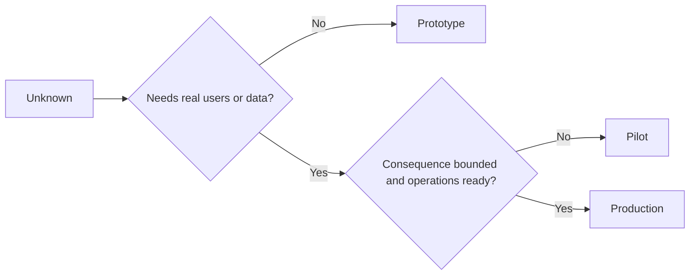

# نمونه اولیه، نمونه آزمایشی یا تولید را عمدا انتخاب کنید

> این محیط های یادگیری متفاوت هستند، نه سطوح پالش. مرحله ای را انتخاب کنید که به جریان ناشناخته با حداقل پیامدهای غیر ضروری پاسخ دهد.

**Type:** Learn + Build
**Languages:** Python (stdlib)
**Prerequisites:** Phase 14 lessons 50 to 52
**Time:** ~70 minutes

## اهداف یادگیری

- مرحله ساخت را از بین ناشناخته، مخاطبان، داده ها، پیامدهای و آمادگی انتخاب کنید.
- کنترل های مرحله ای و معیارهای خروج را تعریف کنید.
- از اینکه نمونه های اولیه به صورت ساکت به سیستم های تولید تبدیل شوند جلوگیری کنید.
- به تأخیر انداختن قدرت واقعی تا زمانی که شواهد و عملیات آن را توجیه کنند.

## سه سوال مختلف

| Stage | Primary question |
|---|---|
| Prototype | Can this mechanism produce the evidence at all? |
| Pilot | Does it work safely with a bounded real audience and real conditions? |
| Production | Can we own it continuously at the promised reliability and risk level? |

یک نمونه اولیه می تواند از نظر فنی کامل باشد و هنوز هم قابل استفاده باشد. یک خلبان می تواند از داده های تولید استفاده کند در حالی که مخاطبان و اختیار محدود باقی می ماند. تولید زمانی شروع می شود که سازمان مسئولیت مداوم را بپذیرد.

## نمونه اولیه

از نمونه اولیه استفاده کنید وقتی که ناشناخته ای نیاز به کاربران واقعی یا داده های واقعی ندارد.

- قابل تخلیه
- جدا شده
- رفتار محدود؛
- صریح در مورد سوال یادگیری؛
- بدون تضمین های عملیاتی نادرست.

قبل از اینکه مکانیسم مرحله دیگری را بدست آورد، معماری را بهینه سازی نکنید.

## خلبان

استفاده از یک پیلت زمانی که ناشناخته نیاز به رفتار واقعی، داده های واقع بینانه، یا یک جریان کار واقعی دارد، اما نتیجه یا آمادگی هنوز با انتشار گسترده سازگار نیست.

یک خلبان نیاز دارد:

- یک مخاطب نامگذاری شده؛
- یک مالک انسانی؛
- مدت زمان محدود و صلاحیت؛
- حسابرسی و بازپسین؛
- آستانهای خروج و حفاظت از رایل
- معیارهای خروج برای گسترش، بازبینی یا توقف.

## تولید

تولید نیاز به چیزی بیشتر از استفاده دارد:

- هدف سطح خدمات
- مالکیت در تماس و حادثه
- بررسی امنیت و حریم خصوصی
- کنترل هزینه ها و ظرفیت ها
- بازگشت و بازیابی؛
- نظارت مداوم؛
- راه بازنشستگی



## حرکت مرحله ای

کد نمونه زمانی خطرناک می شود که کاربران، داده ها یا اختیار را بدون کسب مالکیت به دست آورد. مرز نمونه اولیه و پیلتون را در پیکربندی، کنترل دسترسی، تله متری و اسناد مشخص کنید. یک بنر هشدار کافی نیست.

مرحله باید از خود سیستم مشاهده شود.

## آن را بسازید

آزمایشگاه مرحله ای را از زمینه تصمیم گیری انتخاب می کند، کنترل های مورد نیاز را باز می گرداند و می نویسد `outputs/stage-decisions.json`. .

```bash
python3 code/main.py
python3 -m unittest discover code/tests -v
```

نمونه آزمایشی را با آماده سازی عملیاتی به نتیجه کم تغییر دهید. توضیح دهید که چه شواهد اضافی می تواند تولید را توجیه کند.

## تمرینات

1. سه پروژه فعلی را به مرحله یادگیری طبقه بندی کنید نه وضعیت نشریات.
2. معیارهای خروج خلبان را بنویسید که شامل تصمیم توقف می شود.
3. یک کنترل فنی اضافه کنید که مانع از رسیدن یک نمونه اولیه به داده های تولید می شود.
4. اولین مسئولیت عملیاتی را که تولید ساخت را انجام می دهد شناسایی کنید.
5. تصميمي براي خلبان محدود رويد

## خواندن بیشتر

- [Barry Boehm, A Spiral Model of Software Development and Enhancement](https://dl.acm.org/doi/10.1145/12944.12948)، برای مطابقت با تعهد هر تکرار به ریسک حل شده.
- [Fagerholm et al., Building Blocks for Continuous Experimentation](https://doi.org/10.1145/2601248.2601276)، برای شرایط سازمانی و فنی مورد نیاز برای اجرای مداوم آزمایشات.

## آنچه را که نگه داری

نگه دار`outputs/stage-decisions.json`این گزارش نشان می دهد که چرا هر مرحله توجیه شده و چه کنترل هایی باید قبل از مرحله بعدی وجود داشته باشد.
