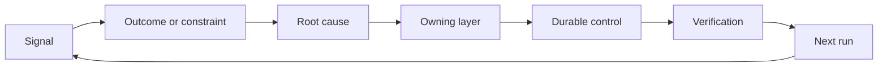

# با داشتن و بازنشستگی، یک رادک ردعمل بسازید

> حمل و نقل یک حلقه ساخت را می بندد و حلقه یادگیری را باز می کند. شواهد باید سیستم را تغییر دهند یا به تله متری تبدیل می شود که هیچ کس مالک آن نیست.

**Type:** Learn + Build
**Languages:** Python (stdlib)
**Prerequisites:** Phase 14 lessons 46 and 53
**Time:** ~75 minutes

## اهداف یادگیری

- حادثه ها، ارزیابی ها، رفتار کاربران و اصلاحات را به اقدامات متعلق تبدیل کنید.
- هر سیگنال را به زمینه، ارزیابی، سیاست، زمان اجرا یا پس انداز هدایت کنید.
- تکرار را به شدت و فرکانس اولویت بندی کنید.
- به هر کنترل شرط بازنشستگی بده

## بازخورد زیرساخت است

یک تیم می تواند ردیابی ها، ارزیابی ها، بلیط های پشتیبانی و پرونده های حوادث را بدون یادگیری از هر یک از آنها جمع آوری کند. مکانیسم گمشده ارتقاء است: یک مسیر مشخص از مشاهده به تغییر پایدار با یک صاحب و اثبات.

حلقه اينه:

1. مشاهده یک سیگنال مشخص؛
2. آن را به یک نتیجه، محدودیت یا فرض متصل کنید؛
3. شناسایی اولین لایه سیستم که علت را دارد؛
4. ایجاد تغییر محدود؛
5. بررسی اینکه تکرار کمتر شود؛
6. بررسی اینکه آیا باید کنترل باقی بماند.

## راه به طبقه مالکیت

| Signal | Destination |
|---|---|
| False positive, regression, wrong result | Evaluation or test |
| Missing context, duplicate work, stale fact | Context source or retrieval route |
| Unsafe action or authority gap | Policy or permission boundary |
| Timeout, retry storm, unavailable dependency | Runtime control |
| New product need or unresolved tradeoff | Shaped backlog item |

علت را در اولین لایه موثر درست کنید. در صورتی که یک آزمایش یا اجازه ممکن است شکست را غیرممکن کند، به یک پاراگراف فوری دیگر اضافه نکنید.



## مالکیت بخشی از کنترل است

هر عمل رچشيت به اين نياز داره:

- یک صاحب؛
- اولویت ای که بر اساس پیامدهای و تکرار آن است؛
- اثر هنری که باید تغییر کند؛
- تأیید که تغییر را اثبات می کند؛
- یک پنجره بازبینی یا انقضاء؛
- یک شرایط بازنشستگی.

یک پیشرفت غیرمتمکن یک مشاهده با فرمت بهتر است.

## کنترل های ثابت را بازنشسته کنید

سیستم های بازخورد سیاست ها را جمع می کنند. این سیاست می تواند متناقض و گران باشد. بررسی کنترل می کند که:

- تغییرات معماری یا جریان کار؛
- یک غیر متغیر سطح پایین تر جایگزین یک دستورالعمل سطح بالاتر می شود.
- شکست محافظت شده در پنجره انتخاب شده ظاهر نشده است؛
- کنترل بیشتر از اینکه از آسیب جلوگیری کند، کار مشروع را مسدود می کند.

بازنشستگی هم به اثبات نیاز دارد.

## ارتباط ایجاد و کدگذاری-آژنت بازخورد

همون رخت به هر دو راه سرو ميکنه:

- شواهد محصول چارچوب نتیجه، فرضیه ها، قطعه یا برنامه اندازه گیری را تغییر می دهد.
- اصلاحات عامل کدگذاری تست ها، زمینه، دامنه، اتوماسیون یا انتقال را تغییر می دهد.
- حوادث می توانند هم مرز محصول و هم میز کار عامل را تغییر دهند.

به همین دلیل است که شکل دادن به ساخت یک مرحله نیست که قبل از کدگذاری به پایان می رسد. آن را در هر تغییر پذیرفته ادامه می دهد.

## آن را بسازید

آزمایشگاه سیگنال ها رو طبقه بندی می کنه، عمل های مخصوص رو ایجاد می کنه، اولویت ها رو میده و می نویسد`outputs/feedback-backlog.json`. .

```bash
python3 code/main.py
python3 -m unittest discover code/tests -v
```

یک سیگنال زمان توقف اجرا را اضافه کنید و تایید کنید که آن را به زمان اجرا به جای عقب ماندگی عمومی هدایت می کند.

## تمرینات

1. يه حادثه و يک شکایت از کاربران رو به عمل هاي ريشچ تبديل کن
2. اولین لایه ای را که می تواند از هر تکرار جلوگیری کند نام ببرید.
3. دستورات و مشاهدات تأیید را به خروجی آزمایشگاه اضافه کنید.
4. یک شرط بازنشستگی را برای یک قانون سیاست تعریف کنید.
5. ردیابی یک اصلاح قبول شده را به فریم کار بعدی برگردانید.

## خواندن بیشتر

- [Basili, Caldiera, and Rombach, The Goal Question Metric Approach](https://www.cs.toronto.edu/~sme/CSC444F/handouts/GQM-paper.pdf)، برای یادگیری سازمانی از طریق اندازه گیری هدفمند.
- [Fagerholm et al., Building Blocks for Continuous Experimentation](https://doi.org/10.1145/2601248.2601276)، برای حلقه فنی و سازمانی که شواهد را به توسعه مداوم محصول متصل می کند.
- [Nuseibeh and Easterbrook, Requirements Engineering: A Roadmap](https://www.cs.toronto.edu/~sme/papers/2000/ICSE2000.pdf)، برای درمان الزامات به عنوان تکامل در طول چرخه زندگی سیستم.

## آنچه را که نگه داری

نگه دار`outputs/feedback-backlog.json`این اثر نهایی مسیر قضاوت و تحویل محصول و ورودی به چارچوب نتیجه بعدی است.
