# پروتکل های ارتباطی

> ماموران که نميتونن با هم حرف بزنند، يه تيم نيستن.

**Type:** Build
**Languages:** TypeScript
**Prerequisites:** Phase 14 (Agent Engineering), Lesson 16.01 (Why Multi-Agent)
**Time:** ~120 minutes

## اهداف یادگیری

- پیاده سازی کشف و درخواست ابزار MCP تا نمایندگان بتوانند از ابزارهای افشا شده توسط سرورهای خارجی استفاده کنند
- ایجاد کارت A2A و نقطه پایان کار که به یک عامل اجازه می دهد تا کار را به دیگری از طریق HTTP اختصاص دهد
- مقایسه MCP (استفاده از ابزار) ، A2A (از یک عامل به یک عامل) ، ACP (دراست شرکت) و ANP (امتیاد غیرمتمرکز) و توضیح دهید که کدام پروتکل مشکل را حل می کند
- برنامه های متعدد را در یک سیستم واحد به هم متصل کنید که در آن عوامل از طریق MCP ابزار را کشف می کنند و از طریق A2A وظایف را به ارمغان می آورند

## مشکل

شما سیستم خود را به چندین عامل تقسیم می کنید یک محقق، یک کدر، یک بازرس. آنها در شغل های فردی خود عالی هستند. اما حالا شما نیاز دارید که آنها واقعا با یکدیگر صحبت کنند.

اولین تلاش شما واضح است: رشته ها را منتقل کنید. محقق یک نقطه متن را باز می گرداند، کوڈر آن را هرچه می تواند تجزیه و تحلیل می کند. این کار تا زمانی که کوڈر خلاصه ای از تحقیقات را اشتباه تفسیر کند، یا دو عامل در حالت تعطیلی منتظر یکدیگر هستند، یا شما نیاز به عوامل ساخته شده توسط تیم های مختلف برای همکاری دارید. ناگهان "فقط رشته ها را منتقل کنید" به هم می افتد.

اين مسئله پروتکل ارتباطات است بدون قراردادي مشترک براي نحوه مبادله اطلاعات، سيستم هاي چند عامل شکننده، قابل شناسي و ناممکن است تا فراتر از چند عامل که شما شخصاً نوشته اید مقیاس پذير شوند.

اکوسیستم هوش مصنوعی با چهار پروتکل پاسخ داده است، هر کدام یک از حلقه های مختلف مشکل را حل می کند:

- **MCP**برای دسترسی به ابزار
- **A2A**برای همکاری بین عوامل
- **ACP**برای حسابرسی شرکت
- **ANP**برای هویت و اعتماد غیرمتمرکز

این درس عمیق است. شما فرمت های سیم واقعی را از هر مشخصات می خوانید، پیاده سازی های کاری را ایجاد می کنید و هر چهار را به یک سیستم متحد متصل می کنید.

## مفهوم

### منظره پروتکل

این چهار پروتکل را به عنوان لایه ای تصور کنید که هر کدام یک سوال متفاوت را حل می کنند:

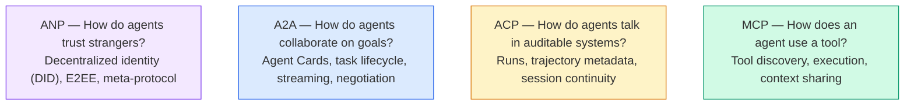

اونا رقبا نيستن، مشکل هاي مختلف رو در سطوح مختلف حل مي کنن.

### MCP (تأقیم)

MCP در مرحله 13 به طور عمیق پوشش داده شده است. خلاصه سریع: MCP استاندارد می کند که چگونه یک LLM به ابزارهای خارجی و منابع داده متصل می شود.**client-server**پروتکل که در آن نماینده (مشتری) ابزارها را که توسط یک سرور در معرض قرار گرفته است کشف و فرا می خواند.

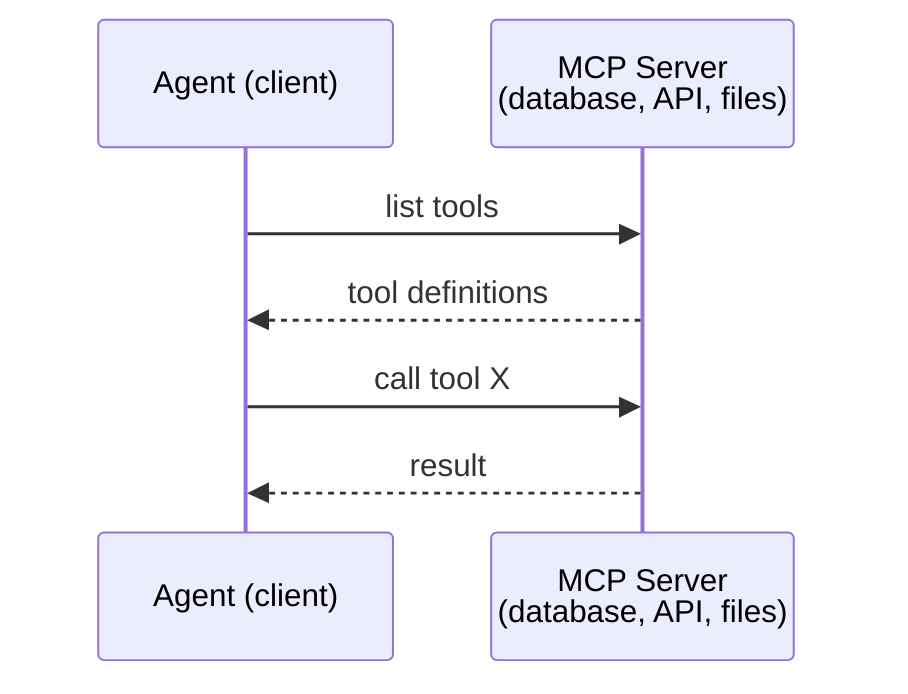

MCP**agent-to-tool**اين به ماموران کمک نميکنه با هم حرف بزنند

### A2A (پروتوکول عامل2 عامل)

**Created by:**گوگل (حالا تحت Linux Foundation به عنوان `lf.a2a.v1`)
**Spec version:**۱.۰۱
**Problem:**چگونه ماموران مستقل با هم همکاری می کنند، مذاکره می کنند و وظایف را به یکدیگر اختصاص می دهند؟

A2A پروتکل برای**peer-to-peer agent collaboration**در جایی که MCP یک عامل را به ابزارها متصل می کند، A2A یک عامل را به سایر عوامل متصل می کند. هر عامل یک **Agent Card**در یک URL شناخته شده، و سایر عوامل کشف، مذاکره و تفویض وظایف به آن.

#### چگونه A2A کار می کند

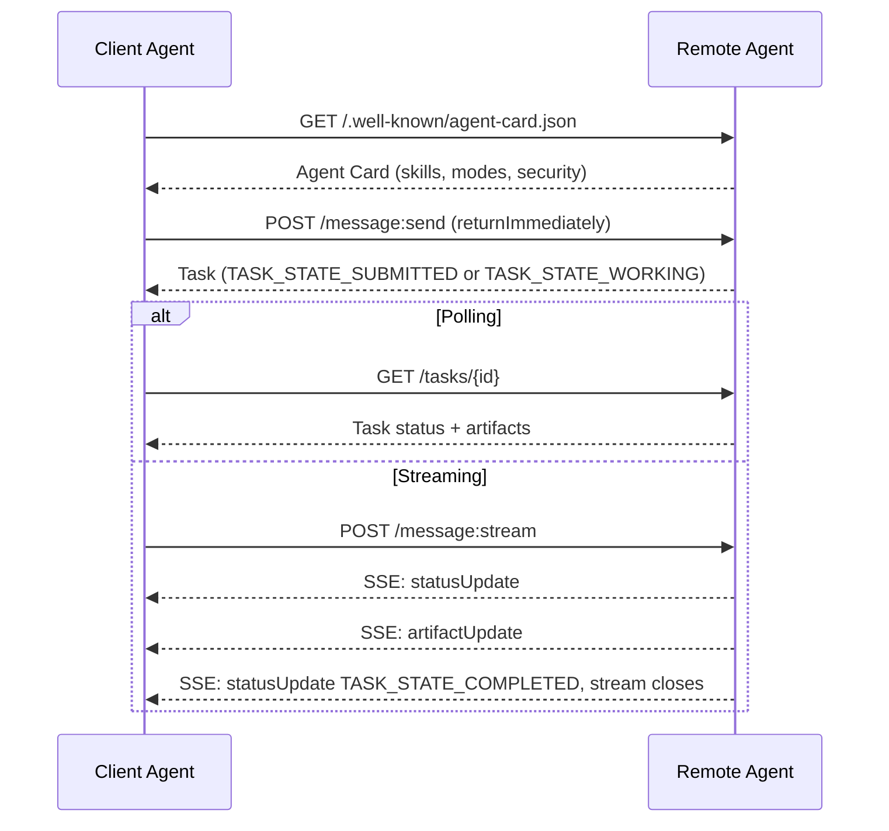

#### کارت واقعی مامور

اين همون چيزيه که يه کارت مامور A2A در بيابان به نظر مياد`GET /.well-known/agent-card.json`:

```json
{
  "name": "Research Agent",
  "description": "Searches documentation and summarizes findings",
  "version": "1.0.0",
  "supportedInterfaces": [
    {
      "url": "https://research-agent.example.com/a2a/v1",
      "protocolBinding": "JSONRPC",
      "protocolVersion": "1.0"
    },
    {
      "url": "https://research-agent.example.com/a2a/rest",
      "protocolBinding": "HTTP+JSON",
      "protocolVersion": "1.0"
    }
  ],
  "provider": {
    "organization": "Your Company",
    "url": "https://example.com"
  },
  "capabilities": {
    "streaming": true,
    "pushNotifications": false
  },
  "defaultInputModes": ["text/plain", "application/json"],
  "defaultOutputModes": ["text/plain", "application/json"],
  "skills": [
    {
      "id": "web-research",
      "name": "Web Research",
      "description": "Searches the web and synthesizes findings",
      "tags": ["research", "search", "summarization"],
      "examples": ["Research the latest changes in React 19"]
    },
    {
      "id": "doc-analysis",
      "name": "Documentation Analysis",
      "description": "Reads and analyzes technical documentation",
      "tags": ["docs", "analysis"],
      "inputModes": ["text/plain", "application/pdf"],
      "outputModes": ["application/json"]
    }
  ],
  "securitySchemes": {
    "bearer": {
      "httpAuthSecurityScheme": {
        "scheme": "Bearer",
        "bearerFormat": "JWT"
      }
    }
  },
  "securityRequirements": [{ "schemes": { "bearer": { "list": [] } } }]
}
```

نکته های مهم که باید توجه کرد:
- **Skills**این نوع از ابزارها به صورت یک ابزارک می توانند به شما کمک کنند تا بتوانید با یک ابزارک یا ابزارک با یک ابزارک یا ابزارک با یک ابزارک یا ابزارک با یک ابزارک یا ابزارک با یک ابزارک یا ابزارک با یک ابزارک یا ابزارک با یک ابزارک یا ابزارک با یک ابزارک یا ابزارک با یک ابزارک یا ابزارک با یک ابزارک یا ابزارک با یک ابزارک یا ابزارک با یک ابزارک یا ابزارک با یک ابزارک یا ابزارک یا ابزارک با یک ابزارک یا ابزارک یا ابزارک با یک ابزارک یا ابزارک یا ابزارک با یک ابزارک یا ابزارک یا ابزارک یا ابزارک یا ابزارک یا ابزارک یا ابزارک یا ابزارک یا ابزارک یا ابزارک یا ابزارک یا ابزارک یا ابزارک یا ابزارک یا ابزارک یا ابزارک یا ابزارک یا ابزارک یا ابزارک یا ابزارک یا ابزارک یا ابزارک یا ابزارک را با یک ابزارک یا ابزارک یا ابزارک یا ابزارک با یک ابزارک یا ابزارک یا ابزارک یا ابزارک یا ابزارک یا ابزارک یا ابزارک یا ابزارک یا ابزارک یا ابزارک یا ابزارک یا ابزارک یا ابزارک یا ابزارک یا ابزارک یا ابزارک یا ابزارک یا ابزارک یا ابزارک یا ابزارک یا ابزارک یا ابزارک یا ابزارک یا ابزارک یا ابزارک یا ابزارک یا ابزارک یاک یاک یاک یاک یاک یاک یا یاک یاک یاک یا یاک یاک یاک یاک یاک یاک یا یا یاک یاک یا یا یا یاک یاک یا یا یا یاک یاک یا یا یا یاک یاک یا یا یاک یا یا یا یا یاک یا یا یاک یا یا یاک یا یا یا یا یاک یا یا یا یا یا یا یا یا یا یا یا یا یا یا یا یا یا یا یا یا یا یاک یا یا یا یا یا یا یا یا یا یا یا یا یا یا یا یا یا یا یا یا یا یا یا یا یا یا یا یا یا یا یا یا یا یا یا یا یا یا یا یا یا یا یا یا یا یا یا یا یا یا یا یا یا یا یا یا یا یا یا یا یا یا یا یا یا یا یا یا یا یا یا یا یا یا یا یا یا یا یا یا یا یا یا یا یا یا یا یا یا یا یا یا یا یا یا یا یا یا یا یا یا یا یا یا یا یا
- **supportedInterfaces**یک عامل واحد می تواند JSON-RPC، REST و gRPC را همزمان صحبت کند.
- **Security**در کارت ساخته شده است: `securitySchemes`نام هر طرح و`securityRequirements`مشتری قبل از اینکه یک درخواست کند، می داند چه نوع مواد مورد نیاز است.

#### چرخه عمر وظایف

وظایف واحد اصلی کار در A2A هستند. آنها از طریق حالت های تعریف شده حرکت می کنند (دیگراف `TASK_STATE_`پیشگویی که هر حالت روی سیم حمل می کند):

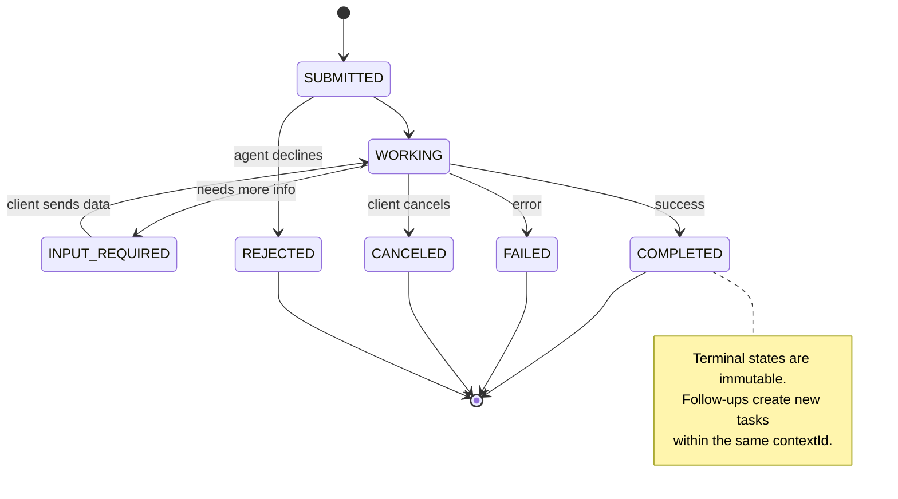

تمام 8 حالت (تفصیلات همچنین تعریف می کند)`UNSPECIFIED`به عنوان یک نگهبان، در اینجا حذف شده است):

| State | Terminal? | Meaning |
|---|---|---|
| `TASK_STATE_SUBMITTED` | No | Acknowledged, not yet processing |
| `TASK_STATE_WORKING` | No | Actively being processed |
| `TASK_STATE_INPUT_REQUIRED` | No | Agent needs more info from client |
| `TASK_STATE_AUTH_REQUIRED` | No | Authentication needed |
| `TASK_STATE_COMPLETED` | Yes | Finished successfully |
| `TASK_STATE_FAILED` | Yes | Finished with error |
| `TASK_STATE_CANCELED` | Yes | Canceled before completion |
| `TASK_STATE_REJECTED` | Yes | Agent declined the task |

وقتی یک کار به حالت نهایی برسد، تغییر ناپذیر است. پیام های بیشتر نیست. پیگیری ها یک کار جدید را در همان حالت ایجاد می کند.`contextId`. .

#### قالب سیم

A2A از JSON-RPC 2.0 استفاده می کند. این چیزی است که یک تبادل پیام واقعی به نظر می رسد:

**Client sends a message:**
```json
{
  "jsonrpc": "2.0",
  "id": 1,
  "method": "SendMessage",
  "params": {
    "message": {
      "messageId": "msg-001",
      "role": "ROLE_USER",
      "parts": [{ "text": "Research React 19 compiler features" }]
    },
    "configuration": {
      "acceptedOutputModes": ["text/plain", "application/json"],
      "historyLength": 10
    }
  }
}
```

**Agent responds with a task:**
```json
{
  "jsonrpc": "2.0",
  "id": 1,
  "result": {
    "task": {
      "id": "task-abc-123",
      "contextId": "ctx-xyz-789",
      "status": {
        "state": "TASK_STATE_COMPLETED",
        "timestamp": "2026-03-27T10:30:00Z"
      },
      "artifacts": [
        {
          "artifactId": "art-001",
          "name": "research-results",
          "parts": [{
            "data": {
              "findings": [
                "React 19 compiler auto-memoizes components",
                "No more manual useMemo/useCallback needed",
                "Compiler runs at build time, not runtime"
              ]
            },
            "mediaType": "application/json"
          }]
        }
      ]
    }
  }
}
```

**Streaming via SSE:**
```text
POST /message:stream HTTP/1.1
Content-Type: application/a2a+json
A2A-Version: 1.0

data: {"task":{"id":"task-123","contextId":"ctx-123","status":{"state":"TASK_STATE_WORKING"}}}

data: {"statusUpdate":{"taskId":"task-123","contextId":"ctx-123","status":{"state":"TASK_STATE_WORKING","message":{"messageId":"msg-002","role":"ROLE_AGENT","parts":[{"text":"Searching documentation..."}]}}}}

data: {"artifactUpdate":{"taskId":"task-123","contextId":"ctx-123","artifact":{"artifactId":"art-1","parts":[{"text":"partial findings..."}]},"append":true,"lastChunk":false}}

data: {"statusUpdate":{"taskId":"task-123","contextId":"ctx-123","status":{"state":"TASK_STATE_COMPLETED"}}}
```

### ACP (پروتوکول ارتباطات آژانس)

**Created by:**آی بی ام / بی آی آی
**Spec version:**0.2.0 (OpenAPI 3.1.1)
**Status:**ادغام به A2A تحت بنیاد لینوکس
**Problem:**چطور ماموران با قابلیت کامل بررسی، ادامه جلسه و ردیابی مسیر ارتباط برقرار می کنند؟

ACP**enterprise protocol**برخلاف آنچه که بسیاری از خلاصه ها ادعا می کنند، ACP انجام می دهد**not**استفاده از JSON-LD. این یک API REST / JSON ساده است که از طریق OpenAPI تعریف شده است. چیزی که آن را منحصر به فرد می کند این است که**TrajectoryMetadata**: هر پاسخ عامل می تواند یک دفترچه دقیق از مراحل استدلال و ابزار تماس که آن را تولید کرده است را داشته باشد.

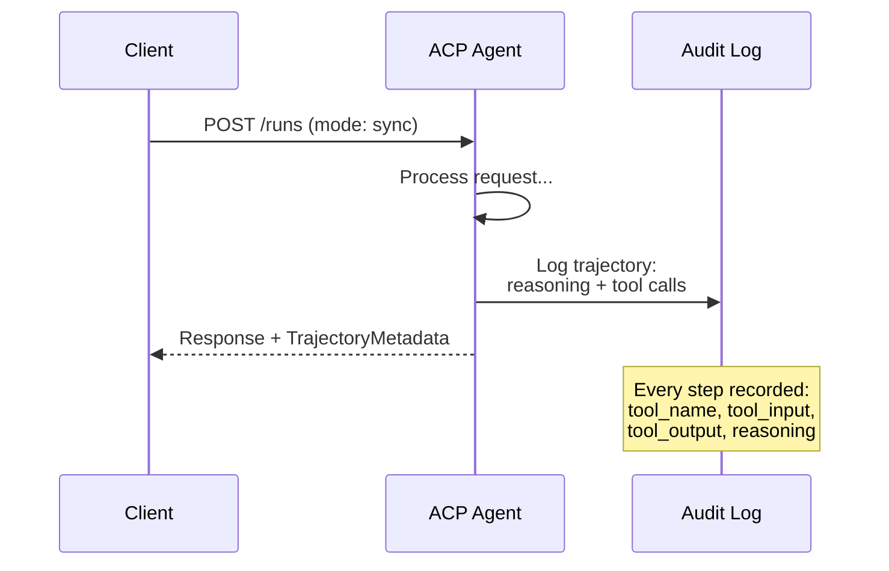

#### مامور کشف در ACP

ACP چهار روش کشف را تعریف می کند:

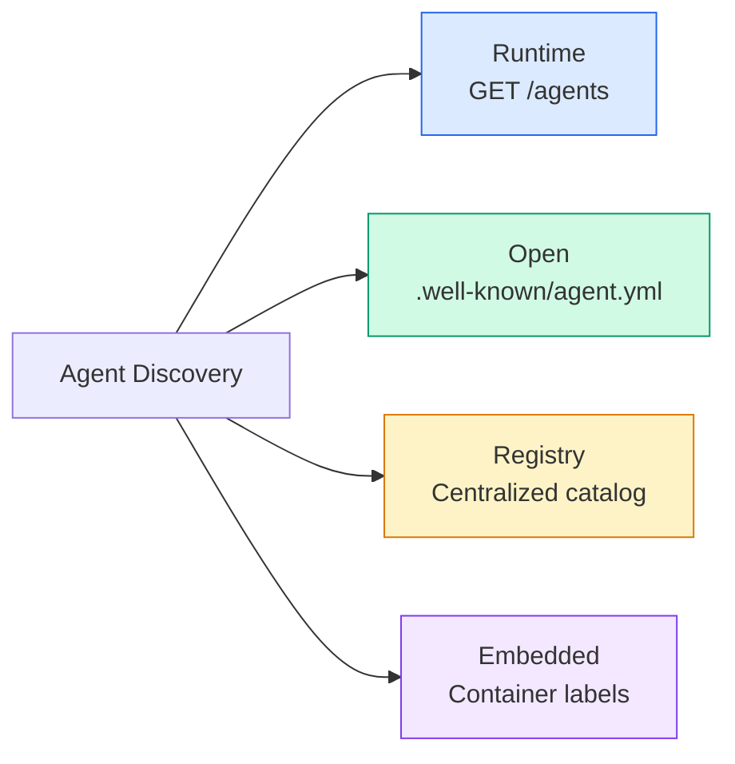

.**AgentManifest**ساده تر از کارت عامل A2A است:

```json
{
  "name": "summarizer",
  "description": "Summarizes documents with source citations",
  "input_content_types": ["text/plain", "application/pdf"],
  "output_content_types": ["text/plain", "application/json"],
  "metadata": {
    "tags": ["summarization", "RAG"],
    "framework": "BeeAI",
    "capabilities": [
      {
        "name": "Document Summarization",
        "description": "Condenses long documents into key points"
      }
    ],
    "recommended_models": ["llama3.3:70b-instruct-fp16"],
    "license": "Apache-2.0",
    "programming_language": "Python"
  }
}
```

#### چرخه عمر را اجرا کنید

ACP به جای "مهام" از "Runs" استفاده می کند. Run یک اجرای عامل با سه حالت است:

| Mode | Behavior |
|---|---|
| `sync` | Blocking. Response contains the complete result. |
| `async` | Returns 202 immediately. Poll `GET /runs/{id}` for status. |
| `stream` | SSE stream. Events fire as the agent works. |

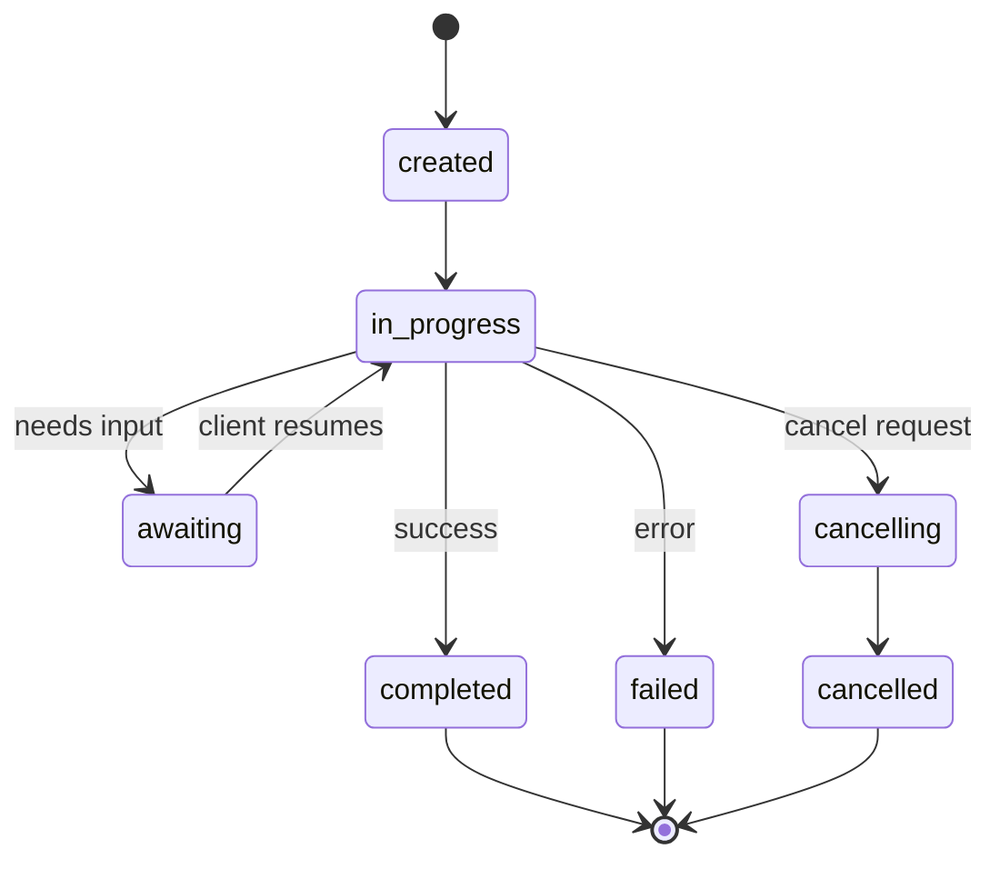

#### مسیر متاداتا (راه بازرسی)

این فرقی کلیدی ACP است. هر بخش پیام می تواند شامل متاداتا باشد که دقیقاً نشان می دهد عامل چه کاری کرده است:

```json
{
  "role": "agent/researcher",
  "parts": [
    {
      "content_type": "text/plain",
      "content": "The weather in San Francisco is 72F and sunny.",
      "metadata": {
        "kind": "trajectory",
        "message": "I need to check the weather for this location",
        "tool_name": "weather_api",
        "tool_input": { "location": "San Francisco, CA" },
        "tool_output": { "temperature": 72, "condition": "sunny" }
      }
    }
  ]
}
```

برای صنایع تنظیم شده این طلا است. هر پاسخ با یک زنجیره استدلال قابل اثبات همراه است: چه ابزارها خوانده شدند، چه ورودی هایی استفاده شدند، چه محصولاتی دریافت شدند. هیچ جعبه سیاه.

ACP هم حمایت می کند**CitationMetadata**برای اختصاص منبع:

```json
{
  "kind": "citation",
  "start_index": 0,
  "end_index": 47,
  "url": "https://weather.gov/sf",
  "title": "NWS San Francisco Forecast"
}
```

### ANP (پروتوکول شبکه عامل)

**Created by:**جامعه منبع باز (که توسط GaoWei Chang تاسیس شد)
**Repo:** [github.com/agent-network-protocol/AgentNetworkProtocol](https://github.com/agent-network-protocol/AgentNetworkProtocol)
**Problem:**چطوري ماموران سازمان هاي مختلف بدون يه مقام مركزي به هم اعتماد مي کنن؟

اين پي اين**decentralized identity protocol**این سیستم با استفاده از شناسه های غیرمتمرکز W3C و رمزگذاری انتهای تا انتهای اعتماد را ایجاد می کند. برخلاف A2A که در آن شما از طریق نقاط نهایی شناخته شده، عوامل را کشف می کنید، ANP به عوامل اجازه می دهد هویت خود را رمزنگاری کنند.

اینپ سه لایه دارد:

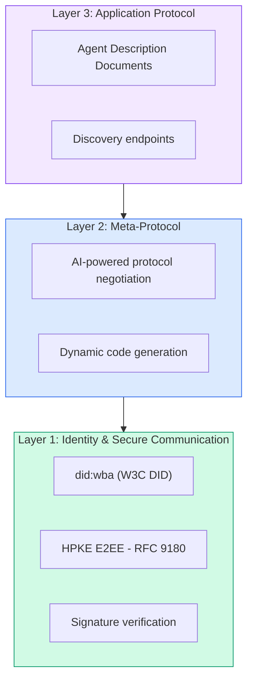

#### اسناد DID (بنیاد واقعی)

ANP از روش DID سفارشی به نام  استفاده می کند`did:wba`(عميل ويب)`did:wba:example.com:user:alice`تصمیم می گیرد`https://example.com/user/alice/did.json`:

```json
{
  "@context": [
    "https://www.w3.org/ns/did/v1",
    "https://w3id.org/security/suites/jws-2020/v1",
    "https://w3id.org/security/suites/secp256k1-2019/v1"
  ],
  "id": "did:wba:example.com:user:alice",
  "verificationMethod": [
    {
      "id": "did:wba:example.com:user:alice#key-1",
      "type": "EcdsaSecp256k1VerificationKey2019",
      "controller": "did:wba:example.com:user:alice",
      "publicKeyJwk": {
        "crv": "secp256k1",
        "x": "NtngWpJUr-rlNNbs0u-Aa8e16OwSJu6UiFf0Rdo1oJ4",
        "y": "qN1jKupJlFsPFc1UkWinqljv4YE0mq_Ickwnjgasvmo",
        "kty": "EC"
      }
    },
    {
      "id": "did:wba:example.com:user:alice#key-x25519-1",
      "type": "X25519KeyAgreementKey2019",
      "controller": "did:wba:example.com:user:alice",
      "publicKeyMultibase": "z9hFgmPVfmBZwRvFEyniQDBkz9LmV7gDEqytWyGZLmDXE"
    }
  ],
  "authentication": [
    "did:wba:example.com:user:alice#key-1"
  ],
  "keyAgreement": [
    "did:wba:example.com:user:alice#key-x25519-1"
  ],
  "humanAuthorization": [
    "did:wba:example.com:user:alice#key-1"
  ],
  "service": [
    {
      "id": "did:wba:example.com:user:alice#agent-description",
      "type": "AgentDescription",
      "serviceEndpoint": "https://example.com/agents/alice/ad.json"
    }
  ]
}
```

نکته های مهم که باید توجه کرد:
- **Key separation**کلید های امضا (secp256k1) از کلید های رمزگذاری (X25519) جدا هستند.
- **`humanAuthorization`**این کلید ها قبل از استفاده نیاز به تأیید صریح انسانی (بیومتریک، رمز عبور، HSM) دارند. عملیات با ریسک بالا مانند انتقال بودجه از این مسیر عبور می کنند.
- **`keyAgreement`**کلید ها برای رمزگذاری انتهای HPKE (RFC 9180) استفاده می شوند.
- .**service**بخش لینک به سند توصیف عامل

#### چگونه اعتماد در ANP کار می کند

اين پي مي کنه**not**استفاده از یک نمودار وب اعتماد یا تایید. اعتماد دوجانبه است و به صورت هر تعامل تأیید می شود:

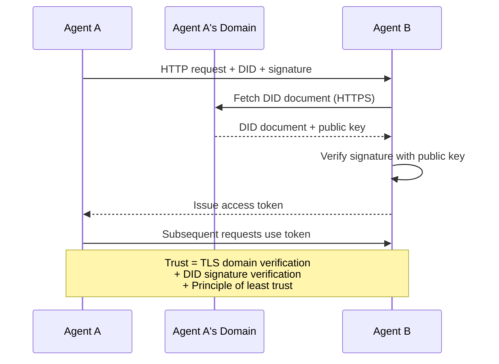

اعتماد از سه منبع سرچشمه می گیرد:
1. **Domain-level TLS**تایید میزبانی سند DID
2. **DID cryptographic signatures**هویت عامل را تأیید کنید
3. **Principle of least trust**فقط مجوزهای حداقل را می دهد

هيچ پيامبندي اعتمادي با اساس گپ و يا درجه بندي پيج رينک وجود نداره.

#### مذاکره در مورد متاپروتوکول

این جدیدترین ویژگی اینپ است. وقتی دو عامل از اکوسیستم های مختلف با هم ملاقات می کنند، نیازی به فرمت داده های پیش از توافق ندارند. آنها به زبان طبیعی مذاکره می کنند:

```json
{
  "action": "protocolNegotiation",
  "sequenceId": 0,
  "candidateProtocols": "I can communicate using:\n1. JSON-RPC with hotel booking schema\n2. REST with OpenAPI 3.1 spec\n3. Natural language over HTTP",
  "modificationSummary": "Initial proposal",
  "status": "negotiating"
}
```

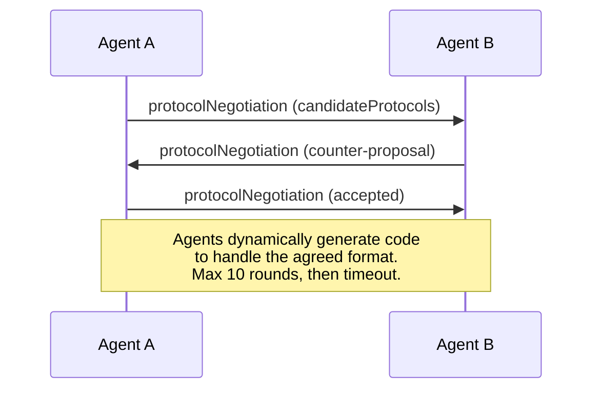

ماموران پیش و عقب (با حداکثر ۱۰ گلوله) تا زمانی که بر روی یک فرمت توافق کنند، سپس کد را برای مدیریت آن به طور پویا تولید می کنند.`negotiating`،`rejected`،`accepted`،`timeout`. .

این بدان معنی است که دو عامل که هرگز با هم نديده اند، می توانند بدون اینکه کسی یک طرح مشترک را پیش تعریف کند، بفهمند که چگونه ارتباط برقرار کنند.

### مقایسه (صحیح شده)

| | MCP | A2A | ACP | ANP |
|---|---|---|---|---|
| **Created by** | Anthropic | Google / Linux Foundation | IBM / BeeAI | Community |
| **Spec format** | JSON-RPC | JSON-RPC / REST / gRPC | OpenAPI 3.1 (REST) | JSON-RPC |
| **Primary use** | Agent to Tool | Agent to Agent | Agent to Agent | Agent to Agent |
| **Discovery** | Tool listing | `/.well-known/agent-card.json` | `GET /agents`, `/.well-known/agent.yml` | `/.well-known/agent-descriptions`, DID service endpoints |
| **Identity** | Implicit (local) | Security schemes (OAuth, mTLS) | Server-level | W3C DID (`did:wba`) with E2EE |
| **Audit trail** | N/A | Basic (task history) | TrajectoryMetadata (tool calls, reasoning) | Not formally specified |
| **State machine** | N/A | 9 task states | 7 run states | N/A |
| **Streaming** | N/A | SSE | SSE | Transport-agnostic |
| **Unique feature** | Tool schemas | Agent Cards + Skills | Trajectory audit trail | Meta-protocol negotiation |
| **Best for** | Tools & data | Dynamic collaboration | Regulated industries | Cross-org trust |
| **Status** | Stable | Stable (v1.0) | Merging into A2A | Active development |

### چگونه با هم کار می کنند

این پروتکل ها متقابل نیستند. یک سیستم واقعی شرکت از چندین سیستم استفاده می کند:

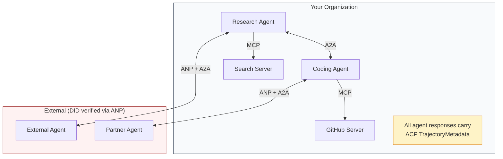

- **MCP**هر عامل را به ابزارش متصل می کند
- **A2A**همکاری بین عوامل (داخلی و خارجی) را اداره می کند
- **ACP**پاسخ ها را در متاداتا مسیر برای قابل بررسی قرار می دهد
- **ANP**براي ماموران که کنترلشون رو ندارن، امكان تاييد هویت رو فراهم ميکنه

```figure
swarm-message-bus
```

## آن را بسازید

### مرحله ی اول: انواع اصلی پیام

هر سیستم چند عامل با یک فرمت پیام شروع می شود. ما انواع را تعریف می کنیم که نقشه به آنچه پروتکل های واقعی استفاده می کنند:

```typescript
import crypto from "node:crypto";

type MessageRole = "ROLE_USER" | "ROLE_AGENT";

type MessagePart =
  | { text: string }
  | { data: unknown; mediaType: string }
  | { url: string; filename: string; mediaType: string };

type TrajectoryEntry = {
  reasoning: string;
  toolName?: string;
  toolInput?: unknown;
  toolOutput?: unknown;
  timestamp: number;
};

type AgentMessage = {
  id: string;
  role: MessageRole;
  parts: MessagePart[];
  trajectory?: TrajectoryEntry[];
  replyTo?: string;
  timestamp: number;
};

function createMessage(
  role: MessageRole,
  parts: MessagePart[],
  replyTo?: string
): AgentMessage {
  return {
    id: crypto.randomUUID(),
    role,
    parts,
    replyTo,
    timestamp: Date.now(),
  };
}

function textMessage(role: MessageRole, text: string): AgentMessage {
  return createMessage(role, [{ text }]);
}
```

توجه داشته باشید:`MessagePart`این فیلدی چند مودالی است (متن، داده های ساختاری، فایل ها) درست مانند مشخصات واقعی A2A و ACP.`text`،`data`، یا`url`) میگه قسمت چیه؟`kind`برچسب`TrajectoryEntry`این اطلاعات مربوط به زنجیره استدلال است که با تراکتوری متادتا ACP مطابقت دارد.

### مرحله دوم: کارت و ثبت نمایندگی A2A

ساخت کشف عامل که با مشخصات واقعی A2A مطابقت داشته باشد:

```typescript
type Skill = {
  id: string;
  name: string;
  description: string;
  tags: string[];
  inputModes: string[];
  outputModes: string[];
};

type AgentInterface = {
  url: string;
  protocolBinding: string;
  protocolVersion: string;
};

type AgentCard = {
  name: string;
  description: string;
  version: string;
  supportedInterfaces: AgentInterface[];
  capabilities: {
    streaming: boolean;
    pushNotifications: boolean;
  };
  defaultInputModes: string[];
  defaultOutputModes: string[];
  skills: Skill[];
};

class AgentRegistry {
  private cards: Map<string, AgentCard> = new Map();

  register(card: AgentCard) {
    this.cards.set(card.name, card);
  }

  discoverBySkillTag(tag: string): AgentCard[] {
    return [...this.cards.values()].filter((card) =>
      card.skills.some((skill) => skill.tags.includes(tag))
    );
  }

  discoverByInputMode(mimeType: string): AgentCard[] {
    return [...this.cards.values()].filter(
      (card) =>
        card.defaultInputModes.includes(mimeType) ||
        card.skills.some((skill) => skill.inputModes.includes(mimeType))
    );
  }

  resolve(name: string): AgentCard | undefined {
    return this.cards.get(name);
  }

  listAll(): AgentCard[] {
    return [...this.cards.values()];
  }
}
```

این بسیار غنی تر از یک نقشه ساده نام-به قابلیت است. شما می توانید توسط برچسب های مهارت، از طریق نوع MIME ورودی، یا با نام، درست مانند مشخصات واقعی A2A پشتیبانی می کند.

### مرحله سوم: چرخه عمر وظایف A2A

دستگاه حالت تمام کار را بسازید:

```typescript
type TaskState =
  | "TASK_STATE_SUBMITTED"
  | "TASK_STATE_WORKING"
  | "TASK_STATE_INPUT_REQUIRED"
  | "TASK_STATE_AUTH_REQUIRED"
  | "TASK_STATE_COMPLETED"
  | "TASK_STATE_FAILED"
  | "TASK_STATE_CANCELED"
  | "TASK_STATE_REJECTED";

const TERMINAL_STATES: TaskState[] = [
  "TASK_STATE_COMPLETED",
  "TASK_STATE_FAILED",
  "TASK_STATE_CANCELED",
  "TASK_STATE_REJECTED",
];

type TaskStatus = {
  state: TaskState;
  message?: AgentMessage;
  timestamp: number;
};

type Artifact = {
  id: string;
  name: string;
  parts: MessagePart[];
};

type Task = {
  id: string;
  contextId: string;
  status: TaskStatus;
  artifacts: Artifact[];
  history: AgentMessage[];
};

type TaskEvent =
  | { statusUpdate: { taskId: string; status: TaskStatus } }
  | {
      artifactUpdate: {
        taskId: string;
        artifact: Artifact;
        append: boolean;
        lastChunk: boolean;
      };
    };

type TaskHandler = (
  task: Task,
  message: AgentMessage
) => AsyncGenerator<TaskEvent>;

class TaskManager {
  private tasks: Map<string, Task> = new Map();
  private handlers: Map<string, TaskHandler> = new Map();
  private listeners: Map<string, ((event: TaskEvent) => void)[]> = new Map();

  registerHandler(agentName: string, handler: TaskHandler) {
    this.handlers.set(agentName, handler);
  }

  subscribe(taskId: string, listener: (event: TaskEvent) => void) {
    const existing = this.listeners.get(taskId) ?? [];
    existing.push(listener);
    this.listeners.set(taskId, existing);
  }

  async sendMessage(
    agentName: string,
    message: AgentMessage,
    contextId?: string
  ): Promise<Task> {
    const handler = this.handlers.get(agentName);
    if (!handler) {
      const task = this.createTask(contextId);
      task.status = {
        state: "TASK_STATE_REJECTED",
        timestamp: Date.now(),
        message: textMessage("ROLE_AGENT", `No handler for ${agentName}`),
      };
      return task;
    }

    const task = this.createTask(contextId);
    task.history.push(message);
    task.status = { state: "TASK_STATE_SUBMITTED", timestamp: Date.now() };

    this.processTask(task, handler, message).catch((err) => {
      task.status = {
        state: "TASK_STATE_FAILED",
        timestamp: Date.now(),
        message: textMessage("ROLE_AGENT", String(err)),
      };
    });
    return task;
  }

  getTask(taskId: string): Task | undefined {
    return this.tasks.get(taskId);
  }

  cancelTask(taskId: string): boolean {
    const task = this.tasks.get(taskId);
    if (!task || TERMINAL_STATES.includes(task.status.state)) return false;
    task.status = { state: "TASK_STATE_CANCELED", timestamp: Date.now() };
    this.emit(taskId, {
      statusUpdate: { taskId, status: task.status },
    });
    return true;
  }

  private createTask(contextId?: string): Task {
    const task: Task = {
      id: crypto.randomUUID(),
      contextId: contextId ?? crypto.randomUUID(),
      status: { state: "TASK_STATE_SUBMITTED", timestamp: Date.now() },
      artifacts: [],
      history: [],
    };
    this.tasks.set(task.id, task);
    return task;
  }

  private async processTask(
    task: Task,
    handler: TaskHandler,
    message: AgentMessage
  ) {
    task.status = { state: "TASK_STATE_WORKING", timestamp: Date.now() };
    this.emit(task.id, {
      statusUpdate: { taskId: task.id, status: task.status },
    });

    try {
      for await (const event of handler(task, message)) {
        if (TERMINAL_STATES.includes(task.status.state)) break;

        if ("statusUpdate" in event) {
          task.status = event.statusUpdate.status;
        }
        if ("artifactUpdate" in event) {
          const update = event.artifactUpdate;
          const existing = task.artifacts.find(
            (a) => a.id === update.artifact.id
          );
          if (existing && update.append) {
            existing.parts.push(...update.artifact.parts);
          } else {
            task.artifacts.push(update.artifact);
          }
        }
        this.emit(task.id, event);
      }
    } catch (err) {
      task.status = {
        state: "TASK_STATE_FAILED",
        timestamp: Date.now(),
        message: textMessage("ROLE_AGENT", String(err)),
      };
      this.emit(task.id, {
        statusUpdate: { taskId: task.id, status: task.status },
      });
    }
  }

  private emit(taskId: string, event: TaskEvent) {
    for (const listener of this.listeners.get(taskId) ?? []) {
      listener(event);
    }
  }
}
```

این عمل چرخه زندگی واقعی A2A را اجرا می کند: `TASK_STATE_SUBMITTED`،`TASK_STATE_WORKING`،`TASK_STATE_INPUT_REQUIRED`، بعد حالت پايان داريم . کنترل كننده ها ژنراتور هاي همگامي هستند که مي توانند`statusUpdate`و`artifactUpdate`در واقع، همان موشک هایی که جریان SSE حمل می کند.

### مرحله چهارم: مسیر بازرسی به سبک ACP

ارتباطات را با ردیابی مسیر انجام دهید:

```typescript
type AuditEntry = {
  runId: string;
  agentName: string;
  input: AgentMessage[];
  output: AgentMessage[];
  trajectory: TrajectoryEntry[];
  status: "created" | "in-progress" | "completed" | "failed" | "awaiting";
  startedAt: number;
  completedAt?: number;
  sessionId?: string;
};

class AuditableRunner {
  private log: AuditEntry[] = [];
  private handlers: Map<
    string,
    (input: AgentMessage[]) => Promise<{
      output: AgentMessage[];
      trajectory: TrajectoryEntry[];
    }>
  > = new Map();

  registerAgent(
    name: string,
    handler: (input: AgentMessage[]) => Promise<{
      output: AgentMessage[];
      trajectory: TrajectoryEntry[];
    }>
  ) {
    this.handlers.set(name, handler);
  }

  async run(
    agentName: string,
    input: AgentMessage[],
    sessionId?: string
  ): Promise<AuditEntry> {
    const entry: AuditEntry = {
      runId: crypto.randomUUID(),
      agentName,
      input: structuredClone(input),
      output: [],
      trajectory: [],
      status: "created",
      startedAt: Date.now(),
      sessionId,
    };
    this.log.push(entry);

    const handler = this.handlers.get(agentName);
    if (!handler) {
      entry.status = "failed";
      return entry;
    }

    entry.status = "in-progress";
    try {
      const result = await handler(input);
      entry.output = structuredClone(result.output);
      entry.trajectory = structuredClone(result.trajectory);
      entry.status = "completed";
      entry.completedAt = Date.now();
    } catch (err) {
      entry.status = "failed";
      entry.trajectory.push({
        reasoning: `Error: ${String(err)}`,
        timestamp: Date.now(),
      });
      entry.completedAt = Date.now();
    }
    return entry;
  }

  getFullAuditLog(): AuditEntry[] {
    return structuredClone(this.log);
  }

  getAuditLogForAgent(agentName: string): AuditEntry[] {
    return structuredClone(
      this.log.filter((e) => e.agentName === agentName)
    );
  }

  getAuditLogForSession(sessionId: string): AuditEntry[] {
    return structuredClone(
      this.log.filter((e) => e.sessionId === sessionId)
    );
  }

  getTrajectoryForRun(runId: string): TrajectoryEntry[] {
    const entry = this.log.find((e) => e.runId === runId);
    return entry ? structuredClone(entry.trajectory) : [];
  }
}
```

هر اجرای عامل یک ورودی کامل حسابرسی تولید می کند: آنچه وارد شده و آنچه خارج شده است و مسیر کامل تماس های ابزار و مراحل استدلال بین آنها. شما می توانید از طریق عامل، از طریق جلسه یا از طریق اجرا فردی سوال کنید.

### مرحله 5: تأیید هویت با سبک ANP

ایجاد هویت و تأیید مبتنی بر DID:

```typescript
type VerificationMethod = {
  id: string;
  type: string;
  controller: string;
  publicKeyDer: string;
};

type DIDDocument = {
  id: string;
  verificationMethod: VerificationMethod[];
  authentication: string[];
  keyAgreement: string[];
  humanAuthorization: string[];
  service: { id: string; type: string; serviceEndpoint: string }[];
};

type AgentIdentity = {
  did: string;
  document: DIDDocument;
  privateKey: crypto.KeyObject;
  publicKey: crypto.KeyObject;
};

class IdentityRegistry {
  private documents: Map<string, DIDDocument> = new Map();

  publish(doc: DIDDocument) {
    this.documents.set(doc.id, doc);
  }

  resolve(did: string): DIDDocument | undefined {
    return this.documents.get(did);
  }

  verify(did: string, signature: string, payload: string): boolean {
    const doc = this.documents.get(did);
    if (!doc) return false;

    const authKeyIds = doc.authentication;
    const authKeys = doc.verificationMethod.filter((vm) =>
      authKeyIds.includes(vm.id)
    );

    for (const key of authKeys) {
      const publicKey = crypto.createPublicKey({
        key: Buffer.from(key.publicKeyDer, "base64"),
        format: "der",
        type: "spki",
      });
      const isValid = crypto.verify(
        null,
        Buffer.from(payload),
        publicKey,
        Buffer.from(signature, "hex")
      );
      if (isValid) return true;
    }
    return false;
  }

  requiresHumanAuth(did: string, operationKeyId: string): boolean {
    const doc = this.documents.get(did);
    if (!doc) return false;
    return doc.humanAuthorization.includes(operationKeyId);
  }
}

function createIdentity(domain: string, agentName: string): AgentIdentity {
  const did = `did:wba:${domain}:agent:${agentName}`;
  const { publicKey, privateKey } = crypto.generateKeyPairSync("ed25519");

  const publicKeyDer = publicKey
    .export({ format: "der", type: "spki" })
    .toString("base64");

  const keyId = `${did}#key-1`;
  const encKeyId = `${did}#key-x25519-1`;

  const document: DIDDocument = {
    id: did,
    verificationMethod: [
      {
        id: keyId,
        type: "Ed25519VerificationKey2020",
        controller: did,
        publicKeyDer,
      },
      {
        id: encKeyId,
        type: "X25519KeyAgreementKey2019",
        controller: did,
        publicKeyDer,
      },
    ],
    authentication: [keyId],
    keyAgreement: [encKeyId],
    humanAuthorization: [],
    service: [
      {
        id: `${did}#agent-description`,
        type: "AgentDescription",
        serviceEndpoint: `https://${domain}/agents/${agentName}/ad.json`,
      },
    ],
  };

  return { did, document, privateKey, publicKey };
}

function signPayload(identity: AgentIdentity, payload: string): string {
  return crypto
    .sign(null, Buffer.from(payload), identity.privateKey)
    .toString("hex");
}
```

این مدل هویت واقعی ANP را منعکس می کند: عوامل دارای اسناد DID با تأیید هویت جداگانه، توافق کلیدی و کلید مجوز انسانی هستند.`IdentityRegistry`شبیه سازی رزولوشن DID (در تولید این می تواند HTTP به دامنه عامل باشد).

### مرحله 6: دروازه پروتکل

تمام چهار پروتکل را به یک سیستم متحد متصل کنید:

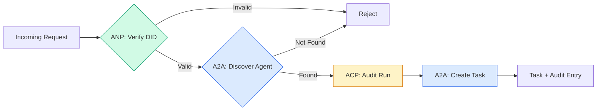

```typescript
class ProtocolGateway {
  private registry: AgentRegistry;
  private taskManager: TaskManager;
  private auditRunner: AuditableRunner;
  private identityRegistry: IdentityRegistry;

  constructor(
    registry: AgentRegistry,
    taskManager: TaskManager,
    auditRunner: AuditableRunner,
    identityRegistry: IdentityRegistry
  ) {
    this.registry = registry;
    this.taskManager = taskManager;
    this.auditRunner = auditRunner;
    this.identityRegistry = identityRegistry;
  }

  async delegateTask(
    fromDid: string,
    signature: string,
    targetAgent: string,
    message: AgentMessage,
    sessionId?: string
  ): Promise<{ task: Task; audit: AuditEntry } | { error: string }> {
    if (!this.identityRegistry.verify(fromDid, signature, message.id)) {
      return { error: "Identity verification failed" };
    }

    const card = this.registry.resolve(targetAgent);
    if (!card) {
      return { error: `Agent ${targetAgent} not found in registry` };
    }

    const audit = await this.auditRunner.run(
      targetAgent,
      [message],
      sessionId
    );
    const task = await this.taskManager.sendMessage(targetAgent, message);

    return { task, audit };
  }

  discoverAndDelegate(
    fromDid: string,
    signature: string,
    skillTag: string,
    message: AgentMessage
  ): Promise<{ task: Task; audit: AuditEntry } | { error: string }> {
    const candidates = this.registry.discoverBySkillTag(skillTag);
    if (candidates.length === 0) {
      return Promise.resolve({
        error: `No agents found with skill tag: ${skillTag}`,
      });
    }
    return this.delegateTask(
      fromDid,
      signature,
      candidates[0].name,
      message
    );
  }
}
```

دروازه چهار کار در یک تماس انجام می دهد:
1. **ANP**: هویت تماس گیرنده را از طریق امضای DID تأیید می کند
2. **A2A**: نشان دهنده هدف را کشف می کند و توانایی های خود را بررسی می کند
3. **ACP**: اجرا را در یک مسیر حسابرسی با مسیر می گیرد
4. **A2A**: ایجاد یک کار با پیگیری چرخه عمر کامل

### مرحله هفتم: همه چیز را با هم وصل کنید

```typescript
async function protocolDemo() {
  const registry = new AgentRegistry();
  registry.register({
    name: "researcher",
    description: "Searches and summarizes findings",
    version: "1.0.0",
    supportedInterfaces: [
      {
        url: "https://researcher.local/a2a/v1",
        protocolBinding: "JSONRPC",
        protocolVersion: "1.0",
      },
    ],
    capabilities: { streaming: true, pushNotifications: false },
    defaultInputModes: ["text/plain"],
    defaultOutputModes: ["text/plain", "application/json"],
    skills: [
      {
        id: "web-research",
        name: "Web Research",
        description: "Searches the web",
        tags: ["research", "search", "summarization"],
        inputModes: ["text/plain"],
        outputModes: ["application/json"],
      },
    ],
  });
  registry.register({
    name: "coder",
    description: "Writes code from specs",
    version: "1.0.0",
    supportedInterfaces: [
      {
        url: "https://coder.local/a2a/v1",
        protocolBinding: "JSONRPC",
        protocolVersion: "1.0",
      },
    ],
    capabilities: { streaming: false, pushNotifications: false },
    defaultInputModes: ["text/plain", "application/json"],
    defaultOutputModes: ["text/plain"],
    skills: [
      {
        id: "code-gen",
        name: "Code Generation",
        description: "Generates code",
        tags: ["coding", "generation"],
        inputModes: ["text/plain", "application/json"],
        outputModes: ["text/plain"],
      },
    ],
  });

  const taskManager = new TaskManager();
  const auditRunner = new AuditableRunner();

  const researchTrajectory: TrajectoryEntry[] = [];

  taskManager.registerHandler(
    "researcher",
    async function* (task, message) {
      yield {
        statusUpdate: {
          taskId: task.id,
          status: {
            state: "TASK_STATE_WORKING" as const,
            timestamp: Date.now(),
          },
        },
      };

      researchTrajectory.push({
        reasoning: "Searching for React 19 documentation",
        toolName: "web_search",
        toolInput: { query: "React 19 compiler features" },
        toolOutput: {
          results: ["react.dev/blog/react-19", "github.com/react/react"],
        },
        timestamp: Date.now(),
      });

      researchTrajectory.push({
        reasoning: "Extracting key findings from search results",
        toolName: "doc_analysis",
        toolInput: { url: "react.dev/blog/react-19" },
        toolOutput: {
          summary:
            "React 19 compiler auto-memoizes, no manual useMemo needed",
        },
        timestamp: Date.now(),
      });

      yield {
        artifactUpdate: {
          taskId: task.id,
          artifact: {
            id: crypto.randomUUID(),
            name: "research-results",
            parts: [
              {
                data: {
                  findings: [
                    "React 19 compiler auto-memoizes components",
                    "No more manual useMemo/useCallback needed",
                    "Compiler runs at build time, not runtime",
                  ],
                  sources: ["react.dev/blog/react-19"],
                },
                mediaType: "application/json",
              },
            ],
          },
          append: false,
          lastChunk: true,
        },
      };

      yield {
        statusUpdate: {
          taskId: task.id,
          status: {
            state: "TASK_STATE_COMPLETED" as const,
            timestamp: Date.now(),
          },
        },
      };
    }
  );

  auditRunner.registerAgent("researcher", async () => ({
    output: [
      textMessage("ROLE_AGENT", "React 19 compiler auto-memoizes components"),
    ],
    trajectory: researchTrajectory,
  }));

  const identityRegistry = new IdentityRegistry();

  const coderIdentity = createIdentity("coder.local", "coder");
  const researcherIdentity = createIdentity("researcher.local", "researcher");

  identityRegistry.publish(coderIdentity.document);
  identityRegistry.publish(researcherIdentity.document);

  const gateway = new ProtocolGateway(
    registry,
    taskManager,
    auditRunner,
    identityRegistry
  );

  console.log("=== Protocol Demo ===\n");

  console.log("1. Agent Discovery (A2A)");
  const researchAgents = registry.discoverBySkillTag("research");
  console.log(
    `   Found ${researchAgents.length} agent(s):`,
    researchAgents.map((a) => a.name)
  );

  console.log("\n2. Identity Verification (ANP)");
  const message = textMessage("ROLE_USER", "Research React 19 compiler features");
  const signature = signPayload(coderIdentity, message.id);
  const verified = identityRegistry.verify(
    coderIdentity.did,
    signature,
    message.id
  );
  console.log(`   Coder DID: ${coderIdentity.did}`);
  console.log(`   Signature verified: ${verified}`);

  console.log("\n3. Task Delegation (A2A + ACP + ANP)");
  const result = await gateway.delegateTask(
    coderIdentity.did,
    signature,
    "researcher",
    message,
    "session-001"
  );

  if ("error" in result) {
    console.log(`   Error: ${result.error}`);
    return;
  }

  console.log(`   Task ID: ${result.task.id}`);
  console.log(`   Task state: ${result.task.status.state}`);
  console.log(`   Artifacts: ${result.task.artifacts.length}`);

  console.log("\n4. Audit Trail (ACP)");
  console.log(`   Run ID: ${result.audit.runId}`);
  console.log(`   Status: ${result.audit.status}`);
  console.log(`   Trajectory steps: ${result.audit.trajectory.length}`);
  for (const step of result.audit.trajectory) {
    console.log(`     - ${step.reasoning}`);
    if (step.toolName) {
      console.log(`       Tool: ${step.toolName}`);
    }
  }

  console.log("\n5. Full Audit Log");
  const fullLog = auditRunner.getFullAuditLog();
  console.log(`   Total runs: ${fullLog.length}`);
  for (const entry of fullLog) {
    const duration = entry.completedAt
      ? `${entry.completedAt - entry.startedAt}ms`
      : "in-progress";
    console.log(`   ${entry.agentName}: ${entry.status} (${duration})`);
  }
}

protocolDemo().catch((err) => {
  console.error("Protocol demo failed:", err);
  process.exitCode = 1;
});
```

## چه اتفاقی افتاده

پروتکل ها راه خوشبختی رو حل می کنن

**Schema drift.**مامور " اي " يه کارت مامور رو منتشر ميکنه`application/json`اما طرح JSON بین نسخه ها تغییر می کند. عامل B فرمت قدیمی را تجزیه و تحلیل می کند و زباله می گیرد. درست: نسخه مهارت های شما و طرح های تولید. مشخصات A2A پشتیبانی می کند `version`به همین دلیل به "کارده"

**State machine violations.**يه عامل اداره ميکنه`TASK_STATE_COMPLETED`حالت تازه، سپس سعی می کند آثار جدید بیشتری را تولید کند. وظیفه تغییر ناپذیر است. کد شما به طور خاموشی به روزرسانی ها را رها می کند یا می اندازد. درست: حالت ترمینال را قبل از تولید بررسی کنید. `TaskManager`در بالا این امر را با`break`بعد از حالت پاياني

**Trust resolution failures.**در این گزارش، این گزارش در مورد این که آیا شما می توانید به عنوان یک عامل در این زمینه به دست آورید، به عنوان یک عامل در این زمینه به شما کمک می کند تا بتوانید از این موضوع آگاه شوید.

**Trajectory bloat.**ثبت مسیر ACP قدرتمند اما گران است. یک عامل پیچیده که 200 تماس ابزار در هر اجرا تولید ورود های بازرسی گسترده است. درست: مسیر ثبت در سطوح تعبیر قابل تنظیم. نام ابزار و IO را برای رعایت ثبت کنید، مراحل استدلال برای بار های کاری غیر تنظیم شده را رد کنید.

**Discovery thundering herd.**50 تا از ماموران تمام سوال`GET /agents`درست کردن: حافظه پیشگیر کارت های آژانس با TTL، فواصل کشف مرحله ای، یا استفاده از ثبت مبتنی بر فشار به جای نظرسنجی.

## ازش استفاده کن

### اجرای واقعی

**A2A**.آنها بالغ ترین هستند.[official spec](https://github.com/google/A2A)این برنامه منبع باز تحت بنیاد لینوکس است. SDK ها برای پایتون و تایپ اسکریپت. اگر عوامل شما نیاز به کشف و همکاری پویا دارند، از اینجا شروع کنید.

**ACP**در حال ادغام شدن به A2A است.[BeeAI project](https://github.com/i-am-bee/acp)از طریق این سیستم، از سیستم های ACP (تراکتور ثبت مسیر، چرخه عمر اجرا) استفاده کنید حتی اگر از A2A به عنوان حمل و نقل استفاده کنید.

**ANP**این آزمایشات تجربی ترین روش است.[community repo](https://github.com/agent-network-protocol/AgentNetworkProtocol)یک SDK پایتون (AgentConnect) دارد. مفهوم مذاکره متاپروتوکول واقعاً جدید است. ارزش دیدن برای انتشار عوامل بین سازمان ها را دارد.

**MCP**در مرحله 13 قبلاً پوشش داده شده. اگر می خواهید ماموران از ابزار استفاده کنند، MCP استاندارد است.

### انتخاب پروتکل درست

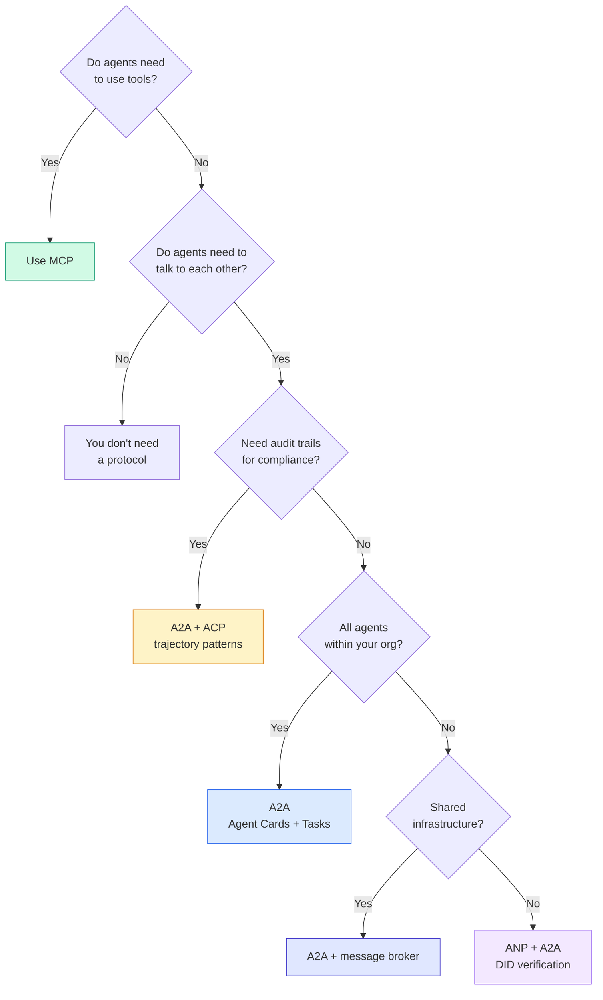

## -باده

این درس نتیجه می دهد:
- `code/main.ts`-- اجرای کامل چهار الگوی پروتکل
- `outputs/prompt-protocol-selector.md`-- یک پیام که به شما کمک می کند پروتکل ها را برای سیستم خود را انتخاب کنید

## تمرینات

1. **Multi-hop task delegation.**طولاني کردن`TaskManager`بنابراین یک عامل عامل می تواند وظایف فرعی را به عوامل دیگر اختصاص دهد. محقق یک وظیفه دریافت می کند، وظایف فرعی را به دو عامل متخصص "تلاش" و "جمع بندی" می کند، منتظر است که هر دو تکمیل شوند، سپس نتایج را به آثار خود ادغام می کند.

2. **Streaming audit trail.**تغییر دادن `AuditableRunner`به جای صبر کردن تا نتیجه کامل، محصول `AuditEntry`به روزرسانی ها در زمان واقعی به عنوان ورودی مسیر اضافه می شود. استفاده از یک ژنراتور async که تولید عکس های حسابرسی.

3. **DID rotation.**به چرخاندن کلید اضافه کنید`IdentityRegistry`یک نماینده باید بتواند یک سند جدید DID با کلید های به روز شده را با حفظ یک`previousDid`تایید کننده ها باید در طول یک دوره مرضی، امضا از کلید فعلی و قبلی را قبول کنند.

4. **Protocol negotiation.**اجرای مفهوم پروتکل متاساساس این پی. دو عامل تبادل`protocolNegotiation`پیام هایی که دارای فرمت های کاندید هستند (به عنوان مثال "من می توانم JSON-RPC صحبت کنم" در مقابل "من REST را ترجیح می دهم"). پس از حداکثر 3 دور، آنها در مورد یک فرمت یا زمان بندی توافق می کنند. فرمت توافق شده تعیین می کند که کدام `TaskManager`یا`AuditableRunner`ازش استفاده ميکنن

5. **Rate-limited discovery.**اضافه کنید`RateLimitedRegistry`بسته بندی که جستجو های کارت عامل را با یک TTL قابل تنظیم ذخیره می کند و سوالات کشف را در هر عامل در ثانیه محدود می کند. یک گله سر و صدا از 100 عامل را شبیه سازی کنید که در شروع یکدیگر را کشف می کنند و تفاوت را اندازه گیری کنید.

## اصطلاحات کلیدی

| Term | What people say | What it actually means |
|------|----------------|----------------------|
| MCP | "The protocol for AI tools" | A client-server protocol for agents to discover and use tools. Agent-to-tool, not agent-to-agent. |
| A2A | "Google's agent protocol" | A peer-to-peer protocol for agent collaboration under the Linux Foundation. Discovery via Agent Cards, 9-state task lifecycle, streaming via SSE. Supports JSON-RPC, REST, and gRPC bindings. |
| ACP | "Enterprise agent messaging" | IBM/BeeAI's REST API for agent runs with TrajectoryMetadata: every response carries the full chain of reasoning and tool calls. Merging into A2A. |
| ANP | "Decentralized agent identity" | A community protocol using `did:wba` (DID) for cryptographic identity, HPKE for E2EE, and AI-powered meta-protocol negotiation for agents that have never seen each other. |
| Agent Card | "An agent's business card" | A JSON document at `/.well-known/agent-card.json` describing skills, supported MIME types, security schemes, and protocol bindings. |
| DID | "Decentralized ID" | W3C standard for cryptographically verifiable identities hosted on the agent's own domain. ANP uses `did:wba` method. |
| TrajectoryMetadata | "The audit receipt" | ACP's mechanism for attaching reasoning steps, tool calls, and their inputs/outputs to every agent response. |
| Meta-protocol | "Agents negotiating how to talk" | ANP's approach where agents use natural language to dynamically agree on data formats, then generate code to handle them. |
| Task | "A unit of work" | A2A's stateful object tracking work from submission through completion. Immutable once terminal. |

## خواندن بیشتر

- [Google A2A specification](https://github.com/google/A2A)-- مشخصات رسمی و SDK ها (v1.0.1، Linux Foundation)
- [IBM/BeeAI ACP specification](https://github.com/i-am-bee/acp)-- مشخصات OpenAPI 3.1 برای اجرا و متادای مسیر عامل
- [Agent Network Protocol](https://github.com/agent-network-protocol/AgentNetworkProtocol)-- هویت مبتنی بر DID، E2EE، مذاکره بر روی پروتکل های متایی
- [Model Context Protocol docs](https://modelcontextprotocol.io/)-- مشخصات MCP Anthropic (در مرحله 13)
- [W3C Decentralized Identifiers](https://www.w3.org/TR/did-core/)-- استاندارد هویت که ANP را پشت سر می گذارد
- [RFC 9180 (HPKE)](https://www.rfc-editor.org/rfc/rfc9180)-- سیستم رمزگذاری ANP برای E2EE استفاده می کند
- [FIPA Agent Communication Language](http://www.fipa.org/specs/fipa00061/SC00061G.html)-- پيشگام دانشگاهي پروتکل هاي جديد مامور
