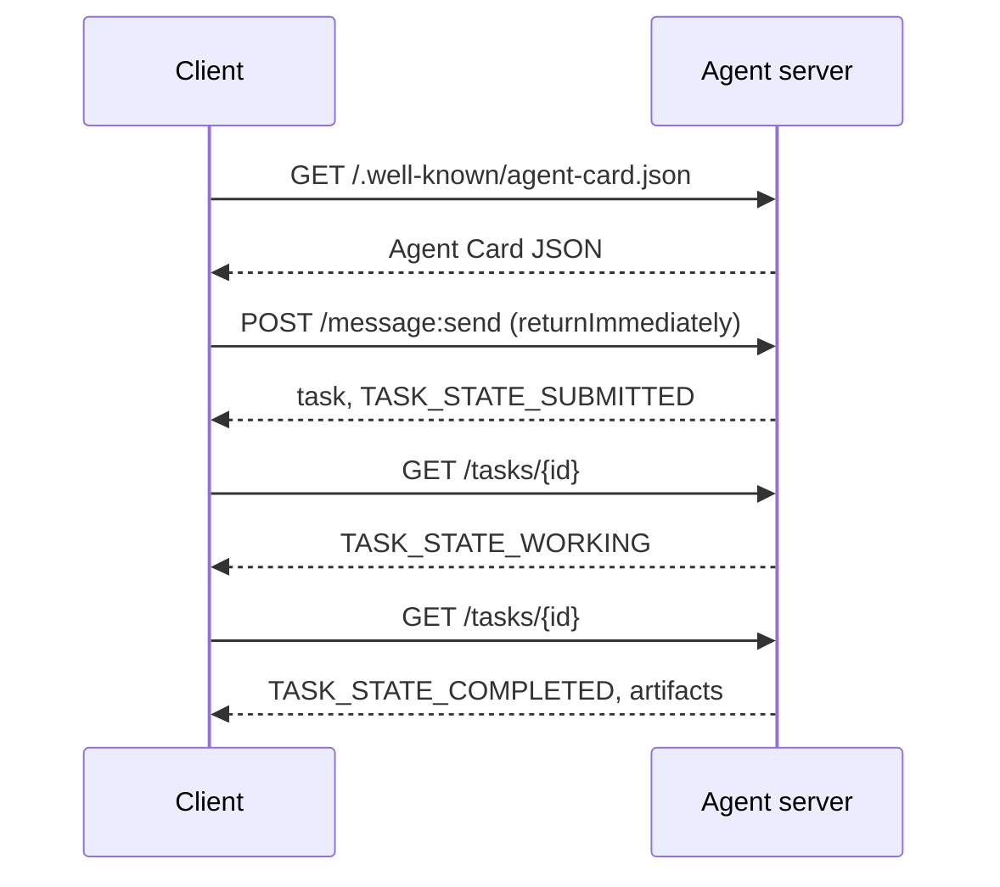

# A2A  پروتکل عامل به عامل

> گوگل A2A را در آوریل 2025 اعلام کرد؛ تا آوریل 2026 مشخصات آن در https://a2a-protocol.org/latest/specification/و 150 سازمان از آن حمایت می کنند. A2A مکمل افقی MCP (درسی 13) است: جایی که MCP عمودی است (کارگری  ابزار) ، A2A همتایی است (کارگری  عامل). این کاردها را تعریف می کند کارت های عامل (دسکور) ، وظایف با آثار هنری (متن، داده های ساختار یافته، ویدیو) ، چرخه های زندگی وظایف نامشعبی و auth. سیستم های تولید به طور فزاینده ای MCP را با A2A ترکیب می کنند. گوگل کلاوود پشتیبانی از A2A را در سال 2025-2026 به Vertex AI Agent Builder معرفی کرد.

**Type:** Learn + Build
**Languages:** Python (stdlib, `http.server`, `json`)
**Prerequisites:** Phase 16 · 04 (Primitive Model)
**Time:** ~75 minutes

## مشکل

شما می توانید یک نقطه پایان HTTP را افشا کنید، یک طرح JSON سفارشی را تعریف کنید و امیدوار باشید که طرف دیگر آن را صحبت کند. هر جفت از عوامل تبدیل به یک ادغام سفارشی می شود.

A2A پروتکل تلگرام جهانی برای آن تماس است. کشف استاندارد، مدل کار استاندارد، حمل و نقل استاندارد، آثار هنری استاندارد. مانند HTTP+REST اما برای اجنتی ها به عنوان شهروندان درجه اول.

## مفهوم

### چهار عنصر

**Agent Card.**یک سند JSON در `/.well-known/agent-card.json`توصیف عامل: نام، مهارت ها،`supportedInterfaces`(URL نقطه آخر، اتصال پروتکل، نسخه پروتکل) ، نوع رسانه های ورودی و خروجی پیش فرض و الزامات auth (`securitySchemes`و اضافه`securityRequirements`کشف با خواندن کارت اتفاق می افتد.

```http
GET /.well-known/agent-card.json HTTP/1.1
Host: agent.example.com
```

```json
{
  "name": "code-review-agent",
  "description": "Reviews Python and TypeScript code.",
  "version": "1.0.0",
  "supportedInterfaces": [
    {
      "url": "https://agent.example.com",
      "protocolBinding": "HTTP+JSON",
      "protocolVersion": "1.0"
    }
  ],
  "capabilities": {"streaming": false, "pushNotifications": false},
  "securitySchemes": {
    "bearer": {"httpAuthSecurityScheme": {"scheme": "Bearer"}}
  },
  "securityRequirements": [{"schemes": {"bearer": {"list": []}}}],
  "defaultInputModes": ["text/plain", "application/json"],
  "defaultOutputModes": ["application/json"],
  "skills": [
    {
      "id": "review-python",
      "name": "Review Python",
      "description": "Reviews Python code.",
      "tags": ["code-review", "python"]
    },
    {
      "id": "review-typescript",
      "name": "Review TypeScript",
      "description": "Reviews TypeScript code.",
      "tags": ["code-review", "typescript"]
    }
  ]
}
```

**Task.**واحد کار، یک شی غیرمسلح و حالت دار با چرخه زندگی:`TASK_STATE_SUBMITTED`→ `TASK_STATE_WORKING`→ `TASK_STATE_COMPLETED`-`TASK_STATE_FAILED`-`TASK_STATE_CANCELED`یک مشتری یک پیام می فرستد، سرور کار را ایجاد می کند و مشتری رای می دهد یا برای بروزرسانی ها اشتراک می گذارد.

**Artifact.**نوع نتیجه تولید شده توسط یک کار. متن، JSON ساختاری، تصویر، ویدیو، صوتی. آثار هنری تایپ می شوند: هر بخش دارای یک از `text`،`raw`،`url`، یا`data`و مي تونم اسمش رو بزنم`mediaType`، پس روش های مختلف درجه اول هستند

**Opaque lifecycle.**A2A *چگونه* مامور راه دور کار را حل می کند را تجویز نمی کند. مشتری انتقال ها و آثار را می بیند؛ پیاده سازی آزاد است از هر چارچوبی استفاده کند.

### تقسیم MCP/A2A

- **MCP**(درس 13): ابزار عامل . عامل از طریق JSON-RPC به یک سرور ابزار می خواند / می نویسد. بدون حالت به طور پیش فرض.
- **A2A**: عامل  عامل. پروتکل همتایان؛ هر دو طرف عامل با استدلال های خود هستند.

سیستم های تولید چند عامل از هر دو استفاده می کنند. یک A2A همتایان به ابزار MCP در طرف خود می گویند. تقسیم این دو مسئله را تمیز نگه می دارد.

### جریان کشف



این ها مسیرهای اتصال HTTP+JSON هستند و هر درخواست دارای `A2A-Version: 1.0`. بطور پیش فرض`SendMessage`تا زمانی که کار به حالت پایانی یا قطع شده برسد، بلاک می شود، بنابراین یک مشتری رای گیری تنظیم می کند `configuration.returnImmediately`تا فوراً کار رو برگردونم

یا با پخش:`POST /message:stream`نمایشگرها را به سرور ارسال می کند (a `task`اول، بعدش`statusUpdate`و`artifactUpdate`رویدادها) و`/tasks/{id}:subscribe`جریان زمانی که وظیفه به حالت نهایی برسد بسته می شود؛ هیچ `final`پرچم

### نویسنده

A2A سه الگوی مشترک را پشتیبانی می کند:

- **Bearer token**: OAuth2 یا غیر شفاف (`httpAuthSecurityScheme`یا`oauth2SecurityScheme`)
- **mTLS**: TLS متقابل؛ سازمان ها هویت خود را به یکدیگر ثابت می کنند (`mtlsSecurityScheme`)
- **API key**: یک کلید در یک سر، پارامتر جستجو یا کوکی (`apiKeySecurityScheme`)

در کارت ماموريت ، ادويت اعلام شده:`securitySchemes`نام هر طرح و`securityRequirements`ميگه که مشتری بايد چه چيزها رو برآورده کنه

### بیش از 150 سازمان تا آوریل 2026

پذیرش شرکت باعث افزایش مقیاس A2A شد. عنوان: A2A به راه سیستم های عامل شرکت تبدیل شد تا مرزهای اعتماد را عبور کنند. گوگل Cloud پشتیبانی از Vertex AI Agent Builder A2A را عرضه کرد؛ Microsoft Agent Framework آن را پشتیبانی می کند؛ اکثر چارچوب های اصلی (LangGraph، CrewAI، AutoGen) A2A را به کشتی می رساند.

### جایی که A2A برنده می شود

- **Cross-organization calls.**مامور شرکت "آ" به مامور شرکت "ب" زنگ مي زند بدون "آ" و "آ" هر جفت قرارداد سفارشي است
- **Heterogeneous frameworks.**مامور لانگ گراف به مامور کروآئي زنگ مي زند مامور پايتون سفارشي A2A به طور معمولي عمل مي کنه
- **Typed artifacts.**نتیجه ویدیویی، JSON ساختاری، صوتی همه کلاس اول
- **Long-running tasks.**چرخه حیات نامشفق + نظرسنجی باعث می شود کارهای ساعت ها آسان تر شود.

### جایی که A2A مبارزه می کند

- **Latency-sensitive micro-calls.**چرخه عمر A2A غیر هماهنگ است. فرقی از فرعی به فرعی در زیر میلی ثانیه نیست. از RPC مستقیم استفاده کنید.
- **Tight-coupled in-process agents.**اگر هر دو عامل در همان فرآیند پایتون اجرا شوند، سفر HTTP A2A به عقب بیش از حد است.
- **Small teams.**هزینه های عمومی مشخصه واقعی است؛ ممکن است عوامل داخلی فقط به رسمیت نیاز نداشته باشند.

### A2A در مقابل ACP، ANP، NLIP

چندین مشخصات مرتبط در سال های 2024-2026 ظاهر شد:

- **ACP**(IBM/Linux Foundation)  پیشگام A2A، دامنه کوچکتر.
- **ANP**(پروتوکول شبکه اجنتی)  کشف همتایان سنگین، غیرمتمرکز اول.
- **NLIP**(پروتوکول تعامل زبان طبیعی ECMA، استاندارد شده دسامبر 2025)  نوع محتوای زبان طبیعی.

A2A از آوریل 2026 به عنوان پروتکل همسال مورد استفاده قرار می گیرد. برای مقایسه، arXiv:2505.02279 (Liu و همکارانش، "یک بررسی پروتکل های تعامل با عوامل") را ببینید.

```figure
sw-agent-card-discovery
```

## آن را بسازید

`code/main.py`یک سرور و مشتری A2A حداقل را اجرا می کند که `http.server`و JSON، در پیوند HTTP + JSON 1.0. سرور:

- افشا می کند`/.well-known/agent-card.json`،
- قبول مي کنه`POST /message:send`،
- وضعیت وظیفه را مدیریت می کند،
- آثار هنری را در تاریخ بازمی گرداند`GET /tasks/{id}`. .

مشتری:

- کارت مامور رو ميگيره
- پيام مي فرستد با `returnImmediately`،
- انتخابات تا پایان،
- .آرتفاکت رو میخواد

راه رفتن:

```
python3 code/main.py
```

اسکریپت سرور را در یک موضوع پس زمینه شروع می کند، سپس مشتری را در مقابل آن اجرا می کند. شما جریان کامل را می بینید: کشف، ارسال، نظرسنجی، آثار.

## ازش استفاده کن

`outputs/skill-a2a-integrator.md`طراحی یک ادغام A2A: محتوای کارت عامل، طرح های کار، انتخاب نویسنده، پخش در مقابل نظرسنجی.

## -باده

فهرست چک:

- **Pin the spec version.**A2A هنوز در حال تکامل است.`supportedInterfaces`ورود اعلام می کند که`protocolVersion`، و مشتریان ارسال`A2A-Version: 1.0`. .
- **Idempotent task creation.**ارسال های تکراری (تجربه های شبکه) باید یک کار را ایجاد کنند.`messageId`. .
- **Artifact schemas.**اعلام کنید که عامل چه شکل هایی را باز می گرداند؛ مصرف کنندگان باید آنها را تأیید کنند.
- **Rate limits + auth.**A2A به صورت عمومی است؛ امنیت استاندارد وب را اعمال کنید.
- **Dead-letter for failed tasks.**با گذشت زمان الگوهای شکست های مکرر را بررسی کنید.

## تمرینات

1. فرار کن`code/main.py`. تایید کن که مشتری سرور رو کشف کرده و دستاورده درست رو دریافت کرده
2. یک مهارت دوم را به سرور اضافه کنید (به عنوان مثال "جمع بندی کنید"). کارت عامل را به روز کنید. یک مشتری بنویسید که مهارت را بر اساس نوع کار انتخاب می کند. یک درخواست 1.0 دارای میدان مهارت نیست، بنابراین سرور مسیرهای بر روی بخش های پیام است.
3. اجرا`POST /message:stream`: پاسخ با Server-Sent Events (a `task`اول، بعدش`statusUpdate`در واقع، این برنامه ها در حال انجام است.
4. مشخصات A2A را بخوانید (https://a2a-protocol.org/latest/specification/) سه چیز را مشخص کنید که این دستورات مشخصی اجرا نمی کنند.
5. مقایسه A2A (Agent Card Discovery) با MCP (مجموعه قابلیت های طرف سرور از طریق `listTools`) تفاوت بین عوامل خود توصیف و آزمون توانایی چیست؟

## اصطلاحات کلیدی

| Term | What people say | What it actually means |
|------|----------------|------------------------|
| A2A | "Agent-to-agent" | Peer protocol for agents to call other agents across systems. Google 2025. |
| Agent Card | "The agent's business card" | JSON at `/.well-known/agent-card.json` describing skills, `supportedInterfaces`, auth. |
| Task | "The unit of work" | Async stateful object with a lifecycle; artifacts produced on completion. |
| Artifact | "The result" | Typed output: text, structured JSON, image, video, audio. First-class media. |
| Opaque lifecycle | "How it's solved is the agent's business" | Client sees state transitions; server is free to choose framework/tools. |
| Discovery | "Finding the agent" | `GET /.well-known/agent-card.json` returns the card. |
| MCP vs A2A | "Tools vs peers" | MCP: vertical agent ↔ tool. A2A: horizontal agent ↔ agent. |
| ACP / ANP / NLIP | "Sibling protocols" | Adjacent specs; A2A is the most-adopted 2026. |

## خواندن بیشتر

- [A2A specification](https://a2a-protocol.org/latest/specification/) مشخصات کاینونیکی
- [A2A v1.0.1 release](https://github.com/a2aproject/A2A/tree/v1.0.1): برچسب ها`docs/specification.md`و`specification/a2a.proto`این درس میخواد
- [Google Developers Blog — A2A announcement](https://developers.googleblog.com/en/a2a-a-new-era-of-agent-interoperability/) اپریل 2025
- [A2A GitHub repo](https://github.com/a2aproject/A2A) پیاده سازی های مرجع و SDK ها
- [Liu et al. — A Survey of Agent Interoperability Protocols](https://arxiv.org/html/2505.02279v1) مقایسه MCP، ACP، A2A، ANP
