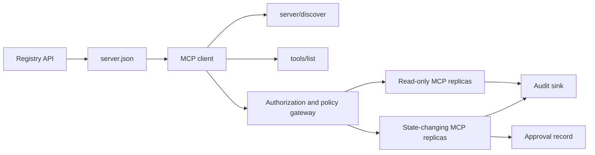

# Capstone 13: سرور MCP بدون تابعیت با ثبت و مدیریت

> MCP تولید یک فرآیند سرور نیست. این یک زنجیره قراردادها است: متاداتا منتشر، کشف زنده، پاکت درخواست بی کشور، مجوز، سیاست، حسابرسی و شواهد انتشار.

**Type:** Capstone
**Languages:** Python and TypeScript reference models; any production language
**Prerequisites:** Phase 11, Phase 13, Phase 14, Phase 17, and Phase 18
**Required MCP deep dives:** [Lesson 28: Tool Contracts](../../../13-tools-and-protocols/28-mcp-tool-contracts-and-content/docs/en.md)،[Lesson 29: Reliability](../../../13-tools-and-protocols/29-mcp-reliability-cancellation-and-flow-control/docs/en.md)،[Lesson 30: Registry Supply Chain](../../../13-tools-and-protocols/30-mcp-registry-supply-chain-and-drift/docs/en.md)و[Lesson 31: Conformance Operations](../../../13-tools-and-protocols/31-mcp-conformance-versioning-and-operations/docs/en.md)
**Protocol target:**MCP `2026-07-28`
**Time:** ~25 hours

## اهداف یادگیری

- درخواست MCP بدون دولت و بسته نتایج را اجرا کنید.
- متاداتا را از پروتکل های زنده جدا نگه دارید.
- کشف ابزار تعیین کننده و آگاه از کش بسازید.
- اجرای سیاست صادر کننده، مخاطبان، دامنه و تأیید برای هر تماس ابزار.
- استفاده از HTTP قابل پخش بدون ارتباط جلسه
- رفتار رو در مرز هاي تار، اجازات، سيستم، ثبت و حسابرسي ثابت کن

## مسیر مورد نیاز MCP

چهار درس مرتبط مرحله 13 را به ترتیب تکمیل کنید قبل از اینکه این سنگ پایانی را آماده تولید قرار دهید:

1. [Lesson 28](../../../13-tools-and-protocols/28-mcp-tool-contracts-and-content/docs/en.md)ابزار، طرح، محتوا، صفحه بندی، تکمیل، مسیر و قراردادهای خطایی را که این سرور باید نشان دهد تعریف می کند.
2. [Lesson 29](../../../13-tools-and-protocols/29-mcp-reliability-cancellation-and-flow-control/docs/en.md)نژاد های لغو، مهلت ها، بی اختیار، فشار، دوباره تلاش و رفتار دوباره
3. [Lesson 30](../../../13-tools-and-protocols/30-mcp-registry-supply-chain-and-drift/docs/en.md)نام فضا، اصل، پاین پذیرش، وضعیت ثبت نام، حرکت، دفترچه و شواهد بازپسین را تعریف می کند.
4. [Lesson 31](../../../13-tools-and-protocols/31-mcp-conformance-versioning-and-operations/docs/en.md)تعریف ترانسکریپت های طلایی و منفی، دوره های نسخه سخت، چک های فرقی SDK، اثبات پروکسی، ویرایش، سلامت و گاتینگ انتشار.

این سنگ پایه این آثار را ادغام می کند. این آنها را با یک آزمون SDK راه خوش جایگزین نمی کند.

## مشکل

یک پلت فرم داخلی به ابزارهای داده های فقط برای خواندن و مجموعه ای کوچک از ابزارهای تغییر وضعیت نیاز دارد. توسعه دهندگان باید بتوانند سرور را کشف کنند، بدانند که چگونه ارتباط برقرار کنند، قابلیت های زنده آن را بررسی کنند و فقط عملیات هایی را که مجاز به استفاده از آنها هستند، تماس بگیرند.

بخش سخت ثبت یک تابع نیست بخش سخت نگه داشتن شش حقیقت مختلف در یک خط است:

1. `server.json`میگه کجا میشه سرور نصب شده یا رسيده باشه
2. `server/discover`میگه که حالا روند زنده چه چیزی رو پشتیبانی می کنه
3. هر درخواست ميگه که از چه پروتکل هاي بازنگري و قابلیت هاي كليتي استفاده مي کنه
4. مجوز تماس گیرنده را به صادر کننده، منابع و دامنه های صحیح متصل می کند.
5. سیاست تصمیم می گیرد که آیا این اقدام خاص می تواند اجرا شود.
6. شواهد بازرسی نشان می دهد که چه چیزی مرز را بدون انتشار اسرار و یا بار های حساس عبور کرد.

اگر یکی از این انحرافات، پلت فرم ممکن است یک سرور قابل دسترسی را لیست کند، یک مشتری متناقض را هدایت کند، یک توکن را برای یک منبع دیگر قبول کند یا بدون بررسی انتظار انجام شود، یک عمل تخریب کننده را نشان دهد.

## دو لایه کشف

دفتر ثبت و سرور MCP زنده پاسخ های مختلف را می دهند.

| Layer | Contract | Question it answers |
|---|---|---|
| Publication | `server.json` and Registry API | What is this server, where is its package or remote endpoint, and how is it configured? |
| Runtime | `server/discover` | Which protocol versions, capabilities, extensions, and server identity does this process support? |

دفتر رسمی از نسخه ای نسخه ای استفاده می کند`server.json`schema. یک ورودی از راه دور می تواند یک URL HTTP Streamable را نام دهد:

```json
{
  "$schema": "https://static.modelcontextprotocol.io/schemas/2025-12-11/server.schema.json",
  "name": "com.example/internal-readonly",
  "title": "Internal Read-Only Tools",
  "description": "Read-only incident and data lookup tools.",
  "version": "1.0.0",
  "remotes": [
    {
      "type": "streamable-http",
      "url": "https://mcp.internal.example.com/readonly"
    }
  ]
}
```

نسخه شیما ثبت و تجدید پروتکل MCP مستقل هستند. یک تاریخ را برای مطابقت با دیگر ننوشته اید. هر سند را با قرارداد خود تأیید کنید.

اعتبار طرح ثابت نمی کند مالکیت فضای نام.`example.com`از فضای نام های DNS برعکس استفاده می کند`com.example/*`یا یکی از فضاهای نام کودک آن. جریان تأیید هویت ثبت کننده این مالکیت است. نگه داشتن برچسب های دامنه در ترتیب عادی نام های نام های مختلف.

مدل stdlib`validate_registry_document`این تابع عمداً یک اعتبار دهنده ی پروفایل از راه دور جزئی است.`name`،`description`و`version`زمینه ها؛ اختیاری`title`; نام و محدودیت های طولانی منتشر شده ، شکل نسخه بتونی و هر `streamable-http`یا`sse`شکل URL HTTP ((S) از راه دور. علاوه بر این نیاز به یک غیر خالی `remotes`این اسم ها رو از اون اسم ها میخوام که این اسم ها رو به اسم "مرد" بنویسم`validate_publisher_namespace`به طور جداگانه نام را با دامنه ناشر تایید شده بررسی می کند، در حالی که `validate_runtime_alignment`نام و نسخه ی نشریه را با نسخه ی زنده مقایسه می کند `serverInfo`. اسکیما رسمی همچنین از سوابق بسته فقط و زمینه های دورتری پشتیبانی می کند. قبل از انتشار، کل سند را با اسکیما رسمی JSON یا `mcp-publisher`; این زیر مجموعه بدون وابستگی را به عنوان اعتبار کامل طرح ارائه ندهید.

سرور باید اجرا کند`server/discover`; یک مشتری می تواند قبل از سایر روش ها آن را فراخشد. این کلفن پایانی پس از حل نقطه پایان این کار را انجام می دهد و تجدید نظر پروتکل فعلی و قابلیت های زنده را دریافت می کند:

```json
{
  "resultType": "complete",
  "supportedVersions": ["2026-07-28"],
  "capabilities": {
    "tools": {
      "listChanged": false
    }
  },
  "_meta": {
    "io.modelcontextprotocol/serverInfo": {
      "name": "com.example/internal-readonly",
      "version": "1.0.0"
    }
  },
  "ttlMs": 3600000,
  "cacheScope": "public"
}
```

یک کاتالوگ خصوصی ممکن است داده های مالکیت، بررسی یا چرخه عمر اضافی را فهرست کند، اما نباید این داده ها را به عنوان زمینه های سیم MCP یا ریشه ایجاد کند.`server.json`در حال حاضر، در این زمینه، اطلاعات مربوط به سازمان ها در اختیار شما قرار دارد.`_meta.io.modelcontextprotocol.registry/publisher-provided`تمدید و ماندن در محدوده 4 KB

## هسته MCP بی شهرت

بازنگری از MCP `2026-07-28`جلسه های پروتکل و برنامه های`initialize`-`notifications/initialized`دست زدن هم از دست دادن`Mcp-Session-Id`. .

هر درخواست متن پروتکل را در خود دارد`params._meta`:

```json
{
  "io.modelcontextprotocol/protocolVersion": "2026-07-28",
  "io.modelcontextprotocol/clientCapabilities": {},
  "io.modelcontextprotocol/clientInfo": {
    "name": "internal-platform-client",
    "version": "1.0.0"
  }
}
```

نسخه و قابلیت ها حقایق درخواست هستند نه حقایق اتصال. یک ترازنده بار ممکن است درخواست های متوالی را به نسخه های سالم مختلف ارسال کند زیرا هر یک از نسخه ها می توانند درخواست را از خود پیام تأیید کنند.

نتایج معمول شامل:`resultType: "complete"`. سرورها بايد هویت خود را در`_meta.io.modelcontextprotocol/serverInfo`در هر نتیجه. یک نسخه از پروتکل گم شده یا غیر رشته ای، پارامای باطل است`-32602`. اشتباه`-32022`فقط برای یک رشته تامین شده است که پشتیبانی نمی شود، با دقیقا `{"supported": ["2026-07-28"], "requested": "..."}`به عنوان داده های آن.

### کشف پنهان

`tools/list`باید برای همان مجموعه ابزار موثر تعیین کننده باشد. نتیجه شامل:

- `ttlMs`، يه اشاره تازه براي مشتری
- `cacheScope`، یا`public`یا`private`؛
- یک ترتیب ثابت ابزار به طوری که لیست های یکسان می توانند از کیش های فوری استفاده مجدد کنند؛
- `resultType: "complete"`و متاداتا هویت سرور

مجوز هر کاربر باید به طور معمول تولید کند`cacheScope: "private"`. قابل مشاهده بودن ابزار مخصوص کاربر را در پشت یک کش عمومی مشترک قرار ندهید.

## HTTP قابل پخش

یک سرور شبکه یک نقطه پایان MCP را که POST را پذیرفته است نشان می دهد. هر درخواست یا اطلاعیه JSON-RPC POST خود را دریافت می کند.

برای یک درخواست، سرور یک شی JSON یا یک جریان SSE را که به آن درخواست اختصاص دارد، باز می گرداند.`subscriptions/listen`درخواست شامل اطلاعیه های تغییر پذیرفته شده است. هیچ جریان GET مستقل، حذف جلسه، سرپرست جلسه، یا `Last-Event-ID`تکرار در حمل و نقل فعلی

هر درخواست شامل:

- `MCP-Protocol-Version`, مطابقت با متاداتا بدن
- `Mcp-Method`, با روش JSON-RPC مطابقت دارد
- `Mcp-Name`برای`tools/call`،`resources/read`و`prompts/get`؛
- `Accept: application/json, text/event-stream`. .

سرنخ های آینه ای که با مشخصات مشخص نشده مطابقت ندارند را رد کنید`-32020`خطا. اعتبارش`Origin`، سرورهای توسعه محلی را به لوپ بیک متصل کنید، مشتریان از راه دور را تأیید کنید و پاسخ SSE بسته ای را با درخواست بسته به عنوان لغو در نظر بگیرید.



```figure
cf-mcp-gate
```

## مجوز و سیاست

متاداتا هاي حمل و نقل اجازه نيستن.

برای سرورهای دور:

1. متاداتا منابع محافظت شده را کشف کنید.
2. سرور مجوز را برای این منبع انتخاب کنید.
3. برای ثبت نام مشتری، اسناد متادای شناسه مشتری را ترجیح دهید. ثبت نام مشتری پویا را به عنوان پشتیبانی از سازگاری در نظر بگیرید.
4. شاخص منابع را در زمان مجوز ارسال کنید.
5. تایید یک بازگشت`iss`ارزش در برابر سرور مجوز ثبت شده برای جریان.
6. اطلاعات کلیدی مشتری توسط صادر کننده هرگز از اطلاعات ثبت نام در بین صادرکنندگان استفاده نکنید.
7. اعتبار صادر کننده توکن، مخاطب یا منبع، انقضاء و دامنه ها را در سرور MCP تأیید کنید.
8. یک تصمیم سیاست دوم را به ابزار و استدلال های مشخص اعمال کنید.

تشریحات ابزار مانند `readOnlyHint`و`destructiveHint`کمک به مشتریان در ارائه ریسک. آنها کنترل های معتبر مجوز نیستند.

### تایید یه رکورده نه یه دامنه جادویی

یک تماس تغییر وضعیت نیاز به یک ثبت تایید مرتبط با بازیگر، ابزار، استدلال های عادی یا هضم، محیط هدف، انقضاء، و یک بار یا استفاده مجدد سیاست دارد. یک پیام چت به تنهایی اثبات تایید نیست.

مدل پایتون JSON کانونیک را با کلید های مرتب شده هاش می کند، سپس آن را با موضوع توکن، نام ابزار، URL سرور و انقضاء پیوند می دهد. تکرار رکورد پس از تغییر حتی یک استدلال قبل از اجرا دستیار شکست می خورد. تأیید شواهد جداگانه است، نه دامنه ای که به توکن دسترسی اضافه شده است.

ابزار های با ریسک بالا را در سطح قابل بررسی جداگانه نگه دارید، زمانی که این موضوع شعاع انفجار را به طور قابل توجهی کاهش دهد. جداسازی تنها در صورتی مفید است که اعتبارات، سیاست، هویت پیاده سازی و کنترل های حسابرسی نیز جدا باشند.

## آن را بسازید

### 1. متاداتا مدل انتشار

ایجاد و اعتبار نمودن طرح`server.json`. یک نام ثابت را در فضای نام های معتبر برای ناشر، به علاوه نسخه، توصیف، رسمی `repository`یا`packages`متاداتا در صورت لزوم، و یک حمل و نقل از راه دور یا استودیو. رازها را به عنوان ورودی های متغیر محیط اعلام شده نگه دارید، هرگز ارزش های واقعی.

### 2. پیاده سازی کشف زنده

اجرا`server/discover`قبل از هر ویژگی RPC. تبلیغ پشتیبانی شده نسخه های پروتکل، قابلیت ها، تمدیدات و هویت سرور. اضافه کردن یک مورد رد نسخه با استفاده از `-32022`. .

### 3. اجرای پاکت بدون کشور

در هر درخواست نسخه پروتکل و قابلیت های مشتری مورد نیاز است.`resultType`و هویت سرور در هر نتیجه. حالت ابتدایی، حافظه حافظه قابلیت های اتصال و شناسه های جلسه را حذف کنید.

### 4. سطح ابزار را بسازید

با دو ابزار فقط برای خواندن و یک ابزار تغییر حالت شروع کنید. به هر یک از آنها یک طرح JSON محدود، توصیف دقیق، شکل نتیجه تعیین کننده و تشریح های صادقانه بدهید. در صورتی که مشتریان به نتایج ساختاری متکی باشند، طرح های خروجی را اضافه کنید.

### 5. اضافه کردن لیست هوشیار به cache

ابزارها را در نظم ثابت با `ttlMs`و`cacheScope`. رفتار اطلاع رسانی های انقضاء و تغییر لیست را به طور جداگانه انجام دهید.

### 6. اجازه و سیاست اضافه کنید

اعتبار صادر کننده، مخاطبان، انقضاء، و دامنه را تأیید کنید. برای هر تماس ابزار تصمیم گیری سیاست را اجرا کنید. مجوزها را به اقدامات با ریسک بالا مرتبط کنید. قبل از اجرای یک دستیار مجوزهای گمشده را رد کنید یا از دست بدهید.

### 7. ثبت جداگانه و اعتبار زمان اجرا

ثابت کردن حالت ثابت`server.json`ضبطش کن، بعد از اون به سمت دور از اينجا بريم`server/discover`. گزارش درحال حرکت زمانی که ریموت، هویت، نسخه یا قابلیت های مورد نیاز منتشر شده با فرآیند زنده مخالف باشد.

### 8. اضافه کردن شواهد بازرسی

بازیگر، صادر کننده، منبع، ابزار، تصمیم گیری سیاست، شناسه درخواست، زمینه ردیابی، تاخیر و نتیجه را ثبت کنید. استدلال های حساس و نتایج را قبل از ادامه به کار ببرید. از زمینه قابل مشاهده مدل خارج از محیط نگه دارید.

### 9. تمرین مقیاس افقی

دو نسخه بدون حالت را پشت یک ترازنده بار قرار دهید. حداقل 100 درخواست همزمان ارسال کنید. نشان دهید که دقت بستگی به خویشاوندی ندارد. اگر یک ابزار نیاز به حالت تماس های متقابل دارد، یک دستگیر غیر شفاف صریح را چاپ کنید و آن را در یک سیستم پایدار مشترک ذخیره کنید.

### 10. از سیم واقعی عبور کن

بررسی های مطابقت را با دوگانه سرور واقعی اجرا کنید. سرپرستی های درخواست و اجسام JSON را ضبط کنید، نه تنها اشیاء SDK. نسخه اشتباه، عدم مطابقت سرپرستی، دامنه گم شده، مخاطبان اشتباه، استدلال های نادرست، شکست دستیار، لغو و انقضاء کش را تمرین کنید.

## بسته شواهد مورد نیاز

یک ارائه تا زمانی که شامل تمام پنج کلاس شواهد نباشد، نامکمل است:

| Evidence | Minimum proof | Source lesson |
|---|---|---|
| Wire | Redacted raw headers and JSON-RPC bodies for golden and negative cases, including metadata type failure, header mismatch, unsupported version, missing or unknown `resultType`, notification no-response, and response ID matching | [Lesson 31](../../../13-tools-and-protocols/31-mcp-conformance-versioning-and-operations/docs/en.md) |
| Proxy | The same stable case run directly and through the deployed intermediary, with ingress, origin, and egress status and body digests; prove protocol errors are not collapsed into generic 500 responses and streaming is not buffered | [Lessons 29](../../../13-tools-and-protocols/29-mcp-reliability-cancellation-and-flow-control/docs/en.md) and [31](../../../13-tools-and-protocols/31-mcp-conformance-versioning-and-operations/docs/en.md) |
| Admission | Verified publisher namespace, immutable Registry record digest, artifact or remote provenance, live `server/discover` identity and capability observation, descriptor pin, current Registry status, and admission-ledger event | [Lesson 30](../../../13-tools-and-protocols/30-mcp-registry-supply-chain-and-drift/docs/en.md) |
| Retry | A cancellation-versus-completion race, explicit timeout, safe read retry, mutation idempotency key, reconnect refetch, and proof that request cancellation cannot silently become durable task cancellation | [Lesson 29](../../../13-tools-and-protocols/29-mcp-reliability-cancellation-and-flow-control/docs/en.md) |
| Rollback | Exact previous version, admission and artifact digests, descriptor pin, active Registry status, current health window, route restoration result, and redacted decision evidence | [Lessons 30](../../../13-tools-and-protocols/30-mcp-registry-supply-chain-and-drift/docs/en.md) and [31](../../../13-tools-and-protocols/31-mcp-conformance-versioning-and-operations/docs/en.md) |

یک هضم بسته اصلاح شده را با انتشار ذخیره کنید. اگر هر کلاس گم شده باشد، انتشار را نگه دارید. رفتار پروکسی را از یک فرستنده در حال فرآیند، پذیرش از حضور ثبت نام، ایمنی از یک شناسه JSON-RPC جدید، یا آماده سازی برگشت از توسعه قبلی، برداشت نکنید.

## مدل های مرجع محلی

مدل پایتون متاداتا ثبت نام، اعتبارسنجی فضای نام ناشر DNS باز، بررسی هویت انتشار تا زمان اجرا، کشف زنده، لیست ابزار تعیین کننده، متاداتا در هر درخواست، صادر کننده مورد اعتماد، مخاطب، اعتبارسنجی و بررسی دامنه، تأییدات محدود به عمل، اعتبارسنجی جزئی ثبت شده، سیاست و حسابرسی بدون باز کردن سوکت شبکه را نشان می دهد:

```bash
cd phases/19-capstone-projects/13-mcp-server-with-registry
python3 code/main.py
python3 -m unittest discover -s code/tests -v
```

پروژه TypeScript شکل JSON-RPC بدون حالت را در استودیو بدون SDK MCP نشان می دهد.`tools/call`مسیر همان طرح های ورودی محدود را که توسط `tools/list`؛ استدلال های ناشناس برای یک ابزار شناخته شده نتیجه کامل را با `isError: true`بدون درخواست اجرائی کننده:

```bash
cd phases/19-capstone-projects/13-mcp-server-with-registry/code/ts
npm install
npm run typecheck
npm test
npm run demo
```

این مدل ها منطق قراردادی محلی را اثبات می کنند. آنها سرنخ های HTTP، تبادل OAuth، انتشار ثبت نام، ادغام OPA، تعادل بار یا رسید جمع آوری را ثابت نمی کنند.

## نمونه سیم

```http
POST /mcp HTTP/1.1
Host: mcp.internal.example.com
Content-Type: application/json
Accept: application/json, text/event-stream
MCP-Protocol-Version: 2026-07-28
Mcp-Method: tools/call
Mcp-Name: postgres.readonly
Authorization: Bearer REDACTED

{
  "jsonrpc": "2.0",
  "id": 42,
  "method": "tools/call",
  "params": {
    "name": "postgres.readonly",
    "arguments": {"sql": "SELECT 1"},
    "_meta": {
      "io.modelcontextprotocol/protocolVersion": "2026-07-28",
      "io.modelcontextprotocol/clientCapabilities": {},
      "io.modelcontextprotocol/clientInfo": {
        "name": "internal-platform-client",
        "version": "1.0.0"
      }
    }
  }
}
```

## -باده

یک مخزن حاوی:

- یک طرح معتبر`server.json`؛
- سطحهای سرور تنها برای خواندن و تغییر حالت؛
- `server/discover`، تعیین کننده`tools/list`، و با سیاست های مربوطه`tools/call`؛
- یک برنامه HTTP قابل پخش با دو نسخه قابل تعویض؛
- یکپارچه سازی مجوز و تأیید؛
- یک ناشر ثبت یا آداپتور API ثبت خصوصی
- تعریف های سیاست و سوابق تأیید مربوط به اقدامات؛
- حذف نتایج حسابرسی و گسترش ردیابی؛
- شواهد شکست سیم و ولایت؛
- پذیرش، دوباره امتحان، سلامت و بازپرداخت شواهد با هضم بسته اصلاح شده

| Weight | Criterion | Evidence |
|---:|---|---|
| 25 | Protocol correctness | Stateless request metadata, discovery, results, headers, and negative cases |
| 20 | Authorization | Issuer, audience, expiry, scope, and action-bound approval cases |
| 15 | Registry integrity | Valid `server.json`, publication record, live discovery probe, and drift report |
| 15 | Policy and safety | Allow, deny, malformed, stale approval, and sensitive-data cases |
| 15 | Scale and reliability | Two replicas, no affinity dependency, cancellation, timeout, and recovery |
| 10 | Auditability | Redacted receiver-side audit and trace evidence |

## تمرینات

1. URL ریموت منتشر شده را تغییر دهید و سرور زنده را بدون تغییر بگذارید. گزارش اعتبارسنجی ثبت کننده را به سمت دقیق منتقل کنید.
2. بفرست`tools/list`دو بار با ورودی های یکسان و ثابت بایت ثابت دستور ابزار. سپس به پایان می رسد `ttlMs`و تازه کردن
3. يه بدن معتبر رو با يه بدن ديگه بفرست`MCP-Protocol-Version`سرش رو برگردون`-32020`و به سیاست یا ابزار استفاده نکنید.
4. یک توکن برای سرور تنها برای خواندن را ایجاد کنید و آن را به سرور تغییر حالت ارائه دهید. تایید مخاطبان را قبل از اجرا کنترل نشان دهید.
5. یک تایید را به یک هضم استدلال عادی متصل کنید. یک زمینه را تغییر دهید و ثابت کنید که تایید را نمی توان تکرار کرد.
6. تماس های متوالی را به نسخه های متناوب هدایت کنید. حافظه فرآیند پنهان را با یک دستی مشترک صریح جایگزین کنید هر کجا که جریان کار نیاز به پایداری دارد.
7. یک اتصال SSE که به درخواست داده شده است را قطع کنید و با یک ID درخواست JSON-RPC جدید دوباره امتحان کنید.`Last-Event-ID`مسیر بازیابی استفاده می شود.

## اصطلاحات کلیدی

| Term | What people say | What it actually means |
|---|---|---|
| Stateless MCP | "No state anywhere" | No protocol session; cross-call state is explicit and server-managed |
| `server.json` | "The tool manifest" | Registry metadata for naming, packaging, configuration, and transports |
| `server/discover` | "The handshake" | A normal mandatory RPC for live versions and capabilities, not a session initializer |
| Cache scope | "Can I cache it?" | Whether a cacheable result is safe for shared or private reuse |
| Policy decision | "The token allows it" | A separate decision over actor, tool, target, arguments, and context |
| Approval record | "A human clicked yes" | Evidence bound to one actor and consequential action under an expiry policy |
| Explicit handle | "A session ID" | Ordinary application data for named server-managed state, not protocol connection state |

## خواندن بیشتر

- [MCP 2026-07-28 key changes](https://modelcontextprotocol.io/specification/2026-07-28/changelog)
- [Streamable HTTP](https://modelcontextprotocol.io/specification/2026-07-28/basic/transports/streamable-http)
- [Server discovery](https://modelcontextprotocol.io/specification/2026-07-28/server/discover)
- [MCP authorization](https://modelcontextprotocol.io/specification/2026-07-28/basic/authorization)
- [Official Registry server.json requirements](https://github.com/modelcontextprotocol/registry/blob/main/docs/reference/server-json/official-registry-requirements.md)
- [Official Registry OpenAPI contract](https://registry.modelcontextprotocol.io/openapi.yaml)
