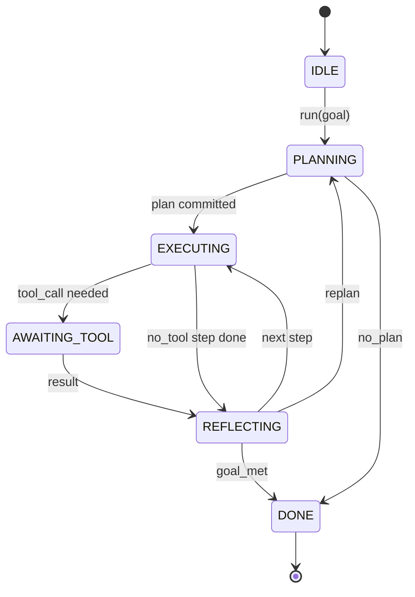

# قرارداد کارکن " هارنس لوپ "

> هنيز عامل است مدل هم پردازنده است اين درس قرارداد حلقه اي را که مي توني هر مدل رو به داخل ببري منجمد ميکنه

**Type:** Build
**Languages:** Python
**Prerequisites:** Phase 13 lessons 01-07, Phase 14 lesson 01
**Time:** ~90 minutes

## اهداف یادگیری
- یک حلقه استفاده از عامل را به عنوان یک ماشین حالت تعیین کننده با انتقال صریح مشخص کنید.
- ۱۰ موضوع مربوط به چرخه زندگی را اجرا کنید که اپراتورها سیاست، تلمتر و محافظ را به آن ها می دهند.
- دو نقطه کششی را تعریف کنید که در آن حلقه کنترل را به تماس گیرنده باز می کند و در ورودی تازه شروع می کند.
- بودجه های هر جلسه را اجرا کنید (موبایل، تماس با ابزار، ساعت دیواری) بدون اینکه در زمان تجاوز وضعیت جزئی از آن ها را از بین ببرد.
- یک جریان تایپ شده از 11 نوع رویداد را ارسال کنید تا UI های پایین و ردیاب ها بدون بررسی مستقیم حلقه بتوانند اشتراک بگذارند.

```figure
cf-loop-contract
```

## قاب

یک عامل کدگذاری که برای چهل نوبت بدون نظارت اجرا می شود، یک حلقه چت نیست. این یک دستگاه دولتی است که عامل می تواند گره های آن را قطع کند و کناره های آن را می تواند بررسی کند. هنگامی که شما قرارداد را یادداشت می کنید، تغییر مدل ها، ابزارها یا سیاست ها یک عامل دیگر نیست. این تبدیل به یک تماس ثبت نام می شود.

این درس این قرارداد را می سازد. ما شش ایالت، ده موضوع هک، دو نقطه کشش، ۱۱ نوع رویداد و یک پاکت بودجه را نام می دهیم. همه چیز دیگر در ابزار (رجستر ابزار، JSON-RPC حمل و نقل، فرستنده، برنامه نویس) به این شکل وصل می شود.

## ایالت ها

حلقه شش حالت داره، پنج حالت فعاله، يک حالت ترمينيال



`IDLE`تنها نقطه ورود قانونی است.`DONE`تنها راه قانونی برای خروج هست`AWAITING_TOOL`تنها حالت که نقطه کشش را به ارمغان می آورد. هر انتقال دیگری داخلی است.

دستگاه حالت تعیین کننده است. با توجه به همان روزنامه رویداد، هنیس دوباره وارد همان حالت می شود. این ویژگی به شما اجازه می دهد تا جلسات بازیابی را برای دیبگینگ بدون دوباره تماس گرفتن مدل باز کنید.

## موضوعات هک

هک ها یک پیچ و جوی برای کارکن هستند. هنیس ده موضوع را می گیرد. هر موضوع هر تعداد مشترک را قبول می کند. مشترکان به ترتیب ثبت نام می شوند. مشترک ممکن است بار مفید را تغییر دهد، به طور قطع به نوبت برساند یا یک نگهبان را برای عبور از مرحله بعدی برگرداند.

```text
before_plan         after_plan
before_tool_call    after_tool_call
before_step         after_step
on_error
on_pause
on_budget_exceeded
on_complete
```

شکل منعکس کننده چیزی است که کلود کد، کورسور و OpenCode در اواسط سال 2025 به هم پیوسته اند. نام ها کاربردی هستند، نه برند. یک هوک که مسدود می کند.`rm -rf`زندگی می کنه`before_tool_call`. يه هک که يه مدت زمان " اوپن تلگيمتري " رو ميفرستاد زندگي ميکنه`after_step`يه خنجر که در جلسه توقف دوباره شروع ميشه زندگي ميکنه`on_pause`. .

## نقاط کشش

دو بار کنترل رو به حلقه ميده اولش`AWAITING_TOOL`وقتی که بدون نتیجه ابزار نمی تواند پیشرفت کند.`on_pause`وقتی بودجه تمام شده یا یک قنچه به طور صریح از بررسی انسانی درخواست می کند.

یک نقطه کشش استثنا نیست. این یک بازگشت است. تماس گیرنده وضعیت آستین را بررسی می کند، هر چیزی را که آستین خواسته است را می آورد و تماس می گیرد.`resume(payload)`.آره پشت سرش از جایی که متوقف شده است برمی گردد. این شکل مشابه ژنراتور پایتون است. حمل و نقل از نقطه کشش انتخاب شماست. در یک TUI این کلید است. در MCP این است`tools/call`. اونم يه نظرسنجی شغل

## جریان رویدادها

این حلقه رویدادها را به یک جریان تایپ شده در نقاط خاصی در قرارداد متصل می کند. جریان فقط اضافه می شود و مشترکان می توانند از هر آفست بازی کنند. ۱۱ نوع رویداد اجرا شده عبارتند از:

- `session.start` یک بار در زمان`run(goal)`به نام
- `plan.draft` وقتی برنامه نویس طرح را بازمی گرداند، صادر می شود
- `plan.commit` پس از اینکه طرح به عنوان برنامه فعال متعهد شده است صادر می شود
- `step.start` در آغاز هر مرحله اجرا صادر می شود
- `step.end` در پایان هر مرحله اجرا صادر می شود
- `tool.call` وقتی که یک مرحله که نیاز به ابزار دارد کنترل را به تماس گیرنده می دهد
- `tool.result` در رزومه با نتیجه ابزار منتشر شده
- `tool.error` در رزومه با خطا یا زمانی که یک هک تماس را قطع می کند
- `budget.warn` وقتی حد بودجه به دست می آید صادر می شود
- `session.pause` در هنگام باز کردن (باژت یا هک) ، در حال تولید
- `session.complete` وقتی حلقه به اندازه ی ممکن می رسد یک بار منتشر می شود `DONE`

این رویدادها بارهای مفید هوک را تکرار نمی کنند. هوک ها ضروری هستند (تبدیل، قطع عمل). رویدادها مشاهدی (ریکارد، کشتی) هستند. آنها را به عنوان یک خط راست و راست رفتار کنید.

## بسته بودجه

یک جلسه دارای سه محدودیت است. شمارش نوبت، تعداد تماس ابزار، ثانیه ساعت دیواری. هر نوبت افزایش به یک نوبت می شود. هر ابزار تماس افزایش به یک تماس ابزار. دیوار ساعت در هر انتقال حالت بررسی می شود. هنگامی که هر محدودیت به دست آمده است، حلقه آتش می زند.`on_budget_exceeded`، پخش می کند`budget.warn`، بعد از اون به`IDLE`با دلیل بیش از بودجه در نقطه کشش بعدی.

بودجه یک سوئیچ نیست بلکه یک سود است. تماس گیرنده تصمیم می گیرد که آیا بودجه را گسترش دهد و دوباره شروع کند یا جلسه را ببندد.

## آنچه این درس انجام نمی دهد

این مدل را نمی خواند، ابزار واقعی را ثبت نمی کند، حمل و نقل را اجرا نمی کند. این چهار درس بعدی است. این درس قرارداد را می کند تا چهار بعدی بدون نوشتن دوباره بتوانند به آن متصل شوند.

برنامه ریز تعیین کننده در`main.py`این یک جایگزین است. این یک نقشه سخت کد شده از سه مرحله را باز می آورد که دو از آنها نیاز به یک نتیجه ابزار است. نکته حلقه است، نه نقشه.

## چطور کد رو بخونيم

`HarnessLoop`اون طبقه اصلي است. اون دولت رو نگه داره، هک ها رو مي سوزونه، حوادث رو پخش ميکنه.`Budget`محدودیت های ردیابی را دنبال می کند.`Event`این پاکت تایپ شده در جریان است.`HookRegistry`میز فرستادن`_transition`تنها تابع است که حالت را تغییر می دهد، بنابراین انوارات ماشین حالت در یک مکان زندگی می کنند.

بخون`main.py`از بالا تا پایین.`code/tests/test_loop.py`. تست ها هر انتقال و هر دستور شلیک را مشخص می کنند

## . به جلوتر می رسیم

سخت ترین بخش ساخت یک آله در تولید ماشین دولتی نیست. این قرارداد را اجرا می کند. قرارداد باید از بارگیری گرم برنامه نویس زنده بماند. باید از یک ابزار زنده بماند که JSON را به طور نادرست باز می آورد. باید از یک هوک زنده بماند که در آن افزایش می یابد.`before_tool_call`دو سوم راه از طریق یک جلسه 40 نوبت. تست های در این درس تمرین این حالت شکست. آنها را اجرا کنید. آنها را شکستن. موارد اضافه کنید.

دروس بعدی، ثبت ابزار اضافه می شود. بعد از آن، JSON-RPC حمل و نقل. بعد از آن، فرستنده. دروس بیست و چهار، حلقه در این فایل یک برنامه واقعی در برابر ابزار واقعی با بودجه واقعی اجرا خواهد شد.
