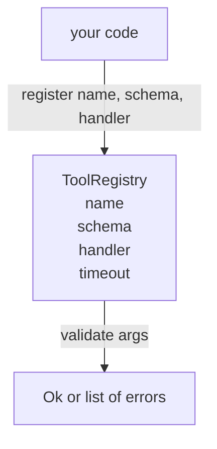

# ثبت ابزار با تأیید طرح

> ابزاری که عامل نمی تواند تأیید کند ابزاری است که عامل نمی تواند به آن تماس بگیرد. قبل از ساخت ابزارها، ثبت و چک کننده شیما را بسازید.

**Type:** Build
**Languages:** Python
**Prerequisites:** Phase 13 lessons 01-07, Phase 14 lesson 01
**Time:** ~90 minutes

## اهداف یادگیری
- یک ثبت نام تایپ شده از نام ابزار → schema → دستیار را نگه دارید که فرستنده می تواند یک بار از آن درخواست کند و بعد از آن به آن اعتماد کند.
- پیاده سازی زیر مجموعه JSON Schema 2020-12 که شامل کلمات کلیدی است نود درصد از تماس های ابزار واقعا استفاده می شود.
- مسیرهای خطای دقیق به شکل json را برگردانید تا مدل بتواند خود را در یک سفر دور و عقب اصلاح کند.
- بدون تغییر صریح، ثبت مجدد را رد کنید، زیرا تغییر صوتی، نحوه حرکت کتاگوس ابزار تولید است.
- اعتبار دهنده را پاک نگه دارید (هیچ I/O، هیچ زمان، هیچ گلوبال) تا بتواند دوباره در یک دفترچه بازخورد اجرا شود.

```figure
cf-registry-validate
```

## چرا ثبت قبل از ابزار است

یک عامل کدگذاری در سال 2026 دارای ابزارهای ثبت شده بیشتری از مدل می تواند در یک پنجره زمینه واحد قرار گیرد. یک آستین غیر معمولی دوصد ابزار را ثبت می کند و در هر چرخش مشخص 10 تا 40 سطح را می سازد. ثبت نامه منبع حقیقت برای "چه ابزار وجود دارد" "چه شکل استدلال آنها را می گیرند" و "چه دستیار من می نامم". هنگامی که این سه پاسخ به دست آمده است، بقیه از حاشیه می توانند حدس زدن را متوقف کنند.

اشتباهاتی که از آن اجتناب می کنیم، حمل و نقل بدون طرح ها و یا حمل و نقل بدون تأیید است. هر دو رایج هستند. هر دو لایه بعدی (دیسپتر در درس بیست و سه) را به بازی حدس و گمان تبدیل می کنند که تنها حالت شکست یک ردیابی از دستیار است.

## چه شکلی یک دفترچه ابزار به نظر می رسد

```text
ToolRecord
  name        : str          (unique, lowercase alphanumeric and underscore segments separated by dots, e.g., snake_case.segment.case)
  description : str          (one line, shown to the model)
  schema      : dict         (JSON Schema 2020-12 subset)
  handler     : Callable     (async or sync, returns Any)
  idempotent  : bool         (dispatcher uses this for retry decisions)
  timeout_ms  : int          (override per-tool dispatcher default)
```

این طرح تنها زمینه ای است که اعتبارگر لمس می کند. عامل شفاف نیست. ما آنها را به طور عمدی جدا می کنیم. طرح داده است. عامل کد است. ترکیب آنها شما را به قرار دادن منطق اعتبار در داخل عامل وسوسه می کند، که این خطای ما است که ما متوقف می کنیم.

## زیر مجموعه JSON Schema 2020-12

مشخصات کامل سال 2020-12 یک مقاله است. ما به هشت کلمه کلیدی نیاز داریم.

```text
type           string / number / integer / boolean / object / array / null
properties     map of property name -> schema
required       list of property names
enum           list of allowed primitive values
minLength      integer, applies to strings
maxLength      integer, applies to strings
pattern        ECMA-262-compatible regex, applies to strings
items          schema applied to every array element
```

این برای پوشش آنچه که یک ابزار API واقعا نیاز دارد کافی است. کلمات کلیدی که ما اضافه نمی کنیم (oneOf، anyOf، allOf، $ref، شرایط) در طرح های تولید معتبر هستند اما اعتبار دهنده را به یک درخت پیاده با چرخه تبدیل می کنند. ما یک ثبت را می سازیم، نه یک موتور JSON Schema.

## مسیرهای خطا Json

هنگامی که اعتبارسنجی شکست می خورد، اعتبارسنجی یک لیست خطاها را باز می آورد. هر خطایی یک مسیر json-pointer را به ورودی می برد. یک اشاره دار یک ردیف پیش فرض با شلوار نام های ملک و شاخص های آرایه است.

```text
{"a": {"b": [1, 2, "x"]}}
                    ^
                    /a/b/2
```

مدل مسیرهای خطا را بهتر از جمله ها می خواند. اگر یک طرح نیاز دارد `args.user.email`و مدل یک عدد کامل را رد کرد، اشتباه باید باشد`/user/email`با`expected_type: string`مدل در تماس بعدی بدون استفاده از زبان طبیعی درست می کنه

## ثبت و رد

`register(name, schema, handler, **opts)`به طور پیش فرض ثبت مجدد را رد می کند.`override=True`این بهداشت عملیاتی است. دو قسمت از پایگاه کد به طور خاموشی نام ابزار را ثبت می کنند این نوع خطای است که یک هفته طول می کشد تا در تولید پیدا شود.

این ثبت سه روش خواندن را نشان می دهد.`get(name)`پس از اینکه این رقم را برگرداند یا افزایش دهد.`validate(name, args)`یک `Ok`یا لیست اشتباهات`names()`نام ابزار را به ترتیب ثبت می دهد.

## چه چیزی اعتبار دهنده است و چه چیزی نیست

این یک گذر یکبار از درخت طرح است، تکراری است. خالص است. این کارگزاران را نمی خواند. این نوع را مجبور نمی کند (یک رشته)`"42"`نمایه ای را عبور نمی کند.

این یک مرز امنیتی نیست. یک عامل مخرب هنوز هم می تواند رفتار بد انجام دهد پس از تایید عبور. فرستنده در درس بیست و سه اضافه می کند زمان و لایه های sandbox. ثبت اضافه می کند شکل.

## شکل



## چطور کد رو بخونيم

`code/main.py`تعریف می کند`ToolRegistry`،`ToolRecord`،`ValidationError`، و هشت تابع اعتبارگر.`schema["type"]`(یا یک طرح را با `enum`هر اعتبارگر نوع یا یک لیست خالی یا یک لیست از `ValidationError`. راهرو سطح بالا خطاها را به هم متصل می کند و قطعات مسیر را در طول نزول به جلو می گذارد

`code/tests/test_registry.py`شامل ثبت، رد، موفقیت اعتبار، شکست اعتبار با مسیرها و هر کلمه کلیدی در زیر مجموعه است.

## . به جلوتر می رسیم

دو تا تمدید که بعد از اینکه این درس به زمین برسد می خواهید`$ref`قطعنامه علیه یک بلوک تعاریف محلی و`additionalProperties: false`هر دو کوچک هستند. هر دو به طور معمول اضافه می شوند زیرا کاتالوگ ابزار بیش از پنجاه ابزار رشد می کند. ما آنها را از درس خارج کردیم تا فایل را تحت یک خواندن نگه داریم.

درس بعدی (۲۲) ساخت JSON-RPC استودیو حمل و نقل است که سطح این ثبت به یک مشتری مدل. درس پس از (۲۳) هر دو پشت یک فرستنده با زمان بندی و تکرار بسته می شود.
