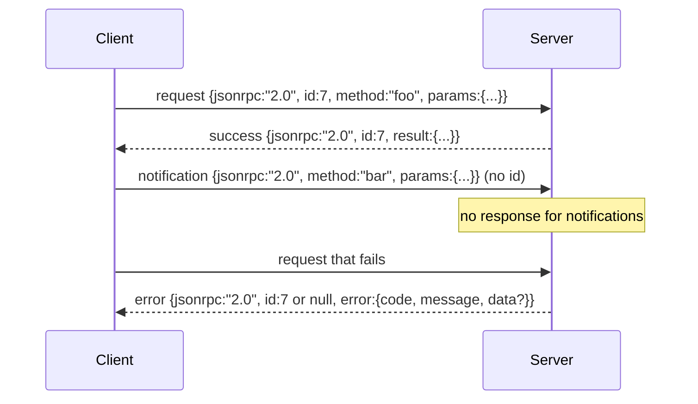

# JSON-RPC 2.0 Over Newline-Delimited Stdio

> حمل و نقل بین یک مشتری مدل و یک سرور ابزار JSON-RPC از طریق stdio است. یک بار دستی آن را به شما می آموزد که هر لایه فریمینگ برای چه پرداخت می کند.

**Type:** Build
**Languages:** Python
**Prerequisites:** Phase 13 lessons 01-07, Phase 14 lesson 01
**Time:** ~90 minutes

## اهداف یادگیری
- JSON-RPC 2.0 را به عنوان JSON خط جدید محدود در stdin و stdout استفاده کنید.
- پنج کد خطای استاندارد (-32700، -32600، -32601، -32602، -32603) را نقشه برداری کنید و با معنای صحیح آنها را روی آنها قرار دهید.
- درخواست ها، پاسخ ها، اطلاعیه ها و دسته ها را بدون اختراع کلید های پاکت جدید تشخیص دهید.
- بدون مسموم کردن بقیه جریان یک خطا تجزیه در هر خط رو کنترل کن
- با استفاده از io.BytesIO یک دمو خود پایان دهنده بسازید تا درس بدون تولید یک فرآیند کودک اجرا شود.

```figure
cf-jsonrpc-frames
```

## چرا JSON-RPC زبان اصلی باقی می ماند

یک آژانس کد در سال 2026 با شاید 12 سرور ابزار در یک جلسه صحبت می کند. هر سرور یک فرآیند جداگانه یا یک نقطه ی آخر از راه دور است. فرمت سیم از سال 2013 یکسان بوده. JSON-RPC 2.0 مشخصات دو صفحه ای است. این زنده می ماند زیرا گزینه های جایگزین (gRPC، HTTP در هر تماس، دوگانه سفارشی) همه یک معامله JSON-RPC را اعمال می کنند: آنها یا پخش یا دسته بندی یا اتصال حمل و نقل را انتخاب می کنند. JSON-RPC در سراسر stdio، سوکت، websocket و HTTP همتقویم است و یک مشتری می تواند یک سرور را که هرگز ندیده است اجرا کند اگر هر دو به مشخصات احترام بگذارند.

این درس ساخت stdio ویرانت. JSON Newline-delimited. هر درخواست یک خط است. هر پاسخ یک خط است. مرز حمل و نقل است `\n`. .

## شکل سیم

چهار شکل پاکت وجود دارد دو مورد توسط مشتری و دو مورد توسط سرور صحبت می شود



اطلاعیه ای نیست`id`. سرور نباید به آن پاسخ دهد. اگر سرور پاسخ به یک اطلاعیه را بازگرداند، مشتری هیچ راهی برای پیوستن آن به یک سایت تماس ندارد. این قانون واحد ریاضیات فریم را ساده نگه می دارد.

یک دسته یک مجموعه ی JSON از درخواست ها یا اطلاعیه ها است. سرور با یک دسته از پاسخ ها، در هر ترتیب، یک برای هر ورودی غیر اطلاعیه پاسخ می دهد. اگر هر ورودی در دسته یک اطلاعیه باشد، سرور هیچ چیز را به شما نمی فرستد.

## پنج کد خطا

```text
-32700  Parse error      JSON could not be parsed
-32600  Invalid Request  Envelope shape is wrong
-32601  Method not found
-32602  Invalid params
-32603  Internal error
```

کد های بین -32000 و -32099 برای خطاهای تعریف شده توسط سرور اختصاص داده شده است. همه چیز دیگر توسط برنامه تعریف شده است. درس به پنجم میچسبد. اگر دستیار شما آن را بالا می برد، حمل و نقل آن را به عنوان -32603 با نام کلاس استثنا در `data.exception`. .

اشتباه تحليل يه قانون خاص داره`id`در پاسخ این است`null`، چون درخواست هرگز به اندازه کافی تجزیه نشده تا یه شناسه استخراج بشه

## فریمینگ خط جدید و نمایش BytesIO

حمل و نقل یک خط در یک زمان را می خواند. یک خط باایت ها تا شامل`\n`اگر خطي را نتونيم بازنگري کنيم، ترانسپورت جوابي به -32700 مي نويسه`id: null`و ادامه می دهد. جریان مسموم نیست. خط بعدی تازه تجزیه می شود.

براي درس ما يه بسته بندي`io.BytesIO`در حال حاضر، این سیستم در حال انجام کار است تا به صورت یک فایل به صورت یک فایل به صورت یک فایل به صورت یک فایل به صورت یک فایل به صورت یک فایل به صورت یک فایل به صورت یک فایل به صورت یک فایل به صورت یک فایل به صورت یک فایل به صورت یک فایل به صورت یک فایل به صورت یک فایل به صورت یک فایل به صورت یک فایل به صورت یک فایل به صورت یک فایل به صورت یک فایل به صورت یک فایل به صورت یک فایل به صورت یک فایل به صورت یک فایل به صورت یک فایل به صورت یک فایل به صورت یک فایل به صورت یک فایل به صورت یک فایل به صورت یک فایل به صورت یک فایل به صورت یک فایل به صورت یک فایل به صورت یک فایل به صورت یک فایل به صورت یک فایل به صورت یک فایل به صورت یک فایل به صورت یک فایل به صورت یک فایل به صورت یک فایل به صورت یک فایل به صورت یک فایل به صورت یک فایل به صورت یک فایل به صورت یک فایل به صورت یک فایل به صورت یک فایل به صورت یک فایل به صورت یک فایل به صورت یک فایل به صورت یک فایل به صورت یک فایل به صورت یک فایل به صورت یک فایل به صورت یک فایل به صورت یک فایل به صورت یک فایل به صورت یک فایل به صورت یک فایل به صورت یک فایل به صورت یک فایل به صورت یک فایل به صورت یک فایل به صورت یک فایل به صورت یک فایل به صورت یک فایل به صورت یک فایل به صورت یک فایل به صورت یک فایل به صورت یک فایل به صورت یک فایل به صورت یک فایل به صورت یک فایل به صورت یک فایل به صورت یک فایل به صورت یک فایل به صورت یک فایل به صورت یک فایل به صورت یک فایل به صورت یک فایل به صورت یک فایل به صورت یک فایل به صورت یک فایل به صورت یک فایل به صورت یک فایل به صورت یک فایل به صورت یک فایل به صورت یک فایل به صورت یک فایل به صورت یک فایل به صورت یک فایل به صورت یک فایل به صورت یک فایل به صورت یک فایل به صورت به صورت یک فایل به صورت یک فایل به صورت به صورت یک فایل به صورت به صورت یک فایل به صورت به صورت به صورت یک فایل به صورت به صورت به صورت به صورت به صورت به صورت به صورت به صورت به صورت به صورت به صورت به صورت به صورت به صورت به صورت به صورت به صورت به صورت به صورت به صورت به صورت به صورت به صورت به صورت به صورت به صورت به صورت به صورت به صورت به صورت به صورت به صورت به صورت به صورت به صورت به صورت به صورت به صورت به صورت به صورت به صورت به صورت به صورت به صورت به صورت به صورت`io`رابط مشابهي را ارائه ميده`.readline()`و`.write()`قرارداد

## روش ارسال

حمل و نقل نميدونه که چه روش هاي وجود داره.`handler(method, params)`که هنیز عرضه می کند. مدیر نتیجه ای را باز می دهد یا افزایش می دهد. سه کلاس استثناء کد های خاص را روی سطح می دهد.

```text
MethodNotFound -> -32601
InvalidParams  -> -32602
Anything else  -> -32603 with exception name in data
```

این ترانسپورت هیچ وقت یک فهرست ابزار را نمی بیند. این فهرست پشت دستیار قرار دارد. این لایه سازی است که ما می خواهیم. ترانسپورت JSON-RPC را صحبت می کند. این فهرست شکل ابزار را صحبت می کند. فرستنده (درسی بیست و سه) آنها را به هم می پیوندد.

## رفتار جریان در خطا

```text
client writes              server reads             server writes
---------------            -----------              -------------
{...valid request...}      parses ok                {...response, id matches...}
{...broken json...         parse fails              {id:null, error: -32700}
{...valid request...}      parses ok                {...response, id matches...}
{...missing method...}     invalid envelope         {id:X, error: -32600}
```

یک خط JSON شکسته حلقه را متوقف نمی کند.`method`فیلدی که حلقه را متوقف نمی کند. یک استثناء دستیار حلقه را متوقف نمی کند. حمل و نقل تا EOF خواندن را ادامه می دهد.

## اطلاعیه ها و جریان های غیر متماثل

یک اطلاعیه آتش و فراموشی است. این هرنس از اطلاعیه ها برای رویدادهای پیشرفت، سیگنال های لغو و خطوط ثبت استفاده می کند. اطلاعیه ها نحوه پخش بروزرسانی های وضعیت یک ابزار طولانی مدت بدون سفر به دور برای هر یک است.

دروس یک دستیار اطلاع رسانی خارج از کشور را اجرا می کند`write_notification`. سرور از آن برای ارسال پیشرفت در حالی که یک درخواست در پرواز است استفاده می کند. دمو الگوی را نشان می دهد: یک درخواست وارد می شود، مدیر دو اطلاعیه پیشرفت را ارسال می کند، سپس پاسخ نهایی را می نویسد.

## چطور کد رو بخونيم

`code/main.py`تعریف می کند`StdioTransport`، کمک کننده تجزیه و تحلیل (`parse_request`، سه دستیار نوشتن (`write_response`،`write_error`،`write_notification`), و حلقه ارسال `serve`. ثابتات کد خطا در محدوده ماژول زنده هستند

`code/tests/test_transport.py`شامل پنج کد خطا، اطلاعیه (هیچ پاسخ نوشته نشده) ، دسته ها (آرایه داخل، آرایه خارج، اطلاعیه ها رد شده) ، JSON شکسته (خطای تجزیه سپس ادامه) و جریان غیرمتماسی است که در آن یک عامل در وسط تماس اطلاعیه را می نویسد.

## . به جلوتر می رسیم

این حمل و نقل برای درس های بعدی کافی است. حمل و نقل تولید اضافه سه چیز. یک زمینه id ارتباط که زنده می ماند ارسال (توی`id`این قبلاً این است، اما در یک شبکه شما نیاز به یک شناسه ردیابی خارجی نیز دارید. یک کانال لغو (یک اطلاعیه مانند `$/cancelRequest`و یک دست زدن مذاکره نوع محتوا به طوری که همان سوکت می تواند JSON-RPC و Streamable HTTP صحبت کند. هیچ کدام از آنها سیم را تغییر نمی دهند. آنها متادتا اضافه می کنند.
