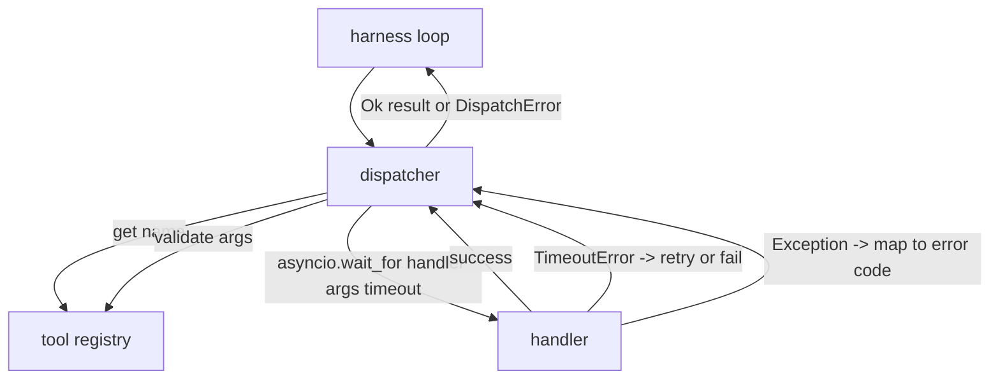
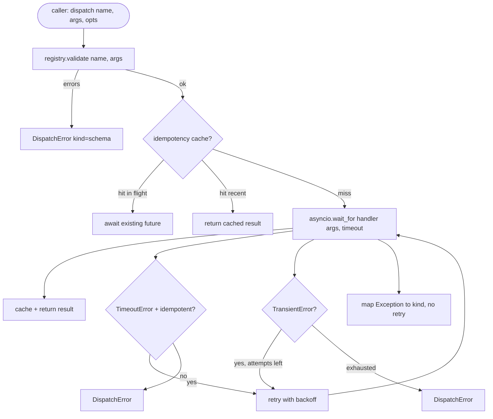

# فرستنده تماس های عملکرد

> در ديسپچر هست که هنيس براي هر وعده اي که طرح انجام داده ميده پرداخت ميکنه زمانبندي، دوباره تلاش، تخريب، نقشه برداری خطا همه چيز در يک خط

**Type:** Build
**Languages:** Python
**Prerequisites:** Phase 13 lessons 01-07, Phase 14 lesson 01
**Time:** ~90 minutes

## اهداف یادگیری
- یک دستیار ابزار را در یک زمان زمان بندی هر تماس که به جای شنیدن حلقه یک خطای تایپ شده را باز می کند، بسته کنید.
- با استفاده از "Jitter" و حداکثر تعداد تلاش ها، یک بار دیگر به صورت تعارفی تکرار کنید.
- تکرار تکرار در کلید idempotency به طوری که یک تکرار که با یک اصل آهسته مسابقه نمی دهد دو بار اجرا شود.
- استثنای های کاربری نقشه و خطاهای حمل و نقل به یک پاکت خطایی که حلقه هرنس قبلاً درک می کند.
- ارسال موازی با یک محدودیت همزمان محدود شده است بنابراین یک فان-آف از چهل تماس ابزار، حلقه رویداد را خسته نمی کند.

```figure
cf-dispatch-retry
```

## جایی که فرستنده میخواد

در میان حلقه استفاده (درسی بیست) و ثبت ابزار (درسی بیست و یک) ، حمل و نقل (درسی بیست و دو) حلقه را تغذیه می کند. حلقه یک تماس ابزار را به فرستنده می دهد. فرستنده به ثبت نام می خواند، دستیار را اجرا می کند و یا نتیجه ای یا یک پاکت خطای شکل JSON-RPC را باز می کند.



دیسپتچر تنها لایه ای است که می داند زمان، بازخورد و بی اختیار بودن. حلقه نمی داند. ثبت نمی کند. کنترل نمی کند. این تعزیر نقطه است.

## زمان بندی

هر ابزار زمانبندی پیش فرض دارد.`timeout_ms`.ديسپتچر از يک تماس که از آن عبور ميکنه`asyncio.wait_for`. در زمان توقف، کار کنترل باز می گردد و فرستنده باز می گردد`DispatchError(kind="timeout")`. .

یک زمان توقف یک خطا قابل بازکرج به طور پیش فرض برای ابزارهای غیر قابل استفاده نیست.`db.write`که زمانش تموم شده و یا نه شده. دوباره امتحان کردن نوشته رو دوبرابر ميکنه.`idempotent`پرچم از سوابق ثبت نام ابزارهای بی اختیار دوباره امتحان کنید ابزارهای غیر بی اختیار باز نمی شود

## بازتجربه با بازتجربه نمایی

قانون بازجوري سه بار حداکثر است و بازپسين با عصب

```text
attempt 1  -> delay 0
attempt 2  -> delay 0.1s * (1 + random[0..0.5])
attempt 3  -> delay 0.4s * (1 + random[0..0.5])
```

فقط`timeout`و`transient`اشتباهات دوباره امتحان کنید.`schema`اشتباه، یک`not_found`، یا یک`internal`اشتباهات طرح تعیین کننده هستند. تکرار تلاش نتیجه را تغییر نمی دهد و بودجه را می سوزاند.

حلقه تکرار با احترام به بودجه از استفاده می کند. اگر بودجه تماس گیرنده صفر تماس ابزار باقی مانده است، فرستنده در اولین تلاش به سرعت شکست می خورد و بازگشت `kind="budget_exceeded"`. .

## کليد افتخاري

یک آزمایش مجدد که در حالی که اصلی هنوز در پرواز است یک خطا تولید واقعی است. اولین تماس در چهار نقطه نه ثانیه (به زودی تحت زمان توقف) می چرخد. دوباره آزمایش در پنج ثانیه می چرخد. اکنون دو درخواست در برابر همان پس زمینه مسابقه می دهند. اگر ابزار است`payments.charge`، دو بار بار پرداخت کردي

فرستنده قبول ميکنه که اختیاري باشه`idempotency_key`اگر همان کلید در پرواز است وقتی تماس می آید، فرستنده منتظر آینده در پرواز است و نتیجه آن را باز می گرداند. حافظه کش کلید ها را برای ۶۰ ثانیه پس از اتمام نگه می دارد تا بازخورد های دیر را جذب کند.

کلید مسئوليت تماس گرفته شده است.`f"{step_id}:{tool_name}:{hash(args)}"`. دیسپتشر کلید را اختراع نمی کند، زیرا اخذ کلید از استدلال ها به تنهایی باعث می شود دو تماس معنوی متفاوت به نظر برسند.

## پاکت خطا

یک ارسال شکست خورده یک شکل را باز می گرداند.

```text
DispatchError
  kind        : "timeout" | "transient" | "schema" | "not_found" | "internal" | "budget_exceeded"
  message     : str
  attempts    : int
  jsonrpc_code: int   (one of -32601, -32602, -32603)
```

نقشه هاي حلقه هاي آداپ`kind`به دولت بعدی`schema`و`not_found`برو`on_error`و دوباره برنامه ریزی رو فعال کنم`timeout`و`transient`برو`on_error`و ممکن است یا ممکن است از نظر تلاش ها دوباره برنامه ریزی شود. `budget_exceeded`محرک ها`on_budget_exceeded`. .

## محدودیت در برابر فان آئوتر

`gather(*calls)`با چهل تماس ابزار، یعنی چهل سوکت باز یا چهل لوله فرعی. اکثر پشتیبانان چهل اتصال موازی از یک مشتری را دوست ندارند.

. دستگاه بازيگر بسته ميکنه`gather`در یک سیمافور. حد متناوب پیش فرض هشت است. هر تماس قبل از ارسال سیمافور را بدست می آورد و در پایان آن را آزاد می کند. تماس گیرنده می بیند `gather`- شکل تولید اما برنامه ریزی واقعی محدود است

## برای یک تماس جریان



## چطور کد رو بخونيم

`code/main.py`تعریف می کند`Dispatcher`،`DispatchError`و`TransientError`. دستگاهي که در ساختمون ثبت ميکنه .`dispatch(name, args, ...)`تنها نقطه ورود است.در هر تلاش، زمان بندی ها در داخل خطی اعمال می شود.`_run_with_retries`استفاده کردن`asyncio.wait_for`.`gather_bounded(calls)`خیلی از ارسال ها با محدودیت هم زمانه رو اجرا میکنه

`code/tests/test_dispatcher.py`شامل وقت توقف، بازخوردن در زمان گذر، بازخوردن در خطای طرح، تخفیف idempotency (دو تماس همزمان با یک کلید یکسان به یک دعوت دستیار) و محدود کردن همزمان (سماور در عمل) می شود.

تست ها استفاده می کنند`asyncio.sleep(0)`و تعیین کننده`Counter`-دستورهای مبتنی بر دستکاری، بنابراین آنها در میلی ثانیه تمام می شوند و به زمان ساعت دیواری وابسته نیستند.

## . به جلوتر می رسیم

دو افزونه تولید فرستنده اضافه می شود. اول، ثبت ساختار در هر انتقال (که جریان رویداد حلقه به شما می دهد، اما فرستنده باید نیز انتشار `dispatch.attempt`و`dispatch.retry`دوم، قطع مدار: پس از شکست N در پنجره، یک ابزار یک دوره خنک کننده را دریافت می کند که در آن ارسال ها بلافاصله با `kind="circuit_open"`هر دو بدون تغییر قرارداد روی این دستگاه قرار میگیرن

درس ۲۴، فرستنده را به یک عامل برنامه ریزی و اجرا می کند تا شما همه چهار قطعه را در حرکت ببینید.
