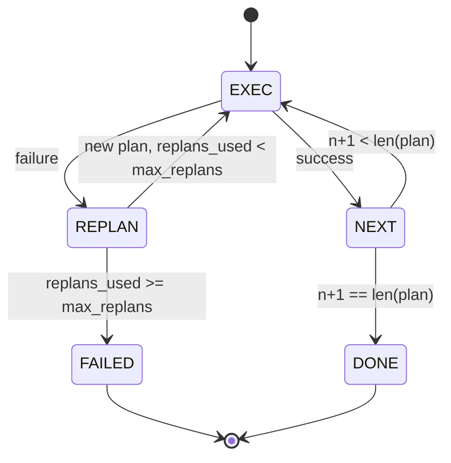

# برنامه ریزی و اجرای جریان کنترل

> يه نقشه که از شکست برنميگرده يه اسکریپت است يه اسکریپت که ميتونه دوباره برنامه ريزي کنه يه مامور است اول برنامه ريزي رو بساز

**Type:** Build
**Languages:** Python
**Prerequisites:** Phase 13 lessons 01-07, Phase 14 lesson 01
**Time:** ~90 minutes

## اهداف یادگیری
- یک طرح را به عنوان یک لیست ترتیب شده از مراحل تایپ شده نشان دهید تا اجرا کننده بتواند در مورد پیشرفت و نتیجه استدلال کند.
- مراحل را به ترتیب اجرا کنید با یک شکست کنترل شده به برنامه نویس بازگردانید.
- از کرسر فعلی با خطای قبلی در زمینه را دوباره برنامه ریزی کنید تا برنامه بعدی مطلع شود.
- در هر ترمیم یک برنامه متفاوت را منتشر کنید تا یک ردیاب یا UI پایین تر بتواند نشان دهد که چرا برنامه تغییر کرده است.
- دو بودجه را اجرا کنید: یک سقف قدم سخت و یک سقف دوباره سخت.

```figure
cg-plan-replan
```

## برنامه ریزی و اجرا، نه زنجیره فکر

یک عامل زنجیره فکر توکن ها را صادر می کند و اجازه می دهد تا حلقه حدس بزند که تماس ابزار کجا پایان می یابد. یک عامل برنامه و اجرای ابتدا یک برنامه ساختاری را صادر می کند، سپس هر مرحله را به صورت تعیین کننده اجرا می کند. برنامه داده هایی است که هرنس می تواند درون بینی کند. اجرای هرنس انجام داده های آن را از طریق یک فرستنده انجام می دهد.

دو قطعه. یک برنامه نویس که یک طرح تولید می کند. یک اجرای کننده که برنامه را اجرا می کند. کار جالب این است که وقتی اجرای کننده شکست می خورد چه اتفاقی می افتد. سه گزینه:

```text
1. Abort         (return failed, surface the error)
2. Skip          (mark step failed, continue with the rest)
3. Replan        (hand the error to the planner, get a new plan from the cursor)
```

رپلين همونيه که يه اسکریپت رو به يه مامور مي کنه

## شکل قدم

```text
Step
  id              : int           (monotonic within a plan revision)
  tool_name       : str
  args            : dict
  expected_outcome: str           (planner's stated success condition)
  result          : Any | None
  error           : str | None
```

`expected_outcome`یک جمله کوتاه است که برنامه نویس در کنار مرحله ارسال می کند. این جمله توسط اجرا کننده اجرا نمی شود. این برای دو چیز است: برنامه نویس آن را هنگام تجدید نظر در برنامه می خواند؛ جریان رویداد آن را منتشر می کند تا یک ردیاب بتواند نشان دهد "این مرحله باید X انجام دهد".

## شکل برنامه ريزي

```python
def planner(goal: str, history: list[Step], last_error: str | None) -> list[Step]:
    ...
```

يه تابع خالص`goal`هدف کاربر است.`history`مراحل انجام شده است (با نتایج و خطا های پر شده).`last_error`هیچ یک از پیام های شکست در اولین تماس و آخرین پیام های شکست در هر تماس بعدی نیست. برنامه نویس نقشه بعدی را از کرسر باز می کند.

برنامه ريزيگر از اجراگر خبر نداره، از بازتجربه ها خبر نداره، از زمانبندي ها خبر نداره، نقشه اي مياره، همين.

## اعدام کننده

اجراگر یک ماشین کوچک است. هر مرحله از طریق دستگاه فرستنده انجام می شود. نتیجه یکی از سه چیز است: موفقیت، شکست قابل برنامه ریزی مجدد، شکست قابل فتنان. شکست های قابل برگشت به برنامه نویس باز می گردد. شکست های فتنانی (برابر بودجه، سقف برنامه ریزی مجدد) بازگشت یک`FAILED`نتیجه جلسه



## برنامه در مورد تجدید نظر متفاوت است

وقتی برنامه نویس بعد از شکست یک برنامه جدید را باز می گرداند، اجرا کننده یک `plan.diff`رویداد با سه میدان

```text
removed: list of step ids that were in the old plan and are not in the new
added  : list of step ids in the new plan that were not in the old
revised: list of step ids whose tool_name or args changed
```

یک ردیابی یا UI می تواند این را به عنوان یک ضربه در مراحل حذف شده و برجسته در اضافه شده ارائه دهد. نکته این نیست که فرمت متفاوت است. نکته این است که ترمیم یک رویداد قابل مشاهده است، نه یک بازنویسی خاموش.

## دو بودجه، هر دو سخت

`max_steps`برنامه خطی پنج مرحله ای که دو بار برنامه ریزی مجدد می کند و هر بار سه مرحله اضافه می کند و هر بار ۱۶ اجرای را به دست می آورد و بودجه را فراتر می برد. اجرای کننده برنامه ریزی مجدد را رد می کند و بازگشت شکست خورده است.

`max_replans`برنامه ریزی کننده که پنج بار در یک ردیف همان طرح شکسته را باز می گرداند، تا زمانی که بودجه مرحله ای آن را بگیرد، لوله می شود. برنامه ریزی مجدد برنامه ریزی کردن باعث می شود که شکست سریع تر و دلیل واضح تر باشد.

## برنامه ريزي دترمينست در اين درس

ما در این درس یک مدل را نمی خوانیم. درسی یک برنامه نویس تعیین کننده را می فرستد که بر اساس یک طرح را انتخاب می کند.`last_error`. .

```text
last_error is None    -> emit a four-step plan
last_error matches X  -> emit a three-step plan that routes around X
last_error matches Y  -> emit a two-step plan that gives up gracefully
otherwise             -> return [] (signals nothing to replan)
```

این برای آزمایش رفتار اجرا کننده در هر مسیر انتقال کافی است: موفقیت، یک بار دوباره، دو بار دوباره، تخفیف مجدد و تخفیف بودجه.

## شکل نتیجه

```text
SessionResult
  status      : "completed" | "failed"
  reason      : str     ("goal_met" | "step_budget" | "replan_budget" | "no_plan")
  history     : list[Step]
  revisions   : list[PlanDiff]
  events      : list[Event]
```

حلقه هرنس از درس بیست می تواند این را مستقیماً بخواند. فرستنده از درس بیست و سه آنچه هر مرحله را اجرا می کند. ثبت از درس بیست و یک ارگ هر مرحله را تأیید می کند. حمل از درس بیست و دو این کل جریان را از طریق JSON-RPC به یک مشتری مدل می دهد.

## چطور کد رو بخونيم

`code/main.py`تعریف می کند`PlanExecuteAgent`،`Step`،`PlanDiff`،`SessionResult`و برنامه ريزي دترمينست. اجراگر يک نفر است.`run(goal)`روش که یک `SessionResult`. تفاوت نقشه با مقایسه ی ID های مرحله ای و `(tool_name, args)`دوتا

`code/tests/test_agent.py`یک موفقیت خطی را پوشش می دهد، یک شکست وسط برنامه ای که یک بار برنامه ریزی مجدد می کند، یک برنامه ریزی مجدد که به عقب می آید `failed:replan_budget`، از دست دادن بودجه به مرحله ای و فرمت برنامه های مختلف

## . به جلوتر می رسیم

دو تمدید زمانی که شما این را به یک مدل واقعی متصل کنید خواهید داشت. اول، پیشخوانی برنامه جزایی: هنگامی که یک برنامه برای سه مرحله اول از شش مرحله موفق می شود و سپس شکست می خورد، شما نمی خواهید سه مرحله اول را دوباره اجرا کنید. اجراگر قبلاً تاریخ را حفظ می کند؛ برنامه نویس فقط باید آن را بخواند. دوم، شاخه های موازی: اجراگر فعلی به طور دقیق دنباله دار است. برنامه نویس که شاخه مستقل را منتشر می کند (`gather_step`به جای`next_step`) می تواند دو تماس ابزار را همزمان از طریق فرستنده اجرا کند.

هر دو پیچیدگی واقعی را اضافه می کنند. هر دو زمانی که اجرای خطی را ثابت کنید، اضافه کردن آسان تر است. این چیزی است که این درس انجام می دهد.
