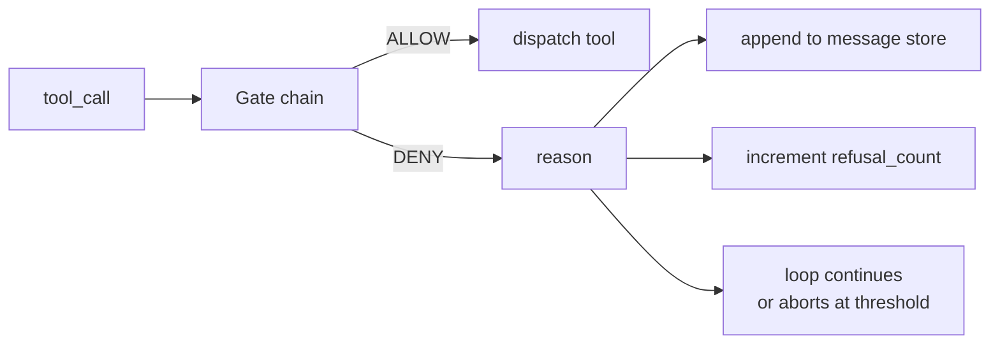
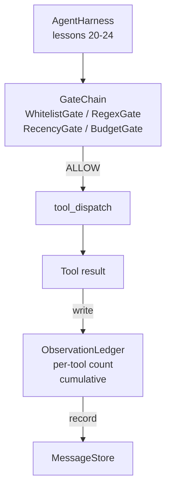

# درس ۲۵: دروازه های تایید و بودجه مشاهده

> یک آرمینای مامور بدون لایه تاییدیه یک آرزوی در یک ژله خندق است. این درس زنجیره دروازه تعیین کننده ای را ایجاد می کند که تصمیم می گیرد آیا یک تماس ابزار مجاز به آتش زدن است، چه مقدار از خروجی که عامل مجاز به دیدن آن است و زمانی که حلقه باید متوقف شود زیرا عامل بیش از حد خوانده است. زنجیره یک تابع از درهای کوچک و نامگذاری شده به علاوه یک دفترچه مشاهده است که هر نشانه ای را که مدل نشان داده شده است ردیابی می کند.

**Type:** Build
**Languages:** Python (stdlib)
**Prerequisites:** Phase 19 · 20-24 (Track A1: agent loop, tool registry, message store, prompt builder, model router), Phase 14 · 33 (instructions as constraints), Phase 14 · 36 (scope contracts), Phase 14 · 38 (verification gates)
**Time:** ~90 minutes

## اهداف یادگیری

- ساخت یک`VerificationGate`پروتکل با یک تعیین کننده`evaluate(call)`روش
- بودجه، تازه، لیست سفید و دروازه های ریگکس را به یک زنجیره با سیمانیک کوتاه مدت ترکیب کنید.
- هر مشاهدي رو از طریق یک`ObservationLedger`با ابزار و چرخ
- در صورت تجاوز بودجه تجمعی مشاهده، درخواست درخواست ابزار را رد کنید.
- سطح یک ساختار`GateDecision`ثبت اینکه قابل مشاهده بودن در جریان پایین می تواند جذب کند.

## مشکل

وقتی یک آرم عامل اجازه می دهد مدل به طور آزاد ابزار را صدا کند، سه کلاس خطا در اولین ساعت استفاده واقعی ظاهر می شود.

اولین مشاهده بیحد است. یک گیرنده در یک ریپو 200K خط تخلیه نیم میلیون توکن تولید به نوبت بعدی. مدل یک مسابقه در هر کیلوبایت را می بیند و بقیه زمینه هدر می رود. لایحه توکن بزرگ است و عامل در حال حاضر بدتر، نه بهتر، در کار است.

دومین کار جدید است. یک کار طولانی مدت پنجاه تماس ابزار را جمع می کند. مدل اولین read_file را از نوبت سه دوباره می خواند. ویرایش های انجام شده در نوبت چهل و هفت هرگز ظاهر نمی شوند زیرا prompt builder اولین مشاهدات را به ترتیب ترتیب می کند.

سومين، "مهميت هاي خارق العاده" است.`web_search`، بعدش به نحوي آخرش فرار ميکنه`shell`چون مدل یک نام ابزار اختراع کرده و هرنس به طور پیش فرض به اجازه داده شده است. تا زمانی که کسی ردیابی را می خواند، یک فایل زباله در /tmp قرار دارد و یک curl در برابر یک API خصوصی اجرا می شود.

دروازه تایید، یک بخش آرک است که می گوید نه. این یک مدل نیست. این یک قاضی نیست. این یک تابع تعیین کننده از `(call, history, ledger)`که اجازه می دهد یا انکار می کند با یک دلیل. دلیل ثبت شده است. مدل گفته می شود. حلقه ادامه می یابد یا سقط می کند.

## مفهوم



دروازه هر چیزیه که با یک`evaluate(call, ctx) -> GateDecision`روش. زنجیره یک لیست ترتیب شده است. ارزیابی کوتاه در اولین انکار. امر مهم: دروازه های ساختاری ارزان قبل از دروازه های حساب ارزشی می شوند.

این درس چهار دروازه را در اختیار دارد:

- `WhitelistGate`اسم ابزار مجازي يه مجموعه صريحه هر چيزي که خارج باشه رد ميشه اين ارزانترين دروازه و اول اجرا ميشه
- `RegexGate`. استدلال ابزار با regex مطابقت دارد . برای رد تماس های shell با`rm -rf`در آنها، یا تماس های HTTP به IP های داخلی. خالص در بار مفید تماس.
- `RecencyGate`. مدل فقط مشاهدات را از آخرین پیچ های N می بیند. مشاهدات قدیمی تر پنهان شده است. دروازه از یک تماس ابزار که نتیجه آن می تواند یک پنجره مشاهده که قبلاً قدیمی شده است را گسترش دهد، رد می کند.
- `BudgetGate`. توکن های تجمعی که مدل در طول جلسه خوانده است دارای سقف هستند. وقتی در دفترچه نوشته شده است که سقف به دست آمده است، هر تماس ابزار بعدی رد می شود.

دفترچه مشاهده حسابداری است. هر تماس موفق ابزار یک ردیف می نویسد: نام ابزار، نوبت، توکن های صادر شده، تجمعی. دفترچه پاسخ دو سوال: چه مقدار مدل کل دیده است، و چه مقدار از ابزار X دیده است. دروازه بودجه اولین را می خواند. دروازه بودجه برای هر ابزار، که شما به عنوان یک تمرین می نویسید، دوم را می خواند.

```figure
cg-gate-chain
```

## معماری



این خط از زنجیره می پرسد. زنجیره یا سر به سر می زند یا انکار می کند. اگر سر به سر می زند، ابزار اجرا می شود، دفترچه کار می کند و نتیجه به ذخیره پیام متصل می شود. اگر انکار کند، مدل به عنوان یک پیام سیستم به دست می آید و حلقه تصمیم می گیرد که آیا دوباره تلاش کند یا قطع کند.

## چه چیزی می سازید

اجرای این برنامه یکپارچه است`main.py`و تست ها

1. `Observation`و`ToolCall`کلاس های داده شکل های سیم را تعریف می کنند.
2. `ObservationLedger`سوابق`(turn, tool, tokens)`خط ها و پاسخ ها`cumulative()`و`per_tool(name)`. .
3. `GateDecision`حمل کننده`(allow, reason, gate_name)`. .
4. `VerificationGate`هر دروازه اي اجرا ميکنه`evaluate(call, ctx)`. .
5. `GateChain`هر دروازه ای را صدا می کند، اولین انکار را باز می گرداند، یا اجازه می دهد که هر دروازه عبور کند.
6. در حال حاضر، این نمایش یک حلقه کوچک از عوامل مصنوعی را اجرا می کند. سه نوبت. در نوبت سوم دروازه بودجه را اجرا می کند و حلقه یک رد پاک با تعداد عدم صفر رد را گزارش می دهد.

اون شماره رمز عمداً احمقيه`len(text) // 4`هدف این درس، لوله کشی دروازه است نه توکنایزر. توکنایزر واقعی را در تولید قرار دهید.

## چرا نظم زنجیره ای مهم است

انکار ارزان تر از اجازه دادن است`WhitelistGate`در O(1) جستجو هاشي اجرا مي شود. `RegexGate`در O(نمونه * argv اجرا می شود. `RecencyGate`يه قطعه کوچولو از فروشگاه پيام ميخواد`BudgetGate`شما با افزایش هزینه سفارش می دهید تا یک تماس رد شده قبل از انجام کار گران قیمت کوتاه شود.

شما همچنین آنها را به شعاع انفجار سفارش می دهید. سفید لیست قوی ترین ادعای این است: این ابزار در قرارداد نیست. دروازه regex بعدی است: این استدلال در قرارداد نیست. پس از آن می آید: آرکین هنوز هم اهمیت می دهد اما تماس ساختار قانونی است. بودجه آخرین است زیرا به طور تعریف، آن را فقط در هنگام گذراندن همه چیز دیگر.

## چطور اين با بقيه راه A همگامي ميکنه

در درس های قبلی، شما به حلقه، فهرست ابزار، ذخیره پیام، سازنده پیام و روتر مدل دسترسی داشتید. این درس لایه بین مدل و ابزارها را اضافه می کند. درس 26 جعبه شن را که فرستنده به آن صدا می دهد وقتی زنجیره دروازه اجازه می دهد. درس 27، استفاده از ابزار ارزیابی که رد را ثبت می کند به عنوان سیگنال کیفیت حساب می شود. درس 28 تصمیمات دروازه را به دامنه های OpenTelemetry متصل می کند. درس 29 همه چيز رو به يه عامل کدگذاری فعال ميده

## دارم کار ميکنم

```bash
cd phases/19-capstone-projects/25-verification-gates-observation-budget
python3 code/main.py
python3 -m pytest code/tests/ -v
```

در این نمایش، یک ردیابی نوبت به نوبت شامل هر تصمیم دروازه چاپ می شود و صفر را ترک می کند. آزمایش ها شامل دفترچه، هر دروازه در آیسولیشن، زنجیره کوتاه و حلقه مصنوعی از انتهای تا انتهای می شود.
