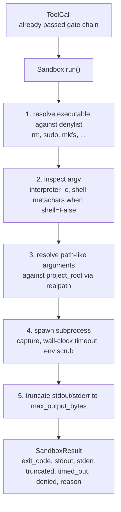
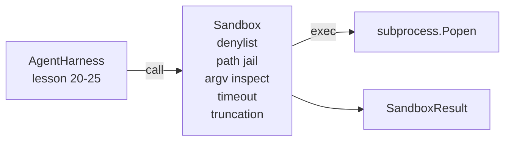

# درس 26 Capstone: دوچرخه با "دنلست" و "پات زندان"

> دروازه تایید تصمیم می گیرد که آیا یک تماس ابزار باید اجرا شود. جعبه شنو تصمیم می گیرد که وقتی اتفاق می افتد چه اتفاقی می افتد. این درس یک فراینده فرعی را ارسال می کند که اجراگر های خطرناک را رد می کند، اشکال خطرناک آر جی وی را رد می کند، هر مسیر فایل را به ریشه پروژه زندانی می کند، تولیدات بزرگ را کوتاه می کند و فرآیندهای فرار را در یک زمان بندی دیوار می کشد. این دو لایه دوم است که بین مدل و سیستم عامل قرار دارند.

**Type:** Build
**Languages:** Python (stdlib)
**Prerequisites:** Phase 19 · 25 (verification gates and observation budget), Phase 14 · 33 (instructions as constraints), Phase 14 · 38 (verification gates)
**Time:** ~90 minutes

## اهداف یادگیری

- ساخت یک`Sandbox`بسته بندی کلاس`subprocess.run`با زمان بندی، گرفتن و کوتاه کردن
- از دستورات با اسم علیه یک دانلست و با ساختار علیه یک بازرس آر جی وی رد کنید.
- هر استدلال مسیر را که خارج از ریشه پروژه اعلام شده حل شود رد کنید.
- وقتي حالت "شال" خاموش شده ميتا كاراكتر هاي "شال" رو رد كنيد
- برگردونيد يه ساختار`SandboxResult`که قابل مشاهده و استفاده از هارد eval می تواند مصرف کند.

## مشکل

یک عامل کد نویسی که می تواند پوسته را از بین ببرد، می تواند درب های پشت را نصب کند، کلید را خارج کند، یک لپ تاپ توسعه دهنده را بنا کند و یک لایحه ابر را در یک نوبت جمع کند. کمترین دفاعی برای عدم دادن پوسته است. دومین کمترین هزینه یک جعبه شن است که به یک لیست دقیق الگوها می گوید نه.

سه نوع شکست در اثر عوامل تکرار می شود.

اولين مورد خطرناکه است. مدل تحت فشار برای حل مسئله راه تلاش خواهد کرد`sudo`،`chmod -R 777`،`rm -rf`،`mkfs`،`dd`هيچکدوم از اينها به يه اداره مامور تعلق ندارن.

دومين ترفند هاي آرگوي است. مدلي که بهشون گفته شده که هيچ قنچه اي وجود نداره، حمله رو از طريق يه مترجم انجام ميده:`python3 -c "import os; os.system('rm -rf /')"`،`bash -c '...'`،`node -e '...'`،`perl -e '...'`. جعبه شنومده بايد بدوند که هر مترجم با يه`-c`مثل پرچم فقط يه تماس با قدم هاي زيادي

سومين راه فرار است. مدل به خواندن گفته می شود.`./src/main.py`و در عوض میخواد`../../etc/passwd`. جعبه شن رو با حلش تمام بحث ها رو باز مي کنه`os.path.realpath`و با تأکيد از پيشگويي

جعبه شن یک مرز امنیتی در مفهوم سیستم عامل نیست. یک مهاجم مشخص با اجرای کد هنوز هم می تواند فرار کند. جعبه شن یک رایل محافظ در زمان توسعه است: آن را می کند که حالت های شکست رایج بلند و مانع از عامل از انجام آسیب به دلیل ناتوانی خالص است.

## مفهوم



جعبه شن چهار محور رد دارد: نام، argv، مسیر، ساختار. هر محور یک تابع خالص از تماس است، هنوز فرعی عمل وجود ندارد. فرعی عمل تنها پس از گذر هر محور تولید می شود.

.`SandboxResult`کد خروج، کد های معمولی هستند: 0 موفقیت، شکست غیر صفر، به علاوه سه کد سنتینل برای انکار (-100) ، زمان بندی (-101) و کوتاه (کد خروج واقعی است، با یک مجموعه پرچم). دروس زیر به جای تجزیه و تحلیل stderr، این نتیجه ساختاری را می خوانند.

```figure
cg-path-jail
```

## معماری



نام های بنالیست یک مجموعه از نام های زیر است.`/bin/rm`،`/usr/bin/rm`) همه به همان نام پایه حل می شوند. بازرس argv شکل مترجم را می داند: هر argv که argv[0] مترجم است و هر arg بعدی با شروع می شود `-c`یا`-e`متاکراکترهای شل (`;`،`|`،`&`،`>`،`<`، پشتک ها ،`$()`) سبب رد شدن زمانی می شود که تماس به طور صریح درخواست پوسته ای نداشته باشد.

زندان راه نازک ترين قطعه است.`project_root`هر بحثی که به نظر می رسد راه (مشتمل است)`/`یا با یک فایل موجود مطابقت دارد) از طریق `os.path.realpath`، سپس با مسیر واقعی ریشه پروژه بررسی می شود. اگر هدف حل شده در زیر ریشه نیست، رد می شود. تلاش های فرار Symlink (یک لینک در ریشه پروژه که به بیرون اشاره دارد) با بررسی مسیر واقعی، نه مسیر واقعی مسدود می شود.

## چه چیزی می سازید

اجرای آن`main.py`و يک تست کثيف

1. `SandboxResult`کلاس داده: exit_code, stdout, stderr, truncated, timed_out, denied, reason, duration_ms.
2. `SandboxConfig`کلاس داده: project_root، max_output_bytes، timeout_seconds، denylist، interpreter_block.
3. `Sandbox`کلاس: `run(argv, *, shell=False, cwd=None)`یک `SandboxResult`. .
4. کمک کننده های داخلی از انکار: `_check_executable_denylist`،`_check_argv_interpreter`،`_check_shell_metachars`،`_check_path_jail`. .
5. تخفیف خروجی با یک صاف`truncated`پرچم و خط مشخصی در جریان گرفته شده.
6. در پایین نمایش: یک سری از تماس های مشروع و مخالف. هر کدام با نتیجه خود نشان داده می شود.

جعبه شن استفاده ميکنه`subprocess.run`با`shell=False`به طور پیش فرض و`capture_output=True`. زمان زماني ساعت ديواري از زماني که ساعت ديواري`timeout`بحث در مورد`TimeoutExpired`، جعبه شن قتله گروه فرآیند و سنتز یک SandboxResult.

## چرا اين يه جعبه قشنگ واقعي نيست

جعبه شن و ماسه درس از فضای نام، گروه های cgroup، seccomp، gVisor، Firecracker یا هر گونه تعزیر در سطح هسته استفاده نمی کند. هر کاری که فرعی فرآیند می تواند انجام دهد، جعبه شن و ماسه می تواند انجام دهد. حفاظت ساختار است: عامل از رایج ترین دعوت های خطرناک انکار می شود و رد بلند به جای خاموش اجرا به مشاهده می شود.

برای عوامل تولید شما لایه بالا: در داخل یک ظرف Docker غیرمنفصل اجرا کنید، در داخل یک microVM اجرا کنید، قابلیت های حذف، نصب پروژه ریشه فقط خواندن و یک سکرتش در خواندن و نوشتن، تنظیم محدودیت در حافظه و CPU، اسکراب محیط به یک لیست سفید امن شناخته شده. درس 29 برخی از این کار را انجام می دهد.

## دارم کار ميکنم

```bash
cd phases/19-capstone-projects/26-sandbox-runner-denylist
python3 code/main.py
python3 -m pytest code/tests/ -v
```

نمایش یک دایرکتوری موقت ایجاد می کند، یک فایل تمیز را در آن می گذارد، سپس یک باتری از تماس ها را اجرا می کند. تماس های قانونی موفق می شوند. تماس های رد شده با SandboxResult به شما باز می گردند.`denied=True`و يه دليل هم هست.`timed_out=True`. مجموعه های قطع`truncated=True`. دمو جدول JSON از نتایج را چاپ می کند و صفر را ترک می کند.

## چطور اين با بقيه راه A همگامي ميکنه

درسی 25 زنجیره دروازه را تولید کرد. درسی 26 اجرای کننده ای است که پس از یک دروازه اجازه می دهد. استفاده از ارزیابی درسی 27 نتایج جعبه شن را با کد خروج انتظار می رود در هر کار مقایسه می کند. درسی 28 یک `gen_ai.tool.execution`هر دو اطرافشون فاصله داره`Sandbox.run`دروس 29 از آخر به آخر یک عامل کدگذاری واقعی را از طریق هر دو لایه به هم متصل می کند.
