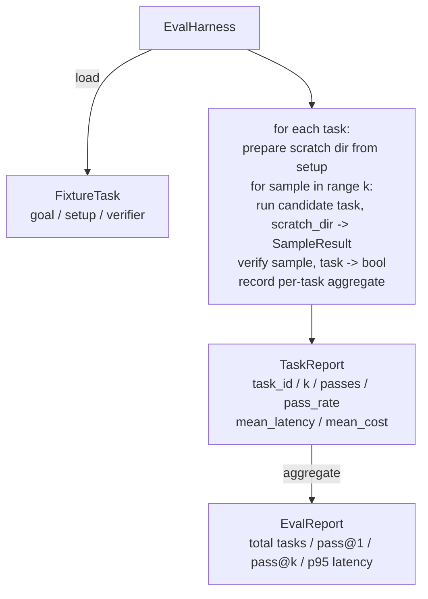

# درس 27 - سنگ سنگ: استفاده از یک اندازه با وظایف ثابت

> یک عامل کدگذاری فقط به اندازه مجموعه ای از وظایف که با آن اندازه گیری می کنید خوب است. این درس یک هارد ارزیابی را ایجاد می کند که یک پوشه از وظایف ثابت را می گیرد، هر یک را از طریق یک نماینده کاندید انجام می دهد، نمرات از طریق یک تأیید کننده تعیین کننده عبور می کنند یا شکست می خورند و نتایج را به pass@1, pass@k، متوسط تاخیر و متوسط هزینه جمع می کند. این آستین منبع حقیقت است که به شما اجازه می دهد یک بازپسین را از یک عامل تشخیص دهید.

**Type:** Build
**Languages:** Python (stdlib)
**Prerequisites:** Phase 19 · 25 (verification gates), Phase 19 · 26 (sandbox runner), Phase 14 · 30 (eval-driven agent development), Phase 14 · 19 (SWE-bench and GAIA benchmarks)
**Time:** ~90 minutes

## اهداف یادگیری

- یک کار ثابت را به عنوان سه برابر هدف، تنظیم و تأیید کننده تعریف کنید.
- امتیاز چندین نمونه در هر کار و محاسبه pass@1 و pass@k.
- تاخیر و هزینه را به میانگین و 95 درصد متریک جمع آوری کنید.
- برقراری اعتبارات تعیین کننده (فایل تفاوت، کد خروج، regex match) به تابع های قابل استفاده مجدد.
- یک گزارش JSON ساختاری را که یک اسکریپت ردیابی رجسیون می تواند مصرف کند، ارسال کنید.

## مشکل

سه حالت شکست دهنده، معیار عامل تباهي بدون استفاده از یک هارنز ارزیابی شده

اول این است که تایید نشده است. مامور می گوید که خطا را اصلاح کرده است، نگاه انسان به تفاوت، سوئیت رنگ سبز نشان داده شده است، و سه هفته بعد آزمایش بازگشت همان خطا را ظاهر می کند. مامور استدلال قابل قبول بدون اینکه واقعا چیزی را اصلاح کند.

دومین بازپسین غیر قابل تشخیص است. تغییر در قالب فوری باعث می شود که عامل 4٪ در کار بلند و 14٪ بدتر در کار آرام باشد. بدون یک مجموعه طلا و نمره هر کار، بازپسین به سمت اصلی حرکت می کند و تنها زمانی ظاهر می شود که مشتری شکایت کند.

سومین، حرکت هر وظیفه است. ارزیابی روز دوشنبه با 100 وظیفه و روز جمعه با 95 وظیفه انجام شد، چون کسی پنج برنامه را تغییر نام داد. نرخ عبور به نظر می رسد 5 درصد بهبود داشته باشد. این نیست.

هرنس برنامه ای است که این شکست ها را به واقعیت تبدیل می کند. هر بار، هر زمان، در یک ترتیب قابل تکرار، در برابر یک تایید کننده که در یک چک تعیین کننده درست یا غلط می شود، اجرا می شود.

## مفهوم

```mermaid
flowchart LR
  F1[fixtures/task_001/<br/>task.json + expected/] --> Harness
  F2[fixtures/task_002/<br/>...] --> Harness
  Harness[Harness<br/>for each task:<br/>setup / run agent k samples /<br/>verify each sample /<br/>record latency, cost]
  Harness --> Report[EvalReport<br/>pass@1 / pass@k<br/>mean ms / p95 ms<br/>mean cost]
```

A`FixtureTask`یک فایل JSON کوچک و یک فایل اختیاری است`expected/`فهرست JSON اعلام می کند`id`، یک`goal`(تغییر به مامور داده شده)`setup`بلاک (فايل ها را به خاکستر انداختن) و یک`verifier`بلاک. بلاک تایید کننده یک تابع را در ثبت تایید کننده هنیس نام می دهد و استدلال های خود را ارائه می دهد.

سه شکل تأیید کننده بیشتر وظایف مفید را پوشش می دهد.

اولين اينه`file_equals`بعد از اینکه عامل اجرا شود، یک فایل با نام با محتوای انتظار می رود مقایسه کنید. این کار "این خطای را به این روش درست کنید" را می گیرد.

دومين اينه`regex_match`. محتوای فایل نامگذاری شده با یک regex مطابقت دارد. این گرفتاری "عمل باید وجود داشته باشد و X" را در حالی که راه حل های قابل قبول زیادی وجود دارد.

سومين اينه`shell_exit_zero`. هنیز یک فرمان پوسته (از مربع شن از درس 26) را اجرا می کند و فقط در صورتی که دستور صفر را ترک کند، وظیفه را عبور می کند. این کار وظایف "تست ها باید عبور کنند" را ضبط می کند.

هر کاري که ميخواي انجام بده`k`زمان ها. پاس@ک`1 - (1 - p)^k`در اینجا p نرخ عبور تجربی است؛ هرنس همچنین شمارش خام را گزارش می کند تا شما بتوانیم تفاوت را تشخیص دهید. لیتینسی ساعت دیواری در هر نمونه است. هزینه هر آنچه که عامل خود را گزارش می دهد (توکین شمارش، دلار یا هر دو) است؛ هرنس آن را در سراسر نمونه ها جمع می کند و اعداد هر کار و مجموع را ارائه می دهد.

```figure
pass-at-k
```

## معماری



نامزد به اسم:`Callable[[FixtureTask, str], SampleResult]`. حاشيه از طریق `tempfile.mkdtemp()`این رشته مهم نیست که کاندید چگونه کار می کند. کاندید می تواند یک متقاضی پخت تعیین کننده (فاید برای خود آزمایش های استفاده از پخت) ، یک عامل LLM واقعی، یک فوزر باشد. قرارداد SampleResult است.

## چه چیزی می سازید

`main.py`کشتی ها:

1. `FixtureTask`کلاس داده ها
2. `SampleResult`کلاس داده: success_self_reported, latency_ms, cost_units, ترمیم
3. `TaskReport`،`EvalReport`کلاس های داده با `to_dict()`. .
4. `VerifierRegistry`نام تایید کننده برای عملکرد. تایید کننده های داخلی: file_equals, regex_match, shell_exit_zero.
5. `EvalHarness`کلاس. يه فهرست از وظایف رو در مقابل يه نامزد اجرا ميکنه.
6. پنج وظیفه ی ثابت در گروه بندی شده است`tasks/`:
   - از هم جدا`fizzbuzz`
   - بازده گمشده`factorial`
   - خطای تایپ در پیام خطا
   - جسم تابع خالی
   - یک به یک در عبور لیست مرتبط
7. یک کاندیدای مرجع تعیین کننده (`apply_known_fixes`) استفاده از هرنس برای نشان دادن یک گذرگاه پاک@1 از 1.0.
8. Demo JSON EvalReport را چاپ می کند و صفر را ترک می کند.

وظایف فکسچر به عنوان فایل JSON در `tasks/`+ فایل های منبع جفت شده در `tasks/<id>/buggy/`و`tasks/<id>/expected/`. هنيس بگي رو به يه گندگي نقلي ميکنه و به نامزد ميده و با انتظارش مياد

## چرا پاس@ک و نه فقط پاس@۱

در واقع، عوامل LLM واقعی استوکاستیک هستند. یک پاس@1 از 0.6 به نظر می رسد شکست خورده است. یک پاس@5 از 0.95 می گوید که عامل اغلب پاسخ درست را دریافت می کند اما در نمونه های اولیه اشتباه انتخاب می کند. راه حل نمونه گیری و رتبه بندی است، نه همیشه آموزش بیشتر. Pass@k این را قابل مشاهده می کند.

Pass@k در کنار pass@1 گزارش می شود زیرا pass@k در مورد یک شکست واقعی گزارش می کند: اگر مدل یک بار در هر بیست تلاش پاسخ درست را دریافت کند، یک عامل مفید ندارید.

## چطور اين با بقيه راه A همگامي ميکنه

درس 25 زنجیره دروازه را تولید کرد درس 26 جعبه شن را تولید کرد.`shell_exit_zero`درسی 28 هر کارتن را در یک ردیابی OTel بسته می کند. درسی 29 در یکی از وسایل بسته شده نمایش پایان به پایان را اجرا می کند و نشان می دهد pass@1 = 1.0 برای کاندیدای مرجع.

## دارم کار ميکنم

```bash
cd phases/19-capstone-projects/27-eval-harness-fixture-tasks
python3 code/main.py
python3 -m pytest code/tests/ -v
```

در این نسخه، EvalReport به JSON چاپ می شود، از جمله pass@1, pass@5, متوسط تاخیر و تجزیه هر کار. کد خروج صفر است. تست ها شامل عملکردهای تأیید کننده، ریاضیات pass@k، بارگذاری ابزارها و استفاده از انتهای به انتهای در برابر کاندیدای مرجع بسته شده است.
