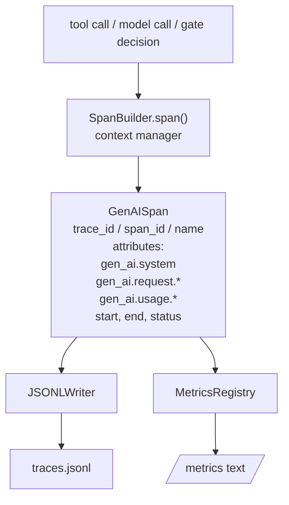
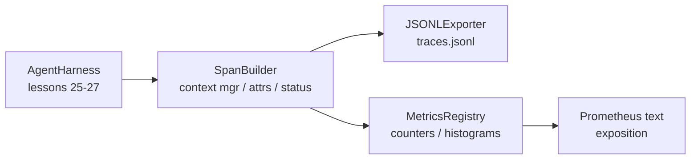

# درس 28 Capstone: مشاهده با OTel GenAI Spans و Prometheus Metrics

> یک آژان بدون قابل مشاهده یک جعبه سیاه است که هزینه دارد. این درس یک سازنده اسپان را دست به دست می کند که به توافق با کنوانسیون های معنایی OpenTelemetry GenAI، پرونده های JSON-Lines را یک اسپان در هر خط می نویسد و شمارشگرها و هیستوگرام ها را در قالب متن Prometeus نشان می دهد. کل چیز stdlib Python است و از اینترنت خارج می شود.

**Type:** Build
**Languages:** Python (stdlib)
**Prerequisites:** Phase 19 · 25 (verification gates), Phase 19 · 26 (sandbox), Phase 19 · 27 (eval harness), Phase 13 · 20 (OpenTelemetry GenAI), Phase 14 · 23 (OTel GenAI conventions)
**Time:** ~90 minutes

## اهداف یادگیری

- یک کلاس داده های اسپان را بسازید که مطابق با کنوانسیون های معنوی OpenTelemetry GenAI شکل گرفته باشد.
- یک صادر کننده JSONL را پیاده سازی کنید که یک دوره مستقل در هر خط را بنویسد.
- شمارشگاه ها و هیستوگراف ها را با برچسب ها و نمایش در قالب متن Prometeus بسازید.
- هر کال ای را در یک مدیر زمینه مدت که مدت زمان، وضعیت و استثناء را ثبت می کند، بسته بندی کنید.
- مطمئن شو که اسپان های منتشر شده از طریق آن عبور می کنند`json.loads`و با شکل مشخصات مطابقت داشته باشد.

## مشکل

یک عامل کدگذاری در تولید هر نوبت سه کلاس آرتیفاکت را تولید می کند: یک تماس مدل، اجرای ابزار و یک تصمیم دروازه تأیید. هیچ یک از این موارد بدون تله متری ساختاری مفید نیستند.

اولین حالت شکست، ردیابی گم شده است. چیزی در روز سه شنبه اشتباه شد اما تنها رکورد یک ژورنال چت 500 خط است. هیچ رکوردی وجود ندارد که ابزار چه مدت اجرا شده است، چقدر طول کشید، چند توکن وارد پرامپتر شده است، یا اینکه دروازه چیزی را رد کرده است. نویسنده عامل باید حدس بزند.

حالت شکست دوم ردیابی قابل تشخیص است. هرنس اسپان را نوشت اما از نام های میدان خاص خود استفاده کرد. هیچ چیز در Grafana، Honeycomb، Jaeger یا CLI محلی نمی تواند آنها را بخواند. هر ابزار موجود در استیک تیم از بین می رود زیرا اسپانها غیر استاندارد هستند.

حالت سوم شکست متریک غیرجمع شده است. شما می توانید یک تماس ابزار آهسته را در ردیابی ببینید، اما نمی توانید به "تخملی p95 تماس های read_file در ساعت گذشته چیست؟" پاسخ دهید زیرا هیچ متریک وجود ندارد، فقط ردیابی وجود دارد.

کنوانسیون های معنوی OpenTelemetry GenAI دقیقا برای این وجود دارد. آنها مجموعه ای کوچک از ویژگی های استاندارد را تعریف می کنند که انتشار کنندگان در چارچوب های LLM به اشتراک می گذارند. اگر هرنس شما این ویژگی ها را می نویسد، هر پس زمینه سازگار با OTel می تواند آنها را بخواند.

## مفهوم



هر عمل در هرنس یک اسپان تولید می کند. یک اسپان دارای یک ردیابی ID (تغییر کل عامل) ، یک اسپان ID (این یک عمل) ، نام (به عنوان مثال `gen_ai.chat`،`gen_ai.tool.execution`), ویژگی هایی که از کنوانسیون های GenAI پیروی می کنند، زمان شروع و پایان و وضعیت.

کنوانسیون های GenAI این کلید های ویژگی را استاندارد می کنند: `gen_ai.system`(که چه ارائه دهنده ای، به عنوان مثال`anthropic`،`openai`)`gen_ai.request.model`(تعرف نماد)`gen_ai.request.max_tokens`،`gen_ai.usage.input_tokens`،`gen_ai.usage.output_tokens`،`gen_ai.response.model`،`gen_ai.response.id`،`gen_ai.operation.name`، و همچنین کلید های خاص ابزار`gen_ai.tool.name`و`gen_ai.tool.call.id`. .

صادر کننده JSONL را می نویسد. یک شی JSON در هر خط. این ساده ترین فرمت ممکن است که ابزار زیر جریان می تواند جریان، grep و واردات. یک صادر کننده OTel واقعی OTLP gRPC صحبت می کند؛ صادر کننده JSONL درسی معادل آفلاین است و صفر را در هر ایستگاه کار ترک می کند.

متریک ها در کنار ردیف ها زندگی می کنند. یک افزونه در هر تماس ابزار: `tools_called_total{tool="read_file"}`. یک هیستوگرامی تاخیر مشاهده شده را ثبت می کند: `tool_latency_ms{tool="read_file"}`هر دو به قالب تعرض متن Prometeus سریال شوند که استاندارد واقعی برای متریک مبتنی بر کشش است.

```figure
trace-spans
```

## معماری



ساختار اسپان کلاس کوچکی است که دارای یک`span(name, attrs)`روش که یک مدیر زمینه را باز می گرداند. مدیر زمینه زمان شروع در ورود را ثبت می کند، زمان پایان در خروج را ثبت می کند، استثنا را اگر یکی افزایش یافته باشد، متصل می کند و مدت نهایی را به صادر کننده منتقل می کند.

ثبت اندازه گیری دو دیکت است.`{(name, frozen_labels): int}`هیستogram نمره های خام را در یک لیست نگه می دارد و در زمان قرار گرفتن در معرض به سطل های هیستogram Prometeus سریال می کند.

## چه چیزی می سازید

`main.py`کشتی ها:

1. `GenAISpan`دسته داده: trace_id, span_id, parent_span_id, نام, صفات, start_unix_nano, end_unix_nano, status, status_message, رویدادها.
2. `SpanBuilder`کلاس با `span(name, attrs, parent=None)`مدیر زمینه
3. `JSONLExporter`کلاس با `export(span)`که یک خط اضافه می کند.
4. `Counter`و`Histogram`کلاس ها و اضافه`MetricsRegistry`. .
5. `prometheus_exposition(registry)`که تولید فرمت متن است.
6. `wrap_tool_call(name)`دکوراتور که مدت زمان را منتشر می کند و متریک ها را به روز می کند.
7. Demo: یک دعوت کامل از عامل را ترکیب می کند (gen_ai.chat در اطراف دامنه ابزارها) ، traces.jsonl را می نویسد، نمایش Prometheus را چاپ می کند، صفر را ترک می کند.

اسم دامنه و اسم ردیف رشته های 16 بائیتی هیکس هستند که از `os.urandom`که با متن W3C OTel مطابقت دارد. صادر کننده هرگز نمی اندازد. خطا IO ظاهر می شود اما هنیز همچنان در حال اجرا است.

هیستوگرامی دارای مجموعه سطل ثابت (تعداد پیش فرض OTel برای تاخیر در میلی ثانیه: 5, 10, 25, 50, 100, 250, 500, 1000, 2500, 5000, 10000, +Inf) است. نمونه ها به عنوان یک لیست ذخیره می شوند؛ تعرض بر اساس تقاضا شمارش های سطل را محاسبه می کند.

## چرا دست به جای opentelemetry-sdk

OTel Python SDK یک وابستگی واقعی است. همچنین چندین هزار خط کد، چندین فرآیند برای صادر کننده OTLP و هزینه زمان اجرا است که بودجه درس را غرق می کند. نسخه دستی به شکل سیم آموزش می دهد. در تولید شما ویژگی های مشابه را به SDK واقعی سیم می دهید و صادر کننده OTLP، دسته بندی و تشخیص منابع را رایگان می کنید.

کنوانسیون ها پایدار هستند. قالب سیمی که درس منتشر می کند در سال 2030 تجزیه و تحلیل خواهد شد زیرا OTel هرگز نام های ویژگی GenAI را شکسته است؛ آنها فقط نام های جدید را اضافه می کنند.

## چطور اين با بقيه راه A همگامي ميکنه

درس 25 زنجیره دروازه را تولید کرد. درس 26 جعبه شن را تولید کرد. درس 27 استفاده از ارز را تولید کرد. درس 28 همه سه را قابل مشاهده می کند. درس 29 هر مرحله از نمایش پایان به پایان را به مدت زمان می کند و متن Prometeus را در پایان چاپ می کند.

## دارم کار ميکنم

```bash
cd phases/19-capstone-projects/28-observability-otel-traces
python3 code/main.py
python3 -m pytest code/tests/ -v
```

نمایشگر یک`traces.jsonl`در درس کار کردن dir (در پایان پاک شده) ، سپس یک نمونه از سه مدت چاپ می شود، سپس نمایش Prometheus برای شمارشگران و هیستogramها چاپ می شود. آزمایش ها تأیید می کند که اسپانها به صورت سریالیز شده و در حال بازگشت هستند، ویژگی های ژنای کَنونیک وجود دارند، که به درستی افزایش را شمارش می کنند و نمایش هیستogram شامل شمارش سطل انتظار می رود.
