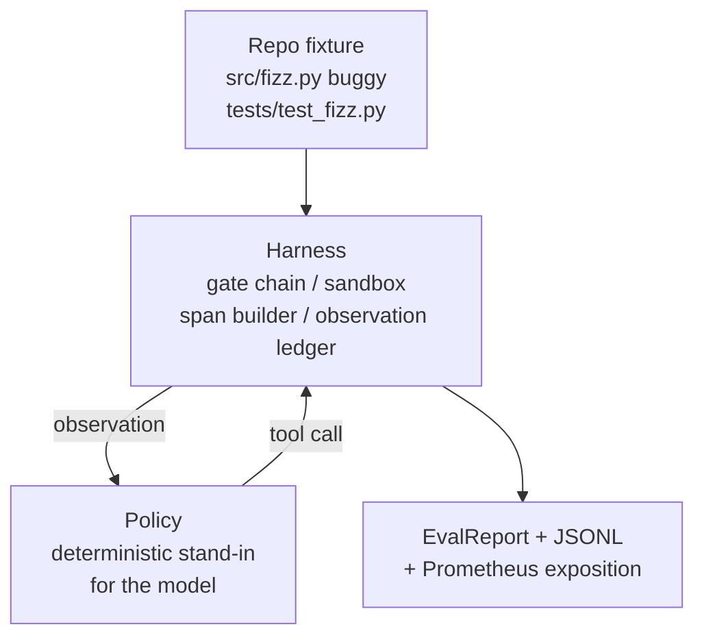
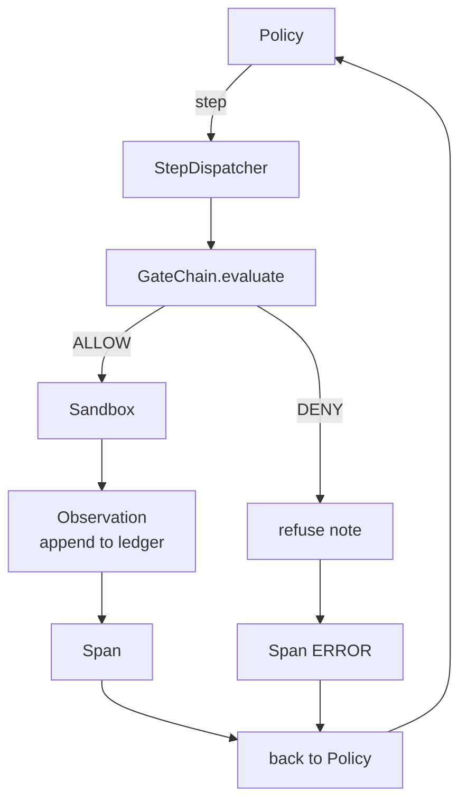

# درس 29 Capstone: عامل کدگذاری از آخر تا آخر در کلاه

> .موفقيت "آ" این درس زنجیره دروازه، جعبه شن، هرنس eval را می پیوندد و OTel را به یک عامل کدگذاری کار می کند که یک خطای واقعی (کچیک، مقیاس ثابت) را در یک پروژه چند فایل پایتون حل می کند. عامل یک سیاست تعیین کننده است، نه یک LLM؛ جایگزینی درس را قابل بازیافت می کند و نشان می دهد که هرنس همیشه بخش جالب بود. قرارداد یکسان است: یک مدل واقعی در پلت های سیاست وصل می شود.

**Type:** Build
**Languages:** Python (stdlib)
**Prerequisites:** Phase 19 · 25 (verification gates), Phase 19 · 26 (sandbox), Phase 19 · 27 (eval harness), Phase 19 · 28 (observability), Phase 14 · 38 (verification gates), Phase 14 · 41 (workbench for real repos), Phase 14 · 42 (agent workbench capstone)
**Time:** ~90 minutes

## اهداف یادگیری

- زنجیره دروازه، جعبه شن، هرنس ارزشی و سازنده اسپان را به یک حلقه عامل واحد ترکیب کنید.
- یک سیاست تعیین کننده را اجرا کنید که از read_file، run_tests و write_file برای رفع یک خطا تنظیم کننده استفاده می کند.
- اجرای بودجه مرحله ای جهانی به علاوه بودجه توکن مشاهده در یک دوره پایان به پایان.
- برای تمام مدت، ردیابی OTel GenAI و متریک Prometheus را کامل ارسال کنید.
- مطمئن شو که مامور در کمتر از 12 مرحله با صفر سفر دروازه در ابزار قانونی حل می کند.

## مشکل

بیشتر نمايش هاي عامل در آيزوليشن عمل ميکنن: يه جعبه شن و ماسه به تنهایی، يه هنيز ارزشي به تنهایی، يک فرستنده اسپان به تنهایی.

دروازه گفت اجازه بده اما جعبه شن رو رد کرد به خاطر چیزی که دروازه پیش بینی نکرده بود .توليسي که از اين جا عبور ميکنه اما اطلاعات اونتل ميگه که دروازه از ابزاري که مامور ادعا مي کنه استفاده کرده رد شده شمارش Prometheus دو بار افزایش می یابد وقتی که باید یک بار افزایش یابد. بودجه مشاهدات از حد بالا رفته اما مامور ادامه داد چون بودجه در زنجیره ردیابی شده بود و جعبه شنو نمی دونست

این درس آزمون ادغام برای کل مسیر است. عامل باید چهار کار را برای انجام دهد: پروژه را بخوانید، آزمایشات را اجرا کنید، خطا را از شکست آزمایش شناسایی کنید، اصلاح را بنویسید، آزمایشات را دوباره اجرا کنید و متوقف کنید. هر عملیات از طریق زنجیره دروازه می رود. هر اجرای ابزار از طریق جعبه شن. هر مرحله در یک مدت بسته می شود. هارمون ارزیابی در پایان همه چیز را نمره می دهد.

## مفهوم



قانون اين مامور يه دستگاه ايالته پنج ايالت

`SURVEY`: مامور لیست پروژه را می خواند. حالت بعدی RUN_TESTS است.

`RUN_TESTS`اگر آزمایش ها موفق شوند، دستگاه حالت با موفقیت متوقف می شود. در غیر این صورت حالت بعدی INSPECT است.

`INSPECT`: مامور فایل منبع شکست خورده را می خواند. حالت بعدی فکس است.

`FIX`: مامور پرونده اصلاح شده رو مي نويسه. حالت بعدي VERIFY

`VERIFY`اگر تست ها موفق شوند، موفقیت را متوقف کنید، در غیر این صورت با شکست متوقف شوید.

هر حالت با یک تماس ابزار مطابقت دارد. هر تماس ابزار از طریق زنجیره دروازه عبور می کند. اگر یک تماس ابزار رد شود، مامور در ردیابی و توقف گزارش رد می کند.

. خطا سازي يه نفر به يك نفر در`fizz.py`سیاست تعیین کننده از پیام شکست آزمون از طریق یک regex خطا را تشخیص می دهد و فایل اصلاح شده را ارسال می کند. جایگزینی سیاست با LLM قرارداد استفاده را تغییر نمی دهد.

```figure
cg-harness-weave
```

## معماری



درس خودکشی دارد. هر درس اولیه قبل از درس در مقیاس کمترین در`main.py`(gate, sandbox, ledger, span) بنابراین درس بدون وارد کردن خواهران و خواهران اجرا می شود. نام ها دقیقا با درس 25-28 مطابقت دارند بنابراین نقشه برداری مفهومی واضح است.

## چه چیزی می سازید

`main.py`کشتی ها:

1. با اسم هاي مشابه درس 25-28:`GateChain`،`Sandbox`،`ObservationLedger`،`SpanBuilder`،`MetricsRegistry`. .
2. `CodingAgentPolicy`کلاس: ماشین دولتی با پنج ایالت
3. `Repo`کمک کننده: یک خاکستری را با وسیله ی بسته بندی شده ی بگی آماده می کند.
4. `AgentRun`کلاس: سیاست را هدایت می کند، از طریق هرنس ارسال می کند، یک `AgentRunReport`. .
5. یک دستگاه بسته بندی (`fixture_repo/`) با src/fizz.py، tests/test_fizz.py و یک درخت انتظار می رود برای استفاده از eval.
6. دمو: از آخر به آخر سیاست اجرا می کند، ردیابی مرحله به مرحله را چاپ می کند، تایید می کند، متریک را چاپ می کند.

یک فایل باگ و یک فایل تست است. پیام شکست آزمون حاوی اطلاعات کافی برای سیاست تعیین کننده برای شناسایی اصلاح است. یک LLM واقعی کار مشابه را کند، آهسته تر و با بازپسین گسترده تر، اما انتظارات هیست را تغییر نمی دهد.

## چرا این سیاست یک LLM نیست

یک LLM واقعی نیاز به کلید API، یک تماس شبکه و استوکاستیکیت غیر قابل تأیید دارد. استفاده از هرنس بخشی است که درس به آن اهمیت می دهد. زیرنویس در یک سیاست تعیین کننده اجازه می دهد که درس در هر لپ تاپ توسعه دهنده با صفر وابستگی خارجی اجرا شود و اجازه می دهد تا مجموعه آزمایش شمار دقیق گام را تأیید کند.

سیاست درس یک زیر مجموعه دقیق از آنچه یک نماینده LLM انجام می دهد است. سیاست بازبینی را می خواند، آزمون شکست خورده را می بیند، خط را شناسایی می کند و یک اصلاح را صادر می کند. یک LLM با همان قرارداد استفاده از یک حلقه می گذرد؛ حسابداری یکسان است.

## آنچه در دیمو ادعا می شود

در دمو آخر به آخر پنج چیز در زمان خروج تایید می شود و مجموعه آزمایش آنها را به صورت برنامه ای تایید می کند.

اين سيستم اين مسئله را در کمتر از 12 مرحله حل کرد.

بودجه مشاهده هرگز فراتر نرفت.

انکار دروازه صفر به ابزار قانونی شلیک شد

هر مرحله يه فاصله ي مشابهي در رد و رد داره

نمايش "پروميتوس" شامل يه`tools_called_total{tool="read_file"}`ورود و یک`tool_latency_ms`هیستogram

## چطور اين با بقيه راه A همگامي ميکنه

این درس ادغام است. درس 25 زنجیره دروازه را نوشت. درس 26 جعبه شنو را نوشت. درس 27 هارنز ارزشی را نوشت. درس 28 مشاهده ای را نوشت. درس 29 ثابت کرد که آنها به عنوان یک سیستم کار می کنند. یک هارنز عامل واقعی از اینجا گسترش می یابد: سیاست تعیین کننده را برای یک مدل تغییر دهید، ثابت بسته را برای یک کار ریپو واقعی تغییر دهید، صادر کننده JSONL را برای OTLP تغییر دهید.

## دارم کار ميکنم

```bash
cd phases/19-capstone-projects/29-end-to-end-coding-task-demo
python3 code/main.py
python3 -m pytest code/tests/ -v
```

در این نسخه، یک ردیابی در هر مرحله، گزارش ارزیابی نهایی و نمایش Prometheus چاپ می شود. کد خروج صفر است. آزمایش ها شامل انتقال حالت سیاست، رد دروازه در تماس های ابزار مصنوعی، اجرا پایان به پایان در دستگاه بسته شده و متغیرات بودجه مرحله ای است.
