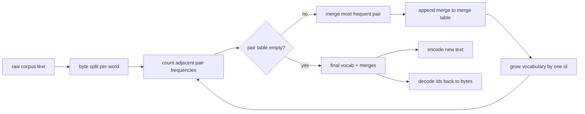
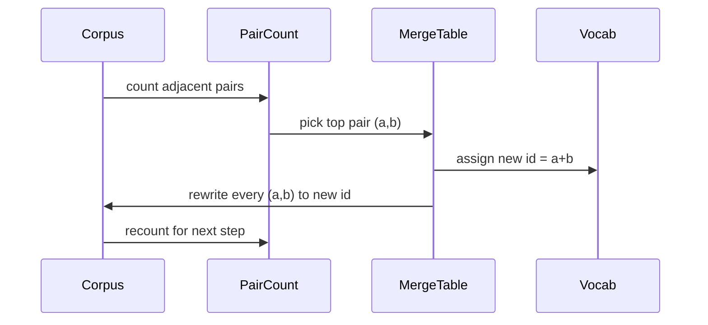

# BPE Tokenizer از ابتدا

> بائیت ها وارد، آیدی ها خارج، آیدی ها به همان بائیت ها برگردد. توکنایزر بسازید که هر مدل متن مدرن هنوز از آن شروع می کند.

**Type:** Build
**Languages:** Python
**Prerequisites:** Phase 04 lessons, Phase 07 transformer lessons
**Time:** ~90 minutes

## اهداف یادگیری
- آموزش یک کلمه بندی بایت-پیر از یک متن خام با پیوستن مکرر مکرر دو نماد متجافت.
- یک جدول ادغام تعیین کننده را پیاده سازی کنید و آن را به متن تازه برای تولید یک جریان از اسم های زیر کلمه اعمال کنید.
- ورودی تعسفی UTF-8 برای IDs و بازگشت بدون از دست دادن اطلاعات.
- توکن های ویژه را ذخیره و محافظت کنید (`<|endoftext|>`،`<|pad|>`) تا بتوانند از آموزش و رمزگذاری زنده بمانند.
- دلیل اینکه چرا یک الفبا باط سطح کف مناسب برای یک توکنيزر عمومی است.

```figure
cap-bpe-merge
```

## قاب

یک مدل زبان هرگز متن را نمی بیند. آن را می بیند اعداد تمام. نقشه از یک رشته به یک لیست از اعداد تمام و عقب است که نشان دهنده است. این لایه را اشتباه بگیرید و هر منحنی از دست دادن در تمرین در حال اندازه گیری چیزی اشتباه است.

خانواده غالب نشانه های زیر برای مدل های متن عمومی رمزگذاری بایت-پیر است. ایده کوچک است. از یک الفبا شناخته شده شروع کنید. جفت نماد مجاور را پیدا کنید که اغلب در کورپوس آموزش ظاهر می شود. آن را به یک نماد جدید ادغام کنید. تا زمانی که ذخایر لغات به اندازه هدف برسد تکرار کنید. رمزگذاری متن جدید از همان لیست ادغام در همان ترتیب استفاده می کند.

ما ویرانت باط سطح را ایجاد خواهیم کرد. الفبا 256 باط خام است، نه نقاط کد یونیکوڈ. این انتخاب به توکنایزر اجازه می دهد هر ورودی UTF-8 را بدون بازگشت به یک توکن ناشناخته اداره کند.

## خط لوله



در این قسمت، در قسمت آموزش و در قسمت نتیجه گیری، جدول ادغام مشترک است. این اشتراک گذاری قرارداد است. اگر ترتیب ادغام را در نتیجه گیری تغییر دهید، یک جریان مختلف از شناسه ها را رمزگذاری می کنید.

## الفبا بايت

اولین 256 ID برای بائتهای خام 0x00 تا 0xFF ذخیره شده است. این تضمین می کند که هر رشته ورودی قبل از هر ترکیب اتفاق می افتد در لغات بیان می شود. پس از بلوک بائته ما یک محدوده کوچک برای توکن های خاص ذخیره می کنیم. حلقه آموزشی هرگز این ID ها را به عنوان اهداف ترکیب پیشنهاد نمی کند زیرا ما آنها را از جریان پیش از توکن ها کاملا خارج می کنیم.

پیش از این، قبل از اینکه آموزش آن را ببیند، corpus را بر روی فضای سفید و مرزهای امتیاز تقسیم می کند. بدون این تقسیم، مرحله ادغام BPE با خوشحالی ادغام را یاد می گیرد که مرزهای کلمه را عبور می کند و لغت با جملات مشترک کامل پر می شود. با تقسیم، ادغام در داخل یک کلمه باقی می ماند و نتیجه عمومی می شود.

## چرخه آموزش

برای هر مرحله تمرین، حلقه سه کار انجام می دهد. آن را در هر کلمه در corpus و شمارش هر جفت از علامت های فعلی در کنار خود به عنوان وزن با چگونه اغلب کلمه خود را به نظر می رسد. آن را انتخاب می کند جفت با بالاترین تعداد. آن را هر رخ دادن از آن جفت به یک علامت جدید که ID آن را به عنوان slot آزاد بعدی در لغت است. سپس آن را ثبت می کند ادغام.



هزینه هر مرحله در اندازه corpus به عنوان یک لیست از ردیف های نماد بیان شده خطی است. برای یک میلیون کلمه و یک لغت هدف از ده هزار ID، حلقه در عرض ثانیه به پایان می رسد زیرا ردیف های نماد با ادغام زمین کوچک می شوند.

## کدگذاری متن تازه

اینفرنس شمارش را به نام می برد. آن را در همان ترتیب که یاد گرفته است، در جدول ترکیب اعمال می کند. برای یک کلمه تازه، کدگر از تقسیم باایت شروع می شود. آن را برای پایین ترین رتبه ترکیب (اولین مورد استفاده) اسکن می کند. آن را انجام می دهد. آن را دوباره اسکن می کند. حلقه زمانی که هیچ ترکیب در جدول برای ترتیب فعلی اعمال نمی شود، پایان می یابد.

ترتیب به ترتیب رتبه ویژگی ای است که کدگذاری را تعیین کننده و با رفتار آموزشی در همان ورودی مطابقت می دهد. یک ترکیب که ابتدا یاد گرفته شده در بالای جدول قرار دارد و ابتدا اعمال می شود. اگر دو ترکیب در موقعیت مشابه اعمال شود، رتبه پایین تر برنده می شود.

## توکن های ویژه

توکن های ویژه ای هستند که جریان بائتهای هرگز نمی توانند تولید کنند. ما آنها را به دست ذخیره می کنیم. دو برای این درس کافی است.

- `<|endoftext|>`در طول آموزش اسناد را جدا می کند. به مدل می گوید "یک سند جدید از اینجا شروع می شود، اجازه ندهید که زمینه قبلی به داخل بیفتد".
- `<|pad|>`به طوری که یک دسته می تواند یک تنسور مستطیل باشد. ماسک از دست دادن آن را در طول تمرین پنهان می کند.

کدگر یک پرچم را برای اجازه دادن به توکن های خاص در ورودی پذیرفته است. با خاموش کردن پرچم، رشته ها `<|endoftext|>`و`<|pad|>`با پرچم روشن، رشته های واقعی به آدی های ذخیره شده خود نقشه برداری می شوند و تحت هیچ ادغام قرار نمی گیرند.

## تضمین سفر برگشت

کدگذاری سپس کدگذاری باید باایت های ورودی را دقیقاً بازگرداند. کدگذاری افزونه باایت های هر آی دی را به ترتیب متصل می کند. از آنجا که هر آی دی یا یک بایت خام یا یک بایت های دو آی دی شناخته شده است، گسترش تکراری همیشه در بایت های خام پایان می یابد. کدگذاری سپس رشته UTF-8 را که این بایت ها نوشته می شود، باز می آورد.

مجموعه تست در این درس این ویژگی را در یک جمله ناشناخته، در یک جمله با یک اموجی یونیکود و در یک جمله که حاوی یک حرف حرفی است بررسی می کند `<|endoftext|>`. نشاني

## آنچه این درس انجام نمی دهد

این شرکت یک pre-tokenizer regex-driven را به سبک بزرگترین tokenizer تولید نمی سازد. پیش از این که این را نشان دهیم، یک فضای سفید و نقطه بندی کوچک است. تنها کافی است که در یک مجموعه کوچکی از آموزش ها ادغام های منطقی ایجاد شود و قرارداد با بقیه زنجیره درس ها یکسان بماند. درس بعدی به توکنایزر به عنوان یک جعبه سیاه نگاه می کند و مجموعه داده های پنجره ای را روی آن می سازد.

این دو عدد را متوازم نمی کند. یک حلقه در پایتون بر روی یک کورپوس چند هزار کلمه در کمتر از یک ثانیه تمام می شود. برای کورپوس های بزرگتر حرکت واضح این است که هر کلمه را متوازم و کاهش دهید.

## چطور کد رو بخونيم

`main.py`چهار تا از اجسام رو تعریف ميکنه`BPETokenizer`در این صفحه، ذخایر لغات، جدول ادغام و جدول نشانه های ویژه وجود دارد.`train`این چرخه آموزش است.`encode`راه نتیجه گیری است.`decode`در پایین، یک توکنایزر کوچک را روی یک کورپوس داخلی آموزش می دهد، یک جمله طولانی را کدگذاری می کند، شناسه ها را رمزگذاری می کند و هر دو را چاپ می کند. آزمایشات در `code/tests/test_bpe.py`املاک سفر و برگشت، رزرو توکن های ویژه و سفارش ادغام را مشخص کنید.

نمایش را اجرا کنید. سپس اندازه لغت هدف را در نمایش از 300 به 600 تغییر دهید و ببینید که طول رمزگذاری جمله نگه داشته چگونه کاهش می یابد. این منحنی منحنی فشرده سازی BPE است.
