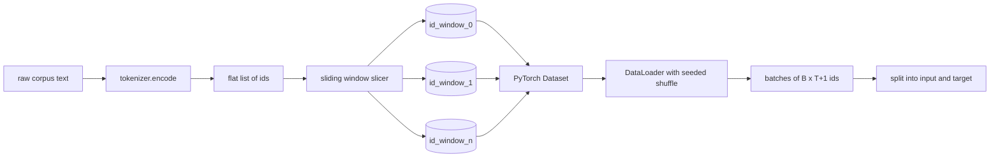
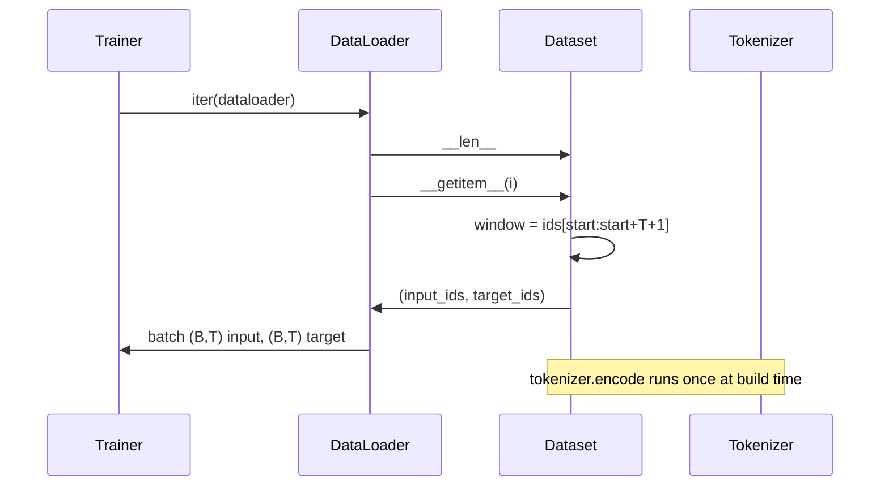

# مجموعه داده های توکن شده با پنجره سلایدی

> یک اجرا قبل از تمرین یک تابع از شناسه های رمز به gradients است. این درس حمل کننده را که ID ها را تغذیه می کند، می سازد.

**Type:** Build
**Languages:** Python
**Prerequisites:** Phase 04 lessons, Phase 07 transformer lessons, Lesson 30 of this phase
**Time:** ~90 minutes

## اهداف یادگیری
- یک نمونه خام را به یک جریان از هویت های رمزنگاری تبدیل کنید با تماس با نشان دهنده یک بار.
- جریان id را به پنجره های طول ثابت با یک مرحله تعدیلی تعویض شده برش دهید.
- یک مجموعه داده های PyTorch را بسازید که ورودی و تنسورهای هدف را برای پیش بینی توکن بعدی باز می کند.
- مجموعه داده ها را در یک DataLoader با یک مخلوط تعیین کننده به هر دوره بسته بندی کنید.
- دلیل در مورد تعادل بین سرعت، تخفیف و اندازه موثر مجموعه داده ها.

```figure
cap-sliding-window
```

## قاب

یک دوره پیش از تمرین یک دسته از شناسه های رمزنگاری را در یک زمان می خواند و مدل را به روز می کند. شکل هر دسته توسط قرارداد آموزش تعیین می شود. برای یک مدل زبان علت، دسته نگه دارد `(B, T)`آدرس ورودی و`(B, T)`هدف ID ها که هدف ورودی است که توسط یک سمت چپ تغییر داده می شود. کار لوله داده ها تولید این قرارداد در مورد تقاضا، به شیوه ای تعیین کننده و قابل بازیافت، از یک کورپوس است که ممکن است چندین گیگابایت از متن خام باشد.

این درس خط لوله را می سازد. توکنایزر از درس قبلی متن را به یک لیست مسطح طولانی از شناسه ها تبدیل می کند. یک پنجره پرتابنده این لیست را به مثال های آموزشی می شکند. یک مجموعه داده های سفارشی نمونه ها را به عنوان تنسورها نشان می دهد. یک DataLoader آنها را دسته بندی می کند و با یک دانه شناخته شده آنها را مخلوط می کند.

## قرارداد شکل

یک LM علت مصرف ID شکل `(B, T)`کجا`B`اندازه دسته و`T`طول زمینه است. هدف در موقعیت`t`در موقعیت وارد شدن است`t+1`. به این معنی که هر نمونه آموزش پوشش می دهد`T+1`نماد های خام. مرحله پنجره کنترل می کند که چه مقدار همپوشانی بین نمونه های متوالی وجود دارد.



اگر پنجره ی آخر به اندازه کافی شناسه ای برای پر کردن نداشته باشد`T+1`در حالي که به جايگاهي قرار بگيره، شيرينش رو مي اندازد.`<|pad|>`این یک انتخاب معتبر است اما این ماسک از دست دادن را پیچیده می کند. برای این درس ما از دست می دهیم.

## چرا پنجره ای شیفت

یک corpus پیش از آموزش یک جریان طولانی از شناسه ها است. اگر مدل فقط پنجره های غیر متداول را ببیند، هر مثال آموزش به آن همان درس را می دهد.`T`خط قدم را تنظیم می کند تا این خط را حرکت دهد تا مدل وظایف پیش بینی بعدی را مشاهده کند.

يه قدم از`T`پنجره های متناوب را تولید می کند.`T // 2`این امر باعث ایجاد 50 درصد همپوشانی می شود و مجموعه داده های موثر را دو برابر می کند.`1`تولید حداکثر تعادل و افزایش مجموعه داده ها با یک فاکتور `T`هزینه بیشتر در هر دوره محاسبه می شود. مزایای بیشتر تنوع مرزی است. اکثر تمرینات قبل از تمرین از یک مرحله برابر با طول زمینه استفاده می کنند زیرا کورپوس بیش از اندازه ای است که مدل می تواند در یک دوره تمام شود، بنابراین استدلال تنوع مرزی ضعیف تر است.

## کلاس مجموعه داده ها

یک مجموعه داده های PyTorch دو روش لازم دارد. `__len__`تعداد نمونه ها را باز می گرداند. `__getitem__`یک مثال را به عنوان یک جفت تنسور باز می گرداند. مجموعه داده ما جریان id رمزگذاری شده و مرحله را ذخیره می کند. شاخص سازی به آن شروع پنجره را در حال حرکت محاسبه می کند بنابراین هزینه حافظه یک کپی از جریان id است بدون توجه به اینکه چند مثال مرحله تولید می کند.



. تغییر به صورت انفرادي در داخل اتفاق مي افتد`__getitem__`. مجموعه داده ها باز می گردد`(input, target)`کجا`input = window[:-1]`و`target = window[1:]`هر دو تنسور هاي بلند پي تورچ هستن و حلقه آموزش بهشون مثل حقيقت زمين نگاه ميکنه

## مخلوط کردن تعیین کننده

یک DataLoader با `shuffle=True`از يه ژنراتور تصادفي PyTorch ميخواد`torch.Generator`در این حالت، اگر دو رنز که تنها در یک پارامتر متفاوت هستند را مقایسه کنید، این ویژگی مهم است. بدون یک رنز، دو رنز داده ها را در ترتیب های مختلف می بینند و منحنیات از دست دادن به دلایل غیر مرتبط با تغییر متفاوت هستند.

قرارداد تخم در این درس ساده است.`epoch_seed = base_seed + epoch_index`. دانه پایه در ساخت منتقل می شود. شاخص دوره توسط مربی در بالای هر دوره افزایش می یابد. یک بار دیگر با همان دانه پایه همیشه در هر دوره ترتیب مشابه را می بیند.

## نمونه برداری دسته

نمونه گیری پیش فرض در PyTorch شاخص ها را به صورت تصادفی با غیر فعال کردن جایگزین به طور یکسان انتخاب می کند. این چیزی است که برای پیش از تمرین می خواهیم. برای تنظیم دقیق در یک مجموعه داده کوچک قرارداد یکسان است. DataLoader با تماس با گروه را جمع می کند `__getitem__` `B`و نتایج را جمع آوری می کنیم. چون هر مثال طول مشابهی با ساخت است، هیچ منطق پر کردن مورد نیاز نیست.

درس ادامه داره`num_workers=0`در یک کار تولید، کارگران به طور متوازمی`__getitem__`با خط لوله ما که عمدتا بدون عملیات است چون کار فقط یک قطعه از یک تنسور در حافظه است، اما همان API Dataset پشتیبانی از کارگران تمیز.

## نمونه های شمارش

برای یک جریان ID طول`N`, طول یک متن`T`و یک قدم`S`, تعداد نمونه ها `max(0, 1 + (N - (T + 1)) // S)`درسی این محاسبه را به عنوان یک روش ثابت در مجموعه داده ها نشان می دهد تا مربی بتواند کل مراحل را در هر دوره بدون تکرار محاسبه کند.

## آنچه این درس انجام نمی دهد

این جریان از دیسک نیست. corpus به طور کامل در حافظه کدگذاری شده و به عنوان یک تنسور واحد نگهداری می شود. برای corpus چند میلیون id که کمتر از یکصد مگابایت است و شکل مناسب برای درس است. جریان دیسک یک نگرانی جداگانه است که با جایگزینی ذخیره سازی وصل می شود اما قرارداد Dataset را حفظ می کند.

این سند چند سند را اداره نمی کند. corpus به عنوان یک جریان ID مداوم در نظر گرفته می شود. مرز سند بعدی با قرار دادن `<|endoftext|>`وقتی که corpus از چندین سند ساخته شده است مدل یاد می گیرد تا حدود را پیش بینی کند.

## چطور کد رو بخونيم

`main.py`دو طبقه و یک دستیار را تعریف می کند.`SlidingWindowDataset`این مجموعه داده های PyTorch است.`make_dataloader`یک DataLoader پیکربندی شده با یک ژنراتور تخم ریزی شده را باز می کند. `_encode_corpus_to_ids`در پایین، یک توکنایزر کوچک در فرآیند ایجاد می شود، یک کورپوس داخلی را کدگذاری می کند، مجموعه داده ها و بارگذاری داده ها را ایجاد می کند، یک دسته را چاپ می کند و قرارداد شکل را تأیید می کند. آزمایشات در `code/tests/test_dataset.py`فرمول شمارش پنجره، خواص تغییر به یک، مخلوط تعیین کننده و تعادل قدم را مشخص کنید.

نمایش را اجرا کنید. سپس طول زمینه را از 16 به 32 تغییر دهید و ببینید که تعداد نمونه ها در هر دوره چگونه کاهش می یابد. این تعداد بودجه مرحله به مرحله شما است.
