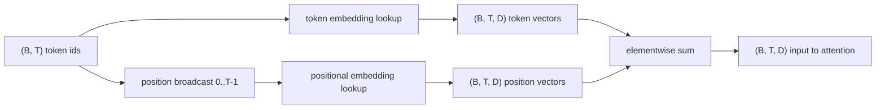
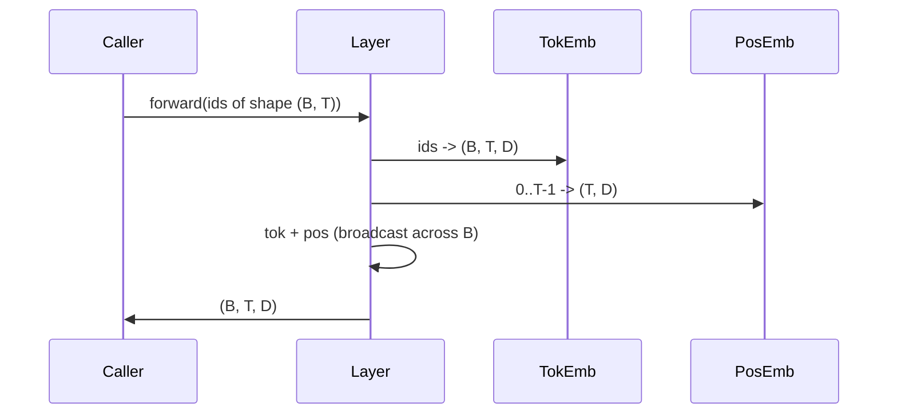

# علامت ها و جایگذاری ها

> ID ها اعداد تمام هستند. مدل به ویکتورها می خواهد. دو جدول جستجو بین آنها قرار دارد و انتخاب موقعیت واحد شکل می دهد که مدل می تواند یاد بگیرد.

**Type:** Build
**Languages:** Python
**Prerequisites:** Phase 04 lessons, Phase 07 transformer lessons, Lessons 30 and 31 of this phase
**Time:** ~90 minutes

## اهداف یادگیری
- یک جدول جستجوی شامل نشانه بسازید که شناسه های لغات را به متری های کثیف نقشه برداری کند.
- یک جدول جستجوی تعویض موقعیت آموخته شده را با موقعیت های خود فهرست کنید.
- یک جای ثابت سینوسوئیدل را بنا کنید که با موقعیت بدون پارامترها شاخص شده باشد.
- ترکیب رمز و موقعیت های گنجانده شده در یک ورودی واحد برای یک بلوک ترانسفورماتور.
- تعویض های متناقض و سینوسایدی در عمودی شدن طول و شمار پارامتر ها

```figure
cc-embedding-lookup
```

## قاب

اولین تماس مدل با یک ID توکن یک ردیف در ماتریس گنجانده شده است. ماتریس دارای یک ردیف در هر یک از کلمات کلیدی و یک ستون در هر ابعاد مدل است. جستجوی یک متری را باز می گرداند که بقیه مدل به عنوان معنای ID رفتار می کند. Backprop ردیف هایی را که در گذرگاه جلو استفاده شده است به روز می کند. طی آموزش هندسه این ردیف ها یاد می گیرد که شباهت را در جهت ها کدگذاری کند.

فقط توکن ها هیچ نظم ندارند. مدل به سیگنال دوم نیاز دارد که به آن بگوید موقعیت یک از موقعیت ۱۷ متفاوت است. دو گزینه اصلی برای این سیگنال یک قرار گیری موقعیت آموخته (تابل دوم جستجو، یک ردیف در هر موقعیت) و یک قرارگیری موقعیت سینوسایدی ثابت (فارمول ریاضی بدون پارامتر) هستند. انتخابي که ميکنه عواقب داره یک جدول آموخته یک پارامتر است و با حداکثر طول زمینه که مدل آموزش داده شده است محدود می شود. یک جدول سینوسوائیدل در تئوری پارامتر آزاد است و فرمول به هر موقعیت گسترش می یابد، اما این درس `SinusoidalPositionalEmbedding`پیش محاسبه یک جدول ثابت در `max_context_length`و آن`forward`در این مورد، هر دو ماژول در این مورد حداکثر طول زمینه را اعمال می کنند. مدل ممکن است حتی زمانی که جدول به اندازه کافی بزرگ باشد تا شاخص شود، هنوز هم از طول تمرین خود فراتر برود.

این درس هر دو را می سازد و آنها را با رمز در یک ورودی واحد برای بلاک توجه درس بعدی تشکیل می دهد.

## قرارداد شکل

ورودی برای مرحله ادغام یک دسته از نماد های نماد شکل است `(B, T)`. محصول يک تنسور شکل است`(B, T, D)`کجا`D`هر عنصر دسته دارای طول زمینه مشابه است`T`هر موقعیت يه اندازه متری داره`D`. .



ترکیب یک مجموعه است نه یک ترکیب.`D`ثابت در شبکه و اجازه می دهد مدل بر اساس ویژگی تصمیم بگیرد که آیا معنی رمز یا موقعیت در هر لایه تسلط دارد.

## ماتریس گنجانشی رمز

رمز تعویض یک پارامتر تنسور شکل است `(V, D)`کجا`V`اندازه لغت است. پیتورچ آن را به عنوان`nn.Embedding(V, D)`در ابتدا، ورودی ها از یک گاوسی کوچک گرفته شده اند، به طور سنتی با میانگین صفر و انحراف استاندارد در حدود `0.02`برای مدل های مقیاس ترانسفورماتور، اصل دقیق کمتر از این مهم است که در طول اجرا ها ثابت بماند.

گذر جلو یک عملیات شاخص سازی است.`(B, T)`آدرس های int64 به `(B, T, D)`در این مرحله، دو ردیف که هرگز در دسته ظاهر نشدند، در این مرحله gradient صفر دریافت می کنند.

یک جزئیات ظریف. گنجانشی نماد و پیش بینی خروجی در پایان مدل اغلب وزن را به اشتراک می گذارند (بند وزن). هنگامی که این اتفاق می افتد، هر گذر عقب به هر ردیف گنجانشی از طریق سمت خروجی لمس می کند. درس در اینجا هر دو را به عنوان ماژول های جداگانه نشان می دهد اما همان ماتریس می تواند هر دو نقش را در یک مدل کامل انجام دهد.

## تعبیرات تعلیمی در موقعیت

تعارف در مورد موقعیت ها یک دوم است`nn.Embedding`شکل`(max_context_length, D)`. جستجو با شماره موقعیت مشخص شده`0, 1, 2, ..., T-1`. گذرگاه جلو پخش کننده ی این ویکتور موقعیت در طول ابعاد دسته

عيب ميز آموزنده اينه که در موقعيتش سوال نمي شود`T`اگر مدل فقط به موقعیت آموزش داده شده باشد`T-1`.خط وجود ندارد. مدل های تولید فقط با کد کد که از این طرح استفاده می کنند حداکثر طول زمینه را به معماری می پخته و از پردازش ورودی طولانی تر انکار می کنند.

## قرار دادن موقعیت سینوسایدی

نقش موقعیت سینوسوائدی یک تابع از موقعیت به ویکتور است.`p`و ویژگی`i`محصولات

```python
angle = p / (10000 ** (2 * (i // 2) / D))
emb[p, 2k]     = sin(angle)
emb[p, 2k + 1] = cos(angle)
```

این تابع هیچ پارامتر ندارد. هر موقعیت دارای یک ویکتور منحصر به فرد است. طول موج به طور هندسی در طول طول ویژگی متفاوت است، بنابراین ابعاد پایین تر موقعیت را کدگذاری می کنند و ابعاد بالاتر موقعیت خوب را کدگذاری می کنند.

ملکیت که از انتخاب `sin`و`cos`در مجموع این است که متری در موقعیت`p + k`یک تابع خطی از متری در موقعیت است`p`این به لایه توجه راه آسان برای یادگیری تعویض موقعیت نسبی می دهد. مدل به پارامتر جداگانه ای برای بیان "به پنج توکن نگاه کنید" نیاز ندارد.

درس تمام جدول سینوسوئیدل را در ساخت محاسبه می کند و در زمان پیش روی آن را شاخص می کند.

## ترکیب

خط ورودی سه چیز را در ترتیب انجام می دهد. شناسه های رمز را بخوانید. متری های رمز را جستجو کنید. متری های موقعیت را اضافه کنید. مبلغ را برگردانید.



پخش در مرحله سوم تکرار می کند`(T, D)`تنسور موقعیت در طول ابعاد دسته. PyTorch آن را به طور خودکار کنترل می کند زیرا تنسور موقعیت شکل دارد`(1, T, D)`بعد از باز کردن فشار

## تجزیه و تحلیل متناقض

درسی هر دو نوع را بر روی همان ورودی اجرا می کند و دو تشخیص را چاپ می کند.

اولين، شمارش پارامترها است.`max_context_length * D`پارامترها بالای تمجید رمز.

دومین، شباهت کوسین بین گنجانده شدن در موقعیت های همسایه است. نوع سینوسوائید دارای تجزیه صاف و قابل پیش بینی است زیرا عملکرد مداوم است. نوع آموخته شده در ابتدایی تقریباً تصادفی است زیرا ردیف ها به طور مستقل کشیده می شوند. پس از آموزش، نوع آموخته شده معمولا یک ساختار همسان و هموار را توسعه می دهد، اما باید از داده ها این ساختار را کشف کند.

## آنچه این درس انجام نمی دهد

این کد بندی موقعیت چرخش (RoPE) یا AliBi را ایجاد نمی کند. این گزینه های مدرن در ترانسفورماتورهای تولید هستند. هر دو از همان قرارداد شکل پیروی می کنند که در اینجا قرار داده شده است (تغییر وابسته به موقعیت را به ویکتورهای شکل اعمال کنید)`(B, T, D)`درسی بعدی بلاک توجه را ایجاد می کند و یکی از تمدیدات اختیاری این است که به صورت چرخش در طرح های کلید جستجو در آنجا قرار گیرد.

آموزش به درونش آموزش نمی دهد. آموزش به یک ضرر نیاز دارد، که نیاز به یک تولید مدل دارد، که نیاز به توجه و یک سر LM دارد. این درس بعدی و بعد از آن است.

## چطور کد رو بخونيم

`main.py`سه ماژول تعریف می کند.`TokenEmbedding`بسته بندی`nn.Embedding(V, D)`.`LearnedPositionalEmbedding`بسته بندی`nn.Embedding(L, D)`.`SinusoidalPositionalEmbedding`جدول رو پیش محاسبه مي کنه و اونو به عنوان يه بازدار باز مي کنه`EmbeddingComposer`یک پیوند رمز و یک پیوند موقعیت را با هم متصل می کند. نمایش در پایین شکل ها، شمارش پارامتر و تشخیص شباهت موقعیت همسایه را چاپ می کند. آزمایشات در `code/tests/test_embeddings.py`شکل پین، رفتار پخش، شمارش پارامتر و فرمول سینوساید.

نمایش رو اجرا کن بعد ابعاد مدل رو عوض کن`D`از 64 تا 32 و ببينيد که چگونه باند هاي طول موج سينوسايد تغییر مي کنند.
