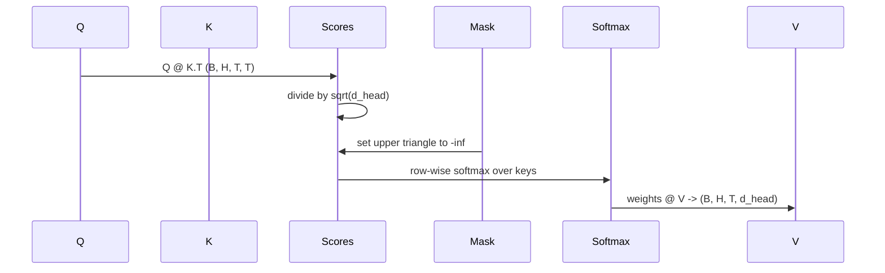

# توجه به خود چند سر

> يک پروژکتور خطي، سه منظره، سر هاي متوازي H، يک ماسک.

**Type:** Build
**Languages:** Python
**Prerequisites:** Phase 04 lessons, Phase 07 transformer lessons, Lessons 30 through 32 of this phase
**Time:** ~90 minutes

## اهداف یادگیری
- یک طرح بندی سوال/کليد/قيمت را به عنوان یک لایه خطی واحد به H تقسیم کنید.
- توجه نقطه محصول را با نرمال سازی و مدیریت dtype درست محاسبه کنید.
- ماسک علت را اعمال کنید که مانع از حضور یک موقعیت به موقعیت های آینده شود.
- وزن توجه هر سر را بررسی کنید تا یک ورودی ثابت داشته باشید و در مورد آنچه هر سر به آن نگاه می کند استدلال کنید.
- یک بلاک توجه کوچک را روی یک کار اسباب بازی تمرین کنید و به کاهش خسارت نگاه کنید زیرا سر ها تخصص دارند.

```figure
cap-multihead-attention
```

## قاب

توجه عملکردی است که اجازه می دهد نمایش یک توکن اطلاعات را از توکن های دیگر در یک ردیف جذب کند. خود توجه به معنای سوالات، کلید ها و ارزش ها همه از همان ورودی مشتق هستند. چند سر به معنای تقسیم پروژکتور به مشکلات H موازی توجه است که خروجی آن ها به هم بسته شده و به عقب پیش بینی می شود.

الگوی موثر پیاده سازی یک لایه خطی است که از `D`به`3 * D`و به سه قسمت برش داده می شود، سپس به شکل H شکل می گیرد.`D // H`مامل، نرمماکس و وزن شده به عنوان عملیات تنسور دسته ای اتفاق می افتد تا سر ها در موازی روی تسریع کننده اجرا شوند.

این درس آن بلوک را می سازد. همچنین ماسک علت را اضافه می کند تا همان کد مانند لایه توجه در یک مدل زبان فقط به عنوان دیکودر کار کند. درس بعدی بلوک را به یک ترانسفارمر کامل و درس بعد از آن را آموزش می دهد.

## قرارداد شکل

ورودی اینه`(B, T, D)`. محصولش`(B, T, D)`. ماسک اينه`(T, T)`در داخل بلوک تنسورهای میانگین شکل دارند`(B, H, T, d_head)`کجا`d_head = D // H`. محدودیت اینه`D % H == 0`. .

```mermaid
flowchart LR
    A["(B, T, D) input"] --> B[Linear D -> 3D]
    B --> C["split into Q, K, V"]
    C --> D["reshape to (B, H, T, d_head)"]
    D --> E["scores = Q @ K.T / sqrt(d_head)"]
    E --> F[apply causal mask]
    F --> G[softmax over keys]
    G --> H["context = weights @ V"]
    H --> I["reshape to (B, T, D)"]
    I --> J[output Linear D -> D]
    J --> K["(B, T, D) output"]
```



دو لایه خطی (پیش بینی QKV و پیش بینی خروجی) تنها پارامترهای بلوک هستند. ماسک، نرم ماکس، ماتمول ها و شکل های جدید همه پارامترهای آزاد هستند.

## تقسیم QKV

پیاده سازی ساده دارای سه لایه خطی جداگانه است، هر یک برای Q، K و V. یکی موثر دارای یک لایه واحد است که خروجی را می دهد `3 * D`این دو ریاضیات معادل هستند زیرا سه ضرب ماتریک جداگانه توسط`(D, D)`وزن ها دقیقا یک ماتریک ضرب به یک هستند`(3D, D)`و از آنها سنگینی جمع شده است.

نسخه کارآمد سریعتر است زیرا تسریع کننده یک ماتمول را به جای سه شروع می کند. همچنین شروع کردن آسان تر است زیرا سه ماتریس زیر در همان تنسور پارامتر زندگی می کنند و می توانند با هم شروع شوند.

## سرش رو عوض کرد

بعد از تقسیم، هر یک از Q، K، V `(B, T, D)`برای تبدیل این به مشکل توجه متوازی H، ما تغییر شکل می دهیم به`(B, T, H, d_head)`و به`(B, H, T, d_head)`ابعاد سر حالا در کنار ابعاد دسته قرار داره پس PyTorch توجه هر سر رو به عنوان یک عملیات دسته ای در سراسر`B * H`نمونه های مستقل

ابعاد d_head باقی می ماند تا نتیجه مطابقت داشته باشد`Q @ K.transpose(-2, -1)`. به اين صورت ميگيره`(B, H, T, T)`نمره توجه به هر سر

## مقیاس بندی

نمره ها با تقسیم میشن`sqrt(d_head)`بدون این مقیاس بندی، محصولات نقطه ای رشد می کنند`d_head`در این حالت، گرادینت ها کوچک و یادگیری است. تقسیم با`sqrt(d_head)`تفاوت نمره ها را در اندازه های سر تقریباً ثابت نگه می دارد.

## ماسک علت

یک مدل زبان فقط با کدگذاری می تواند فقط زمانی که نشانه بعدی را پیش بینی می کند، به گذشته شرط بندی کند. ماسک این را اعمال می کند. به طور مشخص، قبل از نرمترین، هر ورودی بالاتر از دیگاکونال از`(T, T)`بعد از نرم کردن، این موقعیت ها وزن صفر می شوند.



ما ماسک را به عنوان یک بازخورد در ساخت ثبت می کنیم تا در همان دستگاه با مدل زندگی کند و بخشی از نمودار گرادینت نباشد. ماسک حداکثر طول زمینه را پوشش می دهد که بلوک تا به حال می بیند. در زمان پیش روی ما قسمت بالا سمت چپ را برش می دهیم`(T, T)`گوشه

## پیش بینی خروجی

بعد از متریزهای کنست هر سر`(B, H, T, d_head)`، ما به سمت`(B, T, H, d_head)`، شکلش رو عوض کرد`(B, T, D)`، و یک پایان نامه را اعمال کنید`(D, D)`پروژکتور خطی. پروژکتور خروجی اجازه می دهد مدل سر ها را مخلوط کند. بدون آن، سر های H فقط هرگز از طریق لایه های بعدی دوباره ترکیب می شوند و بلوک به صورت مصنوعی محدود می شود.

## بررسی وزن توجه

درس نشان میدهد که`return_weights=True`پرچم در گذرگاه جلو. وقتی تنظیم شود، بلوک وزن توجه هر سر را به شکل می دهد `(B, H, T, T)`در کنار خروجی، دیمو نقشه ی گرما از وزن یک سر را در یک ورودی کوتاه چاپ می کند تا بتوانید ساختار مثلث علت و علت و تمرکز در هر موقعیت را ببینید.

در یک مدل آموزش دیده، سر های مختلف الگوهای مختلفی را یاد می گیرند. برخی سر ها به علامت های بلافاصله قبل توجه می کنند. برخی سر ها به شروع ردیف توجه می کنند. برخی سر ها توجه را تقریباً یکسانی پخش می کنند. هک بازرسی نقطه ورود برای آن کار تفسیر است.

## نمایش آموزش

نمایش در پايين`main.py`این روش به یک هدف مربوط می شود. این روش به یک هدف مربوط می شود. این روش به یک هدف مربوط می شود. این روش به یک هدف مربوط می شود. این روش به یک هدف مربوط می شود. این روش به یک هدف مربوط می شود. این روش به یک هدف مربوط می شود. این روش به یک هدف مربوط می شود. این روش به یک هدف مربوط می شود. این روش به یک هدف مربوط می شود. این روش به یک هدف مربوط می شود. این روش به یک هدف مربوط می شود. این روش به یک هدف مربوط می شود. این روش به یک هدف مربوط می شود. این روش به یک هدف مربوط می شود. این روش به یک هدف مربوط می شود. این روش به یک هدف مربوط می شود. این روش به یک هدف مربوط می شود. این روش به یک هدف مربوط می شود. این روش به یک هدف مربوط می شود. این روش به یک هدف مربوط می شود. این روش به یک هدف مربوط می شود. این روش به یک هدف مربوط می شود. این روش به یک هدف مربوط می شود. این روش به یک هدف مربوط می شود. این روش به یک هدف مربوط می شود. این روش به یک هدف مربوط می شود.`log(64) ~ 4.16`) تا پایین تر`1.0`سه دوره در CPU

هدف از نمایش، آموزش یک مدل مفید نیست، هدف این است که تدریج گرادینت ها از طریق هر قطعه بلوک جریان داشته باشد و سر ها چیزی در مورد یک مشکل یاد بگیرند که پاسخش واضح باشد.

## آنچه این درس انجام نمی دهد

این یک بلوک تغذیه ای را اضافه نمی کند. لایه ترانسفورماتور در یک مدل واقعی توجه است که از آن بعد یک MLP دو لایه با اتصال باقی مانده و استاندارد لایه در اطراف هر یک از آنها پیروی می کند. درس بعدی آنها را اضافه می کند.

این برنامه کدگذاری موقعیت چرخشی یا AliBi را اجرا نمی کند. هر دو در مرحله پروژکتور QKV در همان بلوک اعمال می شوند، اما آنها یک واحد آموزشی جداگانه هستند. بلوک به عنوان ساخته شده در اینجا با تغییر Q و K قبل از ماتمول سازگار است.

این دستگاه برای نتیجه گیری KV را پیاده نمی کند. ذخیره سازی کلید ها و ارزش ها در گذرگاه های پیش رو بهینه سازی است که رمزگذاری خودکشی را سریع می کند. این قرارداد شکل را در تنسورهای K و V تغییر می دهد اما در Q نیست. این در درس نتیجه گیری تعلق دارد.

## چطور کد رو بخونيم

`main.py`تعریف می کند`MultiHeadSelfAttention`. . کلاس دو لایه خطی و یک پوشه ماسک ثبت شده دارد. پروژه های گذرگاهی پیش رو، تغییر شکل، نمره ها، ماسک ها، نرم ها، وزن ها، تغییر شکل و دوباره پروژه ها. نمایش در پایین یک مدل کوچک را ایجاد می کند که توجه را با ورودی های نشانه ای و موقعیت و یک سر LM پوشاند، آن را در یک کار کپی برای سه دوره آموزش می دهد و منحنی از دست دادن و یک نقشه گرما توجه در هر سر را چاپ می کند. آزمایشات در`code/tests/test_attention.py`قرارداد شکل، خواص علت، خواص نرم، خواص سر و تقسیم و جریان گرادینت را مشخص کنید.

ديمو رو اجرا کن بعدش بيشتر`n_heads`از 4 تا 8 (حفاظتی)`d_model=32`، پس`d_head=4`) و تغيير نقشه گرما را تماشا کنید.
