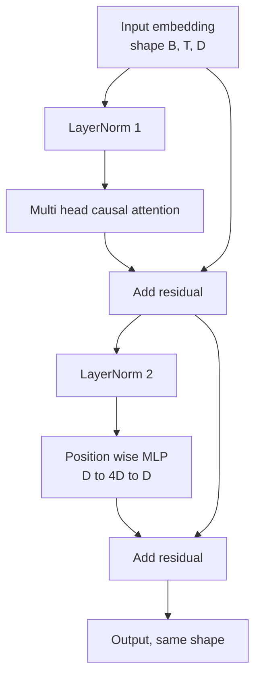
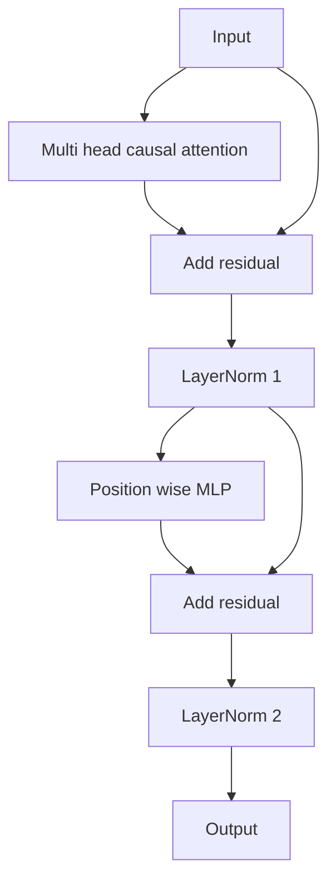

# بلاک ترانسفورماتور از ابتدا

> یک بلوک واحد هر کد کد جدید LLM است. یک طبقه استاندارد، توجه چند سر، باقیمانده، MLP، باقیمانده. ویرانت پیش از LN بدون گرم شدن به طور پایدار آموزش می دهد. ویرانت پس از LN چیزی است که کاغذ اصلی ارسال می کند. این درس هر دو را در کنار هم می سازد و نشان می دهد که کدام یک از آنها در یک دسته 12 لایه با نرخ یادگیری مشترک زنده می ماند.

**Type:** Build
**Languages:** Python
**Prerequisites:** Phase 19 lessons 30 to 33 (tokenizer, embeddings, attention math, batched data loader)
**Time:** ~90 minutes

## اهداف یادگیری

- یک بلوک ترانسفورماتور را در PyTorch از چهار قطعه متحرک بسازید: LayerNorm، توجه عللاتی چند سر، اتصال های باقیمانده، MLP با موقعیت.
- LayerNorms را در دو پیکربندی قرار دهید (پیش از LN و پس از LN) و توضیح دهید که چرا یک قطار بدون گرم شدن به طور پایدار حرکت می کند.
- در داخل توجه چند سر ، پوشش علتي را اجرا کن تا نشاني باشه`i`نميتونم توکن ها رو ببينم`j > i`. .
- جریان گرادینت را در هر دو نوع در یک دسته 12 لایه دنبال کنید و نتیجه را بدون دست زدن بخوانید.
- وقتی درس بعدی 124 میلیون پارامتر GPT را جمع آوری می کند، بلاک را به عنوان یک واحد بازتاب دوباره استفاده کنید.

## مشکل

یک ترانسفورماتور یک بلوک تکرار می شود. یک بار بلوک را اشتباه کنید، آن را 12 بار تکرار کنید، و شما یک مدل را ارسال می کنید که در دوره اول متفاوت است یا که نیاز به گرمایش در بقیه راه ها دارد. دو حالت شکست که در این درس خواهید دید، غریبی نیستند. وقتی که یک دانش آموز برای اولین بار بلوک ها را به طور نابغه جمع می کند، ظاهر می شوند. یکی از آنها، لایه توجه به آینده است. دیگری، LayerNorm که جایی قرار داده شده که نمی تواند سیگنال باقیمانده را در عمق تدارک کند.

درست کردن مکانیکی است وقتی که می بینید. بلوک دقیقا دو مسیر باقی مانده و دقیقا دو موقعیت عادی سازی دارد. موقعیت ها را به درستی انتخاب کنید و بقیه ی سقف فقط حسابداری است.

## مفهوم

هر کدر فقط بلوک ترانسفورماتور یک تابع است که یک تنسور شکل می گیرد `(batch, sequence, embedding)`و یک تنسور با شکل مشابه را باز می کند. در داخل، دو لایه زیر کار را انجام می دهند.



این نوع قبل از LN است. LayerNorm در داخل شاخه باقیمانده قرار دارد، قبل از لایه زیر. اتصال باقیمانده سیگنال غیر عادی را به جلو حمل می کند.

نوع پس از LN LayerNorm را پس از اضافه باقیمانده به بعد می برد.



شکل یکسان است. رفتار تمرین نیست. با پس از LN، گرادینت که از طریق مسیر باقی مانده به عقب جریان می یابد باید از طریق LayerNorm عبور کند. در عمق دوازده و سرعت یادگیری `3e-4`در این حالت، گرادینت به اندازه کافی سریع به اندازه کافی کوچک می شود تا نیاز به یک برنامه گرمایش باشد. Pre-LN مسیر باقیمانده را غیر عادی می کند، بنابراین گرادینت ها به طور تمیز به لایه ی گنجانده شدن گسترش می یابند. Pre-LN پیکربندی GPT-2 است که برای این دلیل کشتی های جلو با آن استفاده می کنند.

### توجه علنی چند سر

زیر لایه توجه ورودی را به سه راه به عنوان پرسشی، کلید، و تنسورهای ارزش قرار می دهد. هر یک از آنها از `(B, T, D)`به`(B, H, T, D/H)`کجا`H`تعداد افراد است. اندازه گیری توجه محصول نقطه`softmax(Q K^T / sqrt(d_k))`هر سر، مثلث بالا را به بی نهایت منفی پوشاند، ماسک را از طریق نرمmax اعمال می کند، سپس به `V`سر ها به يک دسته ي ديگه متصل مي شوند`(B, T, D)`ماسک تنها قطعه ای است که باعث ایجاد علت وجوانی مدل می شود. ماسک را فراموش کنید و یک مدل را آموزش می دهید که فریب می دهد.

### MLP

MLP با موقعیت دانش، شبکه دو لایه را به طور مستقل به هر توکن اعمال می کند. عرض پنهان چهار برابر عرض ادغام است، فعال سازی GELU است و یک ترک بعد از خط دوم است. هیچ توکن در داخل MLP با یکدیگر صحبت نمی کند. تمام مخلوط توکن ها در توجه اتفاق می افتد.

### ارتباطات باقیمانده دو کار انجام می دهند

آنها مسیر گرادینت را در طول عمق اضافه می کنند، که استاندارد گرادینت را در مقیاس از طریق دوازده لایه حفظ می کند. آنها همچنین به هر بلوک اجازه می دهند تا به جای جایگزینی کامل به نمایشگاه اجرا یک بروزرسانی اضافی را یاد بگیرد. هر دو اثر دلیل مقیاس بلوک است.

```figure
cc-transformer-block
```

## آن را بسازید

`code/main.py`ابزار:

- `class LayerNorm`با مقیاس و تغییر قابل یادگیری، eps متحيز، به هر متری توکن اعمال می شود.
- `class MultiHeadAttention`با`num_heads`،`head_dim = d_model // num_heads`، پروژکتور QKV مخلوط شده، ماسک علت ثبت شده، توجه و ترک باقیمانده.
- `class FeedForward`با دو لایه خطی، فعال شدن GELU، ترک.
- `class TransformerBlock`با یک`pre_ln`پرچم که بین دو نوع تغییر می کند.
- یک نمایش که یک ستک 6 لایه پیش از LN و یک ستک 6 لایه پس از LN را با ورودی و چاپ های یکسان (a) شکل خروجی، (b) استاندارد گرادینت در گنجانده پس از یک گذر عقب سازد.

اجرا کن

```bash
python3 code/main.py
```

تولید: بررسی شکل در هر دو استیک، نورم های گرادینت کنار هم. گرادینت گنجانده شدن استیک قبل از LN در همان سرعت یادگیری بزرگتر از استیک پس از LN است، که سیگنال تجربی است قطار های قبل از LN بدون گرم شدن.

## دسته

- `torch`برای ریاضیات تنسور، اوتوگراد، و`nn.Module`لوله کشی
- نه`transformers`، هیچ وزنی پیش از آموزش داده نشده بلوک از ابتدایی ها اجرا شده

## الگوهای تولید در طبیعت

سه الگويي که بلوک کتاب درسي رو تبديل به چيزي ميکنه که ميتوني بفرستي

**Fused QKV projection.**سه لایه خطی جداگانه سه راه اندازی هسته و سه ماتمل هزینه می کنند. یک لایه خطی عرض`3 * d_model`مسیر ادغام در هر تسریع کننده سریعتر است و با آنچه که پیاده سازی های مرجع GPT-2، LLaMA و Mistral تمام کشتی ها مطابقت دارد.

**Registered causal mask buffer.**ماسک فقط به حداکثر طول زمینه بستگی دارد.`register_buffer`، پنجره فعال را در هر گذرگاه جلو برش دهید و تخصیص هر تماس را رد کنید. فراموش کردن این باعث می شود ماسک به نقطه داغ تخصیص در زمینه طولانی تبدیل شود.

**Dropout in two places, not three.**ترک پس از توجه نرم (انتباه ترک) و پس از خط دوم MLP ( ترک باقیمانده) است. ترک در خود باقیمانده هویت اضافی را که اجازه می دهد تا گرادینت در عمق جریان داشته باشد را شکسته است. برخی از پیاده سازی های اولیه این اشتباه را داشتند و با آموزش شکننده پرداخت کردند.

## ازش استفاده کن

- بلوک در این درس بدون تغییر به طور مستقیم به مجموعه GPT در درس 35 وصل می شود.
- نوع قبل از LN چیزی است که هر LLM با وزن باز مدرن استفاده می کند. نوع بعد از LN چیزی است که کاغذ توجه اصلی 2017 استفاده می کند. دانستن هر دو برای خواندن هر معماری دیکودر که با آن روبرو می شوید کافی است.
- GELU را به SiLU عوض کنید و شما فعال سازی خانواده LLaMA را دارید. LayerNorm را به RMSNorm عوض کنید و شما عادی سازی خانواده LLaMA را دارید. همان اسکلت.

## تمرینات

1. اضافه کنید`bias=False`علامت به هر خطی در بلوک. وزن باز مدرن LLMs بدون تعصب در لایه های خطی. اندازه گیری اینکه چند پارامتر شما در 12 لایه 768 مدل کم ذخیره می کنید.
2. جایگزینش کن`nn.LayerNorm`با یک دست رول RMSNorm و بررسی شکل خروجی بدون تغییر است.
3. يه پرچم اضافه کن که وزن توجه رو براي اولين سر به عنوان `(B, T, T)`تراشه سه مثلث بالا رو بکش تا مطمئن بشه بعد از softmax صفر شده
4. يه چک عقل بسازيد که يه نفر رو به غذا بخورد`(2, 16, 384)`تنسور با `H=6`در هر دو نوع و ادعا، تولیدات پیش رو متفاوت هستند (به عنوان مثال،`not torch.allclose`) وقتی وزنه ها به طور یکسان شروع می شوند و ترک به صفر تنظیم می شود.

## اصطلاحات کلیدی

| Term | What people say | What it actually means |
|------|-----------------|------------------------|
| Pre-LN | "Pre norm" | LayerNorm inside the residual branch, before each sublayer; the residual carries the unnormalized signal |
| Post-LN | "Post norm" | LayerNorm after the residual add; what the 2017 paper shipped and what needs warmup |
| Causal mask | "Triangle mask" | The upper triangle of the attention logits set to negative infinity so token i cannot read token j when j is greater than i |
| Fused QKV | "Combined projection" | One linear of width 3D instead of three linears of width D; one kernel, one matmul |
| Residual stream | "Skip connection" | The unnormalized tensor that flows top to bottom through every block; what each block adds to |

## خواندن بیشتر

- مرحله 7 درس 02 (خود توجه از ابتدا) برای ریاضیات توجه زیر این بلوک.
- مرحله 7 درس 05 (ترانسفارمر کامل) برای نسخه کدگر و کدگر همان اسکلت.
- مرحله 10 درس 04 (GPT کوچکی قبل از آموزش) برای روش آموزش که این بلاک به آن متصل می شود.
- مرحله 19 درس 35 (این مسیر) که 12 تا از این بلوک ها را به یک مدل GPT جمع می کند.
