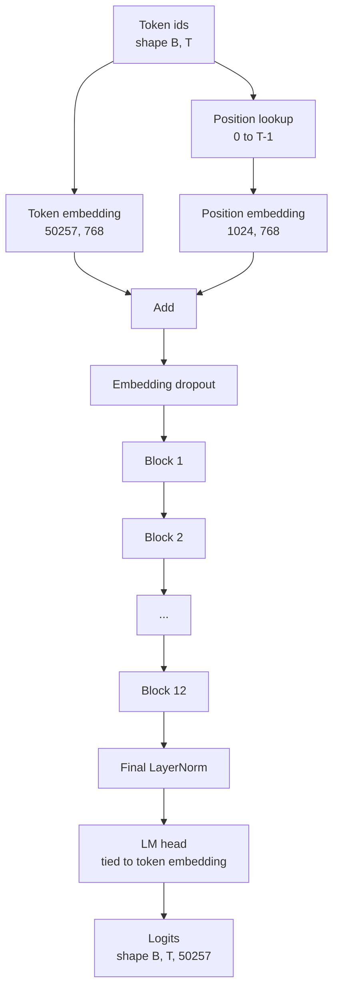
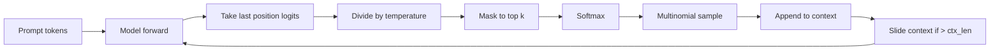

# مجموعه مدل GPT

> ۱۲ بلوک جمع شده، یک توکن ادغام، یک ادغام موقعیت آموخته، یک LayerNorm نهایی و یک سر مدل زبان مرتبط است. این کل مدل GPT پارامتر 124 میلیون است. این درس این قطعات را به یک طبقه کارگر جمع می کند، پارامترها را برای تأیید اینکه مدل با شکل 124M مرجع مطابقت دارد، محاسبه می کند و متن با نمونه گیری چندملیتی، دمای و top-k تولید می کند.

**Type:** Build
**Languages:** Python
**Prerequisites:** Phase 19 lessons 30 to 34
**Time:** ~90 minutes

## اهداف یادگیری

- بلاک ترانسفارمر را از درس 34 به یک مدل GPT کامل جمع آوری کنید: گنجانیدن توکن، گنجانیدن موقعیت، N بلوک، LayerNorm نهایی، سر مدل زبان.
- 124 میلیون پیکربندی پارامتر را بازتولید کنید: لغت 50257، زمینه 1024، شامل 768، 12 سر، 12 لایه.
- وزن های سر مدل زبان را به ورق گذاری توکن متصل کنید و توضیح دهید که چرا این در این مقیاس 38 میلیون پارامتر را ذخیره می کند.
- متن را از یک پرامپت با نمونه گیری چندمنیومال، مقیاس درجه حرارت و کوتاه کردن top-k تولید کنید، با نگه داشتن طول زمینه با پنجره پرتاب.
- تعداد پارامتر ها و هزینه عبور به جلو را در برابر هدف 124 میلیون اندازه گیری کنید.

## مشکل

یک بلوک ترانسفورماتور به تنهایی هیچ کاری نمی کند. شما باید ID های توکن را به ویکتور تبدیل کنید، اطلاعات موقعیت را مخلوط کنید، آنها را از طریق استیک اجرا کنید و به لوازم لغاتی بازگردانید. هر یک از این چهار مرحله را فراموش کنید و مدل یا به سمت جلو نمی رود، اطلاعات موقعیت را تغییر می دهد، یا نمی تواند صحبت کند.

شکل مدل هم مهمه GPT-2 کوچک مرجع 124 میلیون پارامتر در دقیقاً پیکربندی بالا است. اعداد جادويي نيستن لغت 50257 برباید 768 جدول رمز است. موقعیت 1024 برباید 768 جدول موقعیت است. 12 بلوک در حدود 7 میلیون پارامتر هر کدام 84 میلیون است. سر آخر از جدول رمز استفاده می کند با وزن. قطعات رو جمع کن و 124 ميليون رو پيدا کني ساخت مدل ای که تعداد پارامترش با مرجع مطابقت نداشته باشد نشانه ای از اینکه چیزی اشتباه کرده اید.

## مفهوم



نماد های توکن تبدیل به متریکهای توکن می شوند. نماد های موقعیت تبدیل به متریکهای موقعیت می شوند. این دو اضافه می شوند و از طریق سکه ارسال می شوند. LayerNorm نهایی قطعه خارج از بلوک است که از هر نوع مدرن زنده می ماند. سر LM از ماتریس گنجانیدن توکن استفاده می کند، که این معنی پیوند وزن است.

### بسته بندی وزن

رمز تعویض شکل داره`(vocab, d_model)`. مدل زبان باید از `d_model`برگردیم به`vocab`این دو متغیر از یکدیگر هستند. پیوند دو به معنای واقعی کلمه همان تنسور پارامتر است که دو بار استفاده می شود. در لغت 50257 و d_model 768, ماتریکس 38 میلیون پارامتر است. بدون پیوند، شما دو بار پرداخت می کنید. بسته، شما یک بار پرداخت می کنید و شما همچنین یک سیگنال گرادینت کمی تمیز تر را دریافت می کنید زیرا گنجاندن و سر به روز رسانی با هم.

### تعویض موقعیت یاد گرفته شده، نه سینوساید

GPT-2 ارسال یک موقعیت آموخته گنجانده است. جدول موقعیت یک پارامتر تنسور شکل است `(1024, 768)`این مدل در هر پیشروی موقعیت 0 تا T-1 را بررسی می کند و جستجوی را به گنجانده شدن توکن اضافه می کند. این ساده ترین طرح موقعیت است (RoPE، ALiBi، T5 متغیرات نسبی هستند) و این همان چیزی است که 124M مرجع استفاده می کند.

### نسل: دمای، بالا-ک، چندمرد

تولید خودکشی است. در هر مرحله، مدل logits را در کل لغت در هر موقعیت بازمی گرداند. شما تنها آخرین موقعیت را می گیرید، با درجه حرارت تقسیم می کنید، به صورت اختیاری همه جز top k logits را به بی نهایت منفی پوشانید، نرم حداکثر برای بدست آوردن احتمالات، و یک نمایه از توزیع حاصل می کنید.



سه دکمه، سه رفتار متفاوت. دمای نزدیک صفر به طمع سقوط می کند. دمای یک با توزیع طبیعی مدل مطابقت دارد. top-k یک طمع است. top-k چهل فیلتر دم طولانی را فیلتر می کند. ترکیب ها مهم هستند؛ درس بعدی در آموزش از تولید به عنوان یک سیگنال ارزیابی کوالیتی استفاده می کند.

```figure
cc-gpt-assembly
```

## آن را بسازید

`code/main.py`ابزار:

- `class GPTConfig`کلاس داده ها با 124-M default: `vocab_size=50257`،`context_length=1024`،`d_model=768`،`num_heads=12`،`num_layers=12`،`mlp_expansion=4`،`dropout=0.1`،`use_bias=True`،`weight_tying=True`. .
- `class GPTModel`با رمز افزونه، موقعیت افزونه، افزونه ترک، 12 `TransformerBlock`s، LayerNorm نهایی و یک `lm_head`که با علامت در هنگام قرار دادن پرچم متصل می شود.
- A`count_parameters`کمک کننده که شمارش پارامتر منحصر به فرد را باز می گرداند (به این ترتیب در شمارش با همبستگی وزن احترام گذاشته می شود).
- A`generate`تابع که محیط دمای، top-k، multomial و پنجره های شیفت را انجام می دهد.
- یک نمایش که مدل را ایجاد می کند، تعداد پارامتر را در کنار 124M مرجع چاپ می کند و یک دنباله کوتاه از یک پیام ثابت برای نشان دادن پایان پایپلائی را به پایان می رساند.

اجرا کن

```bash
python3 code/main.py
```

خروجی: شمارش پارامتر در کنار مرجع 124M، ID توکن از یک پیام تصادفی تولید شده و تأیید اینکه سر LM و توکن های گنجانده شده ذخیره سازی را هنگام اتصال به اشتراک می گذارند.

برای حفظ سرعت نمایش، اسکریپت همچنین یک پیکربندی کوچک (`d_model=64`،`num_layers=2`) پایان تا پایان و چاپ ترتیب توکن تولید شده در خط است. 124M پیکربندی ساخته شده است اما فقط تعداد پارامتر و یک عبور جلو اعمال می شود.

## دسته

- `torch`برای ریاضیات تنسور، اتوگراید و لوله کشی ماژول.
- `code/main.py`دوباره همان الگوی بلوک را از درس 34 در محل اجرا می کند.

## الگوهای تولید در طبیعت

سه الگوی تفاوت بین یک مدل که می چرخد و یک مدل که می چرخد را نشان می دهد.

**Initialize the residual projections small.**پروژکتور خروجی توجه و خط دوم MLP هر دو به طور مستقیم به یک اضافه باقیمانده تغذیه می کنند. شروع کردن آنهایی که با انحراف استاندارد مشابه هر خط دیگر جریان باقیمانده را به وجود می آورد که با عمق رشد می کند و LayerNorm نهایی را به یک رژیم گرم فشار می دهد.`1 / sqrt(2 * num_layers)`برای این دو طرح، جریان باقیمانده در محدوده سالم از طریق دوازده لایه باقی می ماند.

**Cache the position id tensor, do not recompute.** `torch.arange(T)`به هر سمت جلو حافظه تازه را اختصاص می دهد.`__init__`برای حداکثر زمینه، اولین نوشته های T را در هر تماس برش دهید و سفر برگشت و برگشت اختصاص دهنده را رد کنید.

**Tie weights at parameter level, not just by copying.**تنظیم کردن`lm_head.weight = token_embedding.weight`این کار به شما کمک می کند تا از این کار استفاده کنید و از این طریق به شما کمک کنید تا از این کار استفاده کنید.

## ازش استفاده کن

- کلاس مدل در این درس شکل مشابهی با کلاس بعدی است.
- جایگزینی موقعیت آموخته شده با RoPE به شما خانواده LLaMA بدون لمس بلوک یا سر می دهد.
- جایگزینی GELU با SiLU و LayerNorm با RMSNorm به شما بقیه تغییرات خانواده LLaMA را می دهد.
- تابع تولید با هر منبع logits کار می کند، نه تنها این مدل. شما می توانید logits را از یک فایل GPT-2 پیش از آموزش در درس 37 خارج کنید و از همان حلقه تولید دوباره استفاده کنید.

## تمرینات

1. سر LM را از درون توکن جدا کنید و پارامترهای دوباره شمارش کنید. دلتا 50257 برباید 768 = 38 میلیون است.
2. جای جای جای یادگیری موقعیت گنجانده شده با یک جدول سینوسایدی محاسبه شده در زمان ساخت. تایید مدل هنوز به جلو و شمارش پارامتر کاهش می یابد 786,432.
3. اضافه کنید`greedy=True`علامت به نسل که نمونه گیری را رد کرده و argmax را انتخاب می کند. تایید کنید که دنباله در طول اجرا تعیین کننده است.
4. اضافه کنید`repetition_penalty`دکمه ای که منطق هر نشانه ای را در تاریخچه پرامپت یا تولید شده با ثابت قبل از softmax تقسیم می کند. در یک پرامپت ثابت نشان دهید که مقادیر بالای یک تعداد تکرار را در خروجی کاهش می دهد.
5. اضافه کردن`top_p`نمونه گیری (برگه) در کنار`top_k`. چک دو خطي که مجموع احتمالي توکن هاي نگهداري شده از`top_p`. .

## اصطلاحات کلیدی

| Term | What people say | What it actually means |
|------|-----------------|------------------------|
| Weight tying | "Tied embeddings" | The LM head and the token embedding share the same parameter tensor; saves vocab times d_model parameters and matches the GPT-2 reference |
| Position embedding | "Learned positions" | A separate table of shape (context length, d_model) added to token vectors; learned end to end |
| Sliding window context | "Context cap" | When the prompt plus generated tokens exceed the context length, drop the oldest tokens so the active window fits |
| Top-k sampling | "K truncation" | Keep the K logits with the highest values, mask the rest to negative infinity, softmax over the remainder |
| Temperature | "Sampling temperature" | Divide logits by T before softmax; T less than 1 sharpens, T equal to 1 keeps the natural distribution, T greater than 1 flattens |

## خواندن بیشتر

- مرحله 19 درس 34 برای بلوک این مدل
- مرحله 19 درس 36 برای حلقه آموزش که این مدل را با از دست دادن انتروپی متقاطع هدایت می کند.
- مرحله 19 درس 37 براي بارگذاری وزن هاي GPT-2 پيش از آموزش به اين معماري
- مرحله 7 درس 07 (GPT مدل سازی زبان علل) برای ریاضیات پیش بینی نشانه بعدی.
- مرحله 10 درس 04 (GPT کوچک پیش از آموزش) برای روش آموزش اولیه در مورد همان معماری.
